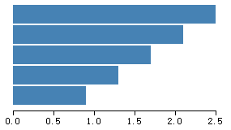

# 八、第七章 坐标轴

坐标轴，是可视化图表中经常出现的一种图形，由一些列线段和刻度组成。坐标轴在 SVG 中是没有现成的图形元素的，需要用其他的元素组合构成。D3 提供了坐标轴的组件，如此在 SVG 画布中绘制坐标轴变得像添加一个普通元素一样简单。



**图片 8.1** 柱形图

## 坐标轴由什么构成

在 SVG 画布的预定义元素里，有六种基本图形：

*   矩形
*   圆形
*   椭圆
*   线段
*   折线
*   多边形

另外，还有一种比较特殊，也是功能最强的元素：

*   路径**<path></path>**

画布中的所有图形，都是由以上七种元素组成。

显然，这里面没有**坐标轴 <axis>**这种元素。如果有的话，我们可以采用类似以下的方式定义：</axis>

```
<axis x1="" x2="" ...></axis>
```

很可惜，没有这种元素。但是，这种设计是合理的：不可能为每一种图形都配备一个单独的元素，那样 SVG 就会过于庞大。

因此，我们需要用其他元素来组合成坐标轴，最终使其变为类似以下的形式：

```
<g>
<!-- 第一个刻度 -->
<g>
<line></line>   <!-- 第一个刻度的直线 -->
<text></text>   <!-- 第一个刻度的文字 -->
</g>
<!-- 第二个刻度 -->
<g>
<line></line>   <!-- 第二个刻度的直线 -->
<text></text>   <!-- 第二个刻度的文字 -->
</g> 
...
<!-- 坐标轴的轴线 -->
<path></path>
</g>
```

分组元素 <g>，是 SVG 画布中的元素，意思是 group。此元素是将其他元素进行组合的容器，在这里是用于将坐标轴的其他元素分组存放。</g>

如果需要手动添加这些元素就太麻烦了，为此，D3 提供了一个组件：d3.svg.axis()。它为我们完成了以上工作。

## 定义坐标轴

上一章提到了比例尺的概念，要生成坐标轴，需要用到比例尺，它们二者经常是一起使用的。下面，在上一章的数据和比例尺的基础上，添加一个坐标轴的组件。

```
//数据
var dataset = [ 2.5 , 2.1 , 1.7 , 1.3 , 0.9 ];
//定义比例尺
var linear = d3.scale.linear()
      .domain([0, d3.max(dataset)])
      .range([0, 250]);

var axis = d3.svg.axis()
     .scale(linear)      //指定比例尺
     .orient("bottom")   //指定刻度的方向
     .ticks(7);          //指定刻度的数量
```

第 1 – 2 行：定义数组。

第 4 – 7 行：定义比例尺，其中使用了数组 dataset。

第 9 – 12 行：定义坐标轴，其中使用了线性比例尺 linear。其中：

*   d3.svg.axis()：D3 中坐标轴的组件，能够在 SVG 中生成组成坐标轴的元素。
*   scale()：指定比例尺。
*   orient()：指定刻度的朝向，bottom 表示在坐标轴的下方显示。
*   ticks()：指定刻度的数量。

## 在 SVG 中添加坐标轴

定义了坐标轴之后，只需要在 SVG 中添加一个分组元素 <g>，再将坐标轴的其他元素添加到这个 <g>里即可。代码如下：</g></g>

```
svg.append("g")
   .call(axis);
```

上面有一个 **call()** 函数，其参数是前面定义的坐标轴 axis。

在 D3 中，call() 的参数是一个函数。调用之后，将当前的选择集作为参数传递给此函数。也就是说，以下两段代码是相等的。

```
function foo(selection) {
  selection
      .attr("name1", "value1")
      .attr("name2", "value2");
}
foo(d3.selectAll("div"))
```

和

```
d3.selectAll("div").call(foo);
```

因此，

```
svg.append("g").call(axis);
```

与

```
axis(svg.append(g));
```

## 设定坐标轴的样式和位置

默认的坐标轴样式不太美观，下面提供一个常见的样式：

```
<style>
.axis path,
.axis line{
    fill: none;
    stroke: black;
    shape-rendering: crispEdges;
}

.axis text {
    font-family: sans-serif;
    font-size: 11px;
}
</style>
```

分别定义了类 axis 下的 path、line、text 元素的样式。接下来，只需要将坐标轴的类设定为 axis 即可。

坐标轴的位置，可以通过 transform 属性来设定。

通常在添加元素的时候就一并设定，写成如下形式：

```
svg.append("g")
  .attr("class","axis")
  .attr("transform","translate(20,130)")
  .call(axis);
```

## 源代码

下载地址：[rm50.zip](http://www.ourd3js.com/src/rm/rm50.zip)

展示地址：[`www.ourd3js.com/demo/rm/R-5.0/Axis.html`](http://www.ourd3js.com/demo/rm/R-5.0/Axis.html)