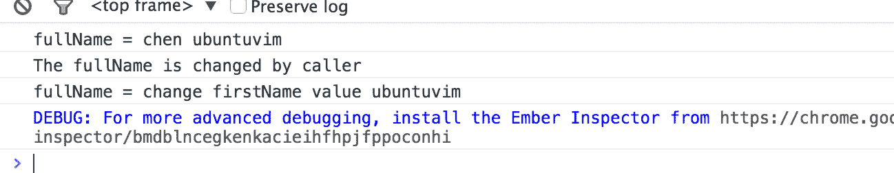
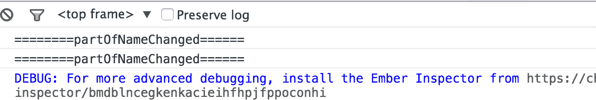
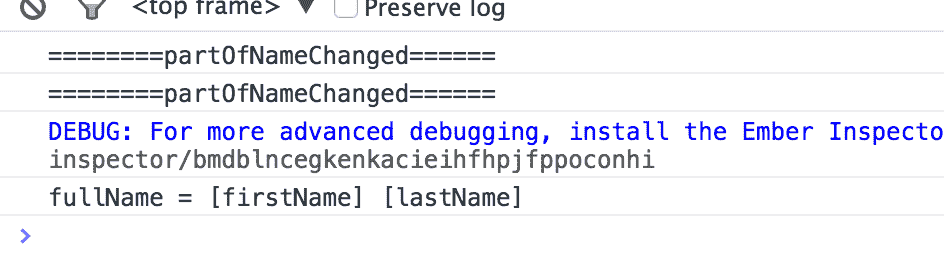

# Ember.js 入门指南之四观察者（observer）

> `Ember`可以检测任何属性的变化，包括计算属性。

### 观察者使用

`Ember`可以察觉所有属性的变化，包括计算属性。观察者是非常有用的，特别是计算属性绑定之后需要同步的时候。 观察者经常被 Ember 开发过度使用。`Ember`框架本身已经大量使用观察者，但是对于大多数的开发者面对开发问题时使用计算属性是更适合的解决方案。 使用方式：可以用`Ember.observer`创建一个对象为观察者。

```
// Observer 对于 Emberjs 来说非常重要，前面你看到的很多代码都是与它有关系，计算属性之所以能更新也是因为它
Person = Ember.Object.extend({  
  firstName: null,
  lastName: null,

  fullName: Ember.computed('firstName', 'lastName', function() {
    return this.get('firstName') + " " + this.get('lastName');
  }),

  //  当 fullName 被改变的时候触发观察者
  fullNameChange: Ember.observer('fullName', function() {
    console.log("The fullName is changed by caller");
    //return this.get('fullName');
  })
});

var person = Person.create({  
  firstName: 'chen',
  lastName: 'ubuntuvim'
});
// 如果被观察的计算属性还没执行过 get()方法不会触发观察者
console.log('fullName = ' + person.get('fullName'));  
//  fullName 是依赖 firstName 和 lastName 的，这里改变了 firstName 的值，计算属性会自动更新，
//  fullName 被改变了所以会触发观察者
person.set('firstName', 'change firstName value');  // 观察者会被触发  
console.log('fullName = ' + person.get('fullName')); 
```

`fullName`是依赖`firstName`和`lastName`的，调用`set()`方法改变了`firstName`的值，自然的导致`fullName`的值也被改变了，`fullName`变化了就触发观察者。从执行的结果就可以看出来；



`Ember`还为开发者提供了另一种使用观察者的方式。这种方式使你可以在类定义之外为某个计算属性增加一个观察者。

```
person.addObserver('fullName', function() {  
    // deal with the change…
}); 
```

### 观察者与异步

目前，观察者在`Ember`中是同步的（不是笔误，官网就是这么说的`Observers in Ember are currently synchronous.`）。这就意味着只要计算属性一发生变化就会触发观察者。也因为这个原因很容易就会引入这样的`bug`在计算属性没有同步的时候。比如下面的代码；

```
Person.reopen({  
  lastNameChanged: Ember.observer('lastName', function() {
    // The observer depends on lastName and so does fullName. Because observers
    // are synchronous, when this function is called the value of fullName is
    // not updated yet so this will log the old value of fullName
    console.log(this.get('fullName'));
  })
}); 
```

然而由于同步的原因如果你的的观察者同时观察多个属性，就会导致观察者执行多次。

```
person = Ember.Object.extend({  
  firstName: null,
  lastName: null,

  fullName: Ember.computed('firstName', 'lastName', function() {
    return this.get('firstName') + " " + this.get('lastName');
  }),

  //  当 fullName 被改变的时候触发观察者
  fullNameChange: Ember.observer('fullName', function() {
    console.log("The fullName is changed by caller");
    //return this.get('fullName');
  })
});
Person.reopen({  
  partOfNameChanged: Ember.observer('firstName', 'lastName', function() {
    //  同时观察了 firstName 和 lastName 两个属性
    console.log('========partOfNameChanged======');
  })
});
var person = Person.create({  
  firstName: 'chen',
  lastName: 'ubuntuvim'
});

person.set('firstName', '[firstName]');  
person.set('lastName', '[lastName]'); 
```



显然上述代码执行了两次`set()`所以观察者也会执行 2 次，但是如果开发中需要设置只能执行一次观察出呢？Ember 提供了一个`once()`方法，这个方法会在下一次循环所有绑定属性都同步的时候执行。

```
Person = Ember.Object.extend({  
  firstName: null,
  lastName: null,

  fullName: Ember.computed('firstName', 'lastName', function() {
    return this.get('firstName') + " " + this.get('lastName');
  }),

  //  当 fullName 被改变的时候触发观察者
  fullNameChange: Ember.observer('fullName', function() {
    console.log("The fullName is changed by caller");
    //return this.get('fullName');
  })
});
Person.reopen({  
  partOfNameChanged: Ember.observer('firstName', 'lastName', function() {
    //  同时观察了 firstName 和 lastName 两个属性
    //  方法 partOfNameChanged 本身还是会执行多次，但是方法 processFullName 只会执行一次
    console.log('========partOfNameChanged======');  //  
    Ember.run.once(this, 'processFullName');
  }),
  processFullName: Ember.observer('fullName', function() {
    // 当你同时设置多个属性的时候，此观察者只会执行一次，并且是发生在下一次所有属性都被同步的时候
    console.log('fullName = ' + this.get('fullName'));
  })
});

var person = Person.create({  
  firstName: 'chen',
  lastName: 'ubuntuvim'
});

person.set('firstName', '[firstName]');  
person.set('lastName', '[lastName]'); 
```



### 观察者与对象初始化

观察者一直到对象初始化完成之后才会执行。 如果你想观察者在对象初始化的时候就执行你必须要手动调用`Ember.on()`方法。这个方法会在对象初始化之后就执行。

```
Person = Ember.Object.extend({  
  salutation:null,
  init() {
    this.set('salutation', 'hello');
    console.log('init....');
  },
  salutationDidChange: Ember.on('init', Ember.observer('salutation', function() {
    console.log('salutationDidChange......');
  }))
});

var p = Person.create();  
p.get('salutationDidChange');  //  output > init....  salutationDidChange......  
console.log(p.get('salutation'));  // output > hello  
p.set('salutation');  //  output > salutationDidChange...... 
```

### 未获取过值的计算属性不会触发观察者

如果一个计算属性从来没有调用过`get()`方法获取的其值，观察者就不会被触发，即使是计算属性的值发生变化了。你可以这么认为，观察者是根据调用`get()`方法前后的值比较判断出计算属性值是否发生改变了。如果没调用过`get()`之前的改变观察者认为是没有变化。 通常我们不需要担心这个问题会影响到程序代码，因为几乎所有被观察的计算属性在触发前都会执行取值操作。如果你仍然担心观察者不会被触发，你可以在`init()`方法了执行一次`get`操作。这样足以保证你的观察在触发之前是执行过 get 操作的。

对于初学者来说，属性值的自动更新还是有点难以理解，到底它是怎么个更新法！！！先别急，先放一放，随着不断深入学习你就会了解到这个是多么强大的特性。

博文完整代码放在[Github](https://github.com/ubuntuvim/my_emberjs_code)（博文经过多次修改，博文上的代码与 github 代码可能又出入，不过影响不大！），如果你觉得博文对你有点用在 github 项目上给我个`star`吧。您的肯定对我来说是最大的动力！！