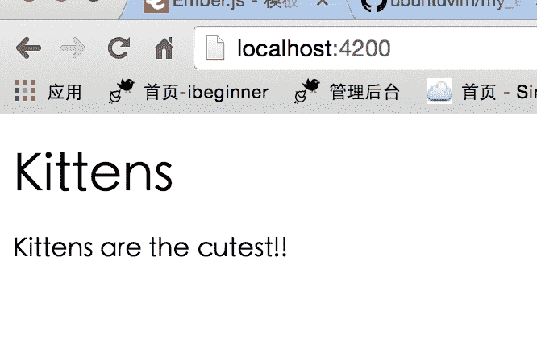
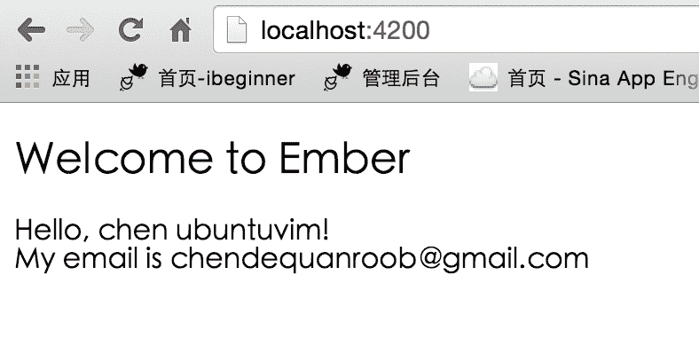

# Ember.js 入门指南之八 handlebars 基础

`Ember`采用`handlebars`模板库作为应用的`view`层。`Handlebars`模板与普通的`HTML`非常相似。但是相比普通的`HTML`而言`handlebars`提供了非常丰富的表达式。 `Ember`采用`handlebars`模板并且扩展了很多功能，让你使用`handlebars`就像使用`HTML`一样简单。

### 模板定义

在前一篇介绍了一个很重要的构建工具`Ember CLI`，从本篇开始后面所创建的文件都是使用这个构建工具来创建，先进入到项目路径下再执行`Ember CLI`命令。

创建一个模板命令`ember g template application`

由于这个模板在创建项目的时候就已经有了，所以会提示你是否覆盖原来的文件，你可以选择覆盖或者不覆盖都行。

```
<!-- app/templates/application.hbs -->  
<h1>Kittens</h1>  
<p>  
Kittens are the cutest!!  
</p> 
```

**注意**：代码中的第一句注释的内容表明了这个文件的位置已经文件名称，后面的代码片段也会采用这种方式标注。如果没有特别的说明第一句代码都是注释文件的路径及其名称。

上述就是一个模板，非常简单的模板，只有一个 h1 和 p 标签，当你保存这个文件的时候 Ember CLI 会自动帮你刷新页面，不需要你手动去刷新！此时你的浏览器页面应该会看到如下信息：



那么恭喜你，模板定义成功了，至于为什么执行[`localhost:4200`](http://localhost:4200)就直接显示到这里等你慢慢学到`controller`和`route`的时候自然会明白，你就当`application.hbs`是一个默认的首页，这样你应该明白了吧！

### handlbars 表达式

每一个模板都会有一个与之关联的`controller`类、`route`类、`model`类（当然这些类是不是必须有的）。这就是模板能显示表达式的值的原因，你可以在`controller`类中设置模板中表达式显示的值，就像`java web`开发中在`servlet`或者`Action`调用`request.setAttribute()`方法设置某个属性一样。比如下面的模板代码：

```
<!-- app/templates/application.hbs -->

<!-- 这个是默认的模板，Ember 会根据命名的规则自动找到 controllers/application 对应的模板是 templates/application.hbs -->

<h2 id="title">Welcome to Ember</h2>

<!-- Ember 的属性自动更新：如果属性在 controller 层改变了，页面会自动刷新显示最新的值，太强大了！！！ -->

Hello, <strong>{{firstName}} {{lastName}}</strong>!  
<br>  
My email is <b>{{email}}</b> 
```

下面我们创建一个 controller。这次我们用 Ember CLI 的命令创建： ember generate controller application，这句命令表示会创建一个 controller 并且名称是 application，然后我们会得到如下几个文件：

1.  `app/controllers/application.js` --`controller`本身
2.  `tests/unit/controllers/application-test.js` --`controller`对应的单元测试文件

打开你的文件目录，是不是可以在`app/controllers`下面看到了！ 现在为了演示表达式我们在`controller`里添加一些代码：

```
// app/controllers/application.js

import Ember from 'ember';

/**
 * Ember 会根据命名规则自动找到 templates/application.hbs 这个模板，
 * @type {hash} 需要设置的 hash 对象
 */
export default Ember.Controller.extend({  
    //  设置两个属性
    firstName: 'chen',
    lastName: 'ubuntuvim',
    email: 'chendequanroob@gmail.com'
}); 
```

然后修改显示的模板如下：

```
<!-- app/templates/application.hbs -->

<!-- 这个是默认的模板，Ember 会根据命名的规则自动找到 controllers/application 对应的模板是 templates/application.hbs -->  
<h2 id="title">Welcome to Ember</h2>

<!-- Ember 的属性自动更新：如果属性在 controller 层改变了，页面会自动刷新显示最新的值，太强大了！！！ -->  
Hello, <strong>{{firstName}} {{lastName}}</strong>!  
<br>  
My email is <b>{{email}}</b> 
```

保存，然后页面会自动刷新（`Ember CLI`会自动检测文件是否改变，然后重新编译项目），我们可以看到在`controller`设置的值，可以直接在模板上显示了。



这个就是表达式的绑定，后面你会学习到更多更有趣也更复杂的`handlebasr`表达式。 随着应用程序的规模不断扩大，会有更多的模板和与之关联的控制器。并且有时候一个模板还可以对应这多个控制器。也就是说模板上表达式的值可能有多个`controller`控制。

博文完整代码放在[Github](https://github.com/ubuntuvim/my_emberjs_code)（博文经过多次修改，博文上的代码与 github 代码可能又出入，不过影响不大！），如果你觉得博文对你有点用，请在 github 项目上给我点个`star`吧。您的肯定对我来说是最大的动力！！