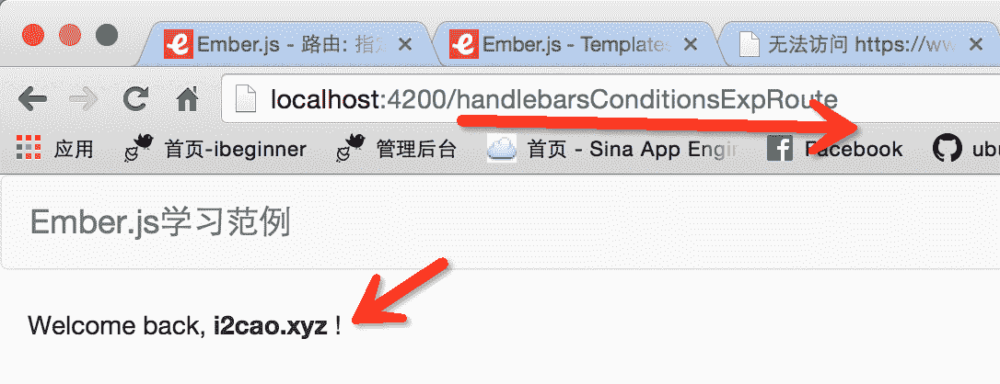

# Ember.js 入门指南之九 handlebars 条件表达式

`handlebars`模板提供了与一般语言类似的条件表达式，比如`if`、`if……else……`。 在介绍这些条件表达式之前，我们先做好演示的准备工作。首先我会使用`Ember CLI`命令创建`route`、`template`，然后在创建的`template`上编写`handlebars`模板代码。 先创建`route`：
`ember generate route handlbars-conditions-exp-route`
或者：
`ember generate route handlbarsConditionsExpRoute`
这两个命令创建的文件名都是一样的。最后`Ember CLI`会为我们自动创建 2 个主要的文件：`app/templates/handlbars-conditions-exp-route.hbs` 和 `app/routes/handlbars-conditions-exp-route.js`

**注意：如果你使用的是驼峰式的名称`Ember CLI`会根据`Ember`的命名规范自动创建以中划线`-`分隔的名称。为什么我是先使用命令创建`route`而不是`template`呢？？因为你创建`route`的同时`Ember CLI`会自动给你创建一个对应的模板文件，如果你是先创建`template`的话，你还需要手动再执行创建`route`的命令，即你要执行 2 条命令(`ember generate template handlbars-conditions-exp-route`和`ember generate route handlbars-conditions-exp-route`)。**

得到演示所需要的文件后回到正题，开始介绍`handlebars`的条件判断表达式。 为了演示先在`route`文件添加模拟条件代码：

```js
//  app/routes/handlebars-condition-exp-route.js

import Ember from 'ember';

export default Ember.Route.extend({

    model: function () {
        return {name: 'i2cao.xyz', age: 25, isAtWork: false, isReading: false };
        // return { enable: true };
    }       
}); 
```

对于`handlebars-condition-exp-route.js`这个文件的内容会在后面路由这一章详细介绍，你可以暂且当做是返回了一个对象到模板上。与`EL`表达式非常类似，你可以用`.`获取对象里的属性值（如：`person.name`）。

### 1，`if`表达式

```js
<!-- app/templates/handlbars-conditions-exp-route.hbs -->

<!-- if 判断标签，当 model 的值不为 false, undefined, null or [] 的时候显示标签内的内容 -->  
{{#if model}}
Welcome back, <b>{{model.name}}</b> !  
{{/if}} 
```



每个条件表达式都要以`#`开头并且要有对应的关闭标签，但是对于`if`标签来说不是必须要关闭标签的，这里简单举个例子：

```js
<!-- 没有关闭关闭标签的 if 用法 -->  
<div class="{{if flag 'show' 'hide'}}">  
测试内容
</div> 
```

这个`if`标签会根据属性`flag`的值判断是显示那个 CSS 类，如果`flag`的值不是`false`，不是`[]`空数组，也不是`null`，也不是`undefined`则`div`会加上 CSS 类`show`，模板编译之后的标签为`<div class="show">`，否则会加 CSS 类`hide`模板编译之后的标签为`<div class="hide">`。这样解释应该很容易理解了，其实说白了就一个`if`判断。没别的难点。。。

运行的时候需要注意两个地方，一个是浏览器执行的`URL`。如果你也是使用驼峰式的命名方式（创建命名：`ember generate route handlbarsConditionsExpRoute`），那你的`URL`跟我的是一样的，反正你只要记得执行的`URL`跟你创建的`route`的名称是一致的。当然这个名字是可以修改的。在`app/router.js`里面修改，在`Router.map`里的代码也是`Ember CLI`自动创建的。我们可以看到有一个`this.route('handlebarsConditionsExpRoute');`这个就是你的路由的名称。

**建议：创建之后的路由名字最好不要修改，`ember`会根据默认的命名规范查找`route`对应的`template`，如果你修改了`router.js`里的名字你需要同时修改`app/routes` 和 `app/templates` 里相对应的文件名。否则`URL`上的路由无法找到对应的`template`显示你的内容，在`router.js`里配置的名字必须与`app/routes`目录下的路由文件名字对应，模板的名字不一定要与路由配置名称对应，应该可以在`route`类中指定渲染的模板是那个，这个后面的内容会讲到（不是重点内容，了解即可）。 说明：可能你看到的我截图给你的有点差别，是因为我修改了主模板(`app/index.html`)你可以在这个文件里添加自己喜欢的样式，你一在`app/index.html`引入你的样式，或者在`ember-cli-build.js`引入第三方样式都可以，自定义的样式放在`public/assets/`下，如果没有目录可以自行手动创建，在此就不再赘述，这个不是本文的重点。**

### 2，`if……else……`表达式

```js
<!-- app/templates/handlebars-conditions-exp-route.hbs -->  
<!-- if……else……判断 -->  
{{#if model.isAtWork}}
Ship that code..<br>  
{{else if model.isReading}}
You can finish War and Peace eventually..<br>  
{{else}}
This is else block...  
{{/if}} 
```

结果是输出：This is else block... 因为`isAtWork`和`isReading`都是`false`。读者可以自己修改`app/routes/handlebars-condition-exp-route.js`里面对应的值然后查看输出结果。

### 3，`unless`表达式

`unless`表达式类似于非操作，当`model.isReading`值为`false`的时候会输出表达式里面的内容。

```js
<!-- app/templates/handlebars-conditions-exp-route.hbs -->  
<!-- 非判断 -->  
{{#unless model.isReading}}
unless.....  
{{/unless}} 
```

如果`isReading`值为`false`会输出`unless…`否则不进入表达式内。

### 4，在 HTML 标签内使用表达式

`handlebars`表达式可以直接在嵌入到`HTML`标签内。

```js
<!-- app/templates/handlebars-conditions-exp-route.hbs -->  
<!-- 可以把表达式直接嵌入在某个标签中，当 enable 的值为 true 则结果是增加了一个类(css 的类)enable，否则增加'disable' -->  
<span class={{if enable 'enable' 'disable'}}>enable or disable</span> 
```

说白了其实就是一个三目运算。不难理解。不过这个例子与第一点讲没有关闭标签的`if`例子一致，就当是复习吧=^=。

上述就是`handlebars`中最常用的几个条件表达式，自己作为小例子演示一遍肯定懂了，对于有点惊讶的开发者甚至看一遍即可。非常的简单，可能后面还会有其他的条件判断的表达式，后续会补上。

博文完整代码放在[Github](https://github.com/ubuntuvim/my_emberjs_code)（博文经过多次修改，博文上的代码与 github 代码可能又出入，不过影响不大！），如果你觉得博文对你有点用，请在 github 项目上给我点个`star`吧。您的肯定对我来说是最大的动力！！