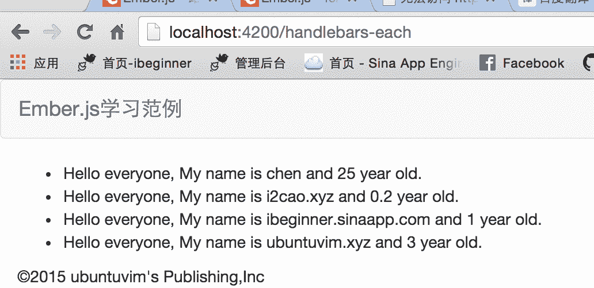

# Ember.js 入门指南之十 handlebars 遍历标签

采用与上一篇文章一样的方法，使用 `ember generate route handlebars-each` 命令创建了一个路由文件和一个对应的模板文件。 这一篇将为你介绍遍历标签，数组的遍历几乎在任何的常用的开发语言中都能看到，也是使用非常广泛的一个功能。下面我将为大家介绍`handlebars`的遍历标签，其使用方式与 EL 表达式几乎是一样的。我想你看一遍下来肯定也能明白了……废话少说，下面直接上演示代码吧！！

```
//  app/routes/handlebars.js
import Ember from 'ember';  
/**
 * 定义一个用于测试的对象数组
 */
export default Ember.Route.extend({  
    //  重写 model 回调函数，初始化测试数据
    model: function() {
        return [
            Ember.Object.create({ name: 'chen', age: 25}),
            Ember.Object.create({ name: 'i2cao.xyz', age: 0.2}),
            Ember.Object.create({ name: 'ibeginner.sinaapp.com', age: 1}),
            Ember.Object.create({ name: 'ubuntuvim.xyz', age: 3})
        ];
    }
}); 
```

如上述所示，在`route`类里构建了一个用于测试的对象数组，每个对象有 2 个属性（`name`，`age`）。 下面是显示数据的模板：

```
<!-- // app/templates/handlebars.hbs -->

{{! 遍历在 route 里设置的对象数组 }}
<ul>  
    {{#each model as |item|}}
        <li>Hello everyone, My name is {{item.name}} and {{item.age}} year old.</li>
    {{/each}}
</ul> 
```

有没有似曾相似的感觉呢！！跟 EL 表达式的`forEach`标签几乎是一样的。不出意外你应该可以看到如下的结果。



**提醒：记得此时运行的 URL 是刚刚新建的 route。** 操作数组的时候注意使用官方建议的方法（如，新增使用`pushObject`而不是`push`），请看[前面的文章](http://blog.ddlisting.com/2016/03/17/ember-js-ru-men-zhi-nan-zhi-liu-mei-ju-enumerables/)。

### 1，访问数组下标

有些情况我们可能需要获取数组的下标，比如有些时候可能会下标作为数据的序号。请看下面的演示：

```
<!-- // app/templates/handlebars.hbs -->

{{! 遍历在 route 里设置的对象数组 }}
<ul  
    {{#each model as |item index|}}
        <li>{{index}} Hello everyone, My name is {{item.name}} and {{item.age}} year old.</li>
    {{/each}}
</ul> 
```

不过这个下标是从 0 开始的，且你还不能想 jstl 中的`forEach`标签可以这样写`{{index+1}}`，`handlebars`不允许这么写！如果你想改成从 1 开始那么可以使用 helper 实现。正如网友`@吧台丶香槟`所说的方法。有关 helper 请看[Ember.js 入门指南之十八工具类的助手](http://blog.ddlisting.com/2016/03/23/ember-js-ru-men-zhi-nan-zhi-shi-ba-gong-ju-lei-de-zhu-shou/)。

### 2，空数组处理

在 each 标签内还可以使用{{else}}，当数组为空的时候就会执行 else 代码块。

```
{{! 空数组处理，如果从 route 返回的 model 为空，则会执行 else 代码块的代码 }}
{{#each model as |item|}}
    Hello, {{item.name}}
{{else}}
    Sorry, nobody is here.
{{/each}} 
```

为了测试效果，请把`app/routes/handlebars.js`的`return`语句改成`return []`。此时返回到模板上的是一个空数组，结果也和预期的一致，页面显示的是“Sorry, nobody is here.”。

上述的内容就是`handlebars`的`each`遍历使用实例。应该也是没什么难度的……

最后感谢的[@吧台丶香槟](http://t.qq.com/falaoyunfeiluan)建议。

博文完整代码放在[Github](https://github.com/ubuntuvim/my_emberjs_code)（博文经过多次修改，博文上的代码与 github 代码可能又出入，不过影响不大！），如果你觉得博文对你有点用，请在 github 项目上给我点个`star`吧。您的肯定对我来说是最大的动力！！