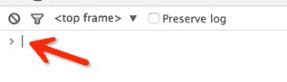
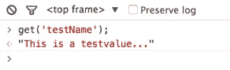
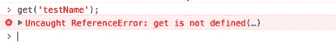
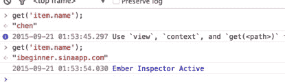
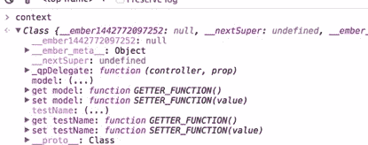

# Ember.js 入门指南之十七调试助手

Ember 不仅提供了专门用于调试 Ember 程序的谷歌、火狐浏览器插件[Ember Inspector](https://github.com/emberjs/ember-inspector)( 安装插件可能需要翻墙，如果你也是一个程序员我想翻墙对于你来说应该不是什么难事！！！)，还提供了用于调试的`helper`。
按照惯例，先做好准备工作，分别执行[Ember CLI](http://ember-cli.com/user-guide)命令创建`controller`、`route`和模板：

```js
ember generate controller dev-helper  
ember generate route dev-helper 
```

### 1，日志助手`{{log}}`

`{{log}}`可以把从`controller`、`route`类传递到页面上的值以日志的形式直接输出在浏览器的控制台上。下面代码在`controller`类添加测试数据。

```js
// app/controllers/dev-helper.js

import Ember from 'ember';

export default Ember.Controller.extend({  
    testName: 'This is a testvalue...'
}); 
```

我们可以在模板上直接显示字符串`testName`的值，也可以使用`{{log}}`助手以日志形式输出在控制台。当然你也可以直接使用`{{log 'xxx'}}`在控制台打印"xxxx"。第二点断点助手的示例中将为你演示`{{log 'xxx'}}`用法。

```js
<!-- app/templates/dev-helper.hbs -->

直接显示在页面上：{{testName}}
{{log testName}} 
```

运行[`localhost:4200/dev-helper`](http://localhost:4200/dev-helper)之后我们可以在页面上看到字符串`testName`的值。打开谷歌或者火狐的控制台（console 标签下）可以看到也打印的字符的值。比较简单我就不再截图了……

### 2，断点助手`{{debugger}}`

当你需要调试的时候，你可以在模板上需要添加断点的地方添加这个助手，运行的时候会自动停在添加这个助手的地方。

```js
{{log '这句话在断点前面'}}
{{debugger}}
<br>  
{{log '这句话在断点后面'}} 
```

不出意外程序会停在有`{{debugger}}`这一行。控制台应该会打印“这句话在断点前面”。然后通过点击下一步跳过断点，然后继续打印“这句话在断点后面”。
运行结果不好截图，请读者自己试试吧！！！
当你使用了`{{debugger}}`，并且程序停止进入 debug 状态的时候，你可以直接在浏览器控制台的命令行输入`get('key')`来获取`controller`设置的值。



在箭头所指的位置输入`get('testName')`，然后按`enter`键执行。会得到如下结果：



可以看到正确的获取到了前面在`controller`类里设置的值。 如果你不是在调试模式下输入`get('testName')`那么会提示如下错误。



你还可以在遍历助手`{{each}}`中使用`{{debugger}}`，点击一次“下一步”就会执行一次循环。

首先重写`route`类的`model`回调，在里面添加测试数据。

```js
//  app/routes/dev-helper.js

import Ember from 'ember';

export default Ember.Route.extend({  
    model: function() {
        return [
            { id: 1, name: 'chen', age: 25 },
            { id: 2, name: 'ibeginner.sinaapp.com', age: 2 }
        ];
    }
}); 
```

在模板的`each`助手中使用`{{debugger}}`助手。

```js
{{#each model as |item|}}
    {{debugger}}
    <li>item</li>
{{/each}} 
```

运行，浏览器自动进入 debug 模式（如果不能自动进入 debug 模式可以手动按`F12`进入 debug）。此时你可以在浏览器控制台命令输入`get('item.name')`来获取本次循环对象的属性值。然后你几点“下一步”或者按`F8`，程序自动进入到下一次循环，然后你再输入`get('item.name')`，此时得到的是本次循环对象属性值。然后点击下一步或者按 F8 进入第三次循环，由于`route`类设置返回的数组只有 2 个元素，第三次已经没有元素。所以这次会自动退出 debug 模式。 如果运行正常你可会得到下图所示的输出信息。



在调试状态下你还可以直接在浏览器控制台命令行输入`context`获取上下文信息。会输出本页面所包含的所有类和属性。



上述介绍的就是 Ember 提供的调试助手的所有使用方法。在你开发 Ember 应用的时候应该是很有用的，特别是在`each`循环遍历的时候。

博文完整代码放在[Github](https://github.com/ubuntuvim/my_emberjs_code)（博文经过多次修改，博文上的代码与 github 代码可能又出入，不过影响不大！），如果你觉得博文对你有点用，请在 github 项目上给我点个`star`吧。您的肯定对我来说是最大的动力！！