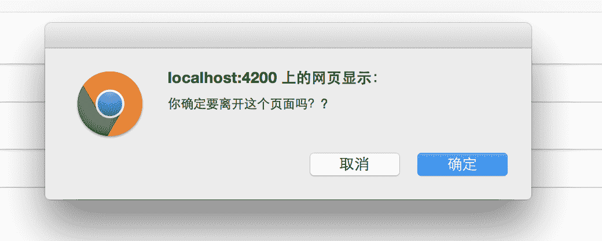
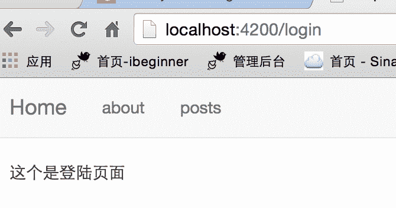

# Ember.js 入门指南之二十四终止与重试路由跳转

在路由的转换过程中，Ember 路由器会通过回调（`beforeModel`、`model`、`afterModel`、`redirect`）解析一个`transition`对象到转换的下一路由中。任何一个回调都可以通过传递过来的`transition`参数获取`transition`对象，然后使用这个对象调用`transition.abort()`方法立即终止路由的转换，如果你的程序保存了这个对象（`transition`对象）之后你还可以在需要的地方取出来并调用`transition.retry()`方法激活路由转换这个动作，最终实现路由的转换。

### 1，通过调用 willTransition 方法阻止路由转换

当用户通过`{{link-to}}`助手、`transition`方法或者直接执行 URL 来转换路由，当前路由会自动执行`willTransition`方法。每个活动的路由都可以决定是否执行转换路由。

想象一下，在当前路由所渲染的页面是一个比较复杂的表单，并且用户已经填写了很多信息，但是用户很可能无意中点击了返回或者关闭页面，这就导致了用户填写的信息直接丢失了，这样的用户体验并不好。此时我们可以通过使用`willTransition`方法阻止用户的行为并提示用户是否确认离开本页面。

为了验证这个特性我们需要创建好测试所需的文件。

```
ember g controller form  
ember g route form 
```

首先在`controller`增加测试数据。

```
//  app/controllers/form.js

import Ember from 'ember';

export default Ember.Controller.extend({  
    firstName: 'chen',
    lastName: 'ubuntuvim'
}); 
```

再创建一个模拟用户填写信息的模板。

```
<form>  
  <div class="form-group">
    <label for="exampleInputEmail1">FirstName</label>
    {{input type="text" class="form-control" id="exampleInputEmail1" placeholder="FirstName" value=firstName}}
  </div>
  <div class="form-group">
    <label for="exampleInputPassword1">LashName</label>
    {{input type="text" class="form-control" id="exampleInputPassword1" placeholder="LashName" value=lastName}}
  </div>
  <button type="submit" class="btn btn-primary">Submit</button>
</form>

<br><br>  
{{#link-to 'about'}}<b>转到 about</b>{{/link-to}} 
```

关键部分来了，我们在路由里添加`willTransition`方法。

```
//  app/routes/form.js

import Ember from 'ember';

export default Ember.Route.extend({  
    actions: {
        willTransition: function(transition) {
            //  如果是使用 this.get('key')获取不了页面输入值，因为不是通过 action 提交表单的
            var v = this.controller.get('firstName');
            //  任意获取一个作为判断表单输入值
            if (v && !confirm("你确定要离开这个页面吗？?")) {
                transition.abort();
            } else {
                return true;
            }
        }
    }
}); 
```

运行：[`localhost:4200/form`](http://localhost:4200/form)，先点击`submit`提交表单，可以看到表单顺利提交没有任何问题，然后再点击`转到 about`，你可以看到会弹出如下提示框。



接着，点击“取消”页面没有跳转，如果是点击“确定”页面会跳转到`about`页面。 再接着，把`FirstName`这个输入框的内容清空然后点击“转到 about”页面直接跳转到了`about`页面。

很多博客网站都是有这个功能的！！

### 2，在 beforeModel、model、afterModel 回调中阻止路由转换

```
beforeModel(transition) {  
    if (new Date() > new Date('January 1, 1980')) {
      alert('Sorry, you need a time machine to enter this route.');
      transition.abort();
    }
} 
```

这段代码演示的就是在`beforeModel`回调中使用`abort`方法阻止路由的转换。代码比较简单我就不做例子演示了！

### 3，存储 transition 对象、路由转换重试

对于使用`abort`方法终止的路由可以调用`retry`方法重新激活。一个很典型的例子就是登陆。如果登陆成功就转到首页，否则跳转回登陆页面。 文件准备工作：

```
ember g controller auth  
ember g route auth  
ember g controller login  
ember g route login 
```

下面是演示用到的代码。

```
//  app/controllers/login.js

import Ember from 'ember';

export default Ember.Controller.extend({  
    actions: {
        login: function() {
          //  获取跳转过来之前路由中设置的 transition 对象
            var transitionObj = this.get('transitionObj');
            console.log('transitionObj = ' + transitionObj);
            if (transitionObj) {
                this.set("transitionObj", null);
                transitionObj.retry();
            } else {
                //  转回首页
                this.transitionToRoute('index');
            }
        }
    }
}); 
```

```
//  app/controllers/auth.js

import Ember from 'ember';

export default Ember.Controller.extend({  
    userIsLogin: false
}); 
```

```
//  app/routes/auth.js

import Ember from 'ember';

export default Ember.Route.extend({  
    beforeModel(transition) {
        // 在名为 auth 的 controller 设置了 userIsLogin 为 false，默认是未登录
        if (!this.controllerFor("auth").get('userIsLogin')) {
            var loginController = this.controllerFor("login");
            // 保存 transition 对象
            loginController.set("transitionObj", transition);
            this.transitionTo("login");  // 跳转到路由 login
        }
    }
}); 
```

```
<!--  //app/templates/login.hbs -->

这个是登陆页面 
```

1.  先执行[`localhost:4200/auth`](http://localhost:4200/auth)，然后界面会自动跳转到`login`页面，结果显示如下：



可以看到 URL 确实是转到`login`了。

1.  执行[`localhost:4200/login`](http://localhost:4200/login)，你会发现页面直接跳转到首页，浏览器控制台打印的`transitionObj`是`undefined`。由于没有经`auth`这个路由的跳转所以获取不到`transition`对象。自然就跳转回`index`这个路由。

博文完整代码放在[Github](https://github.com/ubuntuvim/my_emberjs_code)（博文经过多次修改，博文上的代码与 github 代码可能又出入，不过影响不大！），如果你觉得博文对你有点用，请在 github 项目上给我点个`star`吧。您的肯定对我来说是最大的动力！！