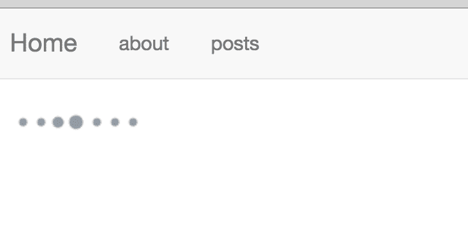
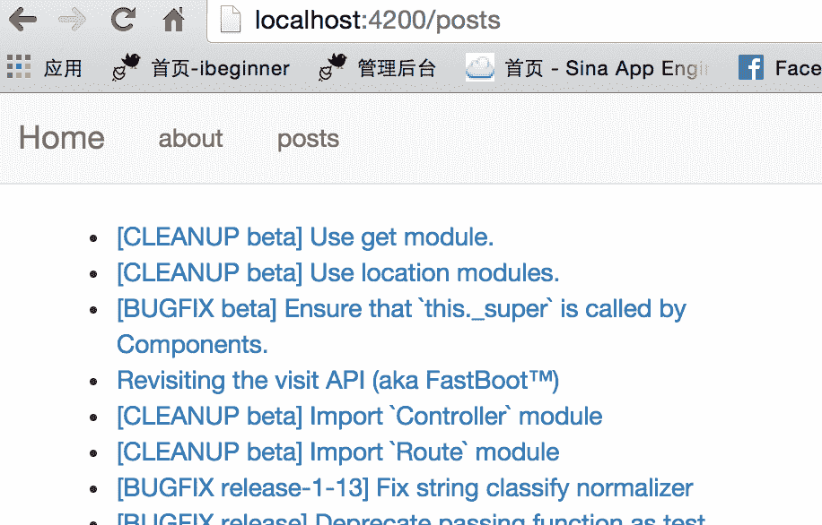
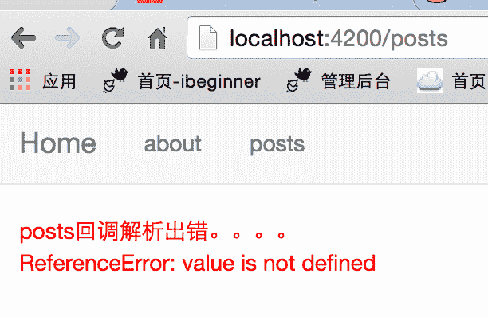
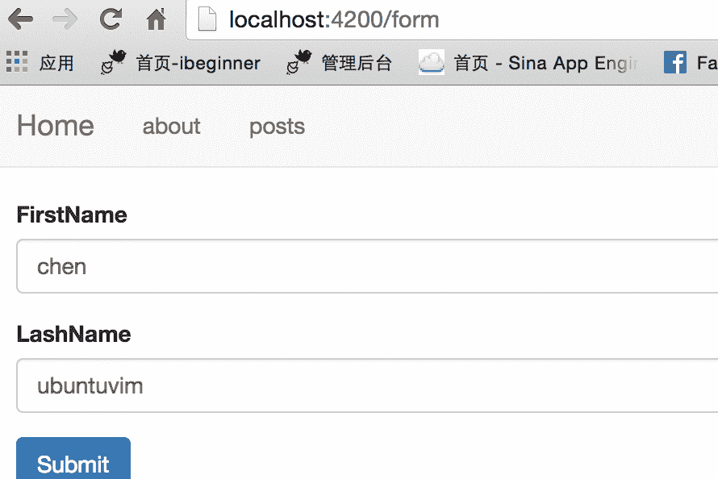

# Ember.js 入门指南之二十五 loading、error 子状态

在前面的[Ember.js 入门指南之二十路由定义](http://blog.ddlisting.com/2016/03/25/ember-js-ru-men-zhi-nan-zhi-er-shi-lu-you-ding-yi/)提过`loading`、`error`子路由，它们是[Ember](http://emberjs.com/)默认创建的，并在`beforeModel`、`model`、`afterModel`这三个回调执行完毕之前会先渲染当前路由的`loading`和`error`模板。

```js
Router.map(function() {  
  this.route('posts', function() {
      this.route('post', { path: '/:post_id'});
  });
}); 
```

对于上述的路由设置[Ember](http://emberjs.com/)会生成如下的路由列表：


每个路由都会自动生成一个`loading`、`error`路由，下面我将一一演示这两个路由的作用。 图片前面`loading`、`error`路由对应的`application`路由。`posts_loading`和`posts_error`对应的是`posts`路由。

### 1，loading 子状态

[Ember](http://emberjs.com/)建议数据放在`beforeModel`、`model`、`afterModel`回调中获取并传递到模板显示。但是只要是加载数据就需要时间，对于[Ember](http://emberjs.com/)应用来说，在`model`等回调中加载完数据才会渲染模板，如果加载数据比较慢那么用户看到的页面就是一个空白的页面，用户体验很差！

[Ember](http://emberjs.com/)提供的解决办法是：在`beforeModel`、`model`、`afterModel`回调还没返回前先进入一个叫`loading`的子状态，然后渲染一个叫`routeName-loading`的模板（如果是`application`路由则对应的直接是`loading`、`error`不需要前缀）。

为了演示这效果在`app/templates`下创建一个`posts-loading`模板。如果程序正常，在渲染模板`posts`之前会先渲染这个模板。

```js
<!-- app/templates/posts-loading.hbs -->

 
```

然后修改路由`posts.js`，让`model`回调执行时间更长一些。

```js
//  app/routes/posts.js

import Ember from 'ember';

export default Ember.Route.extend({

    model: function() {
        //  模拟一个延时操作，
        for (var i = 0; i < 10000000;i++) {

        }
        return Ember.$.getJSON('https://api.github.com/repos/emberjs/ember.js/pulls');
    }
}); 
```

执行[`localhost:4200/posts`](http://localhost:4200/posts)，首先会看到执行的`loading`模板的内容，然后才看到真正要显示的数据。有一个加载过程，如下面 2 幅图片所示。





### 2，loading 事件

在`beforeModel`、`model`、`afterModel`回调没有立即返回之前，会先执行一个名为 loading 的事件。

```js
//  app/routes/posts.js

import Ember from 'ember';

export default Ember.Route.extend({

    model: function() {
        //  模拟一个延时操作，
        for (var i = 0; i < 10000000;i++) {

        }
        return Ember.$.getJSON('https://api.github.com/repos/emberjs/ember.js/pulls');
    },
    actions: {
        loading: function(transition, originRoute) {
            alert("Sorry this is taking so long to load!!");
        }
    }
}); 
```

页面刷新后会弹出一个提示框，先不点击“确定”。打开浏览器的“开发者 -> 开发者工具”，切换到 Network 标签下。找到“pulls”这个请求，点击它。


从图中可以看到此时`model`回调并没有返回。此时响应的内容是空的，说明`loading`事件实在`model`回调返回之前执行了。

然后点击弹出框的“确定”，此时可以看到 Response 有数据了。说明`model`回调已经执行完毕。 注意：如果当前的路由没有显示定义`loading`事件，这个时间会冒泡到父路由，如果父路由也没有显示定义`loading`事件，那么会继续向上冒泡，一直到最顶端的路由`application`。

### 3，error 子状态

与`loading`子状态类似，`error`子状态会在`beforeModel`、`model`、`afterModel`回调执行过程中出现错误的时候触发。

命名方式与`loading`子状态也是类似的。现在定义一个名为`posts-error.hbs`的模板。

```js
<!--  app/templates/posts-error.hbs -->

<p style="color: red;">  
posts 回调解析出错。。。。  
</p> 
```

然后在`model`回调中手动添加一个错误代码。

```js
//  app/routes/posts.js

import Ember from 'ember';

export default Ember.Route.extend({

    model: function() {
        //  模拟一个延时操作，
        for (var i = 0; i < 10000000;i++) {

        }
        var e = parseInt(value);
        return Ember.$.getJSON('https://api.github.com/repos/emberjs/ember.js/pulls');
    }
}); 
```

注意`var e = parseInt(value);`这句代码，由于`value`没有定义所以应该会报错。那么此时页面会显示什么呢？？


如果你的演示程序没有其他问题那么你也会得到上图的结果。但是如果没有定义这个模板，那么界面上将是什么都不显示。

如果你想在`xxx-error.hbs`模板上看到是什么错误信息，你可以在模板上打印`model`的值。如下：

```js
<!--  app/templates/posts-error.hbs -->

<p style="color: red;">  
posts 回调解析出错。。。。  
<br>  
{{model}}
</p> 
```

此时页面会显示出你的代码是什么错误。



不过相比于浏览器控制台打印的错误信息简单很多！！！

### 4，error 事件

`error`事件与第一点讲的 loading 事件也是相似的。使用方式与`loading`一样。个人觉得这个事件非常有用，我们可以在这个事件中根据`error`状态码的不同执行不同的逻辑，比如跳转到不同的路由上。

```js
//  app/routes/posts.js

import Ember from 'ember';

export default Ember.Route.extend({

    model: function() {
        return Ember.$.getJSON('https://api.github.com/repos/emberjs/ember.js/pulls&#95;&#95;&#95;&#95;');
    },

    actions: {
        error: function(error, transition) {
            console.log('error = ' + error.status);
            //  打印 error 对象里的所有属性和方法名
            for(var name in error){         
               console.log(name); 
               // console.log('属性值或者方法体==》' + error[name]);
            }    
            alert(names); 
            if (error && error.status === 400) {
                return this.transitionTo("about");
            } else if (error.status === 404) {
                return this.transitionTo("form");
            } else {
                console.log('else......');
            }
        }
    }
}); 
```

注意`getJSON`方法里的 URL，我在 URL 后面随机加了一些字符，目的是让这个 URL 不存在。此时请求应该会找不到这个地址`error`的响应码应该是 404。然后直接跳转到`form`这个路由上。 运行[`localhost:4200/posts`](http://localhost:4200/posts)之后，浏览器控制台打印信息如下：


页面也会跳转到`form`。



到此路由加载数据过程中涉及的两个状态`loading`和`error`的内容全部介绍完，这两个状态在优化用户体验方面是非常有用的，希望想学习[Ember](http://emberjs.com/)的同学好好掌握！！！=^=

博文完整代码放在[Github](https://github.com/ubuntuvim/my_emberjs_code)（博文经过多次修改，博文上的代码与 github 代码可能又出入，不过影响不大！），如果你觉得博文对你有点用，请在 github 项目上给我点个`star`吧。您的肯定对我来说是最大的动力！！