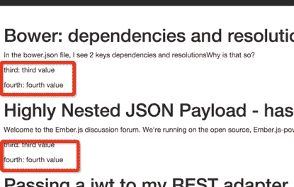

# Ember.js 入门指南之二十九属性传递

## 1，传递参数到组件上

每个组件都是相对独立的，因此任何组件所需的数据都需要通过组件的属性把数据传递到组件中。

比如上篇[Ember.js 入门指南之二十八组件定义](http://blog.ddlisting.com/2016/04/07/ember-js-ru-men-zhi-nan-zhi-er-shi-ba-zu-jian-ding-yi/)的第三点`{{component item.pn post=item}}`就是通过属性 post 把数据传递到组件`foo-component`或者`bar-component`上。如果在`index.hbs`中是如下方式调用组件那么渲染之后的页面是空的。 `{{component item.pn}}` 请读者自己修改`index.hbs`的代码后演示效果。

传递到组件的参数也是动态更新的，当传递到组件上的参数变化时组件渲染的 HTML 也会随之发生改变。

## 2，位置参数

传递的属性参数不一定要指定参数的名字。你可以不指定属性参数的名称，然后根据参数的位置获取对应的值，但是要在组件对应的组件类中指定位置参数的名称。比如下面的代码：

准备工作：

```js
ember g route passing-properties-to-component  
ember g component passing-properties-to-component 
```

调用组件的模板，传入两个位置参数，分别是`item.title`、`item.body`。

```js
<!-- app/templates/passing-properties-to-component.hbs  -->

{{#each model as |item|}}
    <!-- 传递到组件 blog-post 第一个参数为数据的 title 值，第二个为 body 值 -->
    {{passing-properties-to-component item.title item.body}}
{{/each}} 
```

准备需要显示的数据。

```js
//  app/routes/padding-properties-to-component.js

import Ember from 'ember';

export default Ember.Route.extend({

    model: function() {
         return [
            { id: 1, title: 'Bower: dependencies and resolutions new', body: "In the bower.json file, I see 2 keys dependencies and resolutionsWhy is that so? " },
            { id: 2, title: 'Highly Nested JSON Payload - hasMany error', body: "Welcome to the Ember.js discussion forum. We're running on the open source, Ember.js-powered Discourse forum software. " },
            { id: 3, title: 'Passing a jwt to my REST adapter new ', body: "This sets up a binding between the category query param in the URL, and the category property on controller:articles. " }
        ];

    }
}); 
```

在组件类中指定位置参数的名称。

```js
//  app/components/padding-properties-to-component.js

import Ember from 'ember';

const PaddingPropertiesToComponentComponent = Ember.Component.extend({});

PaddingPropertiesToComponentComponent.reopenClass({  
    // 指定位置参数的名称
    positionalParams: ['title', 'body']
});

export default PaddingPropertiesToComponentComponent ; 
```

**注意**：属性 positionalParams 指定的参数不能在运行期改变。位置参数属性`positionalParams`的使用需要用`reopenClass`方法重新扩展组件类，不然无法实现预期效果。

组件直接使用组件类中指定的位置参数名称获取数据。

```js
<!--  app/templates/components/passing-properties-to-component.hbs  -->

<article>  
    <h1>{{title}}</h1>
    <p>{{body}}</p>
</article> 
```

**注意**：获取数据的名称必须要与组件类指定的名称一致，否则无法正确获取数据。 显示结果如下：


[Ember](http://emberjs.com)还允许你指定任意多个参数，但是组件类获取参数的方式就需要做点小修改。比如下面的例子：

调用组件的模板

```js
<!-- app/templates/passing-properties-to-component.hbs  -->

{{#each model as |item|}}
    <!-- 传递到组件 blog-post 第一个参数为数据的 title 值，第二个为 body 值 -->
    {{passing-properties-to-component item.title item.body 'third value' 'fourth value'}}
{{/each}} 
```

指定参数名称的组件类，获取参数的方式可以[Ember.js 入门指南之三计算属性](http://blog.ddlisting.com/2016/03/17/ember-js-ru-men-zhi-nan-ji-suan-shu-xing-compute-properties/)这章。

```js
//  app/components/padding-properties-to-component.js

import Ember from 'ember';

const PaddingPropertiesToComponentComponent = Ember.Component.extend({  
    title: Ember.computed('params.[]', function() {
        return this.get('params')[0];  //获取第一个参数
    }),
    body: Ember.computed('params.[]', function() {
        return this.get('params')[1];  //获取第二个参数
    }),
    third: Ember.computed('params.[]', function() {
        return this.get('params')[2];  //获取第三个参数
    }),
    fourth: Ember.computed('params.[]', function() {
        return this.get('params')[3];  //获取第四个参数
    })
});

PaddingPropertiesToComponentComponent .reopenClass({  
  positionalParams: 'params'
});

export default PaddingPropertiesToComponentComponent; 
```

下面看组件是怎么获取传递过来的参数的。

```js
<!--  app/templates/components/passing-properties-to-component.hbs  -->

<article>  
    <h1>{{title}}</h1>
    <p>{{body}}</p>
    <p>third: {{third}}</p>
    <p>fourth: {{fourth}}</p>
</article> 
```

` 显示结果如下：



到此组件参数传递的内容全部介绍完毕。总的来说没啥难度。Ember 中参数的传递与获取方式基本是相似的，比如[link-to 助手](http://blog.ddlisting.com/2016/03/22/ember-js-ru-men-zhi-nan-zhi-shi-san-link-to/)、[action 助手](http://blog.ddlisting.com/2016/03/22/ember-js-ru-men-zhi-nan-zhi-shi-wu-action/)。

谢谢网友[@李乃恒](http://t.qq.com/A1027659670)的指正。

博文完整代码放在[Github](https://github.com/ubuntuvim/my_emberjs_code)（博文经过多次修改，博文上的代码与 github 代码可能有出入，不过影响不大！），如果你觉得博文对你有点用，请在 github 项目上给我点个`star`吧。您的肯定对我来说是最大的动力！！