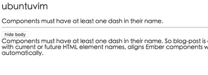

# Ember.js 入门指南之三十五控制器（controller）

从本篇开始进入第五章控制器，`controller`在 E`mber2.0`开始越来越精简了，职责也更加单一——处理逻辑。

下面是准备工作。 重新创建一个[Ember](http://emberjs.com)项目，仍旧使用的是[Ember CLI](http://ember-cli.com/user-guide)命令创建。

```js
ember new chapter5_controllers  
cd chapter5_controllers  
ember server 
```

在浏览器执行项目，看到如下信息说明项目搭建成功。 **Welcome to Ember**。

## 1，控制器简介

控制器与组件非常相似，由此，在未来的新版本中很有可能组件将会完全取代控制器，很可能随着 Ember 版本的更新控制器将退出[Ember](http://emberjs.com)。目前的版本中组件还不能直接通过路由访问，需要通过模板调用才能使用组件，但是未来的版本会解决这个问题，到时候`controller`可能就真的从[Ember](http://emberjs.com)退出了！

正因如此，模块化的 Ember 应用很少用到`controller`。即便是使用了`controller`也是为了处理下面的两件事情：

1.  `controller`主要是为了维持当前路由状态。一般来说，model 的属性会保存到服务器，但是`controller`的属性却不会保存到服务器。
2.  组件上的动作需要通过`controller`层转到`route`层。

模板上下文的渲染是通过当前`controller`的路由处理的。[Ember](http://emberjs.com)所追随的理念是“约定优于配置”，这也就意味着如果你只需要一个`controller` 你就创建一个，而不是一切为了“便于工作”。

下面的例子是演示路由显示`blog post`。假设模板`blog-post`用于展示模型`blog-post`的数据，并在这个模型包含如下属性（隐含属性`id`，因为在`model`中不需要手动指定`id`属性）：

*   title
*   intro
*   body
*   author

`model`定义如下：

```js
//  app/models/blog-post.js

import DS from 'ember-data';

export default DS.Model.extend({  
  title: DS.attr('string'),  //  属性默认为 string 类型，可以不指定
  intro: DS.attr('string'),
  body: DS.attr('string'),
  author: DS.attr('string')
}); 
```

在`route`层增加测试数据，直接返回一个`model`对象。

```js
//  app/routes/blog-post.js

import Ember from 'ember';

export default Ember.Route.extend({  
    model: function() {
        var blogPost = this.store.createRecord('blog-post', {
            title: 'DEFINING A COMPONENT',  //  属性默认为 string 类型，可以不指定
            intro: "Components must have at least one dash in their name. ",
            body: "Components must have at least one dash in their name. So blog-post is an acceptable name, and so is audio-player-controls, but post is not. This prevents clashes with current or future HTML element names, aligns Ember components with the W3C Custom Elements spec, and ensures Ember detects the components automatically.",
            author: 'ubuntuvim'
        });
        // 直接返回一个 model，或者你可以返回 promises，
        return blogPost;
    }
}); 
```

显示信息的模板如下：

```js
<!--  app/templates/blog-post.hbs  -->

<h1>{{model.title}}</h1>  
<h2>{{model.author}}</h2>

<div class="intro">  
    {{model.intro}}
</div>

<hr>

<div class="body">  
    {{model.body}}
</div> 
```

如果你的代码没有编写错误那么也会得到如下结果：


**Welcome to Ember**是主模板的信息，你可以在`application.hbs`中删除，但是记得不要删除`{{outlet}}`，否则什么信息也不显示。

这个例子中没有显示任何特定的属性或者指定的动作（`action`）。此时，控制器的 model 属性所扮演的角色仅仅是模型属性的`pass-through`（或代理）。 注意：控制器获取的`model`是从`route`得到的。

下面为这个例子增加一个功能：用户可以点击标题触发显示或者隐藏`post`的内容。通过一个属性`isExpanded`控制，下面分别修改模板和控制器的代码。

```js
//  app/controllers/blog-post.js

import Ember from 'ember';

export default Ember.Controller.extend({  
    isExpanded: false,  //默认不显示 body
    actions: {
        toggleBody: function() {
            this.toggleProperty('isExpanded');
        }
    }
}); 
```

在`controller`中增加一个属性`isExpanded`，如果你不在`controller`中定义这个属性也是可以的。对于这个`controller`代码的解释请看[Ember.js 入门指南之十五{{action}} 助手](http://blog.ddlisting.com/2016/03/22/ember-js-ru-men-zhi-nan-zhi-shi-wu-action/)。

```js
<!--  app/templates/blog-post.hbs  -->

<h1>{{model.title}}</h1>  
<h2>{{model.author}}</h2>

<div class="intro">  
    {{model.intro}}
</div>

<hr>  
{{#if isExpanded}}
    <button {{action 'toggleBody'}}>hide body</button>
    <div class="body">
        {{model.body}}
    </div>
{{else}}
    <button {{action 'toggleBody'}}>Show body</button>
{{/if}} 
```

在模板中使用`if`助手判断`isExpanded`的值，如果为`true`则显示`body`，否则不显示。

页面加载之后结果如下，首先是不显示`body`内容，点击按钮“Show body”则显示内容，并且按钮变为“hide body”。然后在点击这个按钮则不显示`body`内容。




到此`controller`的职责你应该大致了解了，其主要的作用是逻辑的判断、处理，比如这里例子中判断`body`内容的显示与否，其实你也可以把`controller`类中的处理代码放在`route`类中也可以实现这个效果，但是要作为`model`的属性返回（把`isExpanded`当做`model`的属性处理），请读者自己动手试试，但是把逻辑放到`route`又会使得`route`变得“不专一”了，`route`的主要职责是初始化数据的。我想这也是 Ember 还留着`controller`的原因之一吧！！

博文完整代码放在[Github](https://github.com/ubuntuvim/my_emberjs_code)（博文经过多次修改，博文上的代码与 github 代码可能有出入，不过影响不大！），如果你觉得博文对你有点用，请在 github 项目上给我点个`star`吧。您的肯定对我来说是最大的动力！！