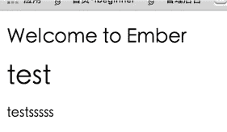
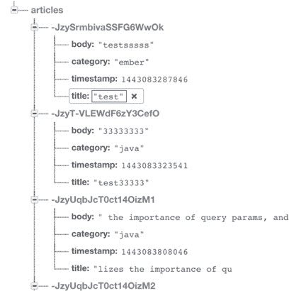
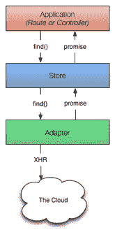
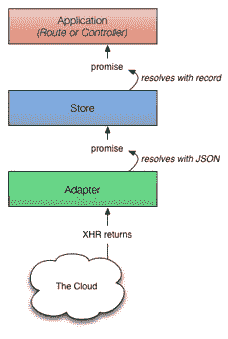
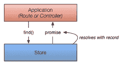

# Ember.js 入门指南之三十七 model 简介

[Ember](http://emberjs.com)官网用了大篇幅来介绍`model`，相比之前的`controller`简直就是天壤之别啊！

从本篇开始学习[Ember](http://emberjs.com)的模型，这一章也是[Ember](http://emberjs.com)基础部分的最后一章内容，非常的重要（不管你信不信反正我是信了）。

在开始学习`model`之前先做好准备工作： 重新创建一个[Ember](http://emberjs.com)项目，仍旧使用的是[Ember CLI](http://ember-cli.com/user-guide)命令创建。

```
ember new chapter6_models  
cd chapter6_models  
ember server 
```

在浏览器执行项目，看到如下信息说明项目搭建成功。 **Welcome to Ember**

本章演示所用到的代码都可以从[`github.com/ubuntuvim/my*emberjs*code/tree/master/chapter6_models`](https://github.com/ubuntuvim/my_emberjs_code/tree/master/chapter6_models)获取。

在介绍`model`之前先在项目中引入[firebase](https://www.firebase.com/)。相关的配置教材请移步这里（如果无法加载页面请先在[`www.firebase.com/`](https://www.firebase.com/)注册用户）。firebase 的官网提供了专门用于 Ember 的版本，还提供了非常简单的例子。从安装到整合都给出了非常详细代码教程。 下面是我的整合步骤（命令都是在项目目录下执行的）：

*   安装

```
ember install emberfire 
```

安装完成之后会自动创建`adapter（app/adapters/application.js）`，对于这个文件不需要做任何修改，官网提供的代码也许跟你的项目的代码不同，应该是官网的版本是旧版的。

*   配置`config/environment.js` 修改第八行`firebase: 'https://YOUR-FIREBASE-NAME.firebaseio.com/'`。这个地址是你注册用户时候得到的。你可以从[这里](https://www.firebase.com/account/#/)查看你的地址。比如下图所示位置


*   再在`config/enviroment.js`的`APP:{}`(大概第 20 行)后面新增如下代码

```
APP: {  
      // Here you can pass flags/options to your application instance
      // when it is created
    },
    contentSecurityPolicy: {
      'default-src': "'none'",
      'script-src': "'self' 'unsafe-inline' 'unsafe-eval' *",
      'font-src': "'self' *",
      'connect-src': "'self' *",
      'img-src': "'self' *",
      'style-src': "'self' 'unsafe-inline' *",
      'frame-src': "*"
    } 
```

然后再注释掉第 7 行原有属性（安装`firebase`自动生成的，但是配置不够完整）：`contentSecurityPolicy`。

或者你可以参考我的配置文件：

```
/* jshint node: true */

module.exports = function(environment) {  
  var ENV = {
    modulePrefix: 'chapter6-models',
    environment: environment,
    // contentSecurityPolicy: { 'connect-src': "'self' https://auth.firebase.com wss://*.firebaseio.com" },
    firebase: '你的 firebase 连接',
    baseURL: '/',
    locationType: 'auto',
    EmberENV: {
      FEATURES: {
        // Here you can enable experimental features on an ember canary build
        // e.g. 'with-controller': true
      }
    },

    APP: {
      // Here you can pass flags/options to your application instance
      // when it is created
    },
    contentSecurityPolicy: {
      'default-src': "'none'",
      'script-src': "'self' 'unsafe-inline' 'unsafe-eval' *",
      'font-src': "'self' *",
      'connect-src': "'self' *",
      'img-src': "'self' *",
      'style-src': "'self' 'unsafe-inline' *",
      'frame-src': "*"
    }
  };

  // 其他代码省略……
  return ENV;
}; 
```

如果不做这个配置启动项目之后浏览器会提示一堆的错误。主要是一些访问权限问题。配置完之后需要重启项目才能生效！

## 1，简介

`model`是一个用于向用户呈现底层数据的对象。不同的应用有不同的`model`，这取决于解决的问题需要什么样的`model`就定义什么样的`model`。

`model`通常是持久化的。这也就意味着用户关闭了浏览器窗口`model`数据不应该丢失。为了确保`model`数据不丢失，你需要存储`model`数据到你所指定的服务器或者是本地数据文件中。

一种非常常见的情况是，`model`数据会以`JSON`的格式通过`HTTP`发送到服务器并保存在服务中。Ember 还未开发者提供了一种更加简便的方式：使用 IndexedDB（使用在浏览器中的数据库）。这种方式是把`model`数据保存到本地。或者使用[Ember Data](https://github.com/emberjs/data)，又或者使用[firebase](https://www.firebase.com/)，把数据直接保存到远程服务器上，后续的文章我将引入[firebase](https://www.firebase.com/)，把数据保存到远程服务器上。

Ember 使用适配器模式连接数据库，可以适配不同类型的后端数据库而不需要修改任何的网络代码。你可以从[emberobserver](http://emberobserver.com/categories/ember-data-adapters)上看到几乎所有 Ember 支持的数据库。

如果你想把你的 Ember 应用与你的远程服务器整合，几遍远程服务器`API`返回的数据不是规范的`JSON`数据也不要紧，[Ember Data](https://github.com/emberjs/data)可以配置任何服务器返回的数据。

[Ember Data](https://github.com/emberjs/data)还支持流媒体服务器，比如 WebSocket。你可以打开一个 socket 连接远程服务器，获取最新的数据或者把变化的数据推送到远程服务器保存。

[Ember Data](https://github.com/emberjs/data)为你提供了更加简便的方式操作数据，统一管理数据的加载，降低程序复杂度。

对于`model`与[Ember Data](https://github.com/emberjs/data)的介绍就到此为止吧，官网用了大量篇幅介绍 Model，在此我就不一一写出来了！太长了，写出来也没人看的！！！如果有兴趣自己看吧！点击查看详细信息。

下面先看一个简单的例子，由这个例子延伸出有关于`model`的核心概念。这些代码是旧版写法，仅仅是为了说明问题，本文也不会真正执行。

```
//  app/components/list-of-drafts.js
export default Ember.Component.extend({  
    willRender() {
        // ECMAScript 6 语法
        $.getJSON('/drafts').then(data => {
            this.set('drafts', data);
        });
    }
}); 
```

定义了一个组件类。并在组件类中获取`json`格式数据。 下面是组件对应的模板文件。

```
<!-- app/templates/components/list-of-drafts.hbs  -->  
<ul>  
    {{#each drafts key="id" as |draft|}}
    <li>{{draft.title}}</li>
    {{/each}}
</ul> 
```

再定义另外一个组件类和模板

```
//  app/components/list-button.js
export default Ember.Component.extend({  
    willRender() {
        // ECMAScript 6 语法
        $.getJSON('/drafts').then(data => {
            this.set('drafts', data);
        });
    }
}); 
```

```
<!-- app/templates/components/ list-button.hbs  -->  
{{#link-to ‘drafts’ tagName=’button’}}
Drafts ({{drafts.length}})  
{{/link-to}} 
```

组件`list-of-drafts`类和组件`list-button`类是一样的，但是他们的对应的模板却不一样。但是都是从远程服务器获取同样的数据。如果没有`Store`（`model`核心内容之一）那么每次这两个模板渲染都会是组件类调用一次远程数据。并且返回的数据是一样的。这无形中增加了不必要的请求，暂用了不必要的宽带，用户体验也不好。但是有了`Store`就不一样了，你可以把`Store`理解为仓库，每次执行组件类时先到`Store`中获取数据，如果没有再去远程获取。当在其中一个组件中改变某些数据，数据的更改也能理解反应到另一个获取此数据的组件上（与计算属性自动更新一样），而这个组件不需要再去服务请求才能获取最新更改过的数据。

下面的内容将为你一一介绍 Ember Data 最核心的几个东西：`models`、`records`、`adapters`、`store`。

## 2，核心概念

声明：下面简介内摘抄至[`www.emberjs.cn/guides/models/#toc_`](http://www.emberjs.cn/guides/models/#toc_)。

#### 1，store

`store`是应用存放记录的中心仓库。你可以认为`store`是应用的所有数据的缓存。应用的控制器和路由都可以访问这个共享的`store`；当它们需要显示或者修改一个记录时，首先就需要访问`store`。

`DS.Store`的实例会被自动创建，并且该实例被应用中所有的对象所共享。

`store`可以看做是一个缓存。在下面的`cache`会结合`store`介绍。

下面的例子结合 firebase 演示： 创建路由和`model`：

```
ember g route store-example  
ember g model article 
```

```
//   app/models/article.js

import DS from 'ember-data';

export default DS.Model.extend({  
    title: DS.attr('string'),
    body: DS.attr('string'),
    timestamp: DS.attr('number'),
    category: DS.attr('string')
}); 
```

这个就是`model`，本章要讲的内容就是它！为何没有定义 id 属性呢？`Ember`会默认生成`id`属性。

我们在路由的`model`回调中获取远程的数据，并显示在模板上。

```
//  app/routes/store-example.js

import Ember from 'ember';

export default Ember.Route.extend({  
    model: function() {
        // 从 store 中获取 id 为 JzySrmbivaSSFG6WwOk 的数据，这个数据是我在我的 firebase 中初始化好的
        return this.store.find('article', '-JzySrmbivaSSFG6WwOk');
    }
}); 
```

`find`方法的第一个参数是`model`类名，第二个参数对象的`id`属性值。记得 id 属性不需要在`model`类中手动定义，Ember 会自动为你定义。

```
<h1>{{model.title}}</h1>

<div class="body">  
{{model.body}}
</div> 
```

页面加载之后可以看到获取到的数据。



下面是我的 firebase 上的部分数据截图。



可以看到成功获取到`id`为`-JzySrmbivaSSFG6WwOk`的数据。更多关于数据的操作在后面会详细介绍。

#### 2，model

有关`model`的概念前面的简介已经介绍了，这里不再赘述。 `model`定义：

`model`是由若干个属性构成的。`attr`方法的参数指定属性的类型。

```
export default DS.Model.extend({  
    title: DS.attr('string'),  //  字符串类型
    flag: DS.attr('boolean'), //  布尔类型
    timestamp: DS.attr('number'),  //  数字类型
    birth: DS.attr(‘date’)  //日期类型
}); 
```

模型也声明了它与其他对象的关系。例如，一个`Order`可以有许多`LineItems`，一个`LineItem`可以属于一个特定的`Order`。

```
App.Order = DS.Model.extend({  
  lineItems: DS.hasMany('lineItem')
});

App.LineItem = DS.Model.extend({  
  order: DS.belongsTo('order')
}); 
```

这个与数据的表之间的关系是一样的。

#### 3，record

`record`是`model`的实例，包含了从服务器端加载而来的数据。应用本身也可以创建新的记录，以及将新记录保存到服务器端。

记录由以下两个属性来唯一标识：

1.  模型类型
2.  一个全局唯一的 ID

比如前面的实例`article`就是通过`find`方获取。获取到的结果就是一个`record`。

#### 4，adapter

适配器是一个了解特定的服务器后端的对象，主要负责将对记录(`record`)的请求和变更转换为正确的向服务器端的请求调用。

例如，如果应用需要一个`ID`为`1`的`person`记录，那么 Ember Data 是如何加载这个对象的呢？是通过 HTTP，还是 Websocket？如果是通过 HTTP，那么 URL 会是`/person/1`，还是`/resources/people/1`呢？

适配器负责处理所有类似的问题。无论何时，当应用需要从`store`中获取一个没有被缓存的记录时，应用就会访问适配器来获取这个记录。如果改变了一个记录并准备保存改变时，`store`会将记录传递给适配器，然后由适配器负责将数据发送给服务器端，并确认保存是否成功。

#### 5，cache

`store`会自动缓存记录。如果一个记录已经被加载了，那么再次访问它的时候，会返回同一个对象实例。这样大大减少了与服务器端的往返通信，使得应用可以更快的为用户渲染所需的 UI。

例如，应用第一次从`store`中获取一个`ID`为`1`的`person`记录时，将会从服务器端获取对象的数据。

但是，当应用再次需要`ID`为`1`的`person`记录时，`store`会发现这个记录已经获取到了，并且缓存了该记录。那么`store`就不会再向服务器端发送请求去获取记录的数据，而是直接返回第一次时候获取到并构造出来的记录。这个特性使得不论请求这个记录多少次，都会返回同一个记录对象，这也被称为`Identity Map`（标识符映射）。

使用标识符映射非常重要，因为这样确保了在一个 UI 上对一个记录的修改会自动传播到 UI 其他使用到该记录的 UI。同时这意味着你无须手动去保持对象的同步，只需要使用`ID`来获取应用已经获取到的记录就可以了。

## 3，架构简介

应用第一次从`store`获取一个记录时，`store`会发现本地缓存并不存在一份被请求的记录的副本，这时会向适配器发请求。适配器将从持久层去获取记录；通常情况下，持久层都是一个 HTTP 服务，通过该服务可以获取到记录的一个`JSON`表示。



如上图所示，适配器有时不能立即返回请求的记录。这时适配器必须向服务器发起一个异步的请求，当请求完成加载后，才能通过返回的数据创建的记录。

由于存在这样的异步性，`store`会从`find()`方法立即返回一个承诺（`promise`）。另外，所有请求需要`store`与适配器发生交互的话，都会返回承诺。 一旦发给服务器端的请求返回被请求记录的 JSON 数据时，适配器会履行承诺，并将`JSON`传递给`store`。 `store`这时就获取到了`JSON`，并使用`JSON`数据完成记录的初始化，并使用新加载的记录来履行已经返回到应用的承诺。



下面将介绍一下当`store`已经缓存了请求的记录时会发生什么。



在这种情形下，`store`已经缓存了请求的记录，不过它也将返回一个承诺，不同的是，这个承诺将会立即使用缓存的记录来履行。此时，由于`store`已经有了一份拷贝，所以不需要向适配器去请求（没有与服务器发生交互）。

`models`、`records`、`adapters`、`store`是你必须要理解的概念。这是 Ember Data 最核心的东西。

有关于上述的概念将会在后面的文章一一用代码演示。理解了本文`model`这一整章的内容都不是问题了！！！

博文完整代码放在[Github](https://github.com/ubuntuvim/my_emberjs_code)（博文经过多次修改，博文上的代码与 github 代码可能有出入，不过影响不大！），如果你觉得博文对你有点用，请在 github 项目上给我点个`star`吧。您的肯定对我来说是最大的动力！！