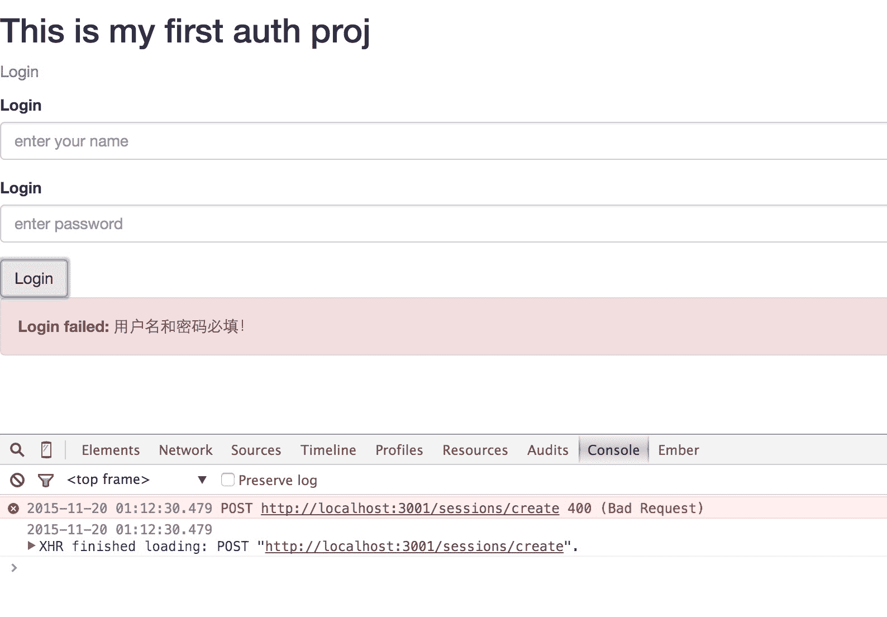
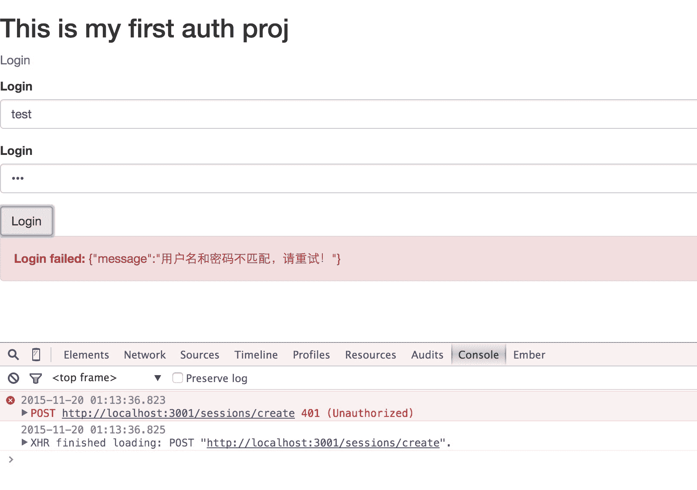
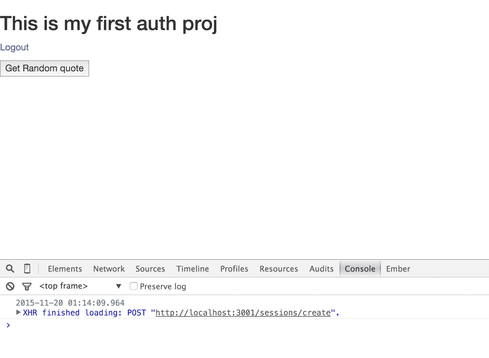

# 使用 ember-simple-auth 实现 Ember.js 应用的权限控制

  很多网站都有登录功能，对于 Ember 的应用我们怎么实现权限的控制呢？本篇将为你演示一个最常用的权限控制例子：用户登录。 要实现登录最常用的方式是通过判断 session 值，如果 session 中存在你所需要的值则可以认为是用户是经过了登录并且把用户信息设置到 session 了， 如果 session 中没有用户信息则认为用户没有登录，直接跳转到登录或者注册页面。

  本篇会引入一个专门用于控制权限的插件[ember-simple-auth](https://github.com/simplabs/ember-simple-auth)， 文章中大部分代码是直接参考这个插件的文档所写。如果你需要项目的代码请移步[github](https://github.com/ubuntuvim/my_emberjs_code/tree/master/chapter8_simple_auth)下载。

  好了，废话少说，直接放码出来吧。

#### 创建 Ember 应用

**本文会使用[Ember CLI](http://www.ember-cli.com/user-guide/)名称创建项目和项目所需的文件，更多有关 Ember CLI 的命令请自行到官网学习。**

```js
ember new chapter8_simple_auth  
cd chapter8_simple_auth  
ember server 
```

  如果你的项目搭建成功执行[`localhost:4200`](http://localhost:4200)， 会看到**Welcome to Ember**，说明项目搭建成功。

#### 升级 Ember、Jquery 版本

  本项目会升级 Ember 版本，目前(*2015-11-18*)来说如果是使用 Ember CLI 命令安装的项目 Ember 的版本是 1.13.7。 升级后使用的版本是**2.0.0-beta.3**。

升级步骤：

1.  修改 bower.json
      修改后此文件主要的代码如下：

```js
{
  "dependencies": {
    "ember": "2.0.0-beta.3"
  },
      "resolutions": {
      "ember": "2.0.0-beta.3"
  }
} 
```

1.  删除原有的 Ember

  必须要手动删除原有的版本，否则因为缓存的问题使用命令重新安装的时候可能安装不成功。手动删除如下目录： `appName/bower_components/ember`

1.  安装新版本 Ember
    使用命令：`bower install`，重新安装 Ember。

2.  检查是否安装成功。
    打开`appName/bower_components/ember/ember.js`，可以看到`Ember`是那个版本。如果是**2.0.0-beta.3**说明升级成功。

3.  同样的方式升级 Jquery
    如果你升级不成功，你可以参考我的项目的[bower.json](https://github.com/ubuntuvim/my_emberjs_code/blob/master/chapter8_simple_auth/bower.json)、[package.json](https://github.com/ubuntuvim/my_emberjs_code/blob/master/chapter8_simple_auth/package.json)升级。修改这两个文件后执行命令`bower install`升级。

4.  重启项目
    可以看到浏览器控制台打印出 Ember 的版本信息。 `2015-11-18 23:54:08.902 ember.debug.js:5202 DEBUG: ------------------------------- 2015-11-18 23:54:08.916 ember.debug.js:5202 DEBUG: Ember : 2.0.0-beta.3 2015-11-18 23:54:08.916 ember.debug.js:5202 DEBUG: jQuery : 2.1.4 2015-11-18 23:54:08.917 ember.debug.js:5202 DEBUG: -------------------------------`

  到此项目的升级工作完成。

#### 安装插件 ember-simple-auth

  直接使用 npm 命令安装，安装的方法可以参考[官方教程](https://github.com/simplabs/ember-simple-auth#installation)， 直接在项目目录下运行`ember install ember-simple-auth`即可完成安装。可以在`appName/bower_components`看到安装的插件。

#### 项目主要代码文件

##### 首页模板文件

```js
{{! app/templates/application.hbs }}

<h2 id="title">This is my first auth proj</h2>

{{#if session.isAuthenticated}}
    <p>
        <a {{action 'invalidateSession'}} style="cursor: pointer;">Logout</a>
    </p>
{{else}}
    <p>
        <a {{action 'sessionRequiresAuthentication'}} style="cursor: pointer;">Login</a>
    </p>
{{/if}}

{{outlet}} 
```

  `session.isAuthenticated`是插件 ember-simple-auth 封装好的属性，如果没有登录 isAuthenticated 为 false， `sessionRequiresAuthentication`也是插件 ember-simple-auth 提供的方法。此方法会自动根据用户实现的[`authenticate`](http://ember-simple-auth.com/api/classes/BaseAuthenticator.html)方法校验用户是否已经登录（`isAuthenticated`为`true`）。

##### 定义登录、登录成功组件

  使用 Ember CLI 创建两个组件：`login-form`和`get-quotes`。

```js
ember g component login-form  
ember g component get-quotes 
```

  分别编写这两个组件和组件对应的模板文件。

**login-form.js**

```js
// app/components/login-form.js

import Ember from 'ember';

export default Ember.Component.extend({  
    // authenticator: 'authenticator: custom',

    actions: {
        authenticate: function() {
            var user = this.getProperties('identification', 'password');
            this.get('session').authenticate('authenticator:custom', user).catch((msg) => {
                this.set('errorMessage', msg);
            });
        }
    }
}); 
```

  其中`authenticator`属性执行了一个自定义的身份验证器`custom`。`identification`和`password`是页面输入的用户名和密码。 `getProperties`方法会自动获取属性值并自动组装成 hash 形式（`{key: value}`形式）。`msg`是方法`authenticate`验证不通过的提示信息。   在此简单处理，直接放回到界面显示。

**login-form.hbs**

```js
{{! app/templates/login-form.hbs }}

<form {{action 'authenticate' on='submit'}}>  
    <div class="form-group">
        <label for="identification">Login</label>
        {{input value=identification placeholder="enter your name" class="form-control"}}
    </div>
    <div class="form-group">
        <label for="password">Login</label>
        {{input value=password placeholder="enter password" class="form-control" type="password"}}
    </div>
    <button type="submit" class="btn btn-default">Login</button>
</form>  
{{#if errorMessage}}
    <div class="alert alert-danger">
        <strong>Login failed: </strong>{{errorMessage}}
    </div>
{{/if}} 
```

  这个文件比较简单没什么好说，`errorMessage`就是组件类中返回的提示信息。

**get-quotes.js**

```js
// app/components/get-quotes.js

import Ember from 'ember';

export default Ember.Component.extend({  
    gotQuote: false,
    quote: "",

    actions: {
        getQuote: function() {
            var that = this;
            //  返回一个随机的字符串
            Ember.$.ajax({
                type: 'GET',
                // url: 'http://localhost:3001/api/protected/random-quote',
                url: 'http://localhost:3001/api/random-quote',
                success: function(response) {
                    that.setProperties({ quote: response, gotQuote: true });
                },
                error: function(error) {
                    alert("An error occurred while processing the response.");
                    console.log(error);
                }
            });
        }
    }
}); 
```

  此组件模拟登陆之后才能访问的资源，通过 Ajax 获取一个随机的字符串。 请求的服务代码你也可以从[github](https://github.com/auth0/nodejs-jwt-authentication-sample#running-it)上下载，下载之后按照文档安装，直接运行`node server.js`既可，服务器端是一个 nodejs 程序，如果你的电脑没有安装[nodejs](https://wwww.nodejs.org)，请自行下载安装。

##### 登陆、信息显示页面

  这两个页面比较简单，直接调用组件。为什么我没有直接把组件代码放在这两个页面呢？？我们知道 Ember2.0 之后官方不推荐使用控制器，控制器的作用在弱化，组件变得越来越重要。   既然我们项目使用的是 Ember2.0 版本那就必须要用组件去替代控制器实现某些逻辑的判断。

```js
{{! app/templates/login.hbs }}

{{login-form}} 
```

```js
{{! app/templates/protected.hbs }}

{{get-quotes}} 
```

##### 登陆前的提示信息

  我们直接把登陆使用的用户名和密码提示出来，为了测试方便嘛，再者项目还没有注册功能。

```js
{{! app/templates/index.hbs }}

{{#unless session.isAuthenticated}}
    <div class="alert alert-info">
        You can {{#link-to 'login' className="alert-link"}}log in {{/link-to}} with login <code>ember</code> and password <code>123</code>.
    </div>
{{/unless}} 
```

  但是用户名和密码为什么是`ember`和`123`呢？？你看到服务器代码里的[user-routes.js](https://github.com/auth0/nodejs-jwt-authentication-sample/blob/master/user-routes.js)就明白了，github 上用的是`gonto`，我下载之后做了点小修改。你可以修改成你喜欢的字符串。

  到此常规的文件就创建完成了，下面的内容才是重头戏。到目前为止我们还没使用过任何有关插件`ember-simple-auth`的内容。

##### 路由配置

```js
ember g route login  
ember g route protected  
ember g route application 
```

  执行命令的时候要注意别把之前的模板覆盖了！！！下面是这几个文件的内容。

**application.js**

```js
// app/routes/application.js

import Ember from 'ember';

import ApplicationRouteMixin from 'simple-auth/mixins/application-route-mixin';

export default Ember.Route.extend(ApplicationRouteMixin, {  
    actions: {
        invalidateSession: function() {
            this.get('session').invalidate();
        }
    }
}); 
```

  这个类首先混合了`ApplicationRouteMixin`类的特性，然后再加上自定义的特性。注意第二行代码，引入了插件`ember-simple-auth`的类`ApplicationRouteMixin`。更多有关这个类的介绍请点击[链接](http://ember-simple-auth.com/api/classes/ApplicationRouteMixin.html)查看。`session`是插件内置的属性。方法`invalidate`设置`session`为无效或者说是当前认证无效，更多详细信息请看方法的[API](http://ember-simple-auth.com/api/classes/SessionService.html)介绍。

**protected.js**

```js
// app/routes/protected.js

import Ember from 'ember';

import AuthenticatedRouteMixin from 'simple-auth/mixins/authenticated-route-mixin';

// 实现 AuthenticatedRouteMixin 的类会自动根据权限过滤，如果经过登录页面直接进入这个 route 会自动跳转到登录页面
export default Ember.Route.extend(AuthenticatedRouteMixin, {  
}); 
```

  此类也是引入插件`ember-simple-auth`封装好的类`AuthenticatedRouteMixin`。混合了此类的类会自动根据权限过滤，如果没有通过认证而直接访问这个 route 会被强制跳转到登录页面。

**login.js**

```js
// app/routes/login.js

import Ember from 'ember';

export default Ember.Route.extend({  
    //  清空提示信息
    setupController: function(controller, model) {
        console.log("route:login model = " + model);
        controller.set('errorMessage', null);
    }
}); 
```

  这个 route 的作用是清空页面的提示信息，如果不清空你再次进入的时候还是会看到提示信息。

##### 控制器配置

  路由 protected 之所以能实现无权限重定向到登录页面是因为在 controller:login 中指定了登录处理类。

**login.js**

```js
// app/controllers/login.js

import Ember from 'ember';

import LoginControllerMixin from 'simple-auth/mixins/login-controller-mixin';

export default Ember.Controller.extend(LoginControllerMixin, {  
}); 
```

  此类引入插件封装好的登录处理类`LoginControllerMixin`，遗憾的是在插件目录下并没有发现这个类，看不到里面的实现！

##### 核心处理类

  最后的这两个类是整个项目最核心的东西——自定义校验器、授权者。

**授权者类 authorizer/custom.js**

```js
// app/authenrizers/custom.js

import Ember from 'ember';  
import Base from 'simple-auth/authorizers/base';

export default Base.extend({  
    authorize: function(jqXHR, requestOptions) {
        var accessToken = this.get('session.content.secure.token');
        if (this.get('session.isAuthenticated') && !Ember.isEmpty(accessToken)) {
            //  setRequestHeader 方法自定义请求头信息：键为 Authorization，值为 Ember+accessToken
            // 有关这个方法的介绍请看[API 介绍](https://developer.mozilla.org/en-US/docs/Web/API/XMLHttpRequest/setRequestHeader)
            jqXHR.setRequestHeader('Authorization', 'Ember' + accessToken);
        }
    }
}); 
```

  直接继承`Base`类，重新实现`authorize`方法。或者你亦可以像[github](https://github.com/simplabs/ember-simple-auth#authorizers)上的教程使用插件已经定义好的类。 `authorize`方法第一个参数是需要设置的`session`数据，第二个参数是一个回调函数，更多详情情况接口[API](http://ember-simple-auth.com/api/classes/BaseAuthorizer.html)。

**验证器类 authenticators/custom.js**

```js
//  app/authenticators/custom.js

import Ember from 'ember';  
import Base from 'simple-auth/authenticators/base';

export default Base.extend({  
    tokenEndpoint: 'http://localhost:3001/sessions/create',
    restore: function(data) {
        return new Ember.RSVP.Promise(function(resolve, reject) {
            if (!Ember.isEmpty(data.token)) {
                resolve(data);
            } else {
                reject();
            }
        });
    },
    authenticate: function(options) {
        return new Ember.RSVP.Promise((resolve, reject) => {
            Ember.$.ajax({
                url: this.tokenEndpoint,
                type: 'POST',
                data: JSON.stringify({
                    username: options.identification,
                    password: options.password
                }),
                contentType: 'application/json;charset=utf-8',
                dataType: 'json'
            }).then(function(response) {
                Ember.run(function() {
                    resolve({
                        token: response.id_token
                    });
                });
            }, function(xhr, status, error) {
                var response = xhr.responseText;
                Ember.run(function() {
                    reject(response);
                });
            });
        });
    },
    invalidate: function() {
        console.log('invalidate...');
        return Ember.RSVP.resolve();
    }
}); 
```

  这个类代码比较多，也比较复杂。目前[官方](https://github.com/simplabs/ember-simple-auth#authenticators)提供了三种常用的验证器。 但是本项目使用的自定义的验证器。需要注意的是自定义的验证器需要实现`restore`、`authenticate`、`invalidate`这个三个方法， 最后一个方法不强制要求重写，但是前面两个方法必须重写。从代码实现可以看到这几个方法都返回了 Promise 对象。 代码首先是执行了 Ajax 请求`http://localhost:3001/sessions/create`，如果执行成功则返回`token`，否则返回出错信息，返回的错误信息可以在[user-routes.js](https://github.com/auth0/nodejs-jwt-authentication-sample/blob/master/user-routes.js)上看到，下载代码后你可以修改成自己喜欢的提示信息。

##### 修改项目配置

  到此项目的主要代码都已实现了，下面为了项目能正常运行还需要修改项目的配置文件`config/environment.js`。

```js
/* jshint node: true */

module.exports = function(environment) {  
  var ENV = {
    // ……与原文件一样
    APP: {
      // Here you can pass flags/options to your application instance
      // when it is created
    },
    contentSecurityPolicy: {
        'default-src': "'none'",
        'script-src': "'self'",
        'font-src': "'self' *",
        'connect-src': "'self' *", // Allow data (ajax/websocket) from http://localhost:3001
        'img-src': "'self'",
        'style-src': "'self' 'unsafe-inline' *", // Allow inline styles
        'media-src': "'self'"
    }
  };
  ENV['simple-auth'] = {
        store: 'simple-auth-session-store:local-storage',
        authorizer: 'authorizer:custom',
        crossOriginWhitelist: ['http://localhost:3001/'],  // Ajax 跨域设置
        // routeAfterAuthentication: '/',  //登录成功后跳转到的页面
        authenticationRoute: 'login'  //  登录不成功转回登录页面
  };
  // ……与原文件一样

  return ENV;
}; 
```

  没有列出的代码与默认生成的代码是一致的。

  最后重启项目测试效果。   首先我们直接访问[`localhost:4200/protected`](http://localhost:4200/protected)，可以看到直接被重定向到`http://localhost:4200/login`(前提是你还没登陆过)。然后再访问[`localhost:4200`](http://localhost:4200)进入到项目首页。可以看到提示登陆的用户名和密码。然后点击`login`转到登陆界面。

下面是**演示效果**

1.  没有输入用户、密码
    

  如果没有输入用户名或者密码其中之一，或者都不输入就点击 login，会出现如图提示信息。你也可以看浏览器控制台打印的日志信息，可以看到返回的状态码为 400，这个状态码也是在[user-routes.js](https://github.com/auth0/nodejs-jwt-authentication-sample/blob/master/user-routes.js)中设置的。

1.  用户名和密码不匹配
    

2.  登陆成功的情况
    

  可以看到浏览器 URL 转到`http://localhost:4200/protected`。然后点击按钮"Get Random quote"，可以看到返回随机的字符串。


  每点击一次就发送一次请求`http://localhost:3001/api/random-quote`，请求返回一个随机的字符串。 到此，使用插件`ember-simple-auth`实现 ember 应用的权限控制的内容全部结束完毕，各位读者们不知道你们是否看得明白，如果觉得文章将不对的地方欢迎给我留言， 如果你觉得作者大半夜写文章精神可嘉也欢迎给我点个赞吧 =_=！！

**参考文章**

1.  [`github.com/simplabs/ember-simple-auth`](https://github.com/simplabs/ember-simple-auth)
2.  [`ember-simple-auth.com/api/index.html`](http://ember-simple-auth.com/api/index.html)
3.  [`www.programwitherik.com/ember-simple-auth-torii-example-application/`](http://www.programwitherik.com/ember-simple-auth-torii-example-application/)
4.  [`auth0.com/blog/2015/06/26/auth0-ember-simple-auth/`](https://auth0.com/blog/2015/06/26/auth0-ember-simple-auth/)

*如果发现连接无法访问，那么你可能需要 fanqiang*