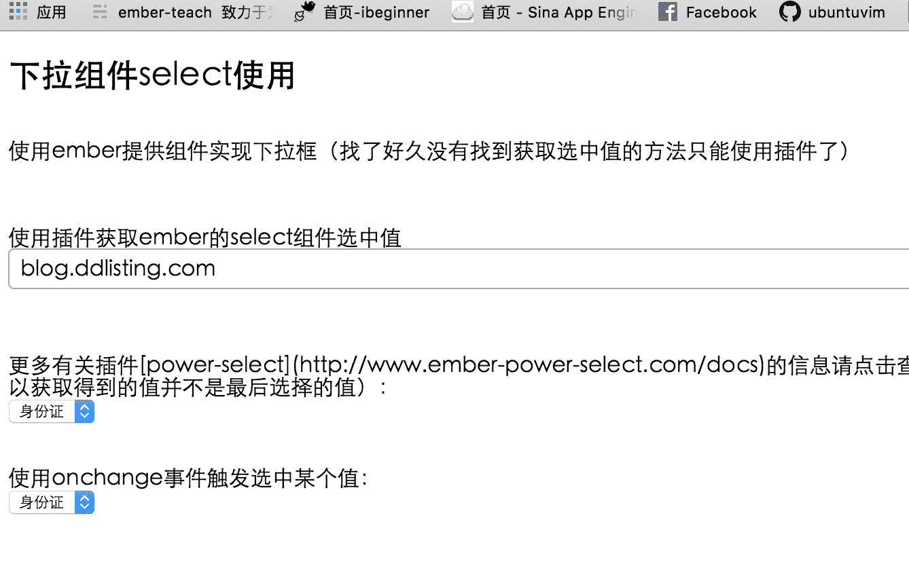
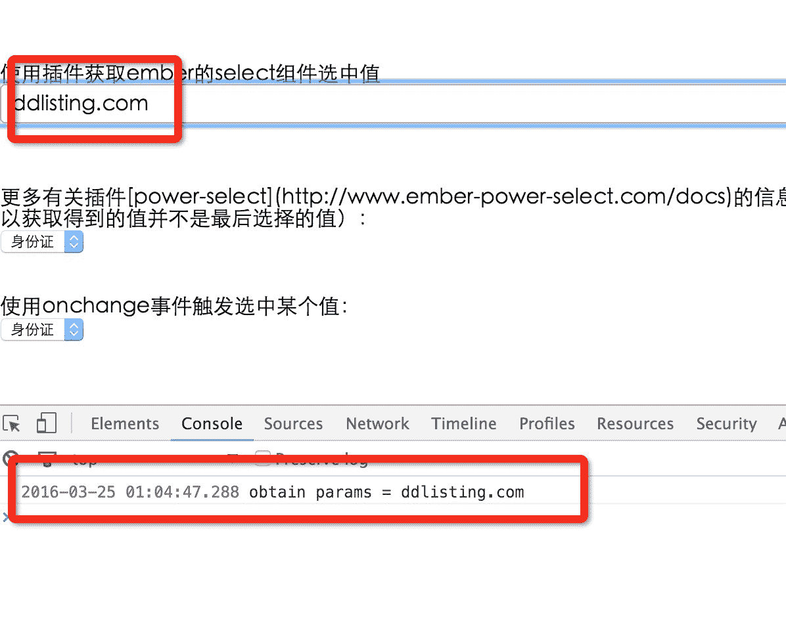

# 如何使用 ember 下拉框组件？？

> This addon enables legacy view support without deprecation notices in Ember.js 1.13\. In Ember.js 2.0 views are not present at all, and this addon brings them back. After Ember 2.4 is released this addon will no longer be compatible with Ember. It should be used to provide extra time for migrating away from views, not as a permanent solution.

简而言之，`select`组件从 2.0 开始声明为过时，2.4 版本后完全移除，如果你的项目是在 2.0 到 2.4 之间的可以通过安装插件[ember-legacy-views](https://github.com/emberjs/ember-legacy-views)支持`select`组件的使用。

不过，还是有很多问题！！！！

**比如**：网上看到好多人问怎么获取`select`组件的值？？

找了半天很遗憾我也不知道！！=^=

最起码你在[官网 API](http://emberjs.com/api/classes/Ember.Select.html)上是找不到的，非常纳闷，官方居然没有介绍怎么去获取 select 下拉组件的值，单纯介绍了怎么在模板中使用！！ 不过官方没介绍如何获取也不要紧，因为……因为从 2.0 开始官方不支持这个组件啦（[请看版本更新说明](http://emberjs.com/deprecations/v1.x/#toc_ember-view)）！！哈哈哈！！真机智！！开个玩笑……

官方不支持了，那怎么办呢！！简单啊，直接使用原生 HTML 不就完了，别搞那么复杂，反正我是直接使用原生的`<select>`标签实现，简单又熟悉。下面是我的实现代码：

```
<!-- app/templates/application.hbs -->  
<h2 id="title">下拉组件 select 使用</h2>

<!--  
在 2.0 至 2.4 之间的版本可以使用插件方式安装使用这个 view，但是从 2.4 之后连插件方式也不支持了。
既然官方不支持这个 view 那我们直接使用原生<select>标签即可，没必要搞的那么复杂。
-->
使用 onclick 事件触发选中某个值（由于是一点中下拉框就获取值，所以获取得到的值并不是最后选择的值）：<br>
<select class="" onclick={{action 'getValue' value="target.value"}}>  
    <option value="1" selected="selected">身份证</option>
    <option value="2">学生证</option>
    <option value="3">军官证</option>
    <option value="4">通行证</option>
</select>

<br><br><br>使用 onchange 事件触发选中某个值：<br>  
<select class="" onchange={{action 'getValue' value="target.value"}}>  
    <option value="12" selected="selected">身份证</option>
    <option value="22">学生证</option>
    <option value="23">军官证</option>
    <option value="24">通行证</option>
</select> 
```

`

```
// app/controllers/application.js

import Ember from 'ember';

export default Ember.Controller.extend({  
    defaultValue: 'blog.ddlisting.com',
    names: ['ddlisting.com','blog.ddlisting.com','anli.ddlisting.com'],
    actions: {
        getValue: function(params) {
            //  获取选中的值
            console.log('params = ' + params);
        }
    }
}); 
```

运行结果我就不截图，就是个普通的 action 调用，可以在控制台看到选中的值，想看结果就自己动手看看吧！！！

然而，如果你是按照官网教程那么使用我也不知道怎么去获取下拉框的值！！比如下面的代码：

```
{{view "select" content=names value=defaultValue
    optionValuePath="content.value" optionLabelPath="content.label"
    selectionBinding="selectChange"}} 
```

如果有读者知道请转告一声。。

如果一定要用这个组件怎么办！！网上提供了很多扩展插件，找了其中觉得很不错一款[power-select](http://www.ember-power-select.com/docs)，非常好用，关键是文档也很好！！下面是我的实例：

```
使用插件获取 ember 的 select 组件选中值<br>
{{#power-select options=names selected=defaultValue onchange=(action 'obtain') as |item|}}
    {{item}}
{{/power-select}} 
```

```
// app/controllers/application.js

import Ember from 'ember';

export default Ember.Controller.extend({  
    defaultValue: 'blog.ddlisting.com',
    names: ['ddlisting.com','blog.ddlisting.com','anli.ddlisting.com'],
    actions: {
        // 设置 select 插件默认值,defaultValue 与模板中 selected 属性值一致
        defaultValue: 'blog.ddlisting.com',
        obtain: function(params) {
            //  设置下拉框为选中的值
            this.set('defaultValue', params);
            // 获取下拉框选中的值
            console.log('obtain params = ' + params);
        }
    }
}); 
```

运行[`localhost:4200/`](http://localhost:4200/)，结果如下截图：



这是页面初始化时候效果，看到默认值是[blog.ddlisting.com](http://blog.ddlisting.com)



此图是选中[ddlisting.com](http://www.ddlisting.com)后的效果截图。看到在控制台打印了选中的数据。

这个是非常简单的例子，希望对你有帮助！！

参考网址：

1.  [`github.com/emberjs/ember-legacy-views`](https://github.com/emberjs/ember-legacy-views)
2.  [`stackoverflow.com/questions/35626545/assertion-failed-using-view-has-been-removed-in-ember-2-0`](http://stackoverflow.com/questions/35626545/assertion-failed-using-view-has-been-removed-in-ember-2-0)