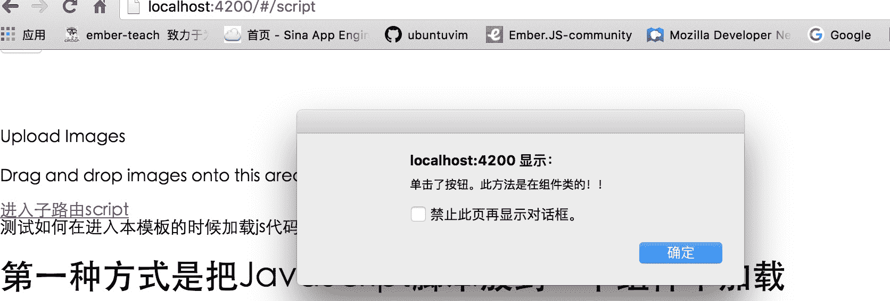

# 如何在 Ember2.0 及以上版本的模板中触发自定义 JS、jQuery 代码

`Ember2.0`不再支持直接在模板中使用`script`标签，也就是说不能在模板中直接插入`script`代码段了！官方的建议是尽可能把所有的 js 代码都放在`app/index.html`中。但是实际项目中可能会遇到这样的问题：

## 实现方式一

在某个子模板中使用 jQuery 方法为某个元素增加了单击的监听事件，比如下面的代码：

```js
$(function() {
    $("#elemId").click(function() {
        // 处理
    });
}); 
```

当你通过`link-to`进入到此子模板（比如：[`localhost:4200/#/about`](http://localhost:4200/#/about)）的时候上述的监听代码并不能有效触发，因为进入模板的时候并不会刷新页面，Ember 只是把元素插入到`{{outlet}}`占位符位置上（可以想象成是使用 js 动态添加 HTML 标签到某个元素上）。但是进入子模板后你手动刷新当前页面后上述的 js 代码却能有效触发！

可见通过`link-to`进入的页面并不会重新加载页面，那么如何解决呢？在`2.0`版本之前很容就能解决这个问题——直接把 js 代码放到子模板最后就行了，但是`2.0`版本之后不支持直接使用`script`标签了！但是要解决这个问题也仍然是很简单的，可以使用组件实现。下面创建一个组件专门用于插入 JavaScript 代码到模板中。

```js
// app/components/script-tag.js

import Ember from 'ember';

// ember2.0 之后不支持在模板中使用 script 标签，
// 通过组件方式加入
export default Ember.Component.extend({  
    tagName: 'script',
    attributeBindings: ['type'],
    type: 'text/javascript'
}); 
```

有了组件之后调用就组件插入 JavaScript 代码就很方便了，并且`2.0`版本及更高版本也是支持的。下面请看如何调用：

```js
<div class="container">

</div>  
{{! 调用组件插入 JavaScript 代码}}
{{#script-tag}}
$(function() {
    $("#elemId").click(function() {
        // 处理
    });
});
{{/script-tag}} 
```

这样处理之后完美解决了通过`link-to`进入子模板不触发 js 事件的问题。 这种方式是可以解决了不加载 js 代码的问题，但是这种方式显然是不好的，既然官方都不允许开发者在模板中使用`script`标签了，我们也没必要再这样做了，那么有什么更好的方法呢？请看方法二。

## 实现方式二

首先谢谢[@pynixwang](http://weibo.com/pynixwang)的建议，之前一直没关注到使用组件生命周期方法去实现。这种方式才是官方所推荐的。那么如何实现了，其实很简单，我们只需要把需要在模板上加载的代码放到方法`didInsertElement()`中即可。详细请看[The Component Lifecycle](https://guides.emberjs.com/v2.5.0/components/the-component-lifecycle/)。下面做一个简单的示例。

#### 模板

```js
测试如何在进入本模板的时候加载 js 代码。

<h1>第一种方式是把 JavaScript 脚本放到一个组件中加载</h1>  
<p>  
    参考<a href="http://blog.ddlisting.com/2016/05/16/use-script-tag-in-template/">http://blog.ddlisting.com/2016/05/16/use-script-tag-in-template/</a>
</p>

<h1>第二种方式是把 JavaScript 脚本放在组件的 didInsertElement()方法中加载</h1>  
<p>  
比如为按钮增加 jQuery 事件监听。
<button type="button" name="button" id="alterSometing">单击触发</button>  
</p> 
```

### 把触发事件的代码放在`app/index.html`

```js
<!DOCTYPE html>  
<html>  
  <head>
    <meta charset="utf-8">
    <meta http-equiv="X-UA-Compatible" content="IE=edge">
    <title>UeditorTest</title>
    <meta name="description" content="">
    <meta name="viewport" content="width=device-width, initial-scale=1">

    {{content-for "head"}}

    <link rel="stylesheet" href="assets/vendor.css">
    <link rel="stylesheet" href="assets/ueditor-test.css">

    {{content-for "head-footer"}}
  </head>
  <body>
    {{content-for "body"}}

    <script src="assets/vendor.js"></script>
    <script src="assets/ueditor-test.js"></script>

    {{content-for "body-footer"}}
    <script src="//cdn.bootcss.com/jquery/2.2.4/jquery.js"></script>
    <script type="text/javascript">
        $(function() {
            $("#alterSometing").click(function() {
                alert("单击了按钮。");
            });
        });
    </script>
  </body>

</html> 
```

#### 在主模板增加一个进入子模板的链接

```js
{{! app/templates/application.hbs }}
{{#link-to 'script'}}
进入子路由 script
{{/link-to}} 
```

等待项目重启完毕，点击首页的链接进入子模板`app/templates/script.hbs`。然后点击按钮，可以发现并没有触发 JavaScript 事件。手动刷新页面，再点击按钮，可以看到 JavaScript 事件被触发了！这是本文一开始就说的问题。现在我们把`index.html`里的 JavaScript 代码移动到组件中。但是方法`didInsertElement()`是在组件类中才有的，所以我们需要创建一个组件。

```js
ember g component script-tag2 
```

组件创建完毕之后我们把原来子模板`script.hbs`的代码移动到组件模板`app/templates/components/script-tag2.hbs`中，然后子啊子模板`script.hbs`中调用组件。

```js
{{! app/templates/script.hbs}}
{{script-tag2}} 
```

**关键的部分**如何在组件类中触发 JavaScript 事件呢？ 直接把放在`index.html`中的 JavaScript 代码移动到方法`didInsertElement()`中，然后去掉外层的`$(function(){})`。然后修改成 ember 的方式调用`Ember.$`，当然直接使用`$("#xxx")`的方式也是可以的。

```js
// app/components/script-tag2.js

import Ember from 'ember';

export default Ember.Component.extend({  
    didInsertElement() {
        Ember.$("#alterSometing").click(function() {
            alert("单击了按钮。此方法是在组件类的！！");
        });
    }
}); 
```

等待项目重启完毕，从新从首页点击链接进入子模板，然后再点击按钮。可以看到 JavaScript 事件成功触发。截图如下：



同理，其他的 JavaScript 事件也是同样的方法。

以上两种方式都可以解决进入子路由不加载 JavaScript 的问题。方法二是官方建议的，组件在 ember 中越来越重要的。为了能与新版 ember 兼容最好还是使用第二种方法。

如果你有更好的方法欢迎给我留言建议！

再次感谢[@pynixwang](http://weibo.com/pynixwang)。