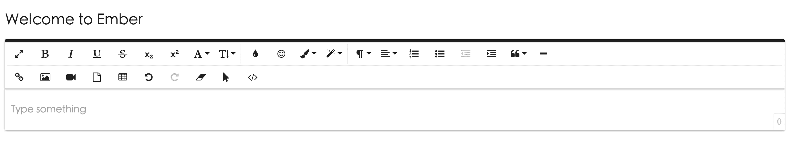
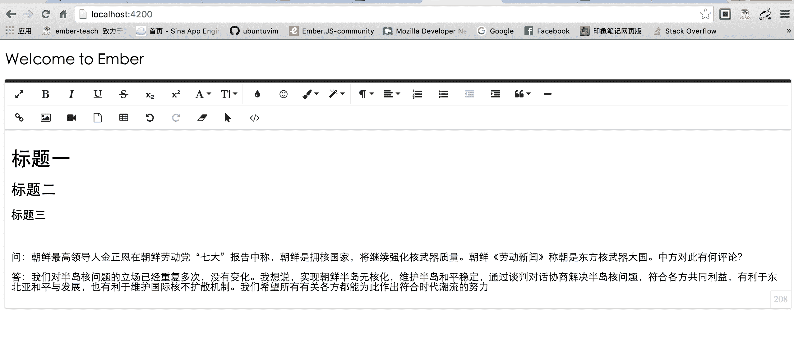

# 如何在 Ember.js 项目中使用在线文本编辑器

网上有很多开发者想在[Ember.js](https://guides.emberjs.com)项目中使用[ueditor](https://ueditor.baidu.com)但是遗憾的是 ueditor 并不支持 Ember，如果直接嵌入 ember 项目的模板页面会出现服务链接等错误。并且在`2.0`版本之后模板中不允许使用`script`标签（当然你可以借助于组件实现）。

本人就尝试了多种方法，尝试使用整合了[Nodejs](https://nodejs.org)的插件[nodejs ueditor](https://npm.taobao.org/package/ueditor)整合到 ember 项目，但是以失败告终！！

既然不能使用 ueditor 那就不用吧，因为 ueditor 的后台不支持 ember（支持 PHP、asp、JSP 等）！

很幸运的是找到类似的替代品！！并且是完美支持 Ember 的！！

[ember-froala-editor](https://www.npmjs.com/package/ember-froala-editor)

这个插件使用起来非常简单，并且有丰富的功能！！！

只需要 2 句代码即可实现！

*   首先安装插件`ember install ember-froala-editor`
*   配置`environment.js`，在此文件中增加如下配置

```
// 其他配置省略
APP: {  
      // Here you can pass flags/options to your application instance
      // when it is created
      },
      'ember-froala-editor': {
        plugins  : true,
        languages: ['es','fr','de'],
        themes   : 'royal'
      }
// 其他配置省略 
```

*   然后在模板中使用如下两行代码引用插件

```
{{! app/templates/application.hbs }}
{{froala-editor}}
{{froala-content}} 
```

*   重启项目，访问：[`localhost:4200/`](http://localhost:4200/)

效果截图如下：



从截图上可以看到此编辑器拥有丰富的功能，足够日常使用了！



编辑器的高度会自动根据内容的大小自适应！真是太棒了！

有关插件的配置以及如何获取编辑器的内容请参考官方介绍。 [froala.github.io/ember-froala-editor](http://froala.github.io/ember-froala-editor/#/)

### 另外，再推荐一款完美整合 embe.js 的在线编辑器。

[summernote](https://www.npmjs.com/package/ember-cli-summernote)

官方文档非常详细。