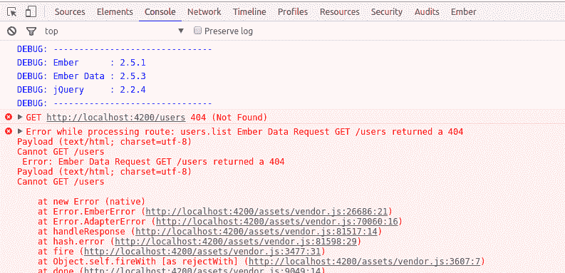
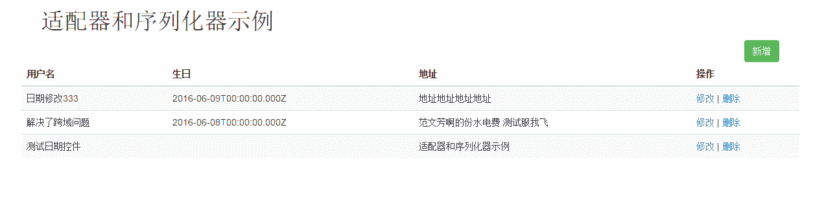
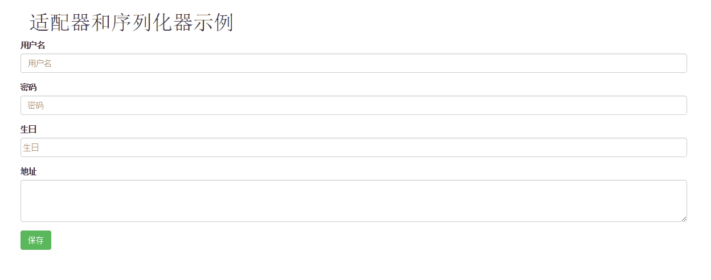
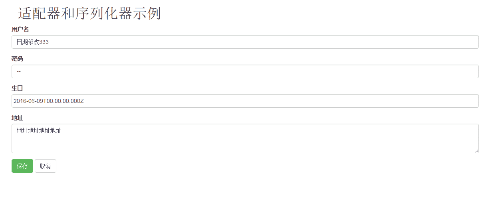

# adapter 与 serializer 使用示例一

[adapter](https://guides.emberjs.com/v2.5.0/models/customizing-adapters/)与[serializer](https://guides.emberjs.com/v2.5.0/models/customizing-serializers/)相对来说是比较高级的内容。但是也是非常常用的一个组件，最常用到这两个组件的就是[Ember Data](https://github.com/emberjs/data)。Ember Data 已经实现了这两个组件，并且提供了非常丰富的[API](http://emberjs.com/api)，如果要自定义适配器和序列化器一般都是扩展或者是重写[JSONAPIAdapter](http://emberjs.com/api/data/classes/DS.JSONAPIAdapter.html)，这也是官方建议的方式，JSONAPIAdapter 是遵循[json api](http://jsonapi.org)规范的适配器，主要表现在数据的交换格式必须遵循 JSONAPI 规范。当然如果你想完全重新实现一套自定义的适配器和序列化器也是可以的，官方建议是基于[Adapter](http://emberjs.com/api/data/classes/DS.Adapter.html)做扩展。由于能力有限本示例不会完全自定义适配器和序列化器，示例仍然是使用官方推荐方式，重写或者扩展 JSONAPIAdapter 以实现自定适配器和序列化器。

那么我们为何需要自定义适配器呢？很明显的一个原因就是 Ember.js 并没有提供数据存储方案，Ember 目前更多的只是一个前端的 MVC 框架，数据的存储服务还是要开发者提供，目前比较流行的做法是使用谷歌的[Firebase](https://www.firebase.com/)，Firebase 是一个实时更新数据的后端服务，国内也有类似的跟随者（[野狗](https://www.wilddog.com/)）但是目前野狗还没有 Ember 的适配器，相反 Firebase 提供了完备的 Ember 适配器，使用起来非常方便，而且还提供了免费的服务。可以说除了网速比较慢之外是非常适合做 Ember 的数据服务的。但是比较遗憾的是我们在天朝内，你懂滴，谷歌的东西在我们这个国度要使用还是不怎么顺畅的。那么既然不能使用现有的轮子那么我们只能使用自己的后端数据服务了，此时就必须要自定义适配器了（我们能直接使用 Firebase 的原因就是 Firebase 提供完美的适配器，不需要开发者去开发，直接使用即可）。

Ember 所推崇是“约定由于配置”，所有 Ember 默认了很多规则，自然适配器和序列化器也不例外，所以本例子程序会包括两个方面的东西，一个是 Ember 项目本身；另一个是为 Ember 项目提供服务器的后端数据库以及数据库处理程序。

#### 主要软件说明

*   [MongoDB](http://www.mongodb.org/)
*   [NodeJS](http://nodejs.org/)
*   [Mongoose](http://www.nodeclass.com/api/mongoose.html#quick_start)
*   [json api 服务端](http://jsonapi.org/implementations/#server-libraries)
*   [Ember CLI](https://ember-cli.com/user-guide)

上述软件的安装与配置请自行根据各自官网文档介绍安装配置，如果你想使用其他数据库也是可以的，但是处理起来可能没有 MongoDB 那么方便，如果你看过 jsonapi 规范就知道，jsonapi 相对于普通的 json 数据还是有挺大差别的，如果是使用其他数据库（比如 MySQL）处理起来可能稍微麻烦一些，另外一个很重要的原因就是 json API 插件大部分都是 node 版的，说了这么多其实就是想把服务器返回的数据格式格式化为 jsonapi 规范，否则其他格式的数据 JSONAPIAdapter 适配器是无法识别的，会报错。

再啰嗦几句：一个 APP 之所以能与后端服务良好交互，其他交互的数据格式都是比较固定的，Ember 也不例外，因为 Ember Data 所接受的数据格式是 jsonapi，所以我们的后端服务返回的数据格式必须符合 jsonapi 规范，当然如果你不是使用 Ember Data，你使用的是其他的数据持久化库也是可以的，那么相对的你的的后端数据服务返回的数据格式就要跟你的持久化库相匹配就可以了，如果你想使用其他的持久化库你可以参考[jsonapi client libraries](http://jsonapi.org/implementations/#client-libraries)，上面提供了各个语言的持久化库。

## 搭建项目

言归正传，下面结合一个小例子讲解如何去自定义适配器去连接到自己的数据库，并把数据持久化到数据库中。

使用[Ember CLI](https://ember-cli.com/user-guide)创建一个普通的 Ember 项目，命令如下：

```
ember new ember-adapter-serializer  
cd ember-adapter-serializer  
ember s 
```

启动项目后预览[`localhost:4200`](http://localhost:4200)，可以看到 Ember 常规的欢迎信息，说明项目创建成功。

## 创建路由、模型、模板

仍然是使用 Ember CLI 命令创建演示示例所需的路由、模型、模板文件，本示例会构建一个简单的博客项目，目的主要是为了使项目尽量包含模型的一对一、一对多、多对多关系，这些关系是一个适配器比较关键的东西（简单理解，其实适配器就像 MVC 项目中的 DAO 层，专门做数据处理的）。

创建命令如下：

```
ember g route users  
ember g model user

ember g route users/list  
ember g route users/new  
ember g route users/edit

ember g route posts  
ember g model post

ember g route tags  
ember g model tag

ember g route comments  
ember g model comment 
```

后续使用到其他的文件再创建。

### 模型处理

模型的处理主要是设置模型的属性以及模型之间的关系，在本例子中定义了 3 个模型：`user`、`post`、`tag`、`comment`。他们的关系如下：

*   user 与 post 是一对多的关系
*   user 与 comment 是一对多的关系
*   post 与 comment 也是一对多的关系
*   post 与 tag 是多对多关系

各个模型代码如下：

#### user

```
// app/models/user.js

import Model from 'ember-data/model';  
import attr from 'ember-data/attr';  
import { belongsTo,hasMany } from 'ember-data/relationships';

export default Model.extend({  
    name: attr('string'),
    password: attr('string'),
    birth: attr('string'),
    addr: attr('string'),
    //一对多关系，一的一方设置 hasMay，多的一方设置 belongsTo
    comments: hasMany('comment'),
    posts: hasMany('post')
}); 
```

#### post

```
// app/models/post.js
import Model from 'ember-data/model';  
import attr from 'ember-data/attr';  
import { belongsTo,hasMany } from 'ember-data/relationships';

export default Model.extend({  
    title: attr('string'),
    publicDate: attr('date'),
    content: attr('string'),
    user: belongsTo('user'),  //一对多关系，多的一方使用 belongsTo
    comments: hasMany('comment'),
    tags: hasMany('tag')
}); 
```

#### comment

```
// app/models/comment.js
import Model from 'ember-data/model';  
import attr from 'ember-data/attr';  
import { belongsTo,hasMany } from 'ember-data/relationships';

export default Model.extend({  
    title: attr('string'),
    publicDate: attr('date'),
    content: attr('string'),
    user: belongsTo('user'),  //一对多关系，多的一方使用 belongsTo
    post: belongsTo('post')
}); 
```

#### tag

```
// app/models/tag.js
import Model from 'ember-data/model';  
import attr from 'ember-data/attr';  
import { belongsTo,hasMany } from 'ember-data/relationships';

export default Model.extend({  
  title: attr('string'),
  posts: hasMany('post')
}); 
```

创建完模型之后，先从 user 开始，简单做一个列表显示所有 user，并在在列表页面可以新增、修改、删除 user，实现最常见的 CRUD 操作。在实现的过程中插入 adapter 和 serializer 的内容。

### 用户列表

用户列表页面也是很简单的，就一个表格，其中引入了[bootstrap](http://v3.bootcss.com/)样式。有关怎么引入请自己网上找答案吧。

#### 列表模板

```
{{! app/templates/users/list.hbs 用户列表}}
<div class="row">  
    <div class="col-md-1 col-sx-11 col-md-offset-11 col-sx-offset-11">
      {{#link-to 'users.new' class="btn btn-success"}}新增{{/link-to}}
    </div>
</div>

<div class="row">  
  <table class="table table-striped table-hover">
    <thead>
      <tr>
        <th>
          用户名
        </th>
        <th>
          生日
        </th>
        <th>
          地址
        </th>
        <th>
          操作
        </th>
      </tr>
    </thead>

    <tbody>
      {{#each model as |user|}}
      <tr>
        <td>
          {{user.name}}
        </td>
        <td>
          {{user.birth}}
        </td>
        <td>
          {{user.addr}}
        </td>
        <td>
          {{#link-to 'users.edit' user.id}}修改{{/link-to}}
          |
          <a>删除</a>
        </td>
      </tr>
      {{/each}}
    </tbody>
  </table>
</div> 
```

#### 列表路由配置

```
import Ember from 'ember';

export default Ember.Route.extend({  
  model() {
    return this.store.findAll('user');
  }
}); 
```

列表的路由也很简单，直接获取所有的 user 记录，并返回到模板中，在模板中便利出每个记录。

待项目重启完成，直接预览[`localhost:4200/users/list`](http://localhost:4200/users/list)，可以看到页面上什么也没有显示，打开浏览器控制台可以看到如下错误：



很显然我们的项目中确实没有提供请求`http://localhost:4200/users`的后端服务，而且项目也没有链接其他任何数据服务（比如 Firebase），那么如何让 Ember 项目链接到我自己的数据库上呢？

在此，先引入数据服务程序，前面介绍过，本例子使用 Mongodb。服务端程序请看[adapter-serializer-server](https://github.com/ubuntuvim/adapter-serializer-server)，对于服务端的内容我就部过多介绍，你只需要知道这个服务程序可以接受、返回的数据格式是 jsonapi 就行了。然后启动后端服务程序。

那么如何让 Ember 项目链接到我的后端服务呢？？很简单，只需要重写适配器的一个属性即可。下面使用 Ember CLI 名称创建一个适配器。

```
ember g adapter application 
```

适配器创建完毕之后，我们直接在适配器中接入自己的后端服务。代码如下：

```
// app/adapters/application.js

import JSONAPIAdapter from 'ember-data/adapters/json-api';

export default JSONAPIAdapter.extend({  
    host: 'http://localhost:3000'
}); 
```

`http://localhost:3000`是 adapter-serializer-server 启动后提供服务的 url。项目启动完毕后可以看到浏览器控制台的错误消失了！并且在“NetWork”标签下可以看到有一个请求`http://localhost:3000/users`点击这个请求，查看请求的“Response”可以看到返回的数据，比如下面的数据格式：

```
{
    "links": {
        "self": "http://localhost:3000/users"
    },
    "data": [
        {
            "id": "5753d7090280777c2381a0dd",
            "type": "users",
            "attributes": {
                "name": "日期修改 333",
                "password": "11",
                "addr": "地址地址地址地址",
                "birth": "2016-06-04T00:00:00.000Z"
            },
            "links": {
                "self": "http://127.0.0.1:3000/users/5753d7090280777c2381a0dd"
            },
            "relationships": {
                "comments": {
                    "data": [],
                    "links": {
                        "self": "http://127.0.0.1:3000/users/5753d7090280777c2381a0dd/relationships/comments"
                    }
                },
                "posts": {
                    "data": [],
                    "links": {
                        "self": "http://127.0.0.1:3000/users/5753d7090280777c2381a0dd/relationships/posts"
                    }
                }
            }
        },
        {
            "id": "5753d74a840db09d2352608a",
            "type": "users",
            "attributes": {
                "name": "解决了跨域问题",
                "password": "123132",
                "addr": "范文芳啊的份水电费 测试服我飞"
            },
            "links": {
                "self": "http://127.0.0.1:3000/users/5753d74a840db09d2352608a"
            },
            "relationships": {
                "comments": {
                    "data": [],
                    "links": {
                        "self": "http://127.0.0.1:3000/users/5753d74a840db09d2352608a/relationships/comments"
                    }
                },
                "posts": {
                    "data": [],
                    "links": {
                        "self": "http://127.0.0.1:3000/users/5753d74a840db09d2352608a/relationships/posts"
                    }
                }
            }
        },
        {
            "id": "57545597840db09d2352608b",
            "type": "users",
            "attributes": {
                "name": "测试日期控件",
                "password": "123123",
                "addr": "适配器和序列化器示例"
            },
            "links": {
                "self": "http://127.0.0.1:3000/users/57545597840db09d2352608b"
            },
            "relationships": {
                "comments": {
                    "data": [],
                    "links": {
                        "self": "http://127.0.0.1:3000/users/57545597840db09d2352608b/relationships/comments"
                    }
                },
                "posts": {
                    "data": [],
                    "links": {
                        "self": "http://127.0.0.1:3000/users/57545597840db09d2352608b/relationships/posts"
                    }
                }
            }
        }
    ]
} 
```

由于我项目已经有了 3 条数据了，所以跟你的可能有些许不同，但是数据的格式是一致的。这个数据的格式是遵循 jsonapi 规范的。

上述代码所演示的是自定义适配器最最常用的一个功能，如果你后端返回的数据是完全遵循 jsonapi 规范的几乎不需要再做其他任何修改了。这样就已经完成自定义适配器的工作了！但是既然在此特意介绍适配器和序列化器当然不会只是介绍这一个属性`host`就完了，后面将陆陆续续介绍其他的属性，以及如何使用 serializer。

继续完成 user 模块。

### 新增 user

#### user 模板

```
{{! app/templates/users/new.hbs  新增 user}}
<form>  
  {{user-form model=model}}
  <button type="submit" class="btn btn-success" {{action 'saveUser' model}}>保存</button>
</form> 
```

#### user 路由

直接在`model`回调中返回一个空的实例对象。方便保存。

```
// app/routes/users/new.js

import Ember from 'ember';

export default Ember.Route.extend({  
  model() {
    return this.store.createRecord('user');
  },
  actions: {
    saveUser(user) {
      user.save().then(() => {
        this.transitionTo('users.list');// 保存成功转到列表页面
      });
    }
  }
}); 
```

### 修改 user

#### user 模板

```
{{! app/templates/users/edit.hbs  修改 user}}
<form>  
  {{user-form model=model}}
  <button type="submit" class="btn btn-success" {{action 'updateUser' model}}>保存</button>
  {{#link-to 'users.list' class="btn btn-default"}}取消{{/link-to}}
</form> 
```

#### user 路由

在修改的方法中先调用`findRecord`方法查询出被修改的数据，然后更新修改的属性，再调用`save`方法保存修改的内容。

```
// app/routes/users/edit.js

import Ember from 'ember';

export default Ember.Route.extend({  
  // 根据 ID 查询
  model(params) {
    return this.store.findRecord('user', params.user_id);
  },
  actions: {
    updateUser(user) {
      this.store.findRecord('user', user.get('id')).then((u) => {
        u.set('name', user.get('name'));
        u.set('addr', user.get('addr'));
        u.set('birth', user.get('birth'));
        u.set('addr', user.get('addr'));
        u.save();  //保存修改的属性值
      });
      this.transitionTo('users.list');  //转到列表页面
    }
  }
}); 
```

由于新增、修改 user 模板都用到供一个表单，提取到一个组件中。

```
ember g component user-form 
```

文件代码就不贴出来了，有需要请点击[查看 github 代码](https://github.com/ubuntuvim/ember-adapter-serializer/blob/master/app/templates/components/user-form.hbs)。然后在组件类中初始化了一个日期控件[bootstrap-datepicker](http://www.bootcdn.cn/bootstrap-datepicker/)，插件直接在`app/index.html`中引入了，下面是组件类代码：

```
// app/components/user-form.js

import Ember from 'ember';

export default Ember.Component.extend({  
  didInsertElement() {
    this._super(...arguments);  //记得调用父类的构造方法
    //初始化日期控件
    Ember.$(".datepicker").datepicker({format:'yyyy-mm-dd', autoclose: true});
  }
}); 
```

user 列表、新增 user、修改 user 界面效果如下截图：







到此实现了类似使用 Firebase 的数据存储功能，可以正确保存数据到自己的数据库中。可以肯定的是数据已经正确保存到我的 MongoDB 中，我就不再截图了！对象的 CRUD 功能已经实现，后续我就不再介绍`post`、`comment`、`tag`的 CRUD 了，后续着重介绍适配器、序列化器的其他属性以及模型之间的关联关系（比如一对多、多对多）。

如果你认真看前面的第一个截图你会发现列表上显示的时间格式不友好，不是我们所习惯看的时间格式，那么如何处理呢？格式化时间的方式有很多，可以自定义[Ember helper](https://guides.emberjs.com/v2.5.0/templates/writing-helpers/)格式化时间，也可以定义模型`user`的属性`birth`为`date`类型，在此我特意定义为了`string`是为了演示 serializer 的使用。我们可以在自定义的 serializer 中格式化返回的数据。下面首先创建 serializer。

```
ember g serializer application 
```

在序列化器中调用响应请求的方法`normalizeResponse`格式化返回的数据。代码如下：

```
// app/serializers/application.js

import JSONAPISerializer from 'ember-data/serializers/json-api';

export default JSONAPISerializer.extend({

    // 此方法响应请求的时候执行
    normalizeResponse(store, primaryModelClass, payload, id, requestType) {

        // 格式化 birth 的时间格式
        //默认显示的时间格式为    2016-06-09T00:00:00.000Z ，简单处理直接截取前面的 10 位
        // 只是为了演示方法 normalizeResponse 的使用，实际项目中不推荐这样的用法，因为需要遍历每个数据，效率不好
        payload.data.forEach(function(item, index) {
            var oldDate = item.attributes.birth;
            if (oldDate) {
                oldDate = oldDate.substring(0, 10);
            }
            item.attributes.birth = oldDate;
            oldDate = null;
        });

        return this._super(...arguments);
    }
    // 此方法发送请求的时候回执行
    // serialize(snapshot, options) {
    //
    // }
}); 
```

但是实际使用过程中不推荐使用这种方式格式化数据，除非是不得已，因为需要遍历每个记录去修改属性的值，如果数据量大影响效率，最好的方式是自定义`helper`在模板上格式化。把格式化的操作放到显示数据的时候。

上述就是 serializer 的一个简单实用示例。

adapter 和 serializer 内容比较多，分为 2 篇介绍，下一篇我回在本篇的基础上逐个介绍 adapter 和 serializer 的常用属性、方法的使用。

### adapter 与 serializer 使用下篇

[adapter 与 serializer 使用实例二](http://blog.ddlisting.com/2016/06/07/adapter-serializershi2/)

项目源码：[`github.com/ubuntuvim/ember-adapter-serializer`](https://github.com/ubuntuvim/ember-adapter-serializer)

后台源码：[`github.com/ubuntuvim/adapter-serializer-server`](https://github.com/ubuntuvim/adapter-serializer-server)

有疑问欢迎在下方评论区给我留言，我会尽快为你解答，如果你觉得本文能给你帮助，或者觉得博主写作辛苦也欢迎点击右上角“**为博主充电**”给我打赏，你的肯定对我来说是最大的动力。O(∩_∩)O 哈哈~