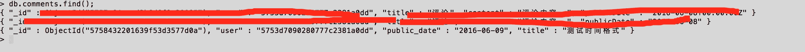

# adapter 与 serializer 使用实例二

接上一篇[adapter 与 serializer 使用实例一](http://blog.ddlisting.com/2016/06/06/adapter-serializer/)，本文继续讲解 adapter 与 serializer 常用属性、方法的使用。知识点比较零碎，希望想学习如何使用 adapter 与 serializer 的读者能跟着我敲一敲例子的代码，亲自动手比别人说 10 遍更有效果。学习过程遇到问题欢迎给我留言一起探讨解决方法。

## Adapter

### adapter 属性`namespace`

属性`namespace`用于指定请求 URL 的前缀，比如如下适配器配置：

```js
// app/adapters/application.js

import JSONAPIAdapter from 'ember-data/adapters/json-api';

export default JSONAPIAdapter.extend({  
    host: 'http://localhost:3000',
    namespace: 'api/v1'
}); 
```

当客户端进入到路由`users`后会发送请求[`localhost:3000/api/v1/users`](http://localhost:3000/api/v1/users)，请求会自动加上前缀`api/v1`。客户端加了请求前缀，相对应的你的后台处理程序也要处理加了前缀的请求。比如我的演示用的后端处理：

```js
// api/v1/user
app.route("/api/v1/:type(users|user)")  
    .get(apiReqHandler)
    .post(apiReqHandler)
    .patch(apiReqHandler)
    .delete(apiReqHandler);
// api/v1/user?id=xxx
app.route("/api/v1/:type(users|user)/:id")  
    .get(apiReqHandler)
    .post(apiReqHandler)
    .patch(apiReqHandler)
    .delete(apiReqHandler); 
```

可以看到我的后端服务路由也必须加上请求前缀，以适配客户端的请求。

### 请求头`headers`

Ember 允许你自定义请求头，比如在请求头携带授权信息。请求头的信息可以是自定义的值也可以是从`session`获取的值。

```js
// app/adapters/application.js

import JSONAPIAdapter from 'ember-data/adapters/json-api';

export default JSONAPIAdapter.extend({  
    host: 'http://localhost:3000',
    namespace: 'api/v1',
    headers: {
    'API_KEY': 'secret key',
      'ANOTHER_HEADER': 'Some header value'
  }
}); 
```

查看请求的格式，可以看到在头部信息中自动加入了设置的 header 信息。


那么有如何在服务端获取这个请求头信息呢？

在服务端获取请求头信息也很简单，直接使用`req.get('key')`获取。

```js
app.use(function(req, res, next) {  
    // 获取客户端传递过来的请求头信息
    console.log('API_KEY == ' + req.get('API_KEY'));
    console.log('ANOTHER_HEADER == ' + req.get('ANOTHER_HEADER'));
    // 其他处理……
    next();
}); 
```

当客户端发送请求的时候服务端就可以获取到请求头信息。


可以使用计算属性作为请求头属性，看下面的用法：

```js
//app/adapters/application.js

import JSONAPIAdapter from 'ember-data/adapters/json-api';

export default JSONAPIAdapter.extend({  
  session: Ember.inject.service('session'),
  headers: Ember.computed('session.authToken', function() {
    return {
      'API_KEY': this.get('session.authToken'),
      'ANOTHER_HEADER': 'Some header value'
    };
  })
}); 
```

有关适配器的主要属性就介绍`host`、`namespace`、`header`，这三个最常用的。更多其他属性的使用请看[customizing-adapters](https://guides.emberjs.com/v2.5.0/models/customizing-adapters/)，以及适配器的[API](http://emberjs.com/api/data/classes/DS.JSONAPISerializer.html)。下面接着介绍 Serializers 的主要属性、方法使用。

## Serializers

### `attrs`属性

`attrs`属性对于`JSONAPISerializer`来说是一个很重要的属性，这个属性是与服务端返回数据的 key 是相对应的。一般请求下服务端返回的数据 key 与模型的属性名是一致的。包括属性的命名规则也是一致的。但是总有些意外情况，比如书名命名规则不一致，有些属性不需要再客户端显示等等情况，这些情况的处理都可以在`attrs`中处理。

#### 重命名属性

重命名属性在前后端数据 key 不一致的时候特别有用。比如下面的情况：

Ember 的模型属性如下：

```js
// app/models/comment.js
import Model from 'ember-data/model';  
import attr from 'ember-data/attr';

export default Model.extend({  
    renameAttr: attr('string')
}); 
```

但是服务端并没有返回同名的属性，服务端返回的属性名是`title`。也就是说，我如何才能把服务端返回的`title`这个值放到`renameAttr`上呢？ 解决的办法是在`attrs`中处理，请看下面的处理代码：

```js
// app/serializers/application.js

import JSONAPISerializer from 'ember-data/serializers/json-api';

export default JSONAPISerializer.extend({

    attrs: {
        renameAttr: { key: 'title' }
    }
}); 
```

查看效果：


注意红色框框圈出来的属性值。可以看到完美解决了上面的问题。

#### 隐藏属性

有时候我前端并不需要把后端返回的值都获取出来，此时你可以把你不需要的属性剔除在外，这样就不会从服务端获取，减少请求的数据量。 不过这种用法一般都是针对于某一个模型去处理，插几句其他内容：Ember 的适配器和序列化器有总的（名为`application`）也有针对某个模型的，他们的优先级别是模型的适配器（序列化器） > application 适配器（序列化器） > 默认适配器（序列化器）；模型的适配器（序列化器）的命名规则是与模型同名，但是是放在`adapters`目录下（序列化器放在`serializers`目录下）。其他内容插入完毕，回到主题中来。

那么如何设置某个属性不需要从服务端获取回来呢？请看下面的代码：

```js
// app/serializers/comment.js

import JSONAPISerializer from 'ember-data/serializers/json-api';

export default JSONAPISerializer.extend({  
    attrs: {
        // renameAttr: { key: 'title' },
        flag: { transient: false },
        publicDate: { serialize: false }
    }
}); 
```

但是遗憾的是并没有达到[API](http://emberjs.com/api/data/classes/DS.JSONSerializer.html#property_attrs)文档所说的效果，还是可以在返回的数据中看到上述两个属性，如果读者发现其中的问题欢迎给我留言指教。

问题参考：

1.  [`stackoverflow.com/questions/16588286`](http://stackoverflow.com/questions/16588286/non-persistent-attributes-in-emberjs/25514178#25514178)
2.  [`stackoverflow.com/questions/30275611`](http://stackoverflow.com/questions/30275611/posting-a-special-command-on-an-ember-model/30277399#30277399)

### `serialize`方法

[serialize](http://emberjs.com/api/data/classes/DS.JSONAPISerializer.html#method_serialize)方法会在客户端发送请求的时候触发，比如用于格式化传递到服务端的数据。比如下面的例子：

客户端发送的数据格式为：

```js
{
  "data": {
    "attributes": {
      "id": "1",
      "name": "My Product",
      "amount": 100,
      "currency": "SEK"
    },
    "type": "product"
  }
} 
```

但是服务端接受的格式不一样，服务端接受的数据格式为：

```js
{
  "data": {
    "attributes": {
      "id": "1",
      "name": "My Product",
      "cost": {
        "amount": 100,
        "currency": "SEK"
      }
    },
    "type": "product"
  }
} 
```

从数据格式上可以清楚看到，服务端接受的数据中属性`cost`是有`amount`和`currency`组合而成。Ember 提供了方法`serialize`格式化数据。请看下面的代码：

```js
// app/serializers/application.js

import JSONAPISerializer from 'ember-data/serializers/json-api';

export default JSONAPISerializer.extend({

   // 此方法发送请求的时候回执行
    serialize(snapshot, options) {
        var json = this._super(...arguments);

        json.data.attributes.cost = {
            amount: json.data.attributes.amount,
            currency: json.data.attributes.currency
        };
        // 删除无用属性
        delete json.data.attributes.amount;
        delete json.data.attributes.currency;

        return json;
    }
}); 
```

相反的，如果服务端返回的数据格式与客户端不匹配，还可以格式化从服务端返回的数据格式以匹配客户端的数据格式。使用的是另一个方法[normalizeResponse](http://emberjs.com/api/data/classes/DS.JSONAPISerializer.html#method_normalizeResponse)，这个方法在相应请求的时候触发（数据从服务端返回到客户端的时候）。

服务端返回的数据为：

```js
{
  "data": {
    "attributes": {
      "id": "1",
      "name": "My Product",
      "cost": {
        "amount": 100,
        "currency": "SEK"
      }
    },
    "type": "product"
  }
} 
```

但是客户端接受的数据格式为：

```js
{
  "data": {
    "attributes": {
      "id": "1",
      "name": "My Product",
      "amount": 100,
      "currency": "SEK"
    },
    "type": "product"
  }
} 
```

很显然，需要把服务端数据的复合`cost`属性拆分开，分别显示为`amount`和`currency`，Ember 提供了便捷的转换方法`normalizeResponse`。

```js
normalizeResponse(store, primaryModelClass, payload, id, requestType) {  
    payload.data.attributes.amount = payload.data.attributes.cost.amount;
    payload.data.attributes.currency = payload.data.attributes.cost.currency;

    delete payload.data.attributes.cost;

    return this._super(...arguments);
} 
```

这个方法在前一篇[adapter 与 serializer 使用示例一](http://blog.ddlisting.com/2016/06/06/adapter-serializer/)的最后部分已经演示过了，再次就不过多介绍。

### IDs

Ember 默认会为每个模型增加一个属性`id`作为主键。如果你想修改这个主键的名字可以通过属性`primaryKey`指定。

```js
// app/serializers/application.js

import JSONAPISerializer from 'ember-data/serializers/json-api';

export default JSONAPISerializer.extend({

    primaryKey: '_id'
}); 
```

但是如果你单单只是修改了客户端接收的主键名称是不行的，还需要后端服务返回的数据主键也是`_id`，否则会报错：


### Attribute Names

#### `keyForAttribute`方法

通过使用方法`keyForAttribute`还可以设定模型属性命名方式，Ember 默认序列化后模型的属性命名规则是中划线分隔，比如模型的属性名为`lastName`那么序列化之后客户端接受的属性名为`last-name`，默认会把单词中划线分隔。但是如果你的服务端的属性是使用下划线分隔的则需要做处理。比如我服务端的实体类如下

```js
var schema = mongoose.Schema({  
  name: {
    type: String
  },
  public_date: {
    type: Date
  },
  content: {
    type: String
  }
}); 
```

注意属性`public_date`的命名方式，单词之间使用下划线分隔。但是 Ember 项目确实使用的是驼峰式命名。如下：

```js
// app/models/comment.js
import Model from 'ember-data/model';  
import attr from 'ember-data/attr';  
import { belongsTo,hasMany } from 'ember-data/relationships';

export default Model.extend({  
    title: attr('string'),
    publicDate: attr('date'),
    content: attr('string'),
    user: belongsTo('user'),  //一对多关系，多的一方使用 belongsTo
    post: belongsTo('post')
}); 
```

注意属性`publicDate`是驼峰式的。此时如果不手动格式化这个属性那么你在客户端则获取不到服务端响应回来的值。




注意看第三条数据，前面两条是其他测试数据，所以打了个码，省的影响观看！！ 第三条数据的 Public Date 这一列是`undefined`，可以并没有获取到返回的数据，那么使用方法`keyForAttribute`格式化之后结果又如何呢？

格式化返回数据：

```js
// app/serializers/application.js

import JSONAPISerializer from 'ember-data/serializers/json-api';

export default JSONAPISerializer.extend({  
    ForAttribute: function(attr) {
        // return attr;
        return Ember.String.underscore(attr);
    }
}); 
```

再次查看浏览器控制台的结果。


可以看到数据正确获取到了。说白了，方法`ForAttribute`的作用就是统一了前后端的模型属性名称。

#### `keyForRelationship`方法

方法`keyForRelationship`的作用与`ForAttribute`类似，只不过`keyForRelationship`用于格式化模型的关联属性。

关于 Serializer 还有很多属性，不过都不是很常用，不一一列出来了。请读者自行参考[官网文档](https://guides.emberjs.com/v2.5.0/models/customizing-serializers/)以及[Serializer 的 API](http://emberjs.com/api/data/classes/DS.JSONAPISerializer.html)学习。

到此 Adapter 和 Serializer 的主要常用属性、方法介绍完毕了，这些方法基本上能满足自定义适配器、序列化器的需求了！如果有其他特殊的需求不放考虑下修改后端服务，直接在后端修改响应的数据格式可能更加好。还有更重要的一点就是适配器和序列化器尽量遵循 Ember 的默认规则，比如模型属性的命名规则等。Ember 整个框架都是遵循“约定由于配置”的原则，作为开发者最好也是遵照这原则，这样我们会省去很多不必要的处理，也提高了开发效率，更重要的是能大幅降低出错的几率，这是我们所期盼的。

项目源码：[`github.com/ubuntuvim/ember-adapter-serializer`](https://github.com/ubuntuvim/ember-adapter-serializer)

后台源码：[`github.com/ubuntuvim/adapter-serializer-server`](https://github.com/ubuntuvim/adapter-serializer-server)

有疑问欢迎在下方评论区给我留言，我会尽快为你解答，如果你觉得本文能给你帮助，或者觉得博主写作辛苦也欢迎点击右上角“**为博主充电**”给我打赏，你的肯定对我来说是最大的动力。O(∩_∩)O 哈哈~