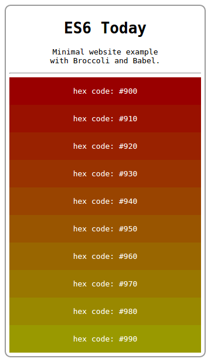

# 卷首语

曾经听许多前端从业者说：“前端发展太快了。”这里的快，十有八九是说层出不穷的新概念，余下的一二，大抵只是抒发一下心中的苦闷罢——前两日刚习得的新技术转眼就“落后”——仔细品味这苦闷，除却不得不持续奔跑的无奈，更多的是一口气，一口卯足了劲儿也要把新知识全数揽入囊中的不服气。作为刚入行的新人，对这点体会颇深。就像是蓦地从某个时间点切入，半数时间向前走，半数时间向后看，瞻前顾后，回味揣摩这十年间的岁月精魄，还得翘首盼着花花新世界，不时再问自己一句，这样走下去真的会好么？是的，其实答案人尽皆知，同时也无人知晓，因为没人能预言未来，顶多只能预测未来，但有一件事情永不会错，当你笃定地沿着一条路走下去，结果通常不会太糟糕，但凡能在浮躁的社会冷静下来潜心磨砺，多少总会有收获。幸而我有意弱化了对新信息的执念，开始做一些事情，《深入浅出 ES6》就是其中一件。

纵观整个系列，亦即纵观 ECMAScript 2015 的整个体系，吸取了诸多成功经验：借鉴自 CoffeeScript 的箭头函数；始于 C++项目 Xanadu，接着被 E 语言采用，后来分别于 Python 和 JavaScript 框架 Dojo 中以 Deferred 对象的面貌出现的 Promise 规范（详见 Async JavaScript 一书 3.1 章）；借鉴了 C++、Java、C#以及 Python 等语言的 for-of 循环语句；部分借鉴 Mustache、Nunjucks 的模板字符串。 当然，新的语言体系也在之前的基础上查漏补缺：弥补块级作用域变量缺失的 let 和 const 关键字；弥补面向大型项目缺失的模块方案；标准委员会甚至为 JavaScript 增加了类特性，有关这一方面的特性褒贬不一，Douglas Crockford 曾在 2014 年的 Nordic.js 大会发表了题为《The Better Parts》的演讲，重新阐述了他个人对于 ECMAScript 6 的看法，他认为 Class 特性是所有新标准中最糟糕的创新（我个人也略赞同这一说法，类的加入虽然有助于其它语言的使用者开始使用 JavaScript，但是却无法发挥出 JavaScript 原型继承的巨大优势）；以及为了保持非侵入式弥补其它新特性而诞生的 Symbols。

其它的新特性也相当诱人，熟练掌握可以大幅度提升开发效率：迭代器 Iterator、生成器 Generators、不定参数 Rest、默认参数 Default、解构 Destructuring、生成器 Generator、代理 Proxy，以及几种新类型：Set、Map、WeakSet、WeakMap、集合 Collection。 以上提及的新特性只是其中的一部分，更多的新特性等待着大家进一步挖掘。整个系列的翻译历时 150 余天，坚持专栏翻译的日子艰苦也快乐，编辑徐川细心地帮我审校每一篇文章，编辑丁晓昀赠予钱歌川先生详解翻译之著作让我大开眼界，与李松峰老师的交流也让我深刻理解了“阅读、转换、表达”的奥义所在，最感谢我的母亲，在我遇到困难需要力量的时候永远支持着我。选择 ES6 作为前端生涯的切入点实之我幸，恰遇这样的机会让我可以一心一意地向前走，向未来走。我很敬佩在“洪荒”和“战乱”年代沉淀无数经 验的前辈们，你们在各种不确定的因素中左右互搏，为终端用户提供统一的用户体验，直到如今你们依然孜孜不倦地吸取业内新鲜的经验。技术在进步，也为前端人 提供着无限的可能性，我们有责任也有义务去推动新标准的发展和普及，诚然在商业的大环境下我们不愿放弃每一寸用户的土壤，但携众人之力定将能推动用户终端 的革新。ES7 标准的提案纷纷提上日程，用不了多久也将登上前端大舞台。也感谢午川同学友情提供译文《深入浅出 ES6（十）：集合 Collection》，让我在困难时期得以顺利过渡。最后祝愿国内前端社区向着更光明美好的未来蓬勃生长！

# 深入浅出 ES6（一）：ES6 是什么

作者 Jason Orendorff ，译者 刘振涛

**编者按：**ECMAScript 6 离我们越来越近了，作为它最重要的方言，Javascript 也即将迎来语法上的重大变革，InfoQ 特开设“[深入浅出 ES6](http://www.infoq.com/cn/es6-in-depth/)”专栏，来看一下 ES6 将给我们带来哪些新内容。本专栏文章来自[Mozilla Web 开发者博客](https://hacks.mozilla.org/category/es6-in-depth/)，由作者授权翻译并发布。

欢迎来到 ES6 深入浅出！JavaScript 的新版本离我们越来越近，我们将通过每周一节的系列课程一起探索 ECMAScript 6 新世界。ES6 中包含了许多新的语言特性，它们将使 JS 变得更加强大，更富表现力。在接下来的几周内，我们将一一深入了解它们。但在我们开始详细学习之前，我认为十分有必要花几分钟讲解一下 ES6 到底是什么，以及你可以从中学到什么！

## ECMAScript 发生了什么变化？

编程语言 JavaScript 是 ECMAScript 的实现和扩展，由 ECMA（一个类似 W3C 的标准组织）参与进行标准化。ECMAScript 定义了：

*   [语言语法](https://developer.mozilla.org/en-US/docs/Web/JavaScript/Reference/Lexical_grammar) – 语法解析规则、关键字、语句、声明、运算符等。
*   [类型](https://developer.mozilla.org/en-US/docs/Web/JavaScript/Data_structures) – 布尔型、数字、字符串、对象等。
*   [原型和继承](https://developer.mozilla.org/en-US/docs/Web/JavaScript/Inheritance_and_the_prototype_chain)
*   内建对象和函数的[标准库](https://developer.mozilla.org/en-US/docs/Web/JavaScript/Reference/Global_Objects) – [JSON](https://developer.mozilla.org/en-US/docs/Web/JavaScript/Reference/Global_Objects/JSON)、[Math](https://developer.mozilla.org/en-US/docs/Web/JavaScript/Reference/Global_Objects/Math)、[数组方法](https://developer.mozilla.org/en-US/docs/Web/JavaScript/Reference/Global_Objects/Array)、[对象自省方法](https://developer.mozilla.org/en-US/docs/Web/JavaScript/Reference/Global_Objects/Object)等。

ECMAScript 标准不定义 HTML 或 CSS 的相关功能，也不定义类似 DOM（文档对象模型）的[Web API](https://developer.mozilla.org/en-US/docs/Web/API)，这些都在独立的标准中进行定义。ECMAScript 涵盖了各种环境中 JS 的使用场景，无论是浏览器环境还是类似[node.js](http://nodejs.org/)的非浏览器环境。

## 新标准

上周，ECMAScript 语言规范第 6 版最终草案提请 Ecma 大会审查，这意味着什么呢？

这意味着在今年夏天，**我们将迎来最新的****JavaScript****核心语言标准**。

这无疑是一则重磅新闻。早在 2009 年，上一版 ES5 刚刚发布，自那时起，ES 标准委员会一直在紧锣密鼓地筹备新的 JS 语言标准——ES6。

ES6 是一次重大的版本升级，与此同时，由于 ES6 秉承着最大化兼容已有代码的设计理念，你过去编写的 JS 代码将继续正常运行。事实上，许多浏览器已经支持部分 ES6 特性，并将继续努力实现其余特性。这意味着，在一些已经实现部分特性的浏览器中，你的 JS 代码已经可以正常运行。如果到目前为止你尚未遇到任何兼容性问题，那么你很有可能将不会遇到这些问题，浏览器正飞速实现各种新特性。

## 版本号 6

ECMAScript 标准的历史版本分别是 1、2、3、5。

那么为什么没有第 4 版？其实，在过去确实曾计划发布提出巨量新特性的第 4 版，但最终却因想法太过激进而惨遭废除（这一版标准中曾经有一个极其复杂的支持泛型和类型推断的内建静态类型系统）。

ES4 饱受争议，当标准委员会最终停止开发 ES4 时，其成员同意发布一个相对谦和的 ES5 版本，随后继续制定一些更具实质性的新特性。这一明确的协商协议最终命名为“Harmony”，因此，ES5 规范中包含这样两句话：

> ECMAScript 是一门充满活力的语言，并在不断进化中。
> 
> 未来版本的规范中将持续进行重要的技术改进。

这一声明许下了一个未来的承诺。

## 兑现承诺

2009 年发布的改进版本 ES5，引入了[Object.create()](https://developer.mozilla.org/en-US/docs/Web/JavaScript/Reference/Global_Objects/Object/create)、[Object.defineProperty()](https://developer.mozilla.org/en-US/docs/Web/JavaScript/Reference/Global_Objects/Object/defineProperty)、[getters](https://developer.mozilla.org/en-US/docs/Web/JavaScript/Reference/Functions/get)和[setters](https://developer.mozilla.org/en-US/docs/Web/JavaScript/Reference/Functions/set)、[严格模式](https://developer.mozilla.org/en-US/docs/Web/JavaScript/Reference/Strict_mode)以及[JSON](https://developer.mozilla.org/en-US/docs/Web/JavaScript/Reference/Global_Objects/JSON)对象。我已经使用过所有这些新特性，并且我非常喜欢 ES5 做出的改进。但事实上，这些改进并没有深入影响我编写 JS 代码的方式，对我来说最大的革新大概就是新的[数组](https://developer.mozilla.org/en-US/docs/Web/JavaScript/Reference/Global_Objects/Array)方法：[.map()](https://developer.mozilla.org/en-US/docs/Web/JavaScript/Reference/Global_Objects/Array/map)、[. filter()](https://developer.mozilla.org/en-US/docs/Web/JavaScript/Reference/Global_Objects/Array/filter)这些。

但是，ES6 并非如此！经过持续几年的磨砺，它已成为 JS 有史以来最实质的升级，新的语言和库特性就像无主之宝，等待有识之士的发掘。新的语言特性涵盖范围甚广，小到受欢迎的语法糖，例如箭头函数（arrow functions）和简单的字符串插值（string interpolation），大到烧脑的新概念，例如代理（proxies）和生成器（generators）。

ES6 将彻底改变你编写 JS 代码的方式！

这一系列旨在向你展示如何仔细审阅 ES6 提供给 JavaScript 程序员的这些新特性。

我们将从一个经典的“遗漏特性”说起，十年来我一直期待在 JavaScript 中看到的它。所以从现在起就加入我们吧，一起领略一下 ES6 迭代器（iterators）和新的 for-of 循环！

查看原文：[深入浅出 ES6（一）：ES6 是什么](http://www.infoq.com/cn/articles/es6-in-depth-an-introduction)

# 深入浅出 ES6（二）：迭代器和 for-of 循环

作者 Jason Orendorff ，译者 刘振涛

> 编者按：ECMAScript 6 已经正式发布了，作为它最重要的方言，Javascript 也即将迎来语法上的重大变革，InfoQ 特开设“[深入浅出 ES6](http://www.infoq.com/cn/es6-in-depth/)”专栏，来看一下 ES6 将给我们带来哪些新内容。本专栏文章来自[Mozilla Web 开发者博客](https://hacks.mozilla.org/category/es6-in-depth/https:/hacks.mozilla.org/category/es6-in-depth/)，由作者授权翻译并发布。

我们如何遍历数组中的元素？20 年前 JavaScript 刚萌生时，你可能这样实现数组遍历：

```
for (var index = 0; index < myArray.length; index++) {
  console.log(myArray[index]);
}
```

自 ES5 正式发布后，你可以使用内建的[forEach](https://developer.mozilla.org/en-US/docs/Web/JavaScript/Reference/Global_Objects/Array/forEach)方法来遍历数组：

```
 myArray.forEach(function (value) {
console.log(value);
});
```

这段代码看起来更加简洁，但这种方法也有一个小缺陷：你不能使用[break](https://developer.mozilla.org/en-US/docs/Web/JavaScript/Reference/Statements/break)语句中断循环，也不能使用[return](https://developer.mozilla.org/en-US/docs/Web/JavaScript/Reference/Statements/return)语句返回到外层函数。

当然，如果只用 for 循环的语法来遍历数组元素也很不错。

那么，你一定想尝试一下[for-in](https://developer.mozilla.org/en-US/docs/Web/JavaScript/Reference/Statements/for...in)循环：

```
 for (var index in myArray) { // 千万别这样做
  console.log(myArray[index]);
}
```

这绝对是一个糟糕的选择，为什么呢？

*   在这段代码中，赋给 index 的值不是实际的数字，而是字符串“0”、“1”、“2”，此时很可能在无意之间进行字符串算数计算，例如：“2” + 1 == “21”，这给编码过程带来极大的不便。
*   作用于数组的 for-in 循环体除了遍历数组元素外，还会遍历[自定义](https://developer.mozilla.org/en-US/docs/Glossary/Expando)属性。举个例子，如果你的数组中有一个可枚举属性 myArray.name，循环将额外执行一次，遍历到名为“name”的索引。就连数组原型链上的属性都能被访问到。
*   最让人震惊的是，在某些情况下，这段代码可能按照随机顺序遍历数组元素。
*   简而言之，for-in 是为普通对象设计的，你可以遍历得到字符串类型的键，因此不适用于数组遍历。

## 强大的 for-of 循环

还记得在《[深入浅出 ES6（一）：ES6 是什么](http://www.infoq.com/cn/articles/es6-in-depth-an-introduction)》中我向你们承诺过的话么？ES6 不会破坏你已经写好的 JS 代码。目前看来，成千上万的 Web 网站依赖 for-in 循环，其中一些网站甚至将其用于数组遍历。如果想通过修正 for-in 循环增加数组遍历支持会让这一切变得更加混乱，因此，标准委员会在 ES6 中增加了一种新的循环语法来解决目前的问题。

就像这样：

```
 for (var value of myArray) {
  console.log(value);
}
```

是的，与之前的内建方法相比，这种循环方式看起来是否有些眼熟？那好，我们将要探究一下[for-of](https://developer.mozilla.org/en-US/docs/Web/JavaScript/Reference/Statements/for...of)循环的外表下隐藏着哪些强大的功能。现在，只需记住：

*   这是最简洁、最直接的遍历数组元素的语法
*   这个方法避开了 for-in 循环的所有缺陷
*   与 forEach()不同的是，它可以正确响应 break、continue 和 return 语句

for-in 循环用来遍历对象属性。

for-of 循环用来遍历数据—例如数组中的值。

但是，不仅如此！

## for-of 循环也可以遍历其它的集合

for-of 循环不仅支持数组，还支持大多数类数组对象，例如 DOM [NodeList 对象](https://developer.mozilla.org/en-US/docs/Web/API/NodeList)。

for-of 循环也支持字符串遍历，它将字符串视为一系列的 Unicode 字符来进行遍历：

```
 for (var chr of "") {
  alert(chr);
}
```

它同样支持 Map 和 Set 对象遍历。

对不起，你一定没听说过 Map 和 Set 对象。他们是 ES6 中新增的类型。我们将在后续的文章讲解这两个新的类型。如果你曾在其它语言中使用过 Map 和 Set，你会发现 ES6 中的并无太大出入。

举个例子，Set 对象可以自动排除重复项：

```
 // 基于单词数组创建一个 set 对象
var uniqueWords = new Set(words);
```

生成 Set 对象后，你可以轻松遍历它所包含的内容：

```
 for (var word of uniqueWords) {
   console.log(word);
}
```

Map 对象稍有不同：内含的数据由键值对组成，所以你需要使用解构（destructuring）来将键值对拆解为两个独立的变量：

```
 for (var [key, value] of phoneBookMap) {
   console.log(key + "'s phone number is: " + value);
}
```

解构也是 ES6 的新特性，我们将在另一篇文章中讲解。看来我应该记录这些优秀的主题，未来有太多的新内容需要一一剖析。

现在，你只需记住：未来的 JS 可以使用一些新型的集合类，甚至会有更多的类型陆续诞生，而 for-of 就是为遍历所有这些集合特别设计的循环语句。

for-of 循环不支持普通对象，但如果你想迭代一个对象的属性，你可以用 for-in 循环（这也是它的本职工作）或内建的 Object.keys()方法：

```
 // 向控制台输出对象的可枚举属性
for (var key of Object.keys(someObject)) {
  console.log(key + ": " + someObject[key]);
}
```

## 深入理解

> “能工摹形，巧匠窃意。”——巴勃罗·毕卡索

ES6 始终坚持这样的宗旨：凡是新加入的特性，势必已在其它语言中得到强有力的实用性证明。

举个例子，新加入的 for-of 循环像极了 C++、Java、C#以及 Python 中的循环语句。与它们一样，这里的 for-of 循环支持语言和标准库中提供的几种不同的数据结构。它同样也是这门语言中的一个扩展点（译注：关于扩展点，建议参考 1\. [浅析扩展点](http://www.blogjava.net/yangbutao/archive/2007/09/27/148500.html) 2\. [What are extensions and extension points?](https://wiki.eclipse.org/FAQ_What_are_extensions_and_extension_points%3F)）。

正如其它语言中的 for/foreach 语句一样，**for-of****循环语句通过方法调用来遍历各种集合**。数组、Maps 对象、Sets 对象以及其它在我们讨论的对象有一个共同点，它们都有一个迭代器方法。

你可以给任意类型的对象添加迭代器方法。

当你为对象添加 myObject.toString()方法后，就可以将对象转化为字符串，同样地，当你向任意对象添加 myObject[Symbol.iterator]()方法，就可以遍历这个对象了。

举个例子，假设你正在使用 jQuery，尽管你非常钟情于里面的.each()方法，但你还是想让 jQuery 对象也支持 for-of 循环，你可以这样做：

```
 // 因为 jQuery 对象与数组相似
// 可以为其添加与数组一致的迭代器方法
jQuery.prototype[Symbol.iterator] = Array.prototype[Symbol.iterator];
```

好的，我知道你在想什么，那个[Symbol.iterator]语法看起来很奇怪，这段代码到底做了什么呢？这里通过 Symbol 处理了一下方法的名称。标准委员会可以把这个方法命名为.iterator()方法，但是如果你的代码中的对象可能也有一些.iterator()方法，这一定会让你感到非常困惑。于是在 ES6 标准中使用 symbol 来作为方法名，而不是使用字符串。

你大概也猜到了，Symbols 是 ES6 中的新类型，我们会在后续的文章中讲解。现在，你需要记住，基于新标准，你可以定义一个全新的 symbol，就像 Symbol.iterator，如此一来可以保证不与任何已有代码产生冲突。这样做的代价是，这段代码的语法看起来会略显生硬，但是这微乎其微代价却可以为你带来如此多的新特性和新功能，并且你所做的这一切可以完美地向后兼容。

所有拥有[Symbol.iterator]()的对象被称为可迭代的。在接下来的文章中你会发现，可迭代对象的概念几乎贯穿于整门语言之中，不仅是 for-of 循环，还有 Map 和 Set 构造函数、解构赋值，以及新的展开操作符。

## 迭代器对象

现在，你将无须亲自从零开始实现一个对象迭代器，我们会在下一篇文章详细讲解。为了帮助你理解本文，我们简单了解一下迭代器（如果你跳过这一章，你将错过非常精彩的技术细节）。

for-of 循环首先调用集合的[Symbol.iterator]()方法，紧接着返回一个新的迭代器对象。迭代器对象可以是任意具有.next()方法的对象；for-of 循环将重复调用这个方法，每次循环调用一次。举个例子，这段代码是我能想出来的最简单的迭代器：

```
 var zeroesForeverIterator = {
 [Symbol.iterator]: function () {
   return this;
  },
  next: function () {
  return {done: false, value: 0};
 }
};
```

每一次调用.next()方法，它都返回相同的结果，返回给 for-of 循环的结果有两种可能：(a) 我们尚未完成迭代；(b) 下一个值为 0。这意味着(value of zeroesForeverIterator) {}将会是一个无限循环。当然，一般来说迭代器不会如此简单。

这个迭代器的设计，以及它的.done 和.value 属性，从表面上看与其它语言中的迭代器不太一样。在 Java 中，迭代器有分离的.hasNext()和.next()方法。在 Python 中，他们只有一个.next() 方法，当没有更多值时抛出 StopIteration 异常。但是所有这三种设计从根本上讲都返回了相同的信息。

迭代器对象也可以实现可选的.return()和.throw(exc)方法。如果 for-of 循环过早退出会调用.return()方法，异常、break 语句或 return 语句均可触发过早退出。如果迭代器需要执行一些清洁或释放资源的操作，可以在.return()方法中实现。大多数迭代器方法无须实现这一方法。.throw(exc)方法的使用场景就更特殊了：for-of 循环永远不会调用它。但是我们还是会在下一篇文章更详细地讲解它的作用。

现在我们已了解所有细节，可以写一个简单的 for-of 循环然后按照下面的方法调用重写被迭代的对象。

首先是 for-of 循环：

```
 for (VAR of ITERABLE) {
  一些语句
}
```

然后是一个使用以下方法和少许临时变量实现的与之前大致相当的示例，：

```
 var $iterator = ITERABLE[Symbol.iterator]();
var $result = $iterator.next();
while (!$result.done) {
   VAR = $result.value;
   一些语句
   $result = $iterator.next();
 }
```

这段代码没有展示.return()方法是如何处理的，我们可以添加这部分代码，但我认为这对于我们正在讲解的内容来说过于复杂了。for-of 循环用起来很简单，但是其背后有着非常复杂的机制。

## 我何时可以开始使用这一新特性？

目前，对于 for-of 循环新特性，所有最新版本 Firefox 都（部分）支持（译注：从 FF 13 开始陆续支持相关功能，FF 36 - FF 40 基本支持大部分特性），在 Chrome 中可以通过访问 chrome://flags 并启用“实验性 JavaScript”来支持。微软的 Spartan 浏览器支持，但是 IE 不支持。如果你想在 web 环境中使用这种新语法，同时需要支持 IE 和 Safari，你可以使用[Babel](http://babeljs.io/)或 Google 的[Traceur](https://github.com/google/traceur-compiler#what-is-traceur)这些编译器来将你的 ES6 代码翻译为 Web 友好的 ES5 代码。

而在服务端，你不需要类似的编译器，io.js 中默认支持 ES6 新语法（部分），在 Node 中需要添加--harmony 选项来启用相关特性。

**{done: true}**

喲！

好的，我们今天的讲解就到这里，但是对于 for-of 循环的使用远没有结束。

在 ES6 中有一种新的对象与 for-of 循环配合使用非常契合，我没有提及它因为它是我们下周文章的主题，我认为这种新特性是 ES6 种最梦幻的地方，如果你尚未在类似 Python 和 C#的语言中遇到它，你一开始很可能会发现它令人难以置信，但是这是编写迭代器最简单的方式，在重构中非常有用，并且它很可能改变我们书写异步代码的方式，无论是在浏览器环境还是服务器环境，所以，下周的深入浅出 ES6 中，请务必一起来仔细看看 ES6 的生成器：generators。

查看原文：[深入浅出 ES6（二）：迭代器和 for-of 循环](http://www.infoq.com/cn/articles/es6-in-depth-iterators-and-the-for-of-loop)

# 深入浅出 ES6（三）：生成器 Generators

作者 Jason Orendorff ，译者 刘振涛

> 编者按：ECMAScript 6 已经正式发布了，作为它最重要的方言，Javascript 也即将迎来语法上的重大变革，InfoQ 特开设“[深入浅出 ES6](http://www.infoq.com/cn/es6-in-depth/)”专栏，来看一下 ES6 将给我们带来哪些新内容。本专栏文章来自[Mozilla Web 开发者博客](https://hacks.mozilla.org/category/es6-in-depth/)，由作者授权翻译并发布。

今天的这篇文章令我感到非常兴奋，我们将一起领略 ES6 中最具魔力的特性。

为什么说是“最具魔力的”？对于初学者来说，此特性与 JS 之前已有的特性截然不同，可能会觉得有点晦涩难懂。但是，从某种意义上来说，它使语言内部的常态行为变得更加强大，如果这都不算有魔力，我不知道还有什么能算。

不仅如此，此特性可以极大地简化代码，它甚至可以帮助你逃离“回调地狱”。

既然新特性如此神奇，那么就一起深入了解它的魔力吧！

## ES6 生成器（Generators）简介

什么是生成器？

我们从一个示例开始：

```
function* quips(name) {
  yield "你好 " + name + "!";
  yield "希望你能喜欢这篇介绍 ES6 的译文";
  if (name.startsWith("X")) {
    yield "你的名字 " + name + "  首字母是 X，这很酷！";
  }
  yield "我们下次再见！";
}
```

这是一只[会说话的猫](http://people.mozilla.org/~jorendorff/demos/meow.html)，这段代码很可能代表着当今互联网上最重要的一类应用。（试着点击[这个链接](http://people.mozilla.org/~jorendorff/demos/meow.html)，与这只猫互动一下，如果你感到有些困惑，回到这里继续阅读）。

这段代码看起来很像一个函数，我们称之为生成器函数，它与普通函数有很多共同点，但是二者有如下区别：

*   普通函数使用 function 声明，而生成器函数使用 function*声明。
*   在生成器函数内部，有一种类似 return 的语法：关键字 yield。二者的区别是，普通函数只可以 return 一次，而生成器函数可以 yield 多次（当然也可以只 yield 一次）。在生成器的执行过程中，遇到 yield 表达式立即暂停，后续可恢复执行状态。

这就是普通函数和生成器函数之间最大的区别，普通函数不能自暂停，生成器函数可以。

## 生成器做了什么？

当你调用 quips()生成器函数时发生了什么？

```
> var iter = quips("jorendorff");
  [object Generator]
> iter.next()
  { value: "你好 jorendorff!", done: false }
> iter.next()
  { value: "希望你能喜欢这篇介绍 ES6 的译文", done: false }
> iter.next()
  { value: "我们下次再见！", done: false }
> iter.next()
  { value: undefined, done: true }
```

你大概已经习惯了普通函数的使用方式，当你调用它们时，它们立即开始运行，直到遇到 return 或抛出异常时才退出执行，作为 JS 程序员你一定深谙此道。

生成器调用看起来非常类似：quips("jorendorff")。但是，当你调用一个生成器时，它并非立即执行，而是返回一个已暂停的生成器对象（上述实例代码中的 iter）。你可将这个生成器对象视为一次函数调用，只不过立即冻结了，它恰好在生成器函数的最顶端的第一行代码之前冻结了。

每当你调用生成器对象的.next()方法时，函数调用将其自身解冻并一直运行到下一个 yield 表达式，再次暂停。

这也是在上述代码中我们每次都调用 iter.next()的原因，我们获得了 quips()函数体中 yield 表达式生成的不同的字符串值。

调用最后一个 iter.next()时，我们最终抵达生成器函数的末尾，所以返回结果中 done 的值为 true。抵达函数的末尾意味着没有返回值，所以返回结果中 value 的值为 undefined。

现在回到[会说话的猫的 demo 页面](http://people.mozilla.org/~jorendorff/demos/meow.html)，尝试在循环中加入一个 yield，会发生什么？

如果用专业术语描述，每当生成器执行 yields 语句，生成器的堆栈结构（本地变量、参数、临时值、生成器内部当前的执行位置）被移出堆栈。然而，生成器对象保留了对这个堆栈结构的引用（备份），所以稍后调用.next()可以重新激活堆栈结构并且继续执行。

值得特别一提的是，**生成器不是线程**，在支持线程的语言中，多段代码可以同时运行，通通常导致竞态条件和非确定性，不过同时也带来不错的性能。生成器则完全不同。当生成器运行时，它和调用者处于同一线程中，拥有确定的连续执行顺序，永不并发。与系统线程不同的是，生成器只有在其函数体内标记为 yield 的点才会暂停。

现在，我们了解了生成器的原理，领略过生成器的运行、暂停恢复运行的不同状态。那么，这些奇怪的功能究竟有何用处？

## 生成器是迭代器！

上周，我们学习了 ES6 的迭代器，它是 ES6 中独立的内建类，同时也是语言的一个扩展点，通过实现[Symbol.iterator]()和.next()两个方法你就可以创建自定义迭代器。

实现一个接口不是一桩小事，我们一起实现一个迭代器。举个例子，我们创建一个简单的 range 迭代器，它可以简单地将两个数字之间的所有数相加。首先是传统 C 的 for(;;)循环：

```
// 应该弹出三次 "ding"
for (var value of range(0, 3)) {
  alert("Ding! at floor #" + value);
}
```

使用 ES6 的类的解决方案（如果不清楚语法细节，无须担心，我们将在接下来的文章中为你讲解）：

```
class RangeIterator {
  constructor(start, stop) {
    this.value = start;
    this.stop = stop;
  }

  [Symbol.iterator]() { return this; }

  next() {
    var value = this.value;
    if (value < this.stop) {
      this.value++;
      return {done: false, value: value};
    } else {
      return {done: true, value: undefined};
    }
  }
}

// 返回一个新的迭代器，可以从 start 到 stop 计数。
function range(start, stop) {
  return new RangeIterator(start, stop);
}
```

[查看代码运行情况。](http://codepen.io/anon/pen/NqGgOQ)

这里的实现类似[Java](http://gafter.blogspot.com/2007/07/internal-versus-external-iterators.html)或[Swift](https://schani.wordpress.com/2014/06/06/generators-in-swift/)中的迭代器，不是很糟糕，但也不是完全没有问题。我们很难说清这段代码中是否有 bug，这段代码看起来完全不像我们试图模仿的传统 for (;;)循环，迭代器协议迫使我们拆解掉循环部分。

此时此刻你对迭代器可能尚无感觉，他们用起来很酷，但看起来有些难以实现。

你大概不会为了使迭代器更易于构建从而建议我们为 JS 语言引入一个离奇古怪又野蛮的新型控制流结构，但是既然我们有生成器，是否可以在这里应用它们呢？一起尝试一下：

```
function* range(start, stop) {
  for (var i = start; i < stop; i++)
    yield i;
}
```

[查看代码运行情况。](http://codepen.io/anon/pen/mJewga)

以上 4 行代码实现的生成器完全可以替代之前引入了一整个 RangeIterator 类的 23 行代码的实现。可行的原因是：**生成器是迭代器**。所有的生成器都有内建.next()和[Symbol.iterator]()方法的实现。你只须编写循环部分的行为。

我们都非常讨厌被迫用被动语态写一封很长的邮件，不借助生成器实现迭代器的过程与之类似，令人痛苦不堪。当你的语言不再简练，说出的话就会变得难以理解。RangeIterator 的实现代码很长并且非常奇怪，因为你需要在不借助循环语法的前提下为它添加循环功能的描述。所以生成器是最好的解决方案！

我们如何发挥作为迭代器的生成器所产生的最大效力？

l 使任意对象可迭代。编写生成器函数遍历这个对象，运行时 yield 每一个值。然后将这个生成器函数作为这个对象的[Symbol.iterator]方法。

l 简化数组构建函数。假设你有一个函数，每次调用的时候返回一个数组结果，就像这样：

```
// 拆分一维数组 icons
// 根据长度 rowLength
function splitIntoRows(icons, rowLength) {
  var rows = [];
  for (var i = 0; i < icons.length; i += rowLength) {
    rows.push(icons.slice(i, i + rowLength));
  }
  return rows;
}
```

使用生成器创建的代码相对较短：

```
function* splitIntoRows(icons, rowLength) {
  for (var i = 0; i < icons.length; i += rowLength) {
    yield icons.slice(i, i + rowLength);
  }
}
```

行为上唯一的不同是，传统写法立即计算所有结果并返回一个数组类型的结果，使用生成器则返回一个迭代器，每次根据需要逐一地计算结果。

*   获取异常尺寸的结果。你无法构建一个无限大的数组，但是你可以返回一个可以生成一个永无止境的序列的生成器，每次调用可以从中取任意数量的值。
*   重构复杂循环。你是否写过又丑又大的函数？你是否愿意将其拆分为两个更简单的部分？现在，你的重构工具箱里有了新的利刃——生成器。当你面对一个复杂的循环时，你可以拆分出生成数据的代码，将其转换为独立的生成器函数，然后使用 for (var data of myNewGenerator(args))遍历我们所需的数据。
*   构建与迭代相关的工具。ES6 不提供用来过滤、映射以及针对任意可迭代数据集进行特殊操作的扩展库。借助生成器，我们只须写几行代码就可以实现类似的工具。

举个例子，假设你需要一个等效于 Array.prototype.filter 并且支持 DOM NodeLists 的方法，可以这样写：

```
function* filter(test, iterable) {
  for (var item of iterable) {
    if (test(item))
      yield item;
  }
}
```

你看，生成器魔力四射！借助它们的力量可以非常轻松地实现自定义迭代器，记住，迭代器贯穿 ES6 的始终，它是数据和循环的新标准。

以上只是生成器的冰山一角，最重要的功能请继续观看！

## 生成器和异步代码

这是我在一段时间以前写的一些 JS 代码

```
 };
        })
      });
    });
  });
});
```

可能你已经在自己的代码中见过类似的片段，[异步 API](http://www.html5rocks.com/en/tutorials/async/deferred/)通常需要一个回调函数，这意味着你需要为每一次任务执行编写额外的异步函数。所以如果你有一段代码需要完成三个任务，你将看到类似的三层级缩进的代码，而非简单的三行代码。

后来我就这样写了：

```
}).on('close', function () {
  done(undefined, undefined);
}).on('error', function (error) {
  done(error);
});
```

异步 API 拥有错误处理规则，不支持异常处理。不同的 API 有不同的规则，大多数的错误规则是默认的；在有些 API 里，甚至连成功提示都是默认的。

这些是到目前为止我们为异步编程所付出的代价，我们正慢慢开始接受异步代码不如等效同步代码美观又简洁的这个事实。

生成器为你提供了避免以上问题的新思路。

实验性的[Q.async()](https://github.com/kriskowal/q/tree/v1/examples/async-generators)尝试结合 promises 使用生成器产生异步代码的等效同步代码。举个例子：

```
// 制造一些噪音的同步代码。
function makeNoise() {
  shake();
  rattle();
  roll();
}

// 制造一些噪音的异步代码。
// 返回一个 Promise 对象
// 当我们制造完噪音的时候会变为 resolved
function makeNoise_async() {
  return Q.async(function* () {
    yield shake_async();
    yield rattle_async();
    yield roll_async();
  });
}
```

二者主要的区别是，异步版本必须在每次调用异步函数的地方添加 yield 关键字。

在 Q.async 版本中添加一个类似 if 语句的判断或 try/catch 块，如同向同步版本中添加类似功能一样简单。与其它异步代码编写方法相比，这种方法更自然，不像是学一门新语言一样辛苦。

如果你已经看到这里，你可以试着阅读来自 James Long 的[更深入地讲解生成器的文章](http://jlongster.com/A-Study-on-Solving-Callbacks-with-JavaScript-Generators)。

生成器为我们提供了一个新的异步编程模型思路，这种方法更适合人类的大脑。相关工作正在不断展开。此外，更好的语法或许会有帮助，[ES7 中](https://github.com/tc39/ecma262)有一个[有关异步函数的提案](https://github.com/lukehoban/ecmascript-asyncawait)，它基于 promises 和生成器构建，并从 C#相似的特性中汲取了大量灵感。

## 如何应用这些疯狂的新特性？

在服务器端，现在你可以在 io.js 中使用 ES6（在 Node 中你需要使用--harmony 这个命令行选项）。

在浏览器端，到目前为止只有 Firefox 27+和 Chrome 39+支持了 ES6 生成器。如果要在 web 端使用生成器，你需要使用[Babel](http://babeljs.io/)或[Traceur](https://github.com/google/traceur-compiler#what-is-traceur)来将你的 ES6 代码转译为 Web 友好的 ES5。

起初，JS 中的生成器由 Brendan Eich 实现，他的设计参考了[Python 生成器](https://www.python.org/dev/peps/pep-0255/)，而此 Python 生成器则受到[Icon](http://www.cs.arizona.edu/icon/)的启发。他们[早在 2006 年](https://developer.mozilla.org/en-US/docs/Web/JavaScript/New_in_JavaScript/1.7)就在 Firefox 2.0 中移植了相关代码。但是，标准化的道路崎岖不平，相关语法和行为都在原先的基础上有所改动。Firefox 和 Chrome 中的 ES6 生成器都是由编译器 hacker [Andy Wingo](http://wingolog.org/)实现的。这项工作由[彭博](http://www.bloomberg.com/)赞助支持（没听错，就是大名鼎鼎的那个彭博！）。

## yield;

生成器还有更多未提及的特性，例如：.throw()和.return()方法、可选参数.next()、yield*表达式语法。由于行文过长，估计观众老爷们已然疲乏，我们应该学习一下生成器，暂时 yield 在这里，剩下的干货择机为大家献上。

下一次，我们变换一下风格，由于我们接连搬了两座大山：迭代器和生成器，下次就一起研究下不会改变你编程风格的 ES6 特性好不？就是一些简单又实用的东西，你一定会喜笑颜开哒！你还别说，在什么都要“微”一下的今天，ES6 当然要有微改进了！

下回预告：ES6 模板字符串深度解析，每天都会写的代码！观众老爷们记得回来哦！我会想你们的！

查看原文：[深入浅出 ES6（三）：生成器 Generators](http://www.infoq.com/cn/articles/es6-in-depth-generators)

# 深入浅出 ES6（四）：模板字符串

作者 Jason Orendorff ，译者 刘振涛

编者按：ECMAScript 6 已经正式发布了，作为它最重要的方言，Javascript 也即将迎来语法上的重大变革，InfoQ 特开设“[深入浅出 ES6](http://www.infoq.com/cn/es6-in-depth/)”专栏，来看一下 ES6 将给我们带来哪些新内容。本专栏文章来自[Mozilla Web 开发者博客](https://hacks.mozilla.org/category/es6-in-depth/https:/hacks.mozilla.org/category/es6-in-depth/)，由作者授权翻译并发布。

在上一篇文章中，我说过要写一篇风格迥异的新文章，在了解了迭代器和生成器后，是时候来品味一些不烧脑的简单知识，如果你们觉得太难了，还不快去啃犀牛书！

现在，就让我们从最简单的知识学起吧！

## 反撇号（`）基础知识

ES6 引入了一种新型的字符串字面量语法，我们称之为模板字符串（template strings）。除了使用反撇号字符 ` 代替普通字符串的引号 ' 或 " 外，它们看起来与普通字符串并无二致。在最简单的情况下，它们与普通字符串的表现一致：

```
context.fillText(`Ceci n'est pas une chaîne.`, x, y);
```

但是我们并没有说：“原来只是被反撇号括起来的普通字符串啊”。模板字符串名之有理，它为 JavaScript 提供了简单的[字符串插值](https://en.wikipedia.org/wiki/String_interpolation)功能，从此以后，你可以通过一种更加美观、更加方便的方式向字符串中插值了。

模板字符串的使用方式成千上万，但是最让我会心一暖的是将其应用于毫不起眼的错误消息提示：

```
function authorize(user, action) {
  if (!user.hasPrivilege(action)) {
    throw new Error(
      `用户 ${user.name} 未被授权执行 ${action} 操作。`);
  }
}
```

在这个示例中，${user.name}和${action}被称为模板占位符，JavaScript 将把 user.name 和 action 的值插入到最终生成的字符串中，例如：用户 jorendorff 未被授权打冰球。（这是真的，我还没有获得冰球许可证。）

到目前为止，我们所了解到的仅仅是比 + 运算符更优雅的语法，下面是你可能期待的一些特性细节：

*   模板占位符中的代码可以是任意 JavaScript 表达式，所以函数调用、算数运算等这些都可以作为占位符使用，你甚至可以在一个模板字符串中嵌套另一个，我称之为模板套构（template inception）。
*   如果这两个值都不是字符串，可以按照常规将其转换为字符串。例如：如果 action 是一个对象，将会调用它的.toString()方法将其转换为字符串值。
*   如果你需要在模板字符串中书写反撇号，你必须使用反斜杠将其转义：`\``等价于"`"。
*   同样地，如果你需要在模板字符串中引入字符$和{。无论你要实现什么样的目标，你都需要用反斜杠转义每一个字符：`\$`和`\{`。

与普通字符串不同的是，模板字符串可以多行书写：

```
$("#warning").html(`
  <h1>小心！>/h1>
  <p>未经授权打冰球可能受罚
  将近${maxPenalty}分钟。</p>
`);
```

模板字符串中所有的空格、新行、缩进，都会原样输出在生成的字符串中。

好啦，我说过要让你们轻松掌握模板字符串，从现在起难度会加大，你可以到此为止，去喝一杯咖啡，慢慢消化之前的知识。真的，及时回头不是一件令人感到羞愧的事情。[Lopes Gonçalves](https://en.wikipedia.org/wiki/Lopes_Gon%C3%A7alves)曾经向我们证明过，船只不会被海妖碾压，也不会从地球的边缘坠落下去，他最终跨越了赤道，但是他有继续探索整个南半球么？并没有，他回家了，吃了一顿丰盛的午餐，你一定不排斥这样的感觉。

## 反撇号的未来

当然，模板字符串也并非事事包揽：

*   它们不会为你自动转义特殊字符，为了避免[跨站脚本](http://www.techrepublic.com/blog/it-security/what-is-cross-site-scripting/)漏洞，你应当像拼接普通字符串时做的那样对非置信数据进行特殊处理。
*   它们无法很好地与[国际化库](http://yuilibrary.com/yui/docs/intl/)（可以帮助你面向不同用户提供不同的语言）相配合，模板字符串不会格式化特定语言的数字和日期，更别提同时使用不同语言的情况了。
*   它们不能替代模板引擎的地位，例如：[Mustache](https://mustache.github.io/)、[Nunjucks](https://mozilla.github.io/nunjucks/)。

模板字符串没有内建循环语法，所以你无法通过遍历数组来构建类似 HTML 中的表格，甚至它连条件语句都不支持。你当然可以使用模板套构（template inception）的方法实现，但在我看来这方法略显愚钝啊。

不过，ES6 为 JS 开发者和库设计者提供了一个很好的衍生工具，你可以借助这一特性突破模板字符串的诸多限制，我们称之为标签模板（tagged templates）。

标签模板的语法非常简单，在模板字符串开始的反撇号前附加一个额外的标签即可。我们的第一个示例将添加一个 SaferHTML 标签，我们要用这个标签来解决上述的第一个限制：自动转义特殊字符。

请注意，ES6 标准库不提供类似 SaferHTML 功能，我们将在下面自己来实现这个功能。

```
var message =
  SaferHTML`<p>${bonk.sender} 向你示好。</p>`;
```

这里用到的标签是一个标识符 SaferHTML；也可以使用属性值作为标签，例如：SaferHTML.escape；还可以是一个方法调用，例如：SaferHTML.escape({unicodeControlCharacters: false})。精确地说，任何 ES6 的[成员表达式（MemberExpression）或调用表达式（CallExpression）](https://people.mozilla.org/~jorendorff/es6-draft.html#sec-left-hand-side-expressions)都可作为标签使用。

可以看出，无标签模板字符串简化了简单字符串拼接，标签模板则完全简化了函数调用！

上面的代码等效于：

```
var message =
  SaferHTML(templateData, bonk.sender);
```

templateData 是一个不可变数组，存储着模板所有的字符串部分，由 JS 引擎为我们创建。因为占位符将标签模板分割为两个字符串的部分，所以这个数组内含两个元素，形如[Object.freeze](https://developer.mozilla.org/en-US/docs/Web/JavaScript/Reference/Global_Objects/Object/freeze)(["<p>", " has sent you a bonk.</p>"]。

（事实上，templateData 中还有一个属性，在这篇文章中我们不会用到，但是它是标签模板不可分割的一环：templateData.raw，它同样是一个数组，存储着标签模板中所有的字符串部分，如果我们查看源码将会发现，在这里是使用形如\n 的转义序列分行，而在 templateData 中则为真正的新行，标准标签 String.raw 会用到这些原生字符串。）

如此一来，SaferHTML 函数就可以有成千上万种方法来解析字符串和占位符。

在继续阅读以前，可能你苦苦思索到底用 SaferHTML 来做什么，然后着手尝试去实现它，归根结底，它只是一个函数，你可以在 Firefox 的开发者控制台里测试你的成果。

以下是一种可行的方案（在[gist](https://gist.github.com/jorendorff/1a17f69dbfaafa2304f0)中查看）：

```
function SaferHTML(templateData) {
  var s = templateData[0];
  for (var i = 1; i < arguments.length; i++) {
    var arg = String(arguments[i]);

    // 转义占位符中的特殊字符。
    s += arg.replace(/&/g, "&")
            .replace(/</g, "<")
            .replace(/</g, ">");

    // 不转义模板中的特殊字符。
    s += templateData[i];
  }
  return s;
}
```

通过这样的定义，标签模板 SaferHTML`<p>${bonk.sender} 向你示好。</p>` 可能扩展为字符串 "<p>ES6<3er 向你示好。</p>"。即使一个恶意命名的用户，例如“黑客 Steve<script>alert('xss');</script>”，向其他用户发送一条骚扰信息，无论如何这条信息都会被转义为普通字符串，其他用户不会受到潜在攻击的威胁。

（顺便一提，如果你感觉上述代码中在函数内部使用[参数对象](https://developer.mozilla.org/en-US/docs/Web/JavaScript/Reference/Functions/arguments)的方式令你感到枯燥乏味，不妨期待下一篇大作，ES6 中的另一个新特性一定会让你眼前一亮！）

仅一个简单的示例不足以说明标签模板的灵活性，我们一起回顾下我们之前有关模板字符串限制的列表，看一下你还能做些什么不一样的事情。

*   模板字符串不会自动转义特殊字符。但是正如我们看到的那样，通过标签模板，你可以自己写一个标签函数来解决这个问题。

事实上，你可以做的比那更好。

站在安全角度来说，我实现的 SaferHTML 函数相当脆弱，你需要通过多种不同的方式将 HTML 不同部分的特殊字符转义，SaferHTML 就无法做到全部转义。但是稍加努力，你就可以写出一个更加智能的 SaferHTML 函数，它可以针对 templateData 中字符串中的 HTML 位进行解析，分析出哪一个占位符是纯 HTML；哪一个是元素内部属性，需要转义'和"；哪一个是 URL 的 query 字符串，需要进行 URL 转义而非 HTML 转义，等等。智能 SaferHTML 函数可以将每个占位符都正确转义。

HTML 的解析速度很慢，这种方法听起来是否略显牵强？幸运的是，当模板重新求值的时候标签模板的字符串部分是不改变的。SaferHTML 可以缓存所有的解析结果，来加速后续的调用。（缓存可以按照 ES6 的另一个特性——WeakMap 的形式进行存储，我们将在未来的文章中继续深入讨论。）

*   模板字符串没有内建的国际化特性，但是通过标签，我们可以添加这些功能。Jack Hsu 的一篇博客文章展示了具体的实现过程。我谨在此处抛砖引玉：

```
i18n`Hello ${name}, you have ${amount}:c(CAD) in your bank account.`
// => Hallo Bob, Sie haben 1.234,56 $CA auf Ihrem Bankkonto.
```

注意观察这个示例中的运行细节，name 和 amount 都是 JavaScript，进行正常插值处理，但是有一段与众不同的代码，:c(CAD)，Jack 将它放入了模板的字符串部分。JavaScript 理应由 JavaScript 引擎进行处理，字符串部分由 Jack 的 i18n 标签进行处理。使用者可以通过 i18n 的文档了解到，:c(CAD)代表加拿大元的货币单位。

这就是标签模板的大部分实际应用了。

*   模板字符串不能代替 Mustache 和 Nunjucks，一部分原因是在模板字符串没有内建的循环或条件语句语法。我们一起来看如何解决这个问题，如果 JS 不提供这个特性，我们就写一个标签来提供相应支持。

```
// 基于纯粹虚构的模板语言
// ES6 标签模板。
var libraryHtml = hashTemplate`
  <ul>
    #for book in ${myBooks}
      <li><i>#{book.title}</i> by #{book.author}</li>
    #end
  </ul>
`;
```

标签模板带来的灵活性远不止于此，要记住，标签函数的参数不会自动转换为字符串，它们如返回值一样，可以是任何值，标签模板甚至不一定要是字符串！你可以用自定义的标签来创建正则表达式、DOM 树、图片、以 promises 为代表的整个异步过程、JS 数据结构、GL 着色器……

**标签模板以开放的姿态欢迎库设计者们来创建强有力的领域特定语言**。这些语言可能看起来不像 JS，但是它们仍可以无缝嵌入到 JS 中并与 JS 的其它语言特性智能交互。我不知道这一特性将会带领我们走向何方，但它蕴藏着无限的可能性，这令我感到异常兴奋！

## 我什么时候可以开始使用这一特性？

在服务器端，io.js 支持 ES6 的模板字符串。

在浏览器端，Firefox 34+支持模板字符串。它们由去年夏天的实习生项目组里的 Guptha Rajagopal 实现。模板字符串同样在 Chrome 41+中得以支持，但是 IE 和 Safari 都不支持。到目前为止，如果你想要在 web 端使用模板字符串的功能，你将需要[Babel](http://babeljs.io/)或[Traceur](https://github.com/google/traceur-compiler#what-is-traceur)协助你完成 ES6 到 ES5 的代码转译，你也可以在[TypeScript](http://blogs.msdn.com/b/typescript/archive/2015/01/16/announcing-typescript-1-4.aspx)中立即使用这一特性。

## 等等——那么 Markdown 呢？

嗯？

哦…这是个好问题。

（这一章节与 JavaScript 无关，如果你不使用[Markdown](http://daringfireball.net/projects/markdown/basics)，可以跳过这一章。）

对于模板字符串而言，Markdown 和 JavaScript 现在都使用`字符来表示一些特殊的事物。事实上，在 Markdown 中，反撇号用来分割在内联文本中间的代码片段。

这会带来许多问题！如果你在 Markdown 中写这样的文档：

```
To display a message, write `alert(`hello world!`)`.
```

它将这样显示：

```
To display a message, write alert(hello world!).
```

请注意，输出文本中的反撇号消失了。Markdown 将所有的四个反撇号解释为代码分隔符并用 HTML 标签将其替换掉。

为了避免这样的情况发生，我们要借助 Markdown 中的一个鲜为人知的特性，你可以使用多行反撇号作为代码分隔符，就像这样：

```
To display a message, write ``alert(`hello world!`)``.
```

在这个[Gist](https://gist.github.com/jorendorff/d3df45120ef8e4a342e5)有具体代码细节，它由 Markdown 写成，所以你可以直接查看源代码。

## 下回预告

下一次，我们将要接触两个新特性，数十年以来它们深得其它语言程序员的喜爱：其中一个可以使开发者免于传参（使用默认参数），另一个可以帮助传非常多参数的开发者们管理他们的函数参数。这两个特性对我们所有人来说都非常有帮助！

客座作者 Benjamin Peterson 在 Firefox 中实现了这些特性，我们将透过他的视角来了解这些新特性，它将为我们深入解析 ES6 默认参数及不定参数。观众老爷们记得回来哦！我会想你们的！

查看原文：[深入浅出 ES6（四）：模板字符串](http://www.infoq.com/cn/articles/es6-in-depth-template-string)

# 深入浅出 ES6（五）：不定参数和默认参数

作者 Benjamin Peterson ，译者 刘振涛

> 编者按：ECMAScript 6 已经正式发布了，作为它最重要的方言，Javascript 也即将迎来语法上的重大变革，InfoQ 特开设“[深入浅出 ES6](http://www.infoq.com/cn/es6-in-depth/)”专栏，来看一下 ES6 将给我们带来哪些新内容。本专栏文章来自[Mozilla Web 开发者博客](https://hacks.mozilla.org/category/es6-in-depth/https:/hacks.mozilla.org/category/es6-in-depth/)，由作者授权翻译并发布。

今天这篇文章将为你带来两个使 JavaScript 函数语法更富表现力的新特性：不定参数和默认参数。

## 不定参数

我们通常使用可变参函数来构造 API，可变参函数可接受任意数量的参数。例如，[String.prototype.concat](https://developer.mozilla.org/en-US/docs/Web/JavaScript/Reference/Global_Objects/String/concat)方法就可以接受任意数量的字符串参数。ES6 提供了一种编写可变参函数的新方式——不定参数。

我们通过一个简单的可变参数函数 containsAll 给大家演示不定参数的用法。函数 containsAll 可以检查一个字符串中是否包含若干个子串，例如：containsAll("banana", "b", "nan")返回 true，containsAll("banana", "c", "nan")返回 false。

首先使用传统方法来实现这个函数：

```
function containsAll(haystack) {
  for (var i = 1; i < arguments.length; i++) {
    var needle = arguments[i];
    if (haystack.indexOf(needle) === -1) {
      return false;
    }
  }
  return true;
}
```

在这个实现中，我们用到了神奇的[arguments 对象](https://developer.mozilla.org/en-US/docs/Web/JavaScript/Reference/Functions/arguments)，它是一个类数组对象，其中包含了传递给函数的所有参数。这段代码实现了我们的需求，但它的可读性却不是最理想的。函数的参数列表中只有一个参数 haystack，我们无法一眼就看出这个函数实际上接受了多个参数。另外，我们一定要注意，应该从 1 开始迭代，而不是从 0 开始，因为 arguments[0]相当于参数 haystack。如果我们想要在 haystack 前后添加另一个参数，我们一定要记得更新循环体。不定参数恰好可以解决可读性与参数索引的问题。下面是用 ES6 不定参数特性实现的 containsAll 函数：

```
function containsAll(haystack, ...needles) {
  for (var needle of needles) {
    if (haystack.indexOf(needle) === -1) {
      return false;
    }
  }
  return true;
}
```

这一版 containsAll 函数与前者有相同的行为，但这一版中使用了一个特殊的...needles 语法。我们来看一下调用 containsAll("banana", "b", "nan")之后的函数调用过程，与之前一样，传递进来的第一个参数"banana"赋值给参数 haystack，needles 前的省略号表明它是一个不定参数，所有传递进来的其它参数都被放到一个数组中，赋值给变量 needles。对于我们的调用示例而言，needles 被赋值为["b", "nan"]，后续的函数执行过程一如往常。（注意啦，我们已经使用过 ES6 中 for-of 循环。）

在所有函数参数中，只有最后一个才可以被标记为不定参数。函数被调用时，不定参数前的所有参数都正常填充，任何“额外的”参数都被放进一个数组中并赋值给不定参数。如果没有额外的参数，不定参数就是一个空数组，它永远不会是 undefined。

## 默认参数

通常来说，函数调用者不需要传递所有可能存在的参数，没有被传递的参数可由感知到的默认参数进行填充。JavaScript 有严格的默认参数格式，未被传值的参数默认为 undefined。ES6 引入了一种新方式，可以指定任意参数的默认值。

下面是一个简单的示例（反撇号表示模板字符串，[上周已经讨论过](https://hacks.mozilla.org/2015/05/es6-in-depth-template-strings-2/)。）：

```
function animalSentence(animals2="tigers", animals3="bears") {
    return `Lions and ${animals2} and ${animals3}! Oh my!`;
}
```

默认参数的定义形式为[param1[ = defaultValue1 ][, ..., paramN[ = defaultValueN ]]]，对于每个参数而言，定义默认值时=后的部分是一个表达式，如果调用者没有传递相应参数，将使用该表达式的值作为参数默认值。相关示例如下：

```
 animalSentence();                       // Lions and tigers and bears! Oh my!
animalSentence("elephants");            // Lions and elephants and bears! Oh my!
animalSentence("elephants", "whales");  // Lions and elephants and whales! Oh my!
```

默认参数有几个微妙的细节需要注意：

*   默认值表达式在函数调用时自左向右求值，这一点与 Python 不同。这也意味着，默认表达式可以使用该参数之前已经填充好的其它参数值。举个例子，我们优化一下刚刚那个动物语句函数：

```
function animalSentenceFancy(animals2="tigers",
    animals3=(animals2 == "bears") ? "sealions" : "bears")
{
  return `Lions and ${animals2} and ${animals3}! Oh my!`;
}
```

现在，animalSentenceFancy("bears")将返回“Lions and bears and sealions. Oh my!”。

*   传递 undefined 值等效于不传值，所以 animalSentence(undefined, "unicorns")将返回“Lions and tigers and unicorns! Oh my!”。

*   没有默认值的参数隐式默认为 undefined，所以

```
function myFunc(a=42, b) {...}
```

是合法的，并且等效于

```
function myFunc(a=42, b=undefined) {...}
```

## 停止使用 arguments

现在我们已经看到了 arguments 对象可被不定参数和默认参数完美代替，移除 arguments 后通常会使代码更易于阅读。除了破坏可读性外，众所周知，针对 arguments 对象对 JavaScript 虚拟机进行的优化会导致一些让你头疼不已的问题。

我们期待着不定参数和默认参数可以完全取代 arguments，要实现这个目标，标准中增加了相应的限制：在使用不定参数或默认参数的函数中禁止使用 arguments 对象。曾经实现过 arguments 的引擎不会立即移除对它的支持，当然，现在更推荐使用不定参数和默认参数。

## 浏览器支持

Firefox 早在第 15 版的时候就支持了不定参数和默认参数。

不幸的是，尚未有其它已发布的浏览器支持不定参数和默认参数。V8 引擎最近[增添了针对不定参数的实验性的支持](https://code.google.com/p/v8/issues/detail?id=2159)，并且有一个开放状态的 V8 [issue 给实现默认参数使用](https://code.google.com/p/v8/issues/detail?id=2160)，JSC 同样也有一个开放的 issue 来给[不定参数](https://bugs.webkit.org/show_bug.cgi?id=38408)和[默认参数](https://bugs.webkit.org/show_bug.cgi?id=38409)使用。

[Babel](http://babeljs.io/)和[Traceur](https://github.com/google/traceur-compiler#what-is-traceur)编译器都支持默认参数，所以从现在起就可以开始使用。

## 文后盘点

尽管技术上不支持任何新的行为，不定参数和参数默认值还是可以使一些 JavaScript 函数定义更富有表现力并且更加可读。调用时自然也更加舒爽！

鸣谢：感谢 Benjamin Peterson 在 Firefox 中实现了这些特性，同时感谢他对于整个项目的贡献，以及他用心撰写了本篇文章。

在下一篇文章中，我们将介绍另外一个简单、优雅、实用，同样是你每天都会用到的 ES6 特性。这篇文章中用到了你平时用来写数组和对象的熟悉的语法，并为这些语法润色，产生一个新的、简洁的方式来拆解数组和对象。那意味着什么呢？为什么要拆解对象？敬请期待 Mozilla 工程师[Nick Fitzgerald](https://twitter.com/fitzgen)为我们带来的《深入浅出 ES6 解构》。

查看原文：[深入浅出 ES6（五）：不定参数和默认参数](http://www.infoq.com/cn/articles/es6-in-depth-rest-parameters-and-defaults)

# 深入浅出 ES6（六）：解构 Destructuring

作者 Nick Fitzgerald ，译者 刘振涛

> *编者按：ECMAScript 6 已经正式发布了，作为它最重要的方言，Javascript 也即将迎来语法上的重大变革，InfoQ 特开设“[深入浅出 ES6](http://www.infoq.com/cn/es6-in-depth/)”专栏，来看一下 ES6 将给我们带来哪些新内容。本专栏文章来自[Mozilla Web 开发者博客](https://hacks.mozilla.org/category/es6-in-depth/https:/hacks.mozilla.org/category/es6-in-depth/)，由作者授权翻译并发布。*

*译者按：Firefox 开发者工具工程师[Nick Fitzgerald](http://fitzgeraldnick.com/)最初在他的博客上发布了一篇文章——《[ES6 中的解构赋值](http://fitzgeraldnick.com/weblog/50/)》，本文基于这篇博文做了些许补充。*

## 什么是解构赋值？

解构赋值允许你使用类似数组或对象字面量的语法将数组和对象的属性赋给各种变量。这种赋值语法极度简洁，同时还比传统的属性访问方法更为清晰。

通常来说，你很可能这样访问数组中的前三个元素：

```
 var first = someArray[0];
    var second = someArray[1];
    var third = someArray[2];
```

如果使用解构赋值的特性，将会使等效的代码变得更加简洁并且可读性更高：

```
 var [first, second, third] = someArray;
```

SpiderMonkey（Firefox 的 JavaScript 引擎）已经支持解构的大部分功能，但是仍不健全。你可以通过[bug 694100](https://bugzilla.mozilla.org/show_bug.cgi?id=694100)跟踪解构和其它 ES6 特性在 SpiderMonkey 中的支持情况。

## 数组与迭代器的解构

以上是数组解构赋值的一个简单示例，其语法的一般形式为：

```
 [ variable1, variable2, ..., variableN ] = array;
```

这将为 variable1 到 variableN 的变量赋予数组中相应元素项的值。如果你想在赋值的同时声明变量，可在赋值语句前加入`var`、`let`或`const`关键字，例如：

```
 var [ variable1, variable2, ..., variableN ] = array;
    let [ variable1, variable2, ..., variableN ] = array;
    const [ variable1, variable2, ..., variableN ] = array;
```

事实上，用`变量`来描述并不恰当，因为你可以对任意深度的嵌套数组进行解构：

```
 var [foo, [[bar], baz]] = [1, [[2], 3]];
    console.log(foo);
    // 1
    console.log(bar);
    // 2
    console.log(baz);
    // 3
```

此外，你可以在对应位留空来跳过被解构数组中的某些元素：

```
 var [,,third] = ["foo", "bar", "baz"];
    console.log(third);
    // "baz"
```

而且你还可以通过“[不定参数](http://www.infoq.com/cn/articles/es6-in-depth-rest-parameters-and-defaults)”模式捕获数组中的所有尾随元素：

```
 var [head, ...tail] = [1, 2, 3, 4];
    console.log(tail);
    // [2, 3, 4]
```

当访问空数组或越界访问数组时，对其解构与对其索引的行为一致，最终得到的结果都是：`undefined`。

```
 console.log([][0]);
    // undefined
    var [missing] = [];
    console.log(missing);
    // undefined
```

请注意，数组解构赋值的模式同样适用于任意迭代器：

```
 function* fibs() {
      var a = 0;
      var b = 1;
      while (true) {
        yield a;
        [a, b] = [b, a + b];
      }
    }
    var [first, second, third, fourth, fifth, sixth] = fibs();
    console.log(sixth);
    // 5
```

## 对象的解构

通过解构对象，你可以把它的每个属性与不同的变量绑定，首先指定被绑定的属性，然后紧跟一个要解构的变量。

```
 var robotA = { name: "Bender" };
    var robotB = { name: "Flexo" };
    var { name: nameA } = robotA;
    var { name: nameB } = robotB;
    console.log(nameA);
    // "Bender"
    console.log(nameB);
    // "Flexo"
```

当属性名与变量名一致时，可以通过一种实用的句法简写：

```
 var { foo, bar } = { foo: "lorem", bar: "ipsum" };
    console.log(foo);
    // "lorem"
    console.log(bar);
    // "ipsum"
```

与数组解构一样，你可以随意嵌套并进一步组合对象解构：

```
 var complicatedObj = {
      arrayProp: [
        "Zapp",
        { second: "Brannigan" }
      ]
    };
    var { arrayProp: [first, { second }] } = complicatedObj;
    console.log(first);
    // "Zapp"
    console.log(second);
    // "Brannigan"
```

当你解构一个未定义的属性时，得到的值为`undefined`：

```
 var { missing } = {};
    console.log(missing);
    // undefined
```

请注意，当你解构对象并赋值给变量时，如果你已经声明或不打算声明这些变量（亦即赋值语句前没有`let`、`const`或`var`关键字），你应该注意这样一个潜在的语法错误：

```
 { blowUp } = { blowUp: 10 };
    // Syntax error 语法错误
```

为什么会出错？这是因为 JavaScript 语法通知解析引擎将任何以{开始的语句解析为一个块语句（例如，`{console}`是一个合法块语句）。解决方案是将整个表达式用一对小括号包裹：

```
 ({ safe } = {});
    // No errors 没有语法错误
```

## 解构值不是对象、数组或迭代器

当你尝试解构`null`或`undefined`时，你会得到一个类型错误：

```
 var {blowUp} = null;
    // TypeError: null has no properties（null 没有属性）
```

然而，你可以解构其它原始类型，例如：`布尔值`、`数值`、`字符串`，但是你将得到`undefined`：

```
 var {wtf} = NaN;
    console.log(wtf);
    // undefined
```

你可能对此感到意外，但经过进一步审查你就会发现，原因其实非常简单。当使用对象赋值模式时，被解构的值[需要被强制转换为对象](https://people.mozilla.org/~jorendorff/es6-draft.html#sec-requireobjectcoercible)。大多数类型都可以被转换为对象，但`null`和`undefined`却无法进行转换。当使用数组赋值模式时，被解构的值一定要[包含一个迭代器](https://people.mozilla.org/~jorendorff/es6-draft.html#sec-getiterator)。

## 默认值

当你要解构的属性未定义时你可以提供一个默认值：

```
 var [missing = true] = [];
    console.log(missing);
    // true
    var { message: msg = "Something went wrong" } = {};
    console.log(msg);
    // "Something went wrong"
    var { x = 3 } = {};
    console.log(x);
    // 3
```

*(译者按：Firefox 目前只实现了这个特性的前两种情况，第三种尚未实现。详情查看[bug 932080](https://bugzilla.mozilla.org/show_bug.cgi?id=932080)。)*

## 解构的实际应用

### 函数参数定义

作 为开发者，我们需要实现设计良好的 API，通常的做法是为函数为函数设计一个对象作为参数，然后将不同的实际参数作为对象属性，以避免让 API 使用者记住 多个参数的使用顺序。我们可以使用解构特性来避免这种问题，当我们想要引用它的其中一个属性时，大可不必反复使用这种单一参数对象。

```
 function removeBreakpoint({ url, line, column }) {
      // ...
    }
```

这是一段来自 Firefox 开发工具 JavaScript 调试器（同样使用 JavaScript 实现——没错，就是这样！）的代码片段，它看起来非常简洁，我们会发现这种代码模式特别讨喜。

### 配置对象参数

延伸一下之前的示例，我们同样可以给需要解构的对象属性赋予默认值。当我们构造一个提供配置的对象，并且需要这个对象的属性携带默认值时，解构特性就派上用场了。举个例子，jQuery 的`ajax`函数使用一个配置对象作为它的第二参数，我们可以这样重写函数定义：

```
 jQuery.ajax = function (url, {
      async = true,
      beforeSend = noop,
      cache = true,
      complete = noop,
      crossDomain = false,
      global = true,
      // ... 更多配置
    }) {
      // ... do stuff
    };
```

如此一来，我们可以避免对配置对象的每个属性都重复`var foo = config.foo || theDefaultFoo;`这样的操作。

*（编者按：不幸的是，对象的默认值简写语法仍未在 Firefox 中实现，我知道，上一个编者按后的几个段落讲解的就是这个特性。点击[bug 932080](https://bugzilla.mozilla.org/show_bug.cgi?id=932080)查看最新详情。）*

### 与 ES6 迭代器协议协同使用

ECMAScript 6 中定义了一个[迭代器协议](https://hacks.mozilla.org/2015/04/es6-in-depth-iterators-and-the-for-of-loop/)，我们在《[深入浅出 ES6（二）：迭代器和 for-of 循环](http://www.infoq.com/cn/articles/es6-in-depth-iterators-and-the-for-of-loop)》中已经详细解析过。当你迭代[Maps](https://developer.mozilla.org/en-US/docs/Web/JavaScript/Reference/Global_Objects/Map)（ES6 标准库中新加入的一种对象）后，你可以得到一系列形如`[key, value]`的键值对，我们可将这些键值对解构，更轻松地访问键和值：

```
 var map = new Map();
    map.set(window, "the global");
    map.set(document, "the document");
    for (var [key, value] of map) {
      console.log(key + " is " + value);
    }
    // "[object Window] is the global"
    // "[object HTMLDocument] is the document"
```

只遍历键：

```
 for (var [key] of map) {
      // ...
    }
```

或只遍历值：

```
 for (var [,value] of map) {
      // ...
    }
```

### 多重返回值

JavaScript 语言中尚未整合多重返回值的特性，但是无须多此一举，因为你自己就可以返回一个数组并将结果解构：

```
 function returnMultipleValues() {
      return [1, 2];
    }
    var [foo, bar] = returnMultipleValues();
```

或者，你可以用一个对象作为容器并为返回值命名：

```
 function returnMultipleValues() {
      return {
        foo: 1,
        bar: 2
      };
    }
    var { foo, bar } = returnMultipleValues();
```

这两个模式都比额外保存一个临时变量要好得多。

```
 function returnMultipleValues() {
      return {
        foo: 1,
        bar: 2
      };
    }
    var temp = returnMultipleValues();
    var foo = temp.foo;
    var bar = temp.bar;
```

或者使用 CPS 变换：

```
 function returnMultipleValues(k) {
      k(1, 2);
    }
    returnMultipleValues((foo, bar) => ...);
```

### 使用解构导入部分 CommonJS 模块

你是否尚未使用 ES6 模块？还用着 CommonJS 的模块呢吧！没问题，当我们导入 CommonJS 模块 X 时，很可能在模块 X 中导出了许多你根本没打算用的函数。通过解构，你可以显式定义模块的一部分来拆分使用，同时还不会污染你的命名空间：

```
 const { SourceMapConsumer, SourceNode } = require("source-map");
```

（如果你使用 ES6 模块，你一定知道在`import`声明中有一个相似的语法。）

## 文后盘点

所以，正如你所见，解构在许多独立小场景中非常实用。在 Mozilla 我们已经积累了许多有关解构的使用经验。十年前，Lars Hansen 在 Opera 中引入了 JS 解构特性，Brendan Eich 随后就给 Firefox 也增加了相应的支持，移植时版本为 Firefox 2。所以我们可以肯定，渐渐地，你会在每天使用的语言中加入解构这个新特性，它可以让你的代码变得更加精简整洁。

在第一篇文章中，我说过 ES6 很可能改变你写 JavaScript 的方式。这正是我日思夜想的特性：轻松学习，简单改进，合力出击，优化项目，在不断的进化中改革这门语言。

感谢团队对于整个 ES6 解构特性的努力，特别感谢 Tooru Fujisawa（arai）和 Arpad Borsos（Swatinem）的出色贡献。

Chrome 中有关解构的支持正在开发中，其它浏览器也将适时增加支持。现在，如果你想在 Web 上使用解构功能，你需要使用[Babel](http://babeljs.io/)或[Traceur](https://github.com/google/traceur-compiler#what-is-traceur)将 ES6 代码转译为相应的 ES5 代码。

* * *

*再次感谢 Nick Fitzgerald 撰写 ES6 的解构特性。*

*下一次，我们将讲解一个新特性，函数一直以来都是 JavaScript 语言的基础构建单元，如果我们用稍短的方式实现函数是否令你感到激动？我自信地预测你 的答案一定是 yes！不过别轻易相信我说的话，发布下一篇文章时记得亲自来看看，我们一起深入浅出 ES6 箭头函数（Arrow Function）。*

查看原文：[深入浅出 ES6（六）：解构 Destructuring](http://www.infoq.com/cn/articles/es6-in-depth-destructuring)

# 深入浅出 ES6（七）：箭头函数 Arrow Functions

作者 Jason Orendorff ，译者 刘振涛

> 译者按：ECMAScript 6 已经正式发布了，作为它最重要的方言，Javascript 也即将迎来语法上的重大变革，InfoQ 特开设“[深入浅出 ES6](http://www.infoq.com/cn/es6-in-depth/)”专栏，来看一下 ES6 将给我们带来哪些新内容。本专栏文章来自[Mozilla Web 开发者博客](https://hacks.mozilla.org/category/es6-in-depth/)，由作者授权翻译并发布。

箭头符号在 JavaScript 诞生时就已经存在，当初第一个 JavaScript 教程曾建议在 HTML 注释内包裹行内脚本，这样可以避免不支持 JS 的浏览器误将 JS 代码显示为文本。你会写这样的代码：

```
 <script language="javascript">
    <!--
      document.bgColor = "brown";  // red
    // -->
    </script>
```

老式浏览器会将这段代码解析为两个不支持的标签和一条注释，只有新式浏览器才能识别出其中的 JS 代码。

为了支持这种奇怪的 hack 方式，浏览器中的 JavaScript 引擎将`<!--`这四个字符解析为单行注释的起始部分，我没开玩笑，这自始至终就是语言的一部分，直到现在仍然有效，这种注释符号不仅出现`<script>`标签后的首行，在 JS 代码的每个角落你都有可能见到它，甚至在 Node 中也是如此。

碰巧，[这种注释风格](http://people.mozilla.org/~jorendorff/es6-draft.html#sec-html-like-comments)首次在 ES6 中被标准化了，但在新标准中箭头被用来做其它事情。

箭头序列`-->`同样是单行注释的一部分。古怪的是，在 HTML 中`-->`之前的字符是注释的一部分，而在 JS 中`-->`之后的部分才是注释。

你一定感到陌生的是，只有当箭头在行首时才会注释当前行。这是因为在其它上下文中，`-->`是一个 JS 运算符：“趋向于”运算符！

```
 function countdown(n) {
      while (n --> 0)  // "n goes to zero"
        alert(n);
      blastoff();
    }
```

上面这段代码[可以正常运行](http://codepen.io/anon/pen/oXZaBY?editors=001)，循环会一直重复直到`n`趋于 0，这当然不是 ES6 中的新特性，它只不过是将两个你早已熟悉的特性通过一些误导性的手段结合在一起。你能理解么？通常来说，类似这种谜团都可以在[Stack Overflow](http://stackoverflow.com/questions/1642028/what-is-the-name-of-the-operator)上找到答案。

当然，同样地，小于等于操作符`<=`也形似箭头，你可以在 JS 代码、隐藏的图片样式中找到更多类似的箭头，但是我们就不继续寻找了，你应该注意到我们漏掉了一种特殊的箭头。

| <!-- | `单行注释` |
| --> | `“趋向于”操作符` |
| <= | `小于等于` |
| => | `这又是什么？` |

`=>`到底是什么？我们今天就来一探究竟。

首先，我们谈论一些有关函数的事情。

## 函数表达式无处不在

JavaScript 中有一个有趣的特性，无论何时，当你需要一个函数时，你都可以在想添加的地方输入这个函数。

举个例子，假设你尝试告诉浏览器用户点击一个特定按钮后的行为，你会这样写：

```
 $("#confetti-btn").click(
```

jQuery 的`.click()`方法接受一个参数：一个函数。没问题，你可以在这里输入一个函数：

```
 $("#confetti-btn").click(function (event) {
      playTrumpet();
      fireConfettiCannon();
    });
```

对 于现在的我们来说，写出这样的代码相当自然，而回忆起在这种编程方式流行之前，这种写法相对陌生一些，许多语言中都没有这种特性。1958 年，Lisp 首 先支持函数表达式，也支持调用 lambda 函数，而 C++，Python、C#以及 Java 在随后的多年中一直不支持这样的特性。

现在截然不同，所有的四种语言都已支持 lambda 函数，更新出现的语言普遍都支持内建的 lambda 函数。我们必须要感谢 JavaScript 和早期的 JavaScript 程序员，他们勇敢地构建了重度依赖 lambda 函数的库，让这种特性被广泛接受。

令人伤感的是，随后在所有我提及的语言中，只有 JavaScript 的 lambda 的语法最终变得冗长乏味。

```
 // 六种语言中的简单函数示例
    function (a) { return a > 0; } // JS
    [](int a) { return a > 0; }  // C++
    (lambda (a) (> a 0))  ;; Lisp
    lambda a: a > 0  # Python
    a => a > 0  // C#
    a -> a > 0  // Java
```

## 箭袋中的新羽

ES6 中引入了一种编写函数的新语法

```
 // ES5
    var selected = allJobs.filter(function (job) {
      return job.isSelected();
    });
    // ES6
    var selected = allJobs.filter(job => job.isSelected());
```

当你只需要一个只有一个参数的简单函数时，可以使用新标准中的箭头函数，它的语法非常简单：`标识符=>表达式`。你无需输入`function`和`return`，一些小括号、大括号以及分号也可以省略。

（我个人对于这个特性非常感激，不再需要输入`function`这几个字符对我而言至关重要，因为我总是不可避免地错误写成`functoin`，然后我就不得不回过头改正它。）

如果要写一个接受多重参数（也可能没有参数，或者是[不定参数、默认参数](http://www.infoq.com/cn/articles/es6-in-depth-rest-parameters-and-defaults)、[参数解构](http://www.infoq.com/cn/articles/es6-in-depth-destructuring)）的函数，你需要用小括号包裹参数 list。

```
 // ES5
    var total = values.reduce(function (a, b) {
      return a + b;
    }, 0);
    // ES6
    var total = values.reduce((a, b) => a + b, 0);
```

我认为这看起来酷毙了。

正如你使用类似[Underscore.js](http://underscorejs.org/)和[Immutable.js](https://facebook.github.io/immutable-js/)这样的库提供的函数工具，箭头函数运行起来同样美不可言。事实上，[Immutable 的文档](https://facebook.github.io/immutable-js/docs/#/)中的示例全都由 ES6 写成，其中的许多特性已经用上了箭头函数。

那么不是非常函数化的情况又如何呢？除表达式外，箭头函数还可以包含一个块语句。回想一下我们之前的示例：

```
 // ES5
    $("#confetti-btn").click(function (event) {
      playTrumpet();
      fireConfettiCannon();
    });
```

这是它们在 ES6 中看起来的样子：

```
 // ES6
    $("#confetti-btn").click(event => {
      playTrumpet();
      fireConfettiCannon();
    });
```

这是一个微小的改进，对于使用了[Promises](https://developer.mozilla.org/en-US/docs/Web/JavaScript/Reference/Global_Objects/Promise)的代码来说箭头函数的效果可以变得更加戏剧性，`}).then(function (result) {` 这样的一行代码可以堆积起来。

注意，使用了块语句的箭头函数不会自动返回值，你需要使用`return`语句将所需值返回。

*小提示：当使用箭头函数创建普通对象时，你总是需要将对象包裹在小括号里。*

```
 // 为与你玩耍的每一个小狗创建一个新的空对象
    var chewToys = puppies.map(puppy => {});   // 这样写会报 Bug！
    var chewToys = puppies.map(puppy => ({})); //
```

用小括号包裹空对象就可以了。

不幸的是，一个空对象`{}`和一个空的块`{}`看起来完全一样。ES6 中的规则是，紧随箭头的{被解析为块的开始，而不是对象的开始。因此，`puppy => {}`这段代码就被解析为没有任何行为并返回`undefined`的箭头函数。

更令人困惑的是，你的 JavaScript 引擎会将类似`{key: value}`的对象字面量解析为一个包含标记语句的块。幸运的是，`{`是唯一一个有歧义的字符，所以用小括号包裹对象字面量是唯一一个你需要牢记的小窍门。

## 这个函数的 this 值是什么呢？

普通`function`函数和箭头函数的行为有一个微妙的区别，**箭头函数没有它自己的`this`值**，箭头函数内的`this`值继承自外围作用域。

在我们尝试说明这个问题前，先一起回顾一下。

JavaScript 中的`this`是如何工作的？它的值从哪里获取？[这些问题的答案可都不简单](http://stackoverflow.com/questions/3127429/how-does-the-this-keyword-work)，如果你对此倍感清晰，一定因为你长时间以来一直在处理类似的问题。

这个问题经常出现的其中一个原因是，无论是否需要，`function`函数总会自动接收一个`this`值。你是否写过这样的 hack 代码：

```
 {
      ...
      addAll: function addAll(pieces) {
        var self = this;
        _.each(pieces, function (piece) {
          self.add(piece);
        });
      },
      ...
    }
```

在这里，你希望在内层函数里写的是`this.add(piece)`，不幸的是，内层函数并未从外层函数继承`this`的值。在内层函数里，`this`会是`window`或`undefined`，临时变量`self`用来将外部的`this`值导入内部函数。（另一种方式是在内部函数上执行`.bind(this)`，两种方法都不甚美观。）

在 ES6 中，不需要再 hack`this`了，但你需要遵循以下规则：

*   通过`object.method()`语法调用的方法使用非箭头函数定义，这些函数需要从调用者的作用域中获取一个有意义的`this`值。
*   其它情况全都使用箭头函数。

```
 // ES6
    {
      ...
      addAll: function addAll(pieces) {
        _.each(pieces, piece => this.add(piece));
      },
      ...
    }
```

在 ES6 的版本中，注意`addAll`方法从它的调用者处获取了`this`值，内部函数是一个箭头函数，所以它继承了外围作用域的`this`值。

超赞的是，在 ES6 中你可以用更简洁的方式编写对象字面量中的方法，所以上面这段代码可以简化成：

```
 // ES6 的方法语法
    {
      ...
      addAll(pieces) {
        _.each(pieces, piece => this.add(piece));
      },
      ...
    }
```

在方法和箭头函数之间，我再也不会错写`functoin`了，这真是一个绝妙的设计思想！

箭头函数与非箭头函数间还有一个细微的区别，箭头函数不会获取它们自己的`arguments`对象。诚然，在 ES6 中，你可能更多地会使用不定参数和默认参数值这些新特性。

## 借助箭头函数洞悉计算机科学的风尘往事

我们已经讨论了许多箭头函数的实际用例，它还有一种可能的使用方法：将 ES6 箭头函数作为一个学习工具，来深入挖掘计算的本质，是否实用，终将取决于你自己。

1936 年，Alonzo Church 和 Alan Turing 各自开发了强大的计算数学模型，图灵将他的模型称为 a-machines，但是每一个人都称其为图灵机。Church 写的是函数模型，他的模型被称为[lambda 演算](https://zh.wikipedia.org/wiki/%CE%9B%E6%BC%94%E7%AE%97)（[λ-calculus](https://en.wikipedia.org/wiki/Lambda_calculus)）。这一成果也被 Lisp 借鉴，用`LAMBDA`来指示函数，这也是为何我们现在将函数表达式称为 lambda 函数。

但什么是 lambda 演算呢？“计算模型”又意味着什么呢？

用 几句话解释清楚很难，但是我会努力阐释：lambda 演算是第一代编程语言的一种形式，但毕竟存储程序计算机在十几二十年后才诞生，所以它原本不是为编程 语言设计的，而是为了表达任意你想到的计算问题设计的一种极度简化的纯数学思想的语言。Church 希望用这个模型来证明普遍意义的计算。

最终他发现，在他的系统中只需要一件东西：函数。

这种声明方式无与伦比，不借助对象、数组、数字、`if`语句、`while`循环、分号、赋值、逻辑运算符甚或是事件循环，只须使用函数就可以从 0 开始重建 JavaScript 能实现的每一种计算。

这是用 Church 的 lambda 标记写出来的数学家风格的“程序”示例：

```
 fix = λf.(λx.f(λv.x(x)(v)))(λx.f(λv.x(x)(v)))
```

等效的 JavaScript 函数是这样的：

```
 var fix = f => (x => f(v => x(x)(v)))
                   (x => f(v => x(x)(v)));
```

所以，在 JavaScript 中实现了一个可以运行的 lambda 演算，它根植于这门语言中。

Alonzo Church 和 lambda 演算后继研究者们的故事，以及它是如何潜移默化地入驻每一门主流编程语言的，已经远超本文的讨论范围。但是如果你对计算机科学 的奠基感兴趣，或者你只是对一门只用函数就可以做许多类似循环和递归这样的事情的语言倍感兴趣，你可以在一个下雨的午后深入[邱奇数](https://zh.wikipedia.org/wiki/%E9%82%B1%E5%A5%87%E6%95%B0)（[Church numerals](https://en.wikipedia.org/wiki/Church_encoding)）和[不动点组合子](https://zh.wikipedia.org/wiki/%E4%B8%8D%E5%8A%A8%E7%82%B9%E7%BB%84%E5%90%88%E5%AD%90)（[Fixed-point combinator](https://en.wikipedia.org/wiki/Fixed-point_combinator#Strict_fixed_point_combinator)），在你的 Firefox 控制台或[Scratchpad](https://developer.mozilla.org/en-US/docs/Tools/Scratchpad)中仔细研究一番。结合 ES6 的箭头函数以及其它强大的功能，JavaScript 称得上是一门探索 lambda 演算的最好的语言。

## 我何时可以使用箭头函数？

早在 2013 年，我就在 Firefox 中实现了 ES6 箭头函数的功能，Jan de Mooij 为其优化加快了执行速度。感谢 Tooru Fujisawa 以及[ziyunfei](https://developer.mozilla.org/zh-CN/profiles/ziyunfei)（译者注：中国开发者，为 Mozilla 作了许多贡献）后续打的补丁。

微软 Edge 预览版中也实现了箭头函数的功能，如果你想立即在你的 Web 项目中使用箭头函数，可以使用[Babel](http://babeljs.io/)、[Traceur](https://github.com/google/traceur-compiler#what-is-traceur)或[TypeScript](http://www.typescriptlang.org/)，这三个工具均已实现相关功能。

我们的下一个话题是 ES6 中的一个非常陌生的特性，我们将一睹`typeof x`返回的全新的类型值。思考一下：不使用字符串如何命名？敬请期待我们下回分解，观众老爷们记得回来！

查看原文：[深入浅出 ES6（七）：箭头函数 Arrow Functions](http://www.infoq.com/cn/articles/es6-in-depth-arrow-functions)

# 深入浅出 ES6（八）：Symbols

作者 Jason Orendorff ，译者 刘振涛

> 编者按：ECMAScript 6 已经正式发布了，作为它最重要的方言，Javascript 也即将迎来语法上的重大变革，InfoQ 特开设“[深入浅出 ES6](http://www.infoq.com/cn/es6-in-depth/)”专栏，来看一下 ES6 将给我们带来哪些新内容。本专栏文章来自[Mozilla Web 开发者博客](https://hacks.mozilla.org/category/es6-in-depth/https:/hacks.mozilla.org/category/es6-in-depth/)，由作者授权翻译并发布。

你是否知道 ES6 中的 Symbols 是什么，它有什么作用呢？我相信你很可能不知道，那就让我们一探究竟！

Symbols 并非用来指代某种 Logo。

它们也不是可以用作代码的小图标。


它们不是代替其它东西的文学手法。

它们更不可能被用来指代谐音词 Cymbals（铙钹）。


（编程的时候最好不要演奏铙钹，它们太过吵闹，很可能导致你的程序崩溃。）

那么，Symbols 到底是什么呢？

## 它是 JavaScript 的第七种原始类型

1997 年 JavaScript 首次被标准化，那时只有六种原始类型，在 ES6 以前，JS 程序中使用的每一个值都是以下几种类型之一：

*   Undefined 未定义
*   Null 空值
*   Boolean 布尔类型
*   Number 数字类型
*   String 字符串类型
*   Object 对象类型

每种类型都是多个值的集合，前五个集合是有限的。布尔类型只有两个值，`true`和`false`，不会再创造第三种布尔值；数字类型和字符串类型的值更多，标准指明一共有 18,437,736,874,454,810,627 种不同的数字（包括`NaN`， 亦即“Not a Number”的缩写，代表非数字），可能存在的字符串类型的值拥有无以匹敌的数量，我估算了一下大约是 (2144,115,188,075,855,872 − 1) ÷ 65,535 种……当然，我很可能得出了一个错误的答案，但字符串类型值的集合一定是有限的。

然而，对象类型值的集合是无限的。每一个对象都像珍贵的雪花一样独一无二，每一次你打开一个 Web 页面，都会创建一堆对象。

ES6 新特性中的 symbol 也是值，但它不是字符串，也不是对象，而是是全新的——第七种类型的原始值。

让我们一起探讨一下 symbol 的实际应用场景。

## 从一个简单的布尔类型出发

有时候你可以非常轻松地将别人的外部数据存储到一个 JavaScript 对象中。

举 个例子，假设你正在写一个 JS 库，可以通过 CSS transitions 使 DOM 元素在屏幕上移动。你可能会注意到，当你尝试在一个 div 元素上同时应用多重 CSS transitions 时并不会生效。实际效果是丑陋而又不连续的“跳闪”。你认为可以修复这个问题，但前提是你需要一种发现给定元素是否已经移动过的方 法。

应当如何解决这个问题呢？

一种方法是，用 CSS API 来告诉浏览器元素是否正在移动，但这样简直小题大做。在元素移动的第一时间内你的库就应该记录下移动的状态，所以它自然知道元素正在移动。

你真正想要的是一种持续跟踪某个元素正在移动的方法。你可以维护一个数组，记录所有正在移动的元素，每当你的库被调用来移动某个元素时，你可以检索数组来查看元素是否已经存在，亦即它是否正在移动中。

当然，如果数组非常大的话，线性搜索将会非常缓慢。

实际上你只想为元素设置一个标记：

```
 if (element.isMoving) {
      smoothAnimations(element);
    }
    element.isMoving = true;
```

这样也会有一些潜在的问题，事实上，你的代码很可能不是唯一一段操作 DOM 的代码。

1.  你创建的属性很可能影响到其它使用了`for-in`或`Object.keys()`的代码。
2.  一些聪明的库作者可能已经考虑并使用了这项技术，这样一来你的库就会与已有的库产生某些冲突
3.  当然，很可能你比他们更聪明，你先采用了这项技术，但是他们的库仍然无法与你的库默契配合。
4.  标准委员会可能决定为所有的元素增加一个.isMoving()方法，到那时你需要重写相关逻辑，必定会有深深的挫败感。

当然你可以选择一个乏味而愚蠢的命名（其他人根本不会想用的那些名称）来解决最后的三个问题：

```
 if (element.__$jorendorff_animation_library$PLEASE_DO_NOT_USE_THIS_PROPERTY$isMoving__) {
      smoothAnimations(element);
    }
    element.__$jorendorff_animation_library$PLEASE_DO_NOT_USE_THIS_PROPERTY$isMoving__ = true;
```

这只会造成无畏的眼疲劳。

借助于密码学，你可以生成一个唯一的属性名称：

```
 // 获取 1024 个 Unicode 字符的无意义命名
    var isMoving = SecureRandom.generateName();
    ...
    if (element[isMoving]) {
      smoothAnimations(element);
    }
    element[isMoving] = true;
```

`object[name]`语法允许你使用几乎任何字符串作为属性名称。所以这个方法行之有效：冲突几乎是不可能的，并且你的代码看起来也很简洁。

但是这也将带来不良的调试体验。每当你在控制台输出（`console.log()`）包含那个属性的元素时，你将会看到一堆巨大的字符串垃圾。假使你需要比这多得多的类似属性呢？你如何保持它们整齐划一？每当你重载的时候它们的命名甚至都不一样！

为什么这个问题如此困难？我们只想要一个小小的布尔值啊！

## symbol 是最终的解决方案

symbol 是程序创建并且可以用作属性键的值，并且它能避免命名冲突的风险。

```
 var mySymbol = Symbol();
```

调用`Symbol()`创建一个新的 symbol，它的值与其它任何值皆不相等。

字符串或数字可以作为属性的键，symbol 也可以，它不等同于任何字符串，因而这个以 symbol 为键的属性可以保证不与任何其它属性产生冲突。

```
 obj[mySymbol] = "ok!";  // 保证不会冲突
    console.log(obj[mySymbol]);  // ok!
```

想要在上述讨论的场景中使用 symbol，你可以这样做：

```
 // 创建一个独一无二的 symbol
    var isMoving = Symbol("isMoving");
    ...
    if (element[isMoving]) {
      smoothAnimations(element);
    }
    element[isMoving] = true;
```

有关这段代码的一些解释：

*   `Symbol("isMoving")`中的`isMoving`被称作描述。你可以通过`console.log()`将它打印出来，对调试非常有帮助；你也可以用`.toString()`方法将它转换为字符串呈现；它也可以被用在错误信息中。

*   `element[isMoving]`被称作一个*以 symbol 为键（symbol-keyed）的属性*。简而言之，它的名字是`symbol`而不是一个字符串。除此之外，它与一个普通的属性没有什么区别。

*   以 symbol 为键的属性属性与数组元素类似，不能被类似`obj.name`的点号法访问，你必须使用方括号访问这些属性。

*   如果你已经得到了 symbol，那么访问一个以 symbol 为键的属性同样简单，以上的示例很好地展示了如何获取`element[isMoving]`的值以及如何为它赋值。如果我们需要，可以查看属性是否存在：`if (isMoving in element)`，也可以删除属性：`delete element[isMoving]`。

*   另一方面，只有当`isMoving`在当前作用域中时才会生效。这是 symbol 的弱封装机制：模块创建了几个 symbol，可以在任意对象上使用，**无须担心**与其它代码创建的属性产生冲突。

symbol 键的设计初衷是避免初衷，因此 JavaScript 中最常见的对象检查的特性会忽略 symbol 键。例如，`for-in`循环只会遍历对象的字符串键，symbol 键直接跳过，`Object.keys(obj)`和`Object.getOwnPropertyNames(obj)`也是一样。但是 symbols 也不完全是私有的：用新的 API `Object.getOwnPropertySymbols(obj)`就可以列出对象的 symbol 键。另一个新的 API，`Reflect.ownKeys(obj)`，会同时返回字符串键和 symbol 键。（我们将在随后的文章中讲解 Reflect(反射) API）。

慢慢地我们会发现，越来越多的库和框架将大量使用 symbol，语言本身也会将 symbol 应用于广泛的用途。

## 但是，到底什么是 symbol 呢？

```
 > typeof Symbol()
    "symbol"
```

确切地说，symbol 与其它类型并不完全相像。

symbol 被创建后就不可变更，你不能为它设置属性（在严格模式下尝试设置属性会得到 TypeError 的错误）。他们可以用作属性名称，这些性质与字符串类似。

另一方面，每一个 symbol 都独一无二，不与其它 symbol 等同，即使二者有相同的描述也不相等；你可以轻松地创建一个新的 symbol。这些性质与对象类似。

ES6 中的 symbol 与 Lisp 和 Ruby 这些语言中[更传统的 symbol](https://en.wikipedia.org/wiki/Symbol_%28programming%29)类似，但不像它们集成得那么紧密。在 Lisp 中，所有的标识符都是 symbol；在 JS 中，标识符和大多数的属性键仍然是字符串，symbol 只是一个额外的选项。

关于 symbol 的忠告：symbol 不能被自动转换为字符串，这和语言中的其它类型不同。尝试拼接 symbol 与字符串将得到 TypeError 错误。

```
 > var sym = Symbol("<3");
    > "your symbol is " + sym
    // TypeError: can't convert symbol to string
    > `your symbol is ${sym}`
    // TypeError: can't convert symbol to string
```

通过`String(sym)`或`sym.toString()`可以显示地将 symbol 转换为一个字符串，从而回避这个问题。

## 获取 symbol 的三种方法

有三种获取 symbol 的方法。

*   **调用 Symbol()。**正如我们上文中所讨论的，这种方式每次调用都会返回一个新的唯一 symbol。

*   **调用 Symbol.for(string)。**这种方式会访问 symbol 注册表，其中存储了已经存在的一系列 symbol。这种方式与通过`Symbol()`定义的独立 symbol 不同，symbol 注册表中的 symbol 是共享的。如果你连续三十次调用`Symbol.for("cat")`，每次都会返回相同的 symbol。注册表非常有用，在多个 web 页面或同一个 web 页面的多个模块中经常需要共享一个 symbol。

*   **使用标准定义的 symbol，例如：Symbol.iterator。**标准根据一些特殊用途定义了少许的几个 symbol。

如果你尚不确定 symbol 是否实用，最后这一章将向你展示 symbol 在实际应用中发挥的巨大作用，非常有趣！

## symbol 在 ES6 规范中的应用

在之前的文章《[深入浅出 ES6（二）：迭代器和 for-of 循环](http://www.infoq.com/cn/articles/es6-in-depth-iterators-and-the-for-of-loop)》中，我们已经领略了借助 ES6 symbol 的力量避免代码冲突的方法，循环`for (var item of myArray)`首先调用`myArray[Symbol.iterator]()`，当时我提到这种写法是为了替代`myArray.iterator()`，拥有更好的向后兼容性。

现在我们知道 symbol 到底是什么了，自然很容易理解为什么我们要创造一个 symbol 以及它为我们带来什么新特性。

ES6 中还有其它几处使用了 symbol 的地方。（这些特性在 Firefox 里尚未实现。）

*   **使 instanceof 可扩展。**在 ES6 中，表达式`object instanceof constructor`被指定为构造函数的一个方法：`constructorSymbol.hasInstance`。这意味着它是可扩展的。

*   **消除新特性和旧代码之间的冲突。**这一点非常复杂，但是我们发现，添加某些 ES6 数组方法会破坏现有的 Web 网站。其它 Web 标准有相同的问题：向浏览器中添加新方法会破坏原有的网站。然而，破坏问题主要由动态作用域引起，所以 ES6 引入一个特殊的 symbol——`Symbol.unscopables`，Web 标准可以用这个 symbol 来阻止某些方法别加入到动态作用域中。

*   **支持新的字符串匹配类型。**在 ES5 中，`str.match(myObject)`会尝试将`myObject`转换为正则表达式对象（`RegExp`）。在 ES6 中，它会首先检查`myObject`是否有一个`myObjectSymbol.match`方法。现在的库可以提供自定义的字符串解析类，所有支持`RegExp`对象的环境都可以正常运行。

这些用例的应用范围都非常小，很难看到这些特性通过它们自身影响我们每日的代码，长期来看才能体现它们的价值。实际上，symbol 是 PHP 和 Python 中的`__doubleUnderscores`在 JavaScript 语言环境中的改进版。标准将借助 symbol 的力量在未来向语言中添加新的钩子，同时无风险地将新特性添加到你已有的代码中。

## 我何时可以使用 ES6 symbol？

symbol 在 Firefox 36 和 Chrome 38 中均已被实现。Firefox 中的实现由我亲自完成，所以如果你的 symbol 像铙钹（cymbals）一样行为异常，请直接联系我！

为了支持那些尚未支持原生 ES6 symbol 的浏览器，你可以使用一个 polyfill，例如[core.js](https://github.com/zloirock/core-js#ecmascript-6-symbols)。因为 symbol 与其它类型不尽相同，所以 polyfill 目前不是很完美。[请阅读注意事项](https://github.com/zloirock/core-js#caveats-when-using-symbol-polyfill)。

下一篇文章，我们将奉上一篇 Gastón Silva 的文章，讲解如何使用 Babel 和 Broccoli 来接触更多的 ES6 新特性，借鉴这篇文章的经验你可以轻松地开始 ES6 之旅。

接 下来，我们将深入浅出 Collections，这个特性被期待已久，最终在 ES6 版本加入到 JavaScript 中。我们将回溯到编程的起源，探索两个古 老的特性，紧接着讨论两个非常相似的特性，它们的生命周期短，但是威力巨大。所以请记得回来，一起探索接下来的旅程！到时见！

查看原文：[深入浅出 ES6（八）：Symbols](http://www.infoq.com/cn/articles/es6-in-depth-symbols)

# 深入浅出 ES6（九）：学习 Babel 和 Broccoli，马上就用 ES6

作者 Gastón I. Silva ，译者 刘振涛

> **编者按：**ECMAScript 6 已经正式发布了，作为它最重要的方言，Javascript 也即将迎来语法上的重大变革，InfoQ 特开设“[深入浅出 ES6](http://www.infoq.com/cn/es6-in-depth/)”专栏，来看一下 ES6 将给我们带来哪些新内容。本专栏文章来自[Mozilla Web 开发者博客](https://hacks.mozilla.org/category/es6-in-depth/)，由作者授权翻译并发布。

自 ES6 正式发布，人们已经开始讨论 ES7：未来版本会保留哪些特性，新标准可能提供什么样的新特性。作为 Web 开发者，我们想知道如何发挥这一切的巨大能量。在[深入浅出 ES6 系列](http://www.infoq.com/cn/es6-in-depth/)之前的文章中，我们不断鼓励你开始在编码中加入 ES6 新特性，辅以一些有趣的工具，你完全可以从现在开始使用 ES6：

> 如果你想在 Web 端使用这种新语法，你可以通过[Babel](https://babeljs.io/)或 Google 的[Traceur](https://github.com/google/traceur-compiler)将你的 ES6 代码转译为 Web 友好的 ES5 代码。

现在，我们将向你分步展示如何做到的这一切。上面提及的工具被称为*转译器*，你可以将它理解为[源代码到源代码的编译器](https://en.wikipedia.org/wiki/Source-to-source_compiler)——一个在可比较的抽象层上操作不同编程语言相互转换的编译器。转译器允许我们用 ES6 编写代码，同时保证这些代码能在每一个浏览器中执行。

## 转译技术拯救了我们

转译器使用起来非常简单，只需两步即可描述它所做的事情：

1.  用 ES6 的语法编写代码。

    ```
    let q = 99;
    let myVariable = `${q} bottles of beer on the wall, ${q} bottles of beer.`;
    ```

2.  用上面那段代码作为转译器的输入，经过处理后得到以下这段输出：

    ```
    "use strict";

    var q = 99;
    var myVariable = "" + q + " bottles of beer on the wall, " + q + " bottles of beer."
    ```

这正是我们熟知的老式 JavaScript，这段代码可以在任意浏览器中运行。

转译器内部从输入到输出的逻辑高度复杂，完全超出本篇文章的讲解范围。正如我们无须知道所有的内部引擎结构就可以驾驶一辆汽车，现在，我们同样可以将转译器视为一个能够处理我们代码的黑盒。

## 实际体验 Babel

你可以通过几种不同的方法在项目中使用 Babel，有一个命令行工具，在这个工具中可以使用如下形式的指令：

```
babel script.js --out-file script-compiled.js
```

Babel 也提供支持在浏览器中使用的版本。你可以将 Babel 作为一个普通的库引入，然后将你的 ES6 代码放置在类型为`text/babel`的 script 标签中。

```
<script src="node_modules/babel-core/browser.js"></script>
<script type="text/babel">
// 你的 ES6 代码
</script>
```

```
随着代码库爆炸式增长，你开始将所有代码划分为多个文件和文件夹，但是这些方法并不能随之扩展。到那时，你将需要一个构建工具以及一种将 Babel 与构建管道整合在一起的方法。
```

在接下来的章节中，我们将要把 Babel 整合到构建工具[Broccoli.js](http://broccolijs.com/)中，我们将在两个示例中编写并执行第一行 ES6 代码。如果你的代码无法正常运行，可以在这里（[broccoli-babel-examples](https://github.com/givanse/broccoli-babel-examples)）查看完整的源代码。在这个仓库中你可以找到三个示例项目：

1.  es6-fruits
2.  es6-website
3.  es6-modules

每一个项目都构建于前一个示例的基础之上，我们会从最小的项目开始，逐步得出一个一般的解决方案，为日后每一个雄心壮志的项目打下良好的开端。这篇文章只包含前两个示例，阅读文章后，你完全可以自行阅读第三个示例中的代码并加以理解。

如果你在想——我坐等浏览器支持这些新特性就好了啦——那么你一定会落后的！实现所有功能要花费很长时间，况且现在有成熟的转译器，而且 ECMAScript 加快了发布新版本的周期（每年一版），我们将会看到新标准比统一的浏览器平台更新得更频繁。所以赶快加入我们，一起发挥新特性的巨大威力吧！

## 我们的首个 Broccoli 与 Babel 项目

Broccoli 是一个用来快速构建项目的工具，你可以用它对文件进行混淆与压缩，还可以通过众多的[Broccoli 插件](https://www.npmjs.com/browse/keyword/broccoli-plugin)实现许多其它功能。它帮助我们处理文件和目录，每当项目变更时自动执行指令，很大程度上减轻了我们的负担。你不妨将它视为：

> 类似 Rails 的 asset 管道，但是 Broccoli 运行在 Node 上且可以对接任意后端。

### 配置项目

#### NODE

你可能已经猜到了，你需要[安装 Node 0.11 或更高版本](https://nodejs.org/)。

如果你使用 unix 系统，不要从包管理器（apt、yum 等）中安装，这样可以避免在安装过程中使用 root 权限，最好使用当前的用户权限，通过上面的链接手动安装。在文章《[不要 sudo npm](http://givan.se/do-not-sudo-npm/)》中可以了解为什么不推荐使用 root 权限，文章中也给出了[其它安装方案](http://givan.se/do-not-sudo-npm/#install-npm-properly)。

#### BROCCOLI

首先，我们要配置好 Broccoli 项目：

```
mkdir es6-fruits
cd es6-fruits
npm init
# 创建一个名为 Brocfile.js 的空文件
touch Brocfile.js
```

现在我们安装`broccoli`和`broccoli-cli`

```
# 安装 broccoli 库
npm install --save-dev broccoli
# 命令行工具
npm install -g broccoli-cli
```

### 编写一些 ES6 代码

创建 src 文件夹，在里面置入`fruits.js`文件。

```
mkdir src
vim src/fruits.js
```

用 ES6 语法在新文件中写一小段脚本。

```
let fruits = [
  {id: 100, name: '草莓'},
  {id: 101, name: '柚子'},
  {id: 102, name: '李子'}
];
for (let fruit of fruits) {
  let message = `ID: ${fruit.id} Name: ${fruit.name}`;
  console.log(message);
}
console.log(`List total: ${fruits.length}`);
```

上面的代码示例使用了三个 ES6 特性：

1.  用`let`进行局部作用域声明（在稍后的文章中讨论）
2.  [for-of 循环](http://www.infoq.com/cn/articles/es6-in-depth-iterators-and-the-for-of-loop)
3.  [模板字符串](http://www.infoq.com/cn/articles/es6-in-depth-template-string)

保存文件，尝试执行脚本。

```
node src/fruits.js
```

目前这段代码不能正常运行，但是我们将会让它运行在 Node 与任何浏览器中。

```
let fruits = [
    ^^^^^^
SyntaxError: Unexpected identifier
```

### 转译时刻

现在，我们用 Broccoli 加载代码，然后用 Babel 处理它。编辑`Brocfile.js`文件并加入以下这段代码：

```
// 引入 babel 插件
var babel = require('broccoli-babel-transpiler');

// 获取源代码，执行转译指令（仅需 1 步）
fruits = babel('src'); // src/*.js

module.exports = fruits;
```

注意我们引入了包裹在 Babel 库中的 Broccoli 插件`broccoli-babel-transpiler`，所以我们一定要安装它：

```
 npm install --save-dev broccoli-babel-transpiler
```

现在我们可以构建项目并执行脚本了：

```
broccoli build dist # 编译
node dist/fruits.js # 执行 ES5
```

输出结果看起来应当是这样的：

```
ID: 100 Name: 草莓
ID: 101 Name: 柚子
ID: 102 Name: 李子
List total: 3
```

那很简单！你可以打开`dist/fruits.js`查看转译后代码。Babel 转译器的一个优秀特性是它能够生产可读的代码。

## 为网站编写 ES6 代码

在第二个示例中，我们将做进一步提升。首先，退出`es6-fruits`文件夹，然后使用上述配置项目一章中列出的步骤创建新目录`es6-website`。

在 src 文件夹中创建三个文件：

`src/index.html`

```
<!DOCTYPE html>
<html>
  <head>
    <title>马上使用 ES6</title>
  </head>
  <style>
    body {
      border: 2px solid #9a9a9a;
      border-radius: 10px;
      padding: 6px;
      font-family: monospace;
      text-align: center;
    }
    .color {
      padding: 1rem;
      color: #fff;
    }
  </style>
  <body>
    <h1>马上使用 ES6</h1>
    <div id="info"></div>
    <hr>
    <div id="content"></div>
    <script src="//code.jquery.com/jquery-2.1.4.min.js"></script>
    <script src="js/my-app.js"></script>
  </body>
</html>
```

`src/print-info.js`

```
function printInfo() {
  $('#info')
  .append('<p>用 Broccoli 和 Babel 构建的' +
          '最小网站示例</p>');
}
$(printInfo);
```

`src/print-colors.js`

```
// ES6 生成器
function* hexRange(start, stop, step) {
  for (var i = start; i < stop; i += step) {
    yield i;
  }
}

function printColors() {
  var content$ = $('#content');

  // 人为的示例
  for ( var hex of hexRange(900, 999, 10) ) {
    var newDiv = $('<div>')
      .attr('class', 'color')
      .css({ 'background-color': `#${hex}` })
      .append(`hex code: #${hex}`);
    content$.append(newDiv);
  }
}

$(printColors);
```

你可能已经注意到`function* hexRange`，是的，那是[ES6 的生成器](http://www.infoq.com/cn/articles/es6-in-depth-generators)。这个特性目前尚未被所有浏览器支持。为了能够使用这个特性，我们需要一个 polyfill，Babel 中已经支持，我们很快将投入使用。

下一步是合并所有 JS 文件然后在网站中使用。最难的部分是编写 Brocfile 文件，这一次我们要安装 4 个插件：

```
npm install --save-dev broccoli-babel-transpiler
npm install --save-dev broccoli-funnel
npm install --save-dev broccoli-concat
npm install --save-dev broccoli-merge-trees
```

把它们投入使用：

```
// Babel 转译器
var babel = require('broccoli-babel-transpiler');
// 过滤树（文件的子集）
var funnel = require('broccoli-funnel');
// 连结树
var concat = require('broccoli-concat');
// 合并树
var mergeTrees = require('broccoli-merge-trees');

// 转译源文件
var appJs = babel('src');

// 获取 Babel 库提供的 polyfill 文件
var babelPath = require.resolve('broccoli-babel-transpiler');
babelPath = babelPath.replace(/\/index.js$/, '');
babelPath += '/node_modules/babel-core';
var browserPolyfill = funnel(babelPath, {
  files: ['browser-polyfill.js']
});

// 给转译后的文件树添加 Babel polyfill
appJs = mergeTrees([browserPolyfill, appJs]);

// 将所有 JS 文件连结为一个单独文件
appJs = concat(appJs, {
  // 我们指定一个连结顺序
  inputFiles: ['browser-polyfill.js', '**/*.js'],
  outputFile: '/js/my-app.js'
});

// 获取入口文件
var index = funnel('src', {files: ['index.html']});

// 获取所有的树
// 并导出最终单一的树
module.exports = mergeTrees([index, appJs]);
```

现在开始构建并执行我们的代码。

```
broccoli build dist
```

这次你在 dist 文件夹中应该看到以下结构：

```
$> tree dist/
dist/
├── index.html
└── js
    └── my-app.js
```

那是一个静态网站，你可以用任意服务器伺服来验证那段代码正常运行。举个例子：

```
cd dist/
python -m SimpleHTTPServer
# 访问 http://localhost:8000/
```

你应该可以看到：



## Babel 和 Broccoli 组合还有更多乐趣

上述第二个示例给出了一个通过 Babel 实现功能的思路，它可能足够你用上一阵子了。如果你想要更多有关 ES6、Babel 和 Broccoli 的内容，可以查看[broccoli-babel-boilerplate](https://github.com/jayphelps/broccoli-babel-boilerplate)，这个仓库中的代码可以提供 Broccoli+Babel 项目的配置，而且高出至少两个层次。这个样板可以文件处理模块、模块导入以及单元测试。

通过这些配置，你可以在示例[es6-modules](https://github.com/givanse/broccoli-babel-examples/tree/master/es6-modules)中亲自实践。Brocfile 魔力无穷，与我们之前实现的非常类似。

* * *

*正如你看到的，Babel 和 Broccoli 对于在 Web 网站中应用 ES6 新特性非常实用。感谢 Gastón I. Silva 贡献这篇文章！*

*下一篇，深入浅出 ES6 将为你带来一些 ES6 中威力更大的特性，届时请加入我们一起探索新世界。*

查看原文：[深入浅出 ES6（九）：学习 Babel 和 Broccoli，马上就用 ES6](http://www.infoq.com/cn/articles/es6-in-depth-babel-and-broccoli)

# 深入浅出 ES6（十）：集合

作者 Jason Orendorff ，译者 午川

> 编者按：ECMAScript 6 已经正式发布了，作为它最重要的方言，Javascript 也即将迎来语法上的重大变革，InfoQ 特开设“[深入浅出 ES6](http://www.infoq.com/cn/es6-in-depth/)”专栏，来看一下 ES6 将给我们带来哪些新内容。本专栏文章来自[Mozilla Web 开发者博客](https://hacks.mozilla.org/category/es6-in-depth/)，由作者授权翻译并发布。

前段时间，官方名为“ECMA-262，第六版，ECMAScript 2015 语言规范”的 ES6 规范终于结束了最后的征途，正式被认可为新的 ECMA 标准。让我们祝贺 TC39 等所有作出贡献人们，ES6 终于定稿了！

更好的消息是，下次更新不需要再等六年了。委员会现在努力要求，大约每 12 个月完成一个新的版本。[第七版提议](https://github.com/tc39/ecma262)已经开始。

现在是时候庆祝庆祝了，让我们来讨论一些很久以来我一直希望在 JS 里看到的东西——当然，它们以后仍然有改进的余地。

# 共同发展中的难题

JS 和其它编程语言有些特殊的差别，有时，它们会以令人惊奇的方式影响到这门语言的发展。

ES6 模块就是个很好的例子。其它语言的模块化系统中，Racket 做得特别棒，Python 也很好。那么，当标准委员会决定在 ES6 中增加模块时，为什么他们不直接仿照一套已经存在的系统呢？

因为 JS 是不同的，因为它要在浏览器里运行。读取和写入都可能花费较长时间，所以，JS 需要一套支持异步加载代码的模块化系统，同时，也不能允许在文件夹中挨个搜索，照搬已有的系统并不能解决问题。ES6 的模块化系统需要一些新技术。

讨论这些问题对最终设计的影响，会是个有趣的故事，不过我们今天要讨论的并不是模块。

这篇文章是关于 ES6 标准中所谓“键值集合”的：`Set`，`Map`，`WeakSet`和`WeakMap`。它们在大多数方面和其它语言中的[哈希表](https://en.wikipedia.org/wiki/Hash_table)一样，不过，正因为 JS 是不同的，标准委员会在其中做了些有趣的权衡与调整。

# 为什么要集合？

熟悉 JS 一定会知道，我们已经有了一种类似哈希表的东西：对象（`Object`）。

一个普通的对象毕竟就只是一个开放的键值对集合。你可以进行获取、设置、删除、遍历——任何一个哈希表支持的操作。所以我们到底为什么要增加新的特性？

好吧，大多数程序简单地用对象来存储键值对就够了，对它们而言，没什么必要换用`Map`或`Set`。但是，直接这样使用对象有一些广为人知的问题：

*   作为查询表使用的对象，不能既支持方法又保证避免冲突。
*   因而，要么得用`Object.create(null)`而非直接写`{}`，要么得小心地避免把`Object.prototype.toString`之类的内置方法名作为键名来存储数据。
*   对象的键名总是字符串（当然，ES6 中也可以是`Symbol`）而不能是另一个对象。
*   没有有效的获知属性个数的方法。

ES6 中又出现了新问题：纯粹的对象不[可遍历](http://www.infoq.com/cn/articles/es6-in-depth-iterators-and-the-for-of-loop)，也就是，它们不能配合`for-of`循环或`...`操作符等语法。

嗯，确实很多程序里这些问题都不重要，直接用纯对象仍然是正确的选择。`Map`和`Set`是为其它场合准备的。

这些 ES6 中的集合本来就是为避免用户数据与内置方法冲突而设计的，所以它们**不会**把数据作为属性暴露出来。也就是说，`obj.key`或`obj[key]`不能再用来访问数据了，取而代之的是`map.get(key)`。同时，不像属性，哈希表的键值不能通过原型链来继承了。

好消息是，不像纯粹的`Object`，`Map`和`Set`有自己的方法了，并且，更多标准或自定义的方法可以无需担心冲突地加入。

# Set

一个`Set`是一群值的集合。它是可变的，能够增删元素。现在，还没说到它和数组的区别，不过它们的区别就和相似点一样多。

首先，和数组不同，一个`Set`不会包含相同元素。试图再次加入一个已有元素不会产生任何效果。


这个例子里元素都是字符串，不过`Set`是可以包含 JS 中任何类型的值的。同样，重复加入已有元素不会产生效果。

其次，`Set`的数据存储结构专门为一种操作作了速度优化：包含性检测。

```
 > // 检查"zythum"是不是一个单词
    > arrayOfWords.indexOf("zythum") !== -1  // 慢
        true
    > setOfWords.has("zythum")               // 快
        true
```

`Set`不能提供的则是索引。

```
 > arrayOfWords[15000]
        "anapanapa"
    > setOfWords[15000]   // Set 不支持索引
        undefined
```

以下是`Set`支持的所有操作：

*   `new Set`：创建一个新的、空的`Set`。
*   `new Set(iterable)`：从任何[可遍历数据](https://hacks.mozilla.org/2015/04/es6-in-depth-iterators-and-the-for-of-loop/)中提取元素，构造出一个新的集合。
*   `set.size`：获取集合的大小，即其中元素的个数。
*   `set.has(value)`：判定集合中是否含有指定元素，返回一个布尔值。
*   `set.add(value)`：添加元素。如果与已有重复，则不产生效果。
*   `set.delete(value)`：删除元素。如果并不存在，则不产生效果。`.add()`和`.delete()`都会返回集合自身，所以我们可以用链式语法。
*   `set[Symbol.iterator]()`：返回一个新的遍历整个集合的迭代器。一般这个方法不会被直接调用，因为实际上就是它使集合能够被遍历，也就是说，我们可以直接写`for (v of set) {...}`等等。
*   `set.forEach(f)`：直接用代码来解释好了，它就像是`for (let value of set) { f(value, value, set); }`的简写，类似于数组的`.forEach()`方法。
*   `set.clear()`：清空集合。
*   `set.keys()`、`set.values()`和`set.entries()`返回各种迭代器，它们是为了兼容`Map`而提供的，所以我们待会儿再来看。

在这些特性中，负责构造集合的`new Set(iterable)`是唯一一个在整个数据结构层面上操作的。你可以用它把数组转化为集合，在一行代码内去重；也可以传递一个生成器，函数会逐个遍历它，并把生成的值收录为一个集合；也可以用来复制一个已有的集合。

上周我答应过要给 ES6 中的新集合们挑挑刺，就从这里开始吧。尽管`Set`已经很不错了，还是有些被遗漏的方法，说不定补充到将来某个标准里会挺不错：

*   目前数组已经有的一些辅助函数，比如`.map()`、`.filter()`、`.some()`和`.every()`。
*   不改变原值的交并操作，比如`set1.union(set2)`和`set1.intersection(set2)`。
*   批量操作，如`set.addAll(iterable)`、`set.removeAll(iterable)`和`set.hasAll(iterable)`。

好消息是，这些都可以用 ES6 已经提供了的方法来实现。

# Map

一个`Map`对象由若干键值对组成，支持：

*   `new Map`：返回一个新的、空的`Map`。
*   `new Map(pairs)`：根据所含元素形如`[key, value]`的数组`pairs`来创建一个新的`Map`。这里提供的`pairs`可以是一个已有的`Map` 对象，可以是一个由二元数组组成的数组，也可以是逐个生成二元数组的一个生成器，等等。
*   `map.size`：返回`Map`中项目的个数。
*   `map.has(key)`：测试一个键名是否存在，类似`key in obj`。
*   `map.get(key)`：返回一个键名对应的值，若键名不存在则返回`undefined`，类似`obj[key]`。
*   `map.set(key, value)`：添加一对新的键值对，如果键名已存在就覆盖。
*   `map.delete(key)`：按键名删除一项，类似`delete obj[key]`。
*   `map.clear()`：清空`Map`。
*   `map[Symbol.iterator]()`：返回遍历所有项的迭代器，每项用一个键和值组成的二元数组表示。
*   `map.forEach(f)` 类似`for (let [key, value] of map) { f(value, key, map); }`。这里诡异的参数顺序，和`Set`中一样，是对应着`Array.prototype.forEach()`。
*   `map.keys()`：返回遍历所有键的迭代器。
*   `map.values()`：返回遍历所有值的迭代器。
*   `map.entries()`：返回遍历所有项的迭代器，就像`map[Symbol.iterator]()`。实际上，它们就是同一个方法，不同名字。

还有什么要抱怨的？以下是我觉得会有用而 ES6 还没提供的特性：

*   键不存在时返回的默认值，类似 Python 中的`collections.defaultdict`。
*   一个可以叫`Map.fromObject(obj)`的辅助函数，以便更方便地用构造对象的语法来写出一个`Map`。

同样，这些特性也是很容易加上的。

到这里，还记不记得，开篇时我提到过运行于浏览器对语言特性设计的特殊影响？现在要好好谈一谈这个问题了。我已经有了三个例子，以下是前两个。

# JS 是不同的，第一部分：没有哈希代码的哈希表？

到目前为止，据我所知，ES6 的集合类完全不支持下述这种有用的特性。

比如说，我们有若干 URL 对象组成的 Set：

```
 var urls = new Set;
    urls.add(new URL(location.href));  // 两个 URL 对象。
    urls.add(new URL(location.href));  // 它们一样么？
    alert(urls.size);  // 2
```

这两个 URL 应该按相同处理，毕竟它们有完全一样的属性。但在 JavaScript 中，它们是各自独立、互不相同的，并且，绝对没有办法来重载相等运算符。

其它一些语言就支持这一特性。在 Java, Python, Ruby 中，每个类都可以重载它的相等运算符；Scheme 的许多实现中，每个哈希表可以使用不同的相等关系。C++则两者都支持。

但是，所有这些机制都需要编写者自行实现一个哈希函数并暴露出系统默认的哈希函数。在 JS 中，因为不得不考虑其它语言不必担心的互用性和安全性，委员会选择了不暴露——至少目前仍如此。

# JS 是不同的，第二部分：意料之外的可预测性

你多半觉得一台计算机具有确定性行为是理所应当的，但当我告诉别人遍历 Map 或 Set 的顺序就是其中元素的插入顺序时，他们总是很惊奇。没错，它就是确定的。

我们已经习惯了哈希表某些方面任性的行为，我们学会了接受它。不过，总有一些足够好的理由让我们希望尝试避免这种不确定性。2012 年我写过：

> *   有证据表明，部分程序员一开始会觉得遍历顺序的不确定性是令人惊奇又困惑的。[1](http://stackoverflow.com/questions/2453624/unsort-hashtable) [2](http://stackoverflow.com/questions/1872329/storing-python-dictionary-entries-in-the-order-they-are-pushed) [3](https://groups.google.com/group/comp.lang.python/browse_thread/thread/15f3b4a5cd6221b1/1b6621daf5d78d73) [4](http://bytes.com/topic/c-sharp/answers/439203-hashtable-items-order) [5](http://stackoverflow.com/questions/1419708/how-to-keep-the-order-of-elements-in-hashtable) [6](http://stackoverflow.com/questions/7105540/hashtable-values-reordered)
> *   ECMAScript 中没有明确规定遍历属性的顺序，但为了兼容互联网现状，几乎所有主流实现都不得不将其定义为插入顺序。因此，有人担心，假如 TC39 不确立一个确定的遍历顺序，“互联网社区也会在自行发展中替我们决定。” [7](https://mail.mozilla.org/pipermail/es-discuss/2012-February/020576.html)
> *   自定义哈希表的遍历顺序会暴露一些哈希对象的代码，继而引发关于哈希函数实现的一些恼人的安全问题。例如，暴露出的代码绝不能获知一个对象的地址。（向不受信任的 ES 代码透露对象地址而对其自身隐藏，将是互联网的一大安全漏洞。）

在 2012 年 2 月以上种种意见被提出时，我是[支持不确定遍历序](https://mail.mozilla.org/pipermail/es-discuss/2012-February/020541.html)的。然后，我决定用实验证明，保存插入序将过度降低哈希表的效率。我写了一个 C++的小型基准测试，结果却[令我惊奇地恰恰相反](https://wiki.mozilla.org/User%3aJorend/Deterministic_hash_tables)。

这就是我们最终为 JS 设计了按插入序遍历的哈希表的过程。

# 推荐使用弱集合的重要原因

[上篇文章](http://www.infoq.com/cn/articles/es6-in-depth-symbols)我们讨论了一个 JS 动画库相关的例子。我们试着要为每个 DOM 对象设置一个布尔值类型的标识属性，就像这样：

```
 if (element.isMoving) {
      smoothAnimations(element);
    }
    element.isMoving = true;
```

不幸的是，这样给一个 DOM 对象增加属性不是个好主意。原因我们上次已经解释过了。

上次的文章里，我们接着展示了用 Symbol 解决这个问题的方法。但是，可以用集合来实现同样的效果么？也许看上去会像这样：

```
 if (movingSet.has(element)) {
      smoothAnimations(element);
    }
    movingSet.add(element);
```

这只有一个坏处。Map 和 Set 都为内部的每个键或值保持了强引用，也就是说，如果一个 DOM 元素被移除了，回收机制无法取回它占用的内存，除非`movingSet`中也删除了它。在最理想的情况下，库在善后工作上对使用者都有复杂的要求，所以，这很可能引发内存泄露。

ES6 给了我们一个惊喜的解决方案：用`WeakSet`而非`Set`。和内存泄露说再见吧！

也 就是说，这个特定情景下的问题可以用弱集合(weak collection)或 Symbol 两种方法解决。哪个更好呢？不幸的是，完整地讨论利弊取舍会把这篇文章拖得有些长。简而言之，如果能在整个网页的生 命周期内使用同一个 Symbol，那就没什么问题；如果不得不使用一堆临时的 Symbol，那就危险了，是时候考虑 WeakMap 来避免内存泄露了。

# WeakMap 和 WeakSet

WeakMap 和 WeakSet 被设计来完成与 Map、Set 几乎一样的行为，除了以下一些限制：

*   WeakMap 只支持 new、has、get、set 和 delete。
*   WeakSet 只支持 new、has、add 和 delete。
*   WeakSet 的值和 WeakMap 的键必须是对象。

还要注意，这两种弱集合都不可迭代，除非专门查询或给出你感兴趣的键，否则不能获得一个弱集合中的项。

这些小心设计的限制让垃圾回收机制能回收仍在使用中的弱集合里的无效对象。这效果类似于弱引用或弱键字典，但 ES6 的弱集合可以在**不暴露脚本中正在垃圾回收**的前提下得到垃圾回收的效益。

# JS 是不同的，第三部分：隐藏垃圾回收的不确定性

弱集合实际上是用 [ephemeron 表](http://www.jucs.org/jucs_14_21/eliminating_cycles_in_weak/jucs_14_21_3481_3497_barros.pdf)实现的。

简单说，一个 WeakSet 并不对其中对象保持强引用。当 WeakSet 中的一个对象被回收时，它会简单地被从 WeakSet 中移除。WeakMap 也类似地不为它的键保持强引用。如果一个键仍被使用，相应的值也就仍被使用。

为什么要接受这些限制呢？为什么不直接在 JS 中引入弱引用呢？

再 次地，这是因为标准委员会很不愿意向脚本暴露未定义行为。孱弱的跨浏览器兼容性是互联网发展的痛苦之源。弱引用暴露了底层垃圾回收的实现细节——这正是与 平台相关的一个未定义行为。应用当然不应该依赖平台相关的细节，但弱引用使我们难于精确了解自己对测试使用的浏览器的依赖程度。这是件很不讲道理的事情。

相比之下，ES6 的弱集合只包含了一套有限的特性，但它们相当牢靠。一个键或值被回收从不会被观测到，所以应用将不会依赖于其行为，即使只是缘于意外。

这是针对互联网的特殊考量引发了一个惊人的设计、进而使 JS 成为一门更好语言的一个例子。

# 什么时候可以用上这些集合呢？

总计四种集合类在 Firefox、Chrome、Microsoft Edge、Safari 中都已实现，要支持旧浏览器则需要 [ES6 - Collections](https://github.com/WebReflection/es6-collections) 之类来补全。

Firefox 中的 WeakMap 最初由 Andreas Gal 实现，他后来当了一段时间 Mozilla 的 CTO。Tom Schuster 实现了 WeakSet，我实现了 Map 和 Set。感谢 Tooru Fujisawa 贡献的几个相关补丁。

下周开始是深入浅出 ES6 系列的两周暑假。这个系列已经覆盖了很多内容，不过几个 ES6 的最强特性还没涉及，敬请期待下次的新主题。

查看原文：[深入浅出 ES6（十）：集合](http://www.infoq.com/cn/articles/es6-in-depth-collections)

# 深入浅出 ES6（十一）：生成器 Generators，续篇

作者 Jason Orendorff ，译者 刘振涛

> 编者按：ECMAScript 6 已经正式发布了，作为它最重要的方言，Javascript 也即将迎来语法上的重大变革，InfoQ 特开设“[深入浅出 ES6](http://www.infoq.com/cn/es6-in-depth/)”专栏，来看一下 ES6 将给我们带来哪些新内容。本专栏文章来自[Mozilla Web 开发者博客](https://hacks.mozilla.org/category/es6-in-depth/)，由作者授权翻译并发布。

欢迎回到深入浅出 ES6 专栏，望你在 ES6 探索之旅中收获知识与快乐！程序员们在工作之余应当补充些额外的知识，现在我们继续深入浅出生成器，我已经为你们准备好非常棒的讨论话题。

在之前的文章《[深入浅出 ES6（三）：生成器 Generators](http://www.infoq.com/cn/articles/es6-in-depth-generators)》中，我为大家介绍了 ES6 中引入的新特性——生成器（Generators），我认为它是 ES6 中最具魔力的特性，很可能是异步编程下一步的发展方向。后来我这样写道：

> 生成器还有更多未提及的特性，例如：.throw()和.return()方法、可选参数.next()、yield*表达式语法。由于行文过长，估计观众老爷们已然疲乏，我们应该学习一下生成器，暂时 yield 在这里，剩下的干货择机为大家献上。

此时此刻，我们再续前缘。

阅读本文前，你最好先阅读一下[文章的第 1 部分](http://www.infoq.com/cn/articles/es6-in-depth-generators)，文章比较长，你可能看得云里雾里，但那儿有一只会说话的猫陪伴你，非常有趣！

## 快速回顾

在第三篇文章中，我们着重讲解了生成器的基本行为。你可能对此感到*陌生*，但是并不难理解。生成器函数与普通函数有很多相似之处，它们之间最大的不同是，普通函数一次执行完毕，而生成器函数体每次执行一部分，每当执行到一个 yield 表达式的时候就会暂停。

尽管在[那篇文章](http://www.infoq.com/cn/articles/es6-in-depth-generators)中我们进行过详细解释，但我们始终未把所有特性结合起来给大家讲解示例。现在就让我们出发吧！

```
 function* somewords() {
      yield "hello";
      yield "world";
    }
    for (var word of somewords()) {
      alert(word);
    }
```

这段脚本简单易懂，但是如果你把代码中不同的比特位当做戏剧中的任务，你会发现它变得如此与众不同。穿上新衣的代码看起来是这样的：

* * *

> （译者注：下面这是原作者创作的一个剧本，他将 ES6 中的各种函数和语法拟人化，以讲解生成器（Generator）的实现原理）

**场景 - 另一个世界的计算机，白天**

for loop 女士独自站在舞台上，戴着一顶安全帽，手里拿着一个笔记板，上面记载着所有的事情。

```
 for loop：
                （电话响起）
                somewords()！ 
```

generator 出现：这是一位高大的、有着一丝不苟绅士外表的黄铜机器人。
它看起来足够友善，但给人的感觉仍然是冷冰冰的金属。

```
 for loop：
            （潇洒地拍了拍她的手）
          好吧！我们去找些事儿做吧。
             （对 generator 说）
                  .next()！ 
```

generator 动了起来，就像突然拥有了生命。

```
 generator：
       {value: "hello", done: false} 
```

然而猝不及防的，它以一个滑稽的姿势停止了动作。

```
 for loop：
                   alert！ 
```

alert 小子飞快冲进舞台，眼睛大睁，上气不接下气。我们感觉的到他一向如此。

```
 for loop：
             对 user 说“hello”。 
```

alert 小子转身冲下舞台。

```
 alert：
            （舞台下，大声尖叫）
               一切都静止了！
             你正在访问的页面说，
                  “hello”！ 
```

停留了几秒钟后，alert 小子跑回舞台，穿过所有人滑停在 for loop 女士身边。

```
 alert：
                 user 说 ok。
                  for loop：
           （潇洒地拍了拍她的手）
          好吧！我们去找些事儿做吧。
           （回到 generator 身边）
                  .next()！ 
```

generator 又一次焕发生机。

```
 generator：
       {value: "world", done: false} 
```

它换了个姿势又一次冻结。

```
 for loop：
                   alert！
                   alert：
                （已经跑起来）
                  正在搞定！
              （舞台下，大声尖叫）
                一切都静止了！
              你正在访问的页面说，
                  “world”！ 
```

又一次暂停，然后 alert 突然跋涉回到舞台，垂头丧气的。

```
 alert：
            user 再一次说 ok，但是…
              但是请阻止这个页面
               创建额外的对话。 
```

他噘着嘴离开了。

```
 for loop：
            （潇洒地拍了拍她的手）
           好吧！我们去找些事儿做吧。
            （回到 generator 身边）
                  .next()！ 
```

generator 第三次焕发生机。

```
 generator：
                 （庄严的）
       {value: undefined, done: true} 
```

它的头低下了，光芒从它的眼里消失。它不再移动。

```
 for loop
               我的午餐时间到了。 
```

她离开了。

一会儿，garbage collector（垃圾收集器）老头进入，捡起了奄奄一息的 generator，将它带下舞台。

好吧，这一出戏不太像*哈姆雷特*，但你应该可以想象得出来。

* * *

好吧，这一出戏不太像*哈姆雷特*，但你应该可以想象得出来。

正如你在戏剧中看到的，当生成器对象第一次出现时，它立即暂停了。每当调用它的`.next()`方法，它都会苏醒并向前执行一部分。

所有动作都是单线程同步的。请注意，无论何时永远只有一个真正活动的角色，角色们不会互相打断，亦不会互相讨论，他们轮流讲话，只要他们的话没有说完都可以继续说下去。（就像莎士比亚一样！）

每当`for-of`循环遍历生成器时，这出戏的某个版本就展开了。这些`.next()`方法调用序列永远不会在你的代码的任何角落出现，在剧本里我把它们都放在舞台上了，但是对于你和你的程序而言，所有这一切都应该在幕后完成，因为生成器和`for-of`循环就是被设计成通过[迭代器接口](http://www.ecma-international.org/ecma-262/6.0/index.html#sec-iterator-interface)联结工作的。

所以，总结一下到目前为止所有的一切：

*   生成器对象是可以产生值的优雅的黄铜机器人。
*   每个生成器函数体构成的单一代码块就是一个机器人。

## 如何关停生成器

我在第 1 部分没有提到这些繁琐的生成器特性：

*   *generator.return()*
*   *generator.next()*的可选参数
*   *generator.throw(error)*
*   *yield**

如果你不理解这些特性存在得意义，就很难对它们提起兴趣，更不用说理解它们的实现细节，所以我选择直接跳过。但是当我们深入学习生成器时，势必要仔细了解这些特性的方方面面。

你或许曾使用过这样的模式：

```
 function dothings() {
      setup();
      try {
        // ... 做一些事情
      } finally {
        cleanup();
      }
    }
    dothings();
```

清理（cleanup）过程包括关闭连接或文件，释放系统资源，或者只是更新 dom 来关闭“运行中”的加载动画。我们希望无论任务成功完成与否都触发清理操作，所以执行流入到`finally`代码块。

那么生成器中的清理操作看起来是什么样的呢？

```
 function* producevalues() {
      setup();
      try {
        // ... 生成一些值
      } finally {
        cleanup();
      }
    }
    for (var value of producevalues()) {
      work(value);
    }
```

这段代码看起来很好，但是这里有一个问题：我们没在`try`代码块中调用`work(value)`，如果它抛出异常，我们的清理步骤会如何执行呢？

或者假设`for-of`循环包含一条`break`语句或`return`语句。清理步骤又会如何执行呢？

放心，清理步骤无论如何都会执行，ES6 已经为你做好了一切。

我们第一次讨论[迭代器和 for-of 循环](http://www.infoq.com/cn/articles/es6-in-depth-iterators-and-the-for-of-loop)时曾说过，迭代器接口支持一个可选的`.return()`方法，每当迭代在迭代器返回`{done:true}`之前退出都会自动调用这个方法。生成器支持这个方法，`mygenerator.return()`会触发生成器执行任一`finally`代码块然后退出，就好像当前的生成暂停点已经被秘密转换为一条`return`语句一样。

注意，`.return()`方法并不是在*所有的*上下文中都会被自动调用，只有当使用了迭代协议的情况下才会触发该机制。所以也有可能生成器没执行`finally`代码块就直接被垃圾回收了。

如何在舞台上模拟这些特性？生成器被冻结在一个需要一些配置的任务（例如，建造一幢摩天大楼）中间。突然有人抛出一个错误！`for`循环捕捉到这个错误并将它放置在一遍，她告诉生成器执行`.return()`方法。生成器冷静地拆除了所有脚手架并停工。然后`for`循环取回错误，继续执行正常的异常处理过程。

## 生成器主导模式

到目前为止，我们在剧本中看到的生成器（generator）和使用者（user）之间的对话非常有限，现在换一种方式继续解释：


在这里使用者主导一切流程，生成器根据需要完成它的任务，但这不是使用生成器进行编程的唯一方式。

在第 1 部分中我曾经说过，生成器可以用来实现异步编程，完成你用异步回调或 promise 链所做的一切。我知道你一定想知道它是如何实现的，为什么 yield 的能力（这可是生成器专属的特殊能力）足够应对这些任务。毕竟，异步代码不仅产生（yield）数据，还会*触发事件*，比如从文件或数据库中调用数据，向服务器发起请求并返回事件循环来等待异步过程结束。生成器如何实现这一切？它又是如何不借助回调力量从文件、数据库或服务器中接受数据？

为了开始找出答案，考虑一下如果`.next()`的调用者只有一种方法可以传值返回给生成器会发生什么？仅仅是这一点改变，我们就可能创造一种全新的会话形式：


事实上，生成器的`.next()`方法接受一个可选参数，参数稍后会作为`yield`表达式的返回值出现在生成器中。那就是说，`yield`语句与`return`语句不同，它是一个只有当生成器恢复时才会有值的表达式。

```
 var results = yield getdataandlatte(request.areacode);
```

这一行代码完成了许多功能：

*   调用`getdataandlatte()`，假设函数返回我们在截图中看到的字符串“`get me the database records for area code...`”。
*   暂停生成器，生成字符串值。
*   此时可以暂停任意长的时间。
*   最终，直到有人调用`.next({data: ..., coffee: ...})`，我们将这个对象存储在本地变量`results`中并继续执行下一行代码。

下面这段代码完整地展示了这一行代码完整的上下文会话：

```
 function* handle(request) {
      var results = yield getdataandlatte(request.areacode);
      results.coffee.drink();
      var target = mosturgentrecord(results.data);
      yield updatestatus(target.id, "ready");
    }
```

`yield`仍然保持着它的原始含义：暂停生成器，返回值给调用者。但是确实也发生了变化！这里的生成器期待来自调用者的非常具体的支持行为，就好像调用者是它的行政助理一样。

普通函数则与之不同，通常更倾向于满足调用者的需求。但是你可以借助生成器创造一段对话，拓展生成器与其调用者之间可能存在的关系。

这个行政助理生成器运行器可能是什么样的？它大可不必很复杂，就像这样：

```
 function rungeneratoronce(g, result) {
      var status = g.next(result);
      if (status.done) {
        return;  // phew!
      }
      // 生成器请我们去获取一些东西并且
      // 当我们搞定的时候再回调它
      doasynchronousworkincludingespressomachineoperations(
        status.value,
        (error, nextresult) => rungeneratoronce(g, nextresult));
    }
```

为了让这段代码运行起来，我们必须创建一个生成器并且运行一次，像这样：

```
 rungeneratoronce(handle(request), undefined);
```

在之前的文章中，我一个库的示例中提到`Q.async()`，在那个库中，生成器是可以根据需要自动运行的异步过程。`rungeneratoronce`正式这样的一个具体实现。事实上，生成器一般会生成 Promise 对象来告诉调用者要做的事情，而不是生成字符串来大声告诉他们。

如果你已经理解了 Promise 的概念，现在又理解了生成器的概念，你可以尝试修改`rungeneratoronce`的代码来支持 Promise。这个任务不简单，但是一旦成功，你将能够用 Promise 线性书写复杂的异步算法，而不仅仅通过`.then()`方法或回调函数来实现异步功能。

# 如何销毁生成器

你是否有看到`rungeneratoronce`的错误处理过程？答案一定是没有，因为上面的示例中直接忽略了错误！

是的，那样做不好，但是如果我们想要以某种方法给生成器报告错误，可以尝试一下这个方法：当有错误产生时，不要继续调用`generator.next(result)`方法，而应该调用`generator.throw(error)`方法来抛出`yield`表达式，进而像`.return()`方法一样终止生成器的执行。但是如果当前的生成暂停点在一个`try`代码块中，那么会`catch`到错误并执行`finally`代码块，生成器就恢复执行了。

另一项艰巨的任务来啦，你需要修改`rungeneratoronce`来确保`.throw()`方法能够被恰当地调用。请记住，生成器内部抛出的异常总是会传播到调用者。所以无论生成器是否捕获错误，`generator.throw(error)`都会抛出`error`并立即返回给你。

当生成器执行到一个`yield`表达式并暂停后可以实现以下功能：

*   调用`generator.next(value)`，生成器从离开的地方恢复执行。
*   调用`generator.return()`，传递一个可选值，生成器只执行`finally`代码块并不再恢复执行。
*   调用`generator.throw(error)`，生成器表现得像是`yield`表达式调用一个函数并抛出错误。
*   或者，什么也不做，生成器永远保持冻结状态。（是的，对于一个生成器来说，很可能执行到一个`try`代码块，永不执行`finally`代码块。这种状态下的生成器可以被垃圾收集器回收。）

看起来生成器函数与普通函数的复杂度相当，只有`.return()`方法显得不太一样。

事实上，`yield`与函数调用有许多共通的地方。当你调用一个函数，你就暂时停止了，对不对？你调用的函数取得主导权，它可能返回值，可能抛出错误，或者永远循环下去。

# 结合生成器实现更多功能

我再展示一个特性。假设我们写一个简单的生成器函数联结两个可迭代对象：

```
 function* concat(iter1, iter2) {
      for (var value of iter1) {
        yield value;
      }
      for (var value of iter2) {
        yield value;
      }
    }
```

es6 支持这样的简写方式：

```
 function* concat(iter1, iter2) {
      yield* iter1;
      yield* iter2;
    }
```

普通`yield`表达式只生成一个值，而`yield*`表达式可以通过迭代器进行迭代生成*所有*的值。

这个语法也可以用来解决另一个有趣的问题：在生成器中调用生成器。在普通函数中，我们可以从将一个函数重构为另一个函数并保留所有行为。很显然我们也想重构生成器，但我们需要一种调用提取出来的子例程的方法，我们还需要确保，子例程能够生成之前生成的每一个值。`yield*`可以帮助我们实现这一目标。

```
 function* factoredoutchunkofcode() { ... }
    function* refactoredfunction() {
      ...
      yield* factoredoutchunkofcode();
      ...
    }
```

考虑一下这样一个场景：一个黄铜机器人将子任务委托给另一个机器人，函数对组织同步代码来说至关重要，所以这种思想可以使基于生成器特性的大型项目保持简洁有序。

## 退场

好啦，这就是有关生成器的全部内容！我希望你如我般享受，很高兴回来。

下一篇文章，我们会讨论另一种令人兴奋的特性，它是在 es6 中加入的一种全新的对象，它很微妙，又很复杂，你可能到最后都不知道自己一直在使用这一特性。下一次请记得回来，我们一起深入浅出 es6 代理（proxy）。

查看原文：[深入浅出 ES6（十一）：生成器 Generators，续篇](http://www.infoq.com/cn/articles/es6-in-depth-generators-continued)

# 深入浅出 ES6（十二）：代理 Proxies

作者 Jason Orendorff ，译者 刘振涛

*编者按：ECMAScript 6 已经正式发布了，作为它最重要的方言，Javascript 也即将迎来语法上的重大变革，InfoQ 特开设“[深入浅出 ES6](http://www.infoq.com/cn/es6-in-depth/)”专栏，来看一下 ES6 将给我们带来哪些新内容。本专栏文章来自[Mozilla Web 开发者博客](https://hacks.mozilla.org/category/es6-in-depth/)，由作者授权翻译并发布。*

请看这样一段代码：

```
 var obj = new Proxy({}, {
      get: function (target, key, receiver) {
        console.log(`getting ${key}!`);
        return Reflect.get(target, key, receiver);
      },
      set: function (target, key, value, receiver) {
        console.log(`setting ${key}!`);
        return Reflect.set(target, key, value, receiver);
      }
    });
```

代码乍一看有些复杂，使用了一些陌生的特性，稍后我会详细讲解每一部分。现在，一起来看一下我们创建的对象：

```
 > obj.count = 1;
        setting count!
    > ++obj.count;
        getting count!
        setting count!
        2
```

显示结果可能与我们的理解不太一样，为什么会输出“`setting count`”和“`getting count`”？其实，我们拦截了这个对象的属性访问方法，然后将“.”运算符重载了。

## 它是如何做到的？

计算领域最好的的技巧是虚拟化，这种技术一般用来实现惊人的功能。它的工作机制如下：

1.  随便选一张照片。

    

    [图片来源：Martin Nikolaj Bech](https://www.flickr.com/photos/martini_dk/369891979)

2.  在图片中围绕某物勾勒出一个轮廓。

    

3.  现在替换掉轮廓中的内容，或者替换掉轮廓外的内容，但是始终要遵循向后兼容的规则，替换前后的图片要尽可能相似，不能让轮廓两侧的图像过于突兀。

    

    [图片来源：Beverley Goodwin](https://www.flickr.com/photos/bevgoodwin/8671334130/)

你可能在《*[楚门的世界](http://movie.douban.com/subject/1292064/)*》和《*[黑客帝国](http://movie.douban.com/subject/1291843/)*》这类经典的计算机科学电影中见到过类似的 hack 方法，将世界划分为两个部分，主人公生活在内部世界，外部世界被精心编造的常态幻觉所替换。

为了满足向后兼容的规则，你需要巧妙地设计填补进去的图片，但是真正的技巧是正确地勾勒轮廓。

我所谓的*轮廓*是指一个 API 边界或接口，接口可以详细说明两段代码的交互方式以及交互双方对另一半的需求。所以如果一旦在系统中设计好了接口，轮廓自然就清晰了，这样就可以任意替换接口两侧的内容而不影响二者的交互过程。

如果没有现成的接口，就需要施展你的创意才华来创造新接口，有史以来最酷的软件 hack 总是会勾勒一些之前从未有过的 API 边界，然后通过大量的工程化实践将接口引入到现有的体系中去。

[虚拟内存](https://zh.wikipedia.org/wiki/%E8%99%9A%E6%8B%9F%E5%86%85%E5%AD%98)、[硬件虚拟化](https://zh.wikipedia.org/wiki/%E7%A1%AC%E4%BB%B6%E8%99%9A%E6%8B%9F%E5%8C%96)、[Docker](https://zh.wikipedia.org/wiki/Docker_%28%E8%BB%9F%E9%AB%94%29)、[Valgrind](http://valgrind.org/)、[rr](http://rr-project.org/)等不同抽象程度的项目都会基于现有的系统推动开发一些令人意想不到的新接口。在某些情况下，需要花费数年的时间、新的操作系统特性甚至是新的硬件来使新的边界良好运转。

最棒的虚拟化 hack 会带来对需要虚拟的东西的新的理解。想要编写一个 API，你需要充分理解你所面向的对象，一旦你理解透彻，就能实现出令人惊异的成果。

而 ES6 则为 JavaScript 中最基本的概念“对象（object）”引入了虚拟化支持。

## 所以，对象到底是什么？

噢，我是说真的，请花费一点时间仔细想想这个问题的答案。当你清楚自己知道对象是什么的的时候再向下滚动。


[图片来源：Joe deSousa](https://www.flickr.com/photos/mustangjoe/5966894496/)

这个问题于我而言太难了！我从未听到过一个非常满意的定义。

这会让你感到惊讶么？定义基础概念向来很困难——抽空看看欧几里得在《[几何原本](http://aleph0.clarku.edu/~djoyce/java/elements/bookI/bookI.html)》中的前几个定义你就知道了。ECMAScript 语言规范很棒，可是却将对象定义为“type 对象的成员”，这种定义真的对我们没什么帮助。

后来，规范中又添加了一个定义：“对象是属性的集合”。这句话没错，目前来说可以这样定义，我们稍后继续讨论。

我之前说过，*想要编写一个 API，你需要充分理解你所面向的对象*。所以在某种程度上，我也算对本文做出一个承诺，我们会一起深入理解对象的细节，然后一起实现酷炫的功能。

那么我们就跟随 ECMAScript 标准委员会的脚步，为 JavaScript 对象定义一个 API，一个接口。问题是我们需要什么方法？对象又可以做什么呢？

这个问题的答案一定程度上取决于对象的类型：DOM 元素对象可以做一部分事情，音频节点对象又可以做另外一部分事情，但是所有对象都会共享一些基础功能：

*   对象都有属性。你可以 get、set 或删除它们或做更多操作。
*   对象都有原型。这也是 JS 中继承特性的实现方式。
*   有一些对象是可以被调用的函数或构造函数。

几乎所有处理对象的 JS 程序都是使用属性、原型和函数来完成的。甚至元素或声音节点对象的特殊行为也是通过调用继承自函数属性的方法来进行访问。

所以 ECMAScript 标准委员会定义了一个由 14 种*内部方法*组成的集合，亦即一个适用于所有对象的通用接口，属性、原型和函数这三种基础功能自然成为它们关注的核心。

我们可以在[ES6 标准列表 5 和 6](http://www.ecma-international.org/ecma-262/6.0/index.html#table-5)中找到全部的 14 种方法，我只会在这里讲解其中一部分。双方括号[[ ]]代表*内部*方法，在一般的 JS 代码中不可见，你可以调用、删除或覆写普通方法，但是无法操作内部方法。

*   **obj.[[Get]](key, receiver)** – 获取属性值。

    当 JS 代码执行以下方法时被调用：`obj.prop`或`obj[key]`。

    *obj*是当前被搜索的对象，*receiver*是我们首先开始搜索这个属性的对象。有时我们必须要搜索几个对象，*obj*可能是一个在*receiver*原型链上的对象。

*   **obj.[[Set]](key, value, receiver)** – 为对象的属性赋值。

    当 JS 代码执行以下方法时被调用：`obj.prop = value`或`obj[key] = value`。

    执行类似`obj.prop += 2`这样的赋值语句时，首先调用[[Get]]方法，然后调用[[Set]]方法。对于++和--操作符来说亦是如此。

*   **obj.[HasProperty]** – 检测对象中是否存在某属性。

    当 JS 代码执行以下方法时被调用：`key in obj`。

*   **obj.[Enumerate]** – 列举对象的可枚举属性。

    当 JS 代码执行以下方法时被调用：`for (key in obj)` …

    这个内部方法会返回一个可迭代对象，`for-in`循环可通过这个方法得到对象属性的名称。

*   **obj.[GetPrototypeOf]** – 返回对象的原型。

    当 JS 代码执行以下方法时被调用：[`obj.[__proto__]`](https://developer.mozilla.org/zh-CN/docs/Web/JavaScript/Reference/Global_Objects/Object/proto)或[`Object.getPrototypeOf`](https://developer.mozilla.org/zh-CN/docs/Web/JavaScript/Reference/Global_Objects/Object/GetPrototypeOf)`(obj)`。

*   **functionObj.[[Call]](thisValue, arguments)** – 调用一个函数。

    当 JS 代码执行以下方法时被调用：`functionObj()`或`x.method()`。

    可选的。不是每一个对象都是函数。

*   **constructorObj.[[Construct]](arguments, newTarget)** – 调用一个构造函数。

    当 JS 代码执行以下方法时被调用：举个例子，`new Date(2890, 6, 2)`。

    可选的。不是每一个对象都是构造函数。

    参数*newTarget*在子类中起一定作用，我们将在未来的文章中详细讲解。

可能你也可以猜到其它七个内部方法。

在整个 ES6 标准中，只要有可能，任何语法或对象相关的内建函数都是基于这 14 种内部方法构建的。ES6 在对象的中枢系统周围划分了一个清晰的界限，你可以借助代理特性用任意 JS 代码替换标准中枢系统的内部方法。

既然我们马上要开始讨论覆写内部方法的相关问题，请记住，我们要讨论的是诸如`obj.prop`的核心语法、诸如[`Object.keys()`](https://developer.mozilla.org/zh-CN/docs/Web/JavaScript/Reference/Global_Objects/Object/keys)的内建函数等的行为。

## 代理 Proxy

ES6 规范定义了一个全新的全局构造函数：[代理](https://developer.mozilla.org/zh-CN/docs/Web/JavaScript/Reference/Global_Objects/Proxy)（[Proxy](https://developer.mozilla.org/en-US/docs/Web/JavaScript/Reference/Global_Objects/Proxy)）。它可以接受两个参数：*目标对象（target）*与*句柄对象（handler）*。请看一个简单的示例：

```
 var target = {}, handler = {};
    var proxy = new Proxy(target, handler);
```

我们先来探讨*代理*和*目标对象*之间的关系，然后再研究句柄对象的功用。

*代理*的行为很简单：将*代理*的所有内部方法转发至*目标*。简单来说，如果调用`proxy.[[Enumerate]]()`，就会返回`target.[[Enumerate]]()`。

现在，让我们尝试执行一条能够触发调用`proxy.[[Set]]()`方法的语句。

```
 proxy.color = "pink";
```

好的，刚刚都发生了什么？`proxy.[[Set]]()`应该调用`target.[[Set]]()`方法，然后在*目标*上创建一个新的属性。实际的结果如何？

```
 > target.color
        "pink"
```

是的，它做到了！对于所有其它内部方法而言同样可以做到。新创建的代理会尽可能与目标的行为一致。

当然，它们也不完全相同，你会发现`proxy !== target`。有时也有目标能够通过类型检测而代理无法通过的情况发生，举个例子，如果代理的目标是一个 DOM 元素，相应的代理就不是，此时类似`document.body.appendChild(proxy)`的操作会触发类型错误（`TypeError`）。

## 代理句柄

现在我们继续来讨论一个让代理充满魔力的功能：句柄对象。

句柄对象的方法可以覆写任意代理的内部方法。

举个例子，你可以定义一个[`handler.set()`](https://developer.mozilla.org/en-US/docs/Web/JavaScript/Reference/Global_Objects/Proxy/handler/set)方法来拦截所有给对象属性赋值的行为：

```
 var target = {};
    var handler = {
      set: function (target, key, value, receiver) {
        throw new Error("请不要为这个对象设置属性。");
      }
    };
    var proxy = new Proxy(target, handler);
    > proxy.name = "angelina";
        Error: 请不要为这个对象设置属性。
```

句柄方法的完整列表可以在[MDN 有关代理的页面](https://developer.mozilla.org/zh-CN/docs/Web/JavaScript/Reference/Global_Objects/Proxy#Methods_of_the_handler_object)上找到，一共有 14 种方法，与 ES6 中定义的 14 中内部方法一致。

所有句柄方法都是可选的，没被句柄拦截的内部方法会直接指向目标，与我们之前看到的别无二致。

## 小试牛刀（一）：“不可能实现的”自动填充对象

到目前为止，我们对于代理的了解程度足够尝试去做一些奇怪的事情，实现一些不借助代理根本无法实现的功能。

我们的第一个实践，创建一个`Tree()`函数来实现以下特性：

```
 > var tree = Tree();
    > tree
        { }
    > tree.branch1.branch2.twig = "green";
    > tree
        { branch1: { branch2: { twig: "green" } } }
    > tree.branch1.branch3.twig = "yellow";
        { branch1: { branch2: { twig: "green" },
                     branch3: { twig: "yellow" }}}
```

请注意，当我们需要时，所有中间对象*branch1*、*branch2*和*branch3*都可以自动创建。这固然很方便，但是如何实现呢？

在这之前，没有可以实现这种特性的方法，但是通过代理，我们只用寥寥几行就可以轻松实现，然后只需要接入`tree.[[Get]]()`就可以。如果你喜欢挑战，在继续阅读前可以尝试自己实现。

这里是我的解决方案：

```
 function Tree() {
      return new Proxy({}, handler);
    }
    var handler = {
      get: function (target, key, receiver) {
        if (!(key in target)) {
          target[key] = Tree();  // 自动创建一个子树
        }
        return Reflect.get(target, key, receiver);
      }
    };
```

注意最后的`Reflect.get()`调用，在代理句柄方法中有一个极其常见的需求：只执行委托给*目标*的默认行为。所以 ES6 定义了一个新的[`反射（Reflect）对象`](https://developer.mozilla.org/zh-CN/docs/Web/JavaScript/Reference/Global_Objects/Reflect)，在其上有 14 种方法，你可以用它来实现这一需求。

## 小试牛刀（二）：只读视图

我想我可能传达给你们一个错误的印象，也就是代理易于使用。接下来的这个示例可能会让你稍感困顿。

这一次我们的赋值语句更复杂：我们需要实现一个函数，`readOnlyView(object)`，它可以接受任何对象作为参数，并返回一个与此对象行为一致的代理，该代理不可被变更，就像这样：

```
 > var newMath = readOnlyView(Math);
    > newMath.min(54, 40);
        40
    > newMath.max = Math.min;
        Error: can't modify read-only view
    > delete newMath.sin;
        Error: can't modify read-only view
```

我们如何实现这样的功能？

即使我们不会阻断内部方法的行为，但仍然要对其进行干预，所以第一步是拦截可能修改目标对象的五种内部方法。

```
 function NOPE() {
      throw new Error("can't modify read-only view");
    }
    var handler = {
      // 覆写所有五种可变方法。
      set: NOPE,
      defineProperty: NOPE,
      deleteProperty: NOPE,
      preventExtensions: NOPE,
      setPrototypeOf: NOPE
    };
    function readOnlyView(target) {
      return new Proxy(target, handler);
    }
```

这段代码可以正常运行，它借助只读视图阻止了赋值、属性定义等过程。

这种方案中是否有漏洞？

最大的问题是类似[[Get]]的一些方法可能仍然返回可变对象，所以即使一些对象`x`是只读视图，`x.prop`可能是可变的！这是一个巨大的漏洞。

我们需要添加一个`handler.get()`方法来堵上漏洞：

```
 var handler = {
      ...
      // 在只读视图中包裹其它结果。
      get: function (target, key, receiver) {
        // 从执行默认行为开始。
        var result = Reflect.get(target, key, receiver);
        // 确保返回一个不可变对象！
        if (Object(result) === result) {
          // result 是一个对象。
          return readOnlyView(result);
        }
        // result 是一个原始原始类型，所以已经具备不可变的性质。
        return result;
      },
      ...
    };
```

这仍然不够，`getPrototypeOf`和`getOwnPropertyDescriptor`这两个方法也需要进行同样的处理。

然而还有更多问题，当通过这种代理调用 getter 或方法时，传递给 getter 或方法的`this`的值通常是代理自身。但是正如我们之前所见，有时代理无法通过访问器和方法执行的类型检查。在这里用目标对象代替代理更好一些。聪明的小伙伴，你知道如何解决这个问题么？

由此可见，创建代理非常简单，但是创建一个具有直观行为的代理相当困难。

## 只言片语

*   代理到底好在哪里？

    代理可以帮助你观察或记录对象访问，当调试代码时助你一臂之力，测试框架也可以用代理来创建[模拟对象](https://zh.wikipedia.org/wiki/%E6%A8%A1%E6%8B%9F%E5%AF%B9%E8%B1%A1)（[mock object](https://en.wikipedia.org/wiki/Mock_object)）。

    代理可以帮助你强化普通对象的能力，例如：惰性属性填充。

    我不太想提到这一点，但是如果要想了解代理在代码中的运行方式，将代理的句柄对象包裹在*另一个代理*中是一个非常不错的办法，每当句柄方法被访问时就可以将你想要的信息输出到控制台中。

    正如上文中只读视图的示例`readOnlyView`，我们可以用代理来限制对象的访问。当然在应用代码中很少遇到这种用例，但是 Firefox 在内部使用代理来实现不同域名之间的[安全边界](https://developer.mozilla.org/en-US/docs/Mozilla/Gecko/Script_security)，是我们的安全模型的关键组成部分。

*   与 WeakMap 深度结合。在我们的`readOnlyView`示例中，每当对象被访问的时候创建一个新的代理。这种做法可以帮助我们节省在`WeakMap`中创建代理时的缓存内存，所以无论传递多少次对象给`readOnlyView`，只会创建一个代理。

    这也是一个动人的 WeakMap 用例。

*   代理可解除。ES6 规范中还定义了另外一个函数：`Proxy.revocable(target, handler)`。这个函数可以像`new Proxy(target, handler)`一样创建代理，但是创建好的代理后续可被*解除*。（`Proxy.revocable`方法返回一个对象，该对象有一个`.proxy`属性和一个`.revoke`方法。）一旦代理被解除，它即刻停止运行并抛出所有内部方法。

*   对象不变性。在某些情况下，ES6 需要代理的句柄方法来报告与*目标*对象状态一致的结果，以此来保证所有对象甚至是代理的不变性。举个例子，除非目标不可扩展（inextensible），否则代理不能被声明为不可扩展的。

不变性的规则非常复杂，在此不展开详述，但是如果你看到类似“`proxy can't report a non-existent property as non-configurable`”这样的错误信息，就可以考虑从不变性的角度解决问题，最可能的补救方法是改变代理报告本身，或者在运行时改变目标对象来反射代理的报告指向。

## 现在，你认为对象是什么？

我记得我们之前的见解是：“对象是属性的集合。”

我不喜欢这个定义，即使给定义叠加原型和可调用能力也不会让我改变看法。我认为“集合（collection）”这个词太危险了，不适合用作对象的定义。对象的句柄方法可以做任何事情，它们也可以返回随机结果。

ECMAScript 标准委员会针对这个问题开展了许多研究，搞清楚了对象能做的事情，将那些方法进行标准化，并将虚拟化技术作为每个人都能使用的一等特性添加到语言的新标准中，为前端开发领域拓展了无限可能。

完善后的对象几乎可以表示任何事物。

对象是什么？可能现在最贴切的答案需要用 12 个内部方法进行定义：对象是在 JS 程序中拥有[[Get]]、[[Set]]等操作的实体。

* * *

我不太确定我们是否比之前更了解对象，但是我们绝对做了许多惊艳的事情，是的，我们实现了旧版 JS 根本做不到的功能。

## 我现在可以使用代理么？

不！在 Web 平台上无论如何都不行。目前只有 Firefox 和微软的 Edge 支持代理，而且还没有支持这一特性 polyfill。

如果你想在 Node.js 或 io.js 环境中使用代理，首先你需要添加名为[harmony-reflect](https://github.com/tvcutsem/harmony-reflect)的 polyfill，然后在执行时启用一个非默认的选项（`--harmony_proxies`），这样就可以暂时使用 V8 中实现的老版本代理规范。

放轻松，让我们一起来做试验吧！为每一个对象创建成千上万个相似的副本镜像却不能调试？现在就解放自己！不过目前来看，请不要将欠考虑的有关代理的代码泄露到产品中，这非常危险。

代理特性在 2010 年由 Andreas Gal 首先实现，由 Blake Kaplan 进行代码审查。标准委员会后来完全重新设计了这个特性。Eddy Bruel 在 2012 年实现了新标准。

我实现了`反射（Reflect）`特性，由 Jeff Walden 进行代码审查。Firefox Nightly 已经支持除`Reflect.enumerate()`外的所有特性。

下一次，我们将讨论 ES6 中最有争议的特性，有请在 Firefox 中实现这一特性的 Mozilla 工程师 Eric Faust 为大家深入讲解 ES6 中的类特性。

查看原文：[深入浅出 ES6（十二）：代理 Proxies](http://www.infoq.com/cn/articles/es6-in-depth-proxies-and-reflect)

# 深入浅出 ES6（十三）：类 Class

作者 Eric Faust ，译者 刘振涛

*编者按：ECMAScript 6 已经正式发布了，作为它最重要的方言，Javascript 也即将迎来语法上的重大变革，InfoQ 特开设“[深入浅出 ES6](http://www.infoq.com/cn/es6-in-depth/)”专栏，来看一下 ES6 将给我们带来哪些新内容。本专栏文章来自[Mozilla Web 开发者博客](https://hacks.mozilla.org/category/es6-in-depth/)，由作者授权翻译并发布。*

你可能觉得之前讲解的内容略显复杂，今天我们就讲解一些相对简单的内容，不再是[生成器（Generator）](http://www.infoq.com/cn/articles/es6-in-depth-generators-continued/)这样前所未闻的全新编码方式，也不是诸如[代理（Proxy）](http://www.infoq.com/cn/articles/es6-in-depth-proxies-and-reflect/)这种为 JavaScript 内部算法工作原理提供钩子的全能对象，更不是能够为开发提供便利的新型数据结构。简单来说，我们将要一起讨论如何根据语言习惯简化对象构造函数的创建过程。

## 目前面临的问题

假如我们想要创建一个经典的面向对象设计示例：Circle 类。想象一下我们正在为一个简单的 Canvas 库编写这个 Circle 类，在众多需要考虑的因素中，我们可能更想了解以下功能的实现方式：

*   在给定的 Canvas 上绘制一个给定圆。
*   跟踪记录生成圆的总数。
*   跟踪记录给定圆的半径，以及如何使其值成为圆的[不变条件](https://zh.wikipedia.org/wiki/%E4%B8%8D%E5%8F%98%E6%9D%A1%E4%BB%B6)。
*   计算给定圆的面积。

按照目前常见的 JS 编码风格，我们首先应该以函数的形式创建一个构造函数，然后给该函数添加任何我们可能想要的属性，然后用一个对象替换构造函数的`prototype`属性。这个`prototype`对象将包含构造函数创建的实例的所有初始化属性。下面是一个简单的示例，可以直接作为样板文件（boilerplate）重复使用：

```
 function Circle(radius) {
        this.radius = radius;
        Circle.circlesMade++;
    }
    Circle.draw = function draw(circle, canvas) { /* Canvas 绘制代码 */ }
    Object.defineProperty(Circle, "circlesMade", {
        get: function() {
            return !this._count ? 0 : this._count;
        },
        set: function(val) {
            this._count = val;
        }
    });
    Circle.prototype = {
        area: function area() {
            return Math.pow(this.radius, 2) * Math.PI;
        }
    };
    Object.defineProperty(Circle.prototype, "radius", {
        get: function() {
            return this._radius;
        },
        set: function(radius) {
            if (!Number.isInteger(radius))
                throw new Error("圆的半径必须为整数。");
            this._radius = radius;
        }
    });
```

这段代码非常繁琐且不符合人的直觉，要想读懂必须对函数的运行方式有着非凡的掌握，然后你才能理解各种已装载的属性与生成的实例对象进行绑定的方式。如果这种方法看起来很复杂，不要担心，这篇文章会为你展示一种更简单的方法来实现所有这些功能。

## 方法定义语法

ES6 提供一种向对象添加特殊属性的新语法，可以帮助我们清理这些方法。给`Circle.prototype`添加`area`方法非常简单，但是给`radius`添加 getter/setter 方法对就很难。随着 JS 引入越来越多的面向对象方法，人们开始对简化给对象添加访问器的方法感兴趣。我们需要一种功能类似`obj.prop = method`的新方法来给对象添加“方法”，同时不借助`Object.defineProperty`的力量。人们想要能够简单地实现以下功能：

*   给对象添加标准的函数属性。
*   给对象添加生成器函数属性。
*   给对象添加标准的访问器函数属性。
*   给对象添加任意使用`[]`语法添加的函数属性，我们称其为*预计算（computed）属性名*。

其中一些功能在以前无法实现，例如：我们不能通过给`obj.prop`赋值来定义 getter 或 setter。因此，我们亟需新语法来编写以下代码：

```
 var obj = {
        // 现在不再使用 function 关键字给对象添加方法
        // 而是直接使用属性名作为函数名称。
        method(args) { ... },
        // 只需在标准函数的基础上添加一个“*”，就可以声明一个生成器函数。
        *genMethod(args) { ... },
        // 借助|get|和|set|可以在行内定义访问器。
        // 只是定义内联函数，即使没有生成器。
        // 注意通过这种方式装载的 getter 不能接受参数
        get propName() { ... },
        // 注意通过这种方式装载的 setter 至少接受一个参数
        set propName(arg) { ... },
        // []语法可以用于任意支持预计算属性名的地方，来满足上面的第 4 中情况。
        // 这意味着你可以使用 symbol，调用函数，联结字符串
        // 或其它可以给 property.id 求值的表达式。
        // 这个语法对访问器或生成器同样有效，我在这里只是举个例子。
        [functionThatReturnsPropertyName()] (args) { ... }
    };
```

现在，我们可以用这种新语法重写上面的代码片段：

```
 function Circle(radius) {
        this.radius = radius;
        Circle.circlesMade++;
    }
    Circle.draw = function draw(circle, canvas) { /* Canvas 绘制代码 */ }
    Object.defineProperty(Circle, "circlesMade", {
        get: function() {
            return !this._count ? 0 : this._count;
        },
        set: function(val) {
            this._count = val;
        }
    });
    Circle.prototype = {
        area() {
            return Math.pow(this.radius, 2) * Math.PI;
        },
        get radius() {
            return this._radius;
        },
        set radius(radius) {
            if (!Number.isInteger(radius))
                throw new Error("圆的半径必须为整数。");
            this._radius = radius;
        }
    };
```

讲究地说，这段代码与上面的代码段并不完全相同，装载后的对象字面量中的方法定义是可配置（configurable）和可枚举（enumerable） 的，然而在第一段代码段中却不是这样。事实上，很少有人会注意到这个问题，我决定为了简洁起见暂时省略可枚举性和可配置性。

不过，这段代码依然变得更好了，不是么？不幸的是，即使有了新的方法定义语法，我们仍然不能武装到牙齿，所以仍然需要通过定义函数来定义`Circle`类。没有一种方法能够让你在定义函数时就获取它的属性。

## 类定义语法

尽管这比以前更好，但是它仍然不能满足人们对于简洁的 JavaScript 面向对象解决方案的渴望。在其它语言中，有一个句法结构可以用来处理面向对象设计的问题，经过一番讨论后他们将其命名为*类（Class）*。

好吧，让我们也来添加一些类。

我们需要这样一个系统：给命名构造函数添加方法的同时给函数的`.prototype`属性也添加相应方法，从而用这个类构造出的实例也包含相应的方法。既然我们掌握了一种崭新的方法定义语言，我们一定要物尽其用。在类的所有实例中，我们只需要一种区分普通函数与特殊函数的方法，在 C++或 Java 中，这种功能对应的关键字是`static`。这种方法看起来不错，让我们用起来！

我们还需要一个方法，可以在一堆方法中指定出唯一的构造函数。在 C++或 Java 中，构造函数与类同名，并且没有返回类型。既然 JS 没有返回类型，我们无论如何都需要一个`.constructor`属性来支持向后兼容性，你可以称之为方法`构造函数`（method constructor）。

将所有的概念组合到一起后，我们可以重写 Circle 类并实现所有功能：

```
 class Circle {
        constructor(radius) {
            this.radius = radius;
            Circle.circlesMade++;
        };
        static draw(circle, canvas) {
            // Canvas 绘制代码
        };
        static get circlesMade() {
            return !this._count ? 0 : this._count;
        };
        static set circlesMade(val) {
            this._count = val;
        };
        area() {
            return Math.pow(this.radius, 2) * Math.PI;
        };
        get radius() {
            return this._radius;
        };
        set radius(radius) {
            if (!Number.isInteger(radius))
                throw new Error("圆的半径必须为整数。");
            this._radius = radius;
        };
    }
```

哇嗷！我们不仅可以实现`Circle`所需的功能，还能使代码如此简洁，这比刚开始好多了！

虽然如此，有的人有可能会遇到问题或碰到边缘用例。我会尝试着预测你们将会遇到的问题并一一解答：

*   **分号是怎么回事？**—— 在一次“打造传统类”的尝试中，我们决定编写一个更传统的分隔符。如果不喜欢可以不写，分隔符是可选的。

*   **如果我不想要一个构造函数，但是仍然想在创建的对象中放置方法呢？**—— 好吧，`constructor`方法也是可选的，对象中会默认声明一个空的构造函数`constructor() {}`。

*   **可以用生成器作为`构造函数`么？**—— 坚决不可以！构造器不是普通方法，随意添加将会触发`类型错误（TypeError）`，这条规则同样适用于生成器和访问器。

*   **我可以用预计算属性名来定义`构造函数`么？**—— 很不幸的是不可以！那将会变得很难预测，所以我们不去尝试。如果你用预计算属性名定义一个方法来命名`构造函数`，你将得到一个名为`constructor`的方法，它就不是类的构造函数了。

*   **如果我改变了`Circle`的值，会导致`new Circle`的行为异常么？**—— 不会！类与函数表达式类似，会得到一个给定名称的内部绑定，这个绑定不会被外部力量改变，所以无论你在外围作用域给`Circle`变量设置什么值，构造器中的`Circle.circlesMade++`依然会像预期一样运行。

*   **好的，但是我可能直接给函数传一个对象字面量作为参数，类是不是就不能实例化了？**—— 幸运的是，ES6 中也支持类表达式！可以是命名或匿名表达式，且行为与上述一致，唯一的区别是它们不会在你声明它们的作用域中创建变量。

*   **上面提到的可枚举性、可配置性又如何解释呢？**—— 人们希望在类中装载的方法是可配置、不可枚举的。一来你可以在对象中装载方法，二来当你枚举对象属性时，不会将装载的方法枚举出来，得到的只是附加的数据属性，这样做是有道理的。

*   **嗨，等等……什么……？我的实例变量在哪儿？`静态`和常量呢？**—— 好吧，你问住我了。ES6 目前的定义中不存在相关信息。但是有个好消息，在诸多的规范进程中，我强烈支持在类语法中加入可选的`static`和`const`关键字，该提案已经正式向规范会议递交并处于议程中，我认为我们可以期待在未来会产生更多的相关讨论。

*   **好的，即使这样，这些内容都很赞！我们现在可以使用这些技术么？**—— 不完全可以。目前，你们可以借助 polyfill（尤其是[Babel](https://babeljs.io/)）来熟悉特性的相关语法，等到所有主流浏览器原生支持还需要一段时间。我已经在[Firefox 的 Nightly 版本](https://nightly.mozilla.org/)中实现了我们所讨论的所有特性；同样，这些特性在 Edge 和 Chrome 中也已实现，只是默认不启用；目前 Safari 尚未实现相关特性。

*   在这里我们没有提及 Java 和 C+++中的子类（subclassing）和`super`关键字，JS 也有么？– 是的，它有！我们完全可以在另一篇文章中详细讨论，后续欢迎回来与我们一起探索子类，挖掘更多 JavaScript 类实现的强大之处。

感谢[Jason Orendorff](https://hacks.mozilla.org/author/jorendorffmozillacom/)和[Jeff Walden](https://whereswalden.com/)引导我设计这一功能并为我所有的实现做代码审查，正是有了他们我才能实现类的相关特性。

下一次，Jason Orendorff 将会为我们深入浅出讲解*let*和*const*，欢迎继续加入我们！

查看原文：[深入浅出 ES6（十三）：类 Class](http://www.infoq.com/cn/articles/es6-in-depth-classes)

# 深入浅出 ES6（十四）：let 和 const

作者 Jason Orendorff ，译者 刘振涛

*编者按：ECMAScript 6 已经正式发布了，作为它最重要的方言，Javascript 也即将迎来语法上的重大变革，InfoQ 特开设“[深入浅出 ES6](http://www.infoq.com/cn/es6-in-depth/)”专栏，来看一下 ES6 将给我们带来哪些新内容。本专栏文章来自[Mozilla Web 开发者博客](https://hacks.mozilla.org/category/es6-in-depth/)，由作者授权翻译并发布。*

今天我想要谈论的是一个集谦逊与惊人的野心于一身的新特性。

回溯到 1995 年，当 Brendan Eich 在设计第一版 JavaScript 时，他搞错了许多东西，当然这也包括曾属于语言本身的一部分，例如`Date`对象，对象相乘被自动转换为 NaN 等。然而现在回过头看，语言最重要的部分都是设计合理的：对象、原型、具有词法作用域的一等函数、默认情况下的可变性等。语言的骨架非常优秀，甚至超越了人们对它的初步印象。

话说回来，正是 Brendan 当初的设计错误才诞生了今天这篇文章。我们这次关注的目标非常小，在你使用这门语言多年后可能根本不会注意到这个问题，但是它 又如此重要，因为我们可能会误认为这个错误就是语言设计中的“the good parts”（译者注：请参考《JavaScript 语言精粹》一书中附录 A：毒瘤中有关作用域的描述）。

今天我们一定要把这些与变量有关的问题拿下。

## 问题 #1：JS 没有块级作用域

请看这样一条规则：**在 JS 函数中的 var 声明，其[作用域](http://robertnyman.com/2008/10/09/explaining-javascript-scope-and-closures/)是函数体的全部**。乍一听没什么问题，但是如果碰到以下两种情况就不会得到令人满意的结果。

其一，在代码块内声明的变量，其作用域是整个函数作用域而不是块级作用域。

你之前可能没有关注到这一点，但我担心这个问题确实是你不能够轻易忽视的。我们一起重现一下由这个问题引发的 bug。

假如你现在的代码使用了一个变量`t`：

```
 function runTowerExperiment(tower, startTime) {
      var t = startTime;
      tower.on("tick", function () {
        ... 使用了变量 t 的代码 ...
      });
      ... 更多代码 ...
    }
```

到目前为止，一切都很顺利。现在你想添加测量保龄球速度的功能，所以你在回调函数内部添加了一个简单的`if`语句。

```
 function runTowerExperiment(tower, startTime) {
      var t = startTime;
      tower.on("tick", function () {
        ... 使用了变量 t 的代码 ...
        if (bowlingBall.altitude() <= 0) {
          var t = readTachymeter();
          ...
        }
      });
      ... 更多代码 ...
    }
```

哦，亲爱的，之前那段“使用了变量*t*的代码”运行良好，现在你无意中添加了第二个变量`t`，这里的`t`指向的是一个新的内部变量`t`而不是原来的外部变量。

JavaScript 中`var`声明的作用域像是 Photoshop 中的油漆桶工具，从声明处开始向前后两个方向扩散，直到触及函数边界才停止扩散。你想啊，这种变量`t`的作用域甚广，所以一进入函数就要马上将它创建出来。这就是所谓的*提升（hoisting）*。变量提升就好比是，JS 引擎用一个很小的代码起重机将所有`var`声明和`function`函数声明都举起到函数内的最高处。

现在看来，提升特性自有它的优点。如果没有提升的动作，许多在全局作用域范围内看似合理的完美技术在立即调用函数表达式（[IIFE](https://en.wikipedia.org/wiki/Immediately-invoked_function_expression)）中通通失效。但在上面演示的这种情况下，提升会引发令人不愉快的 bug：所有使用变量`t`进行的计算最终的结果都是`NaN`。这种问题极难定位，尤其是当你的代码量远超上面这个玩具一般的示例，你会发狂到崩溃。

在原有代码块*之前*添加新的代码块会导致诡异的错误，这时候我就会想，到底是谁的问题，我的还是系统的？我们可不希望自己搞砸了系统。

而这个问题与接下来这个问题相比就相形见绌了。

## 问题 #2：循环内变量过度共享

你可以猜一下当执行以下这段代码时会发生什么，非常简单：

```
 var messages = ["嗨！", "我是一个 web 页面！", "alert()方法非常有趣！"];
    for (var i = 0; i < messages.length; i++) {
      alert(messages[i]);
    }
```

如果你一直跟随这个[系列](http://www.infoq.com/cn/es6-in-depth/)的文章，你知道我喜欢在示例代码中使用`alert()`方法。可能你也知道`alert()`不是一个好的 API，它是一个同步方法，所以当弹出一个警告对话框时，输入事件不会触发，你的 JS 代码，包括你的整个 UI，直到用户点击 OK 确认之前完全处于暂停状态。

请不要轻易使用`alert()`来实现 web 页面中的功能，我之所以在代码中使用是因为`alert()`特性使它变成一个非常有教学意义的工具。

而且，如果放弃所有笨重的方法和糟糕的行为就可以做出一只会说话的猫，何乐而不为呢？

```
 var messages = ["喵！", "我是一只会说话的猫！", "回调（callback）非常有趣!"];
    for (var i = 0; i < messages.length; i++) {
      setTimeout(function () {
        cat.say(messages[i]);
      }, i * 1500);
    }
```

[点击查看这段代码错误的运行结果！](http://jsfiddle.net/8t2q8wfr/4/)

然而一定是哪里不对，这只会说话的猫并没有按照预期连说三条消息，它说了三次“undefined”。

你知道问题出在哪里么？


你能看到树上的毛毛虫（bug）吗？（图片来源：[nevil saveri](https://www.flickr.com/photos/nevilzaveri/7994751456/)）

事实上，这个问题的答案是，循环本身及三次 timeout 回调均共享唯一的变量*i*。当循环结束执行时，*i*的值为 3（因为`messages.length`的值为 3），此时回调尚未被触发。

所以当第一个 timeout 执行时，调用`cat.say(messages[i])`，此时 i 的值为 3，所以猫咪最终打印出来的是`messages[3]`的值亦即`undefined`。

解决这个问题有很多种方法（[这里有一种](http://jsfiddle.net/sybn4h33/3/)），但是你想，`var`作用域规则接连给你添麻烦，如果能在第一时间彻底解决掉这个问题多好啊！

## let 是更完美的 var

JavaScript 的设计错误（其它语言也有，奈何 JavaScript 太*突出*）多半不能被修复。保持向后兼容性意味着永不改变 JS 代码在 Web 平台上的行为，即使连标准委员会都无权要求修复 JavaScript 中自动插入分号这种怪异的特性；浏览器厂商也从来不会做出突破性的改变，因为如此一来伤害的是他们的忠实用户。

所以大约十年以前，Brendan Eich 决定修复这个问题，但只有唯一的解决方案。

他添加了一个新的关键词：`let`。`let`与`var`一样，也可以用来声明变量，但它有着更好的作用域规则。

它看起来是这样的：

```
 let t = readTachymeter();
```

或者这样的：

```
 for (let i = 0; i < messages.length; i++) {
      ...
    }
```

`let`与`var`还是有不同之处的，所以如果你只是在代码中将`var`全局搜索替换为`let`，一些依赖`var`声明的独特特性（可能你不是故意这样写）的代码可能无法正常运行。但对于绝大多数代码来说，在 ES6 的新代码模式下，你应该停止使用`var`声明变量，能使用`let`就用吧！从现在起，请记住这句口号：“`let`是更完美的`var`”。

那到底`let`和`var`有什么不同呢？非常高兴你提出这个问题！

这一规则可以帮助你捕捉 bug，除了`NaN`错误以外，每一个异常都会在当前行抛出。

*   **`let`声明的变量拥有块级作用域。**也就是说用`let`声明的变量的作用域只是外层块，而不是整个外层函数。

    `let`声明仍然保留了提升的特性，但不会盲目提升。在`runTowerExperiment`这个示例中，通过将`var`替换为`let`可以快速修复问题，如果你处处使用`let`进行声明，就不会遇到类似的 bug。

*   **`let`声明的全局变量不是全局对象的属性。**这就意味着，你不可 以通过`window.变量名`的方式访问这些变量。它们只存在于一个不可见的块的作用域中，这个块理论上是 Web 页面中运行的所有 JS 代码的外层块。

*   **形如`for (let x...)`的循环在每次迭代时都为 x 创建新的绑定。**

    这是一个非常微妙的区别，拿我们的会说话的猫的例子来说，如果一个`for (let...)`循环执行多次并且循环保持了一个闭包，那么每个闭包将捕捉一个循环变量的不同值作为副本，而不是所有闭包都捕捉循环变量的同一个值。

    所以在会说话的猫示例中，也可以通过将`var`替换为`let`修复 bug。

    这种情况适用于现有的三种循环方式：`for-of`、`for-in`、以及传统的用分号分隔的类 C 循环。

*   **`let`声明的变量直到控制流到达该变量被定义的代码行时才会被装载，所以在到达之前使用该变量会触发错误。**举个例子：

    ```
     function update() {
          console.log("当前时间:", t);  // 引用错误（ReferenceError）
          ...
          let t = readTachymeter();
        }
    ```

    不可访问的这段时间变量一直处于作用域中，但是尚未装载，它们位于*临时死区（Temporal Dead Zone，简称 TDZ*）中。我一直想用科幻小说来类比这个脑洞大开的行话，但是还没想好怎么搞。

    （脆弱的性能细节：在大多数情况下，查看代码就可以区分声明是否已经执行，所以事实上，JavaScript 引擎不需要在每次代码运行时都额外执行 一次变量可访问检查来确保变量已经被初始化。然而在闭包内部有时不是透明的，这时 JavaScript 引擎将会做一个运行时检查，也就意味着`let`相对`var`而言比较慢。）

    （脆弱的平行宇宙作用域细节：在一些编程语言中，一个变量的作用域始于声明之处，而非前后覆盖整个封闭代码块。标准委员会曾考虑过将这种作用域准则赋予`let`关键词，但是一旦使用这种准则，原本提前使用变量的语句会导致引用错误（ReferenceError），现在该语句不位于`let t`的声明作用域中，根本不会引用此处的变量`t`，而是引用外层作用域的相应变量。但是这个方法无法与闭包和函数提升很好得结合，所以该提案最终被否决了。）

*   **用`let`重定义变量会抛出一个语法错误（SyntaxError）。**

    这一条规则也可以帮助你检测琐碎的小问题。诚然，这亦是`var`与`let`的不同之处，当你全局搜索`var`替换为`let`时也会导致`let`重定义语法错误，因为这一规则对全局`let`变量也有效。

    如果你的多个脚本中都声明了相同的全局变量，你最好继续用`var`声明这些变量。如果你换用了`let`，后加载的脚本都会执行失败并抛出错误。

    或者你可以考虑使用 ES6 内建的模块机制，后面的文章中会详细讲解。

    （脆弱的语法细节：`let`是一个严格模式下的保留词。在非严格模式下，出于向后兼容的目的，你仍可以用`let`命名来声明变量、函数和参数，虽然你不会犯傻，但是你确实可以编写`var let = 'q';`这样的代码！不过`let let;`无论如何都是非法的。）

在那些不同之外，`let`和`var`几乎很相似了。举个例子，它们都支持使用逗号分隔声明多重变量，它们也都支持[解构](http://www.infoq.com/cn/articles/es6-in-depth-destructuring)特性。

注意，`class`类声明的行为与`var`不同而与`let`一致。如果你加载一段包含同名类的脚本，后定义的类会抛出重定义错误。

## const

是的，还有一个新的关键词！

ES6 引入的第三个声明类关键词与`let`类似：`const`。

`const`声明的变量与`let`声明的变量类似，它们的不同之处在于，`const`声明的变量只可以在声明时赋值，不可随意修改，否则会导致`SyntaxError`（语法错误）。

```
 const MAX_CAT_SIZE_KG = 3000; // 正确

    MAX_CAT_SIZE_KG = 5000; // 语法错误（SyntaxError）
    MAX_CAT_SIZE_KG++; // 虽然换了一种方式，但仍然会导致语法错误
```

当然，规范设计的足够明智，用`const`声明变量后必须要赋值，否则也抛出语法错误。

```
 const theFairest;  // 依然是语法错误，你这个倒霉蛋
```

## 神秘的代理命名空间

> “命名空间是一种绝妙的理念，我们应当多加利用！”——Tim Peters，“这是 Python 之禅”

嵌套作用域是编程语言背后的核心理念之一，这个理念始于大约 57 年前的[ALGOL](https://zh.wikipedia.org/wiki/ALGOL)，现在回过头看当时的决定无比正确。

在 ES3 之前，JavaScript 中只有全局作用域和函数作用域。（让我们忽略`with`语句吧。）ES3 中引入了`try-catch`语句，意味着语言中诞生一种新的作用域，只用于 catch 块中的异常变量。ES5 添加了用于严格的`eval()`方法的作用域。ES6 添加了块作用域，for 循环作用域，新的全局`let`作用域，模块作用域，以及求参数的默认值时使用的附加作用域。

所 有自 ES3 开始添加的其它作用域非常重要，它们的加入使得 JavaScript 面向过程与面向对象的特性运行得犹如闭包一样平稳、精准，当然闭包也可以无 缝衔接这些作用域实现各种功能。或许你在阅读这篇文章之前从未注意到这些作用域规则的存在，如果真的这样，那这门语言就恰如其分地完成了它的本职工作。

## 我现在可以使用 let 和 const 了么？

是的。如果要在 web 上使用`let`和`const`特性，你需要使用一个诸如[Babel](http://babeljs.io/)、[Traceur](https://github.com/google/traceur-compiler#what-is-traceur)或[TypeScript](http://www.typescriptlang.org/)的 ES6 转译器。（Babel 和 Traceur 暂不支持临时死区特性。）

io.js 支持`let`和`const`，但是只在严格模式下编码可以使用。Node.js 同样支持，但是需要启用`--harmony`选项。

[九年前](https://developer.mozilla.org/en-US/docs/Web/JavaScript/New_in_JavaScript/1.7)，Brendan Eich 在 Firefox 中实现了初版的`let`关键词。这个特性在随后的标准化进程中彻底地被重新设计了。Shu-yu Guo 正在按照新标准对原有实现进行升级，该项目由 Jeff Walden 和其他人做代码审查。

好的，我们正处于冲刺阶段，漫长而艰难的 ES6 特性之旅的终点离我们不远了，成功就在眼前。两周后，我们将实现大家最期待的 ES6 特性（译者注：作者 7 月 31 日发文，根据推算目前应该已经完成）。下一次，我们继续拓展 ES6 中类的特性`super`，记得回来加入我们跟随 Eric Faust 一起《深入浅出 ES6：子类》。

查看原文：[深入浅出 ES6（十四）：let 和 const](http://www.infoq.com/cn/articles/es6-in-depth-let-and-const)

# 深入浅出 ES6（十五）：子类 Subclassing

作者 Eric Faust ，译者 刘振涛

*译者按：ECMAScript 6 已经正式发布了，作为它最重要的方言，Javascript 也即将迎来语法上的重大变革，InfoQ 特开设“[深入浅出 ES6](http://www.infoq.com/cn/es6-in-depth/)”专栏，来看一下 ES6 将给我们带来哪些新内容。本专栏文章来自[Mozilla Web 开发者博客](https://hacks.mozilla.org/category/es6-in-depth/)，由作者授权翻译并发布。*

在之前的文章《[深入浅出 ES6（十三）：类 Class](http://www.infoq.com/cn/articles/es6-in-depth-classes)》中，我们一起深入探讨了 ES6 的新特性——类，在这篇文章中我写到“可以使用类来创建一些简易的对象构造函数”，于是我们共同实现了这样一段代码：

```
 class Circle {
        constructor(radius) {
            this.radius = radius;
            Circle.circlesMade++;
        };
        static draw(circle, canvas) {
            // Canvas 绘制代码
        };
        static get circlesMade() {
            return !this._count ? 0 : this._count;
        };
        static set circlesMade(val) {
            this._count = val;
        };
        area() {
            return Math.pow(this.radius, 2) * Math.PI;
        };
        get radius() {
            return this._radius;
        };
        set radius(radius) {
            if (!Number.isInteger(radius))
                throw new Error("圆的半径必须是整数。");
            this._radius = radius;
        };
    }
```

你们或许还记得，我在文章末尾预留了一个尚未揭晓的悬念，其实在类的整个体系中还有一个威力无穷的特性等待我们深入挖掘。ES6 的类系统借鉴了传统的 C++和 Java 中的类系统，它们都支持类*继承*，子类可以继承父类，并在其基础上扩展更多自己的功能。那就让我们继续今天的文章，进一步发掘这个新特性无穷的潜力吧。

在我们开始讨论子类的概念之前，还是再一起巩固一下属性继承和*动态原型链*的相关知识。

## JavaScript 继承

我们在创建对象的时候可以为其添加各种属性，但在这个过程中，新创建的对象同时也继承了原型对象的属性。作为 JavaScript 开发者，你应该很熟悉`Object.create`这个 API，我们可以用它来创建一些新对象：

```
 var proto = {
        value: 4,
        method() { return 14; }
    }
    var obj = Object.create(proto);
    obj.value; // 4
    obj.method(); // 14
```

进一步说，如果我们在创建`obj`时给它添加`proto`已有的属性，则新创建对象会覆盖原型对象中的同名属性。

```
 obj.value = 5;
    obj.value; // 5
    proto.value; // 4
```

## 子类化的基本概念

现在我们已经了解，通过类创建的对象，它们的原型链之间是如何连接的。回想一下，当我们创建一个类的时候，类的定义中有一个`constructor`方法，这个方法控制着所有静态方法，实际上我们正是依据这个方法创建了一个新的函数；然后我们又创建一个对象并将它赋给这个函数的`prototype`属性。为了使新创建的类继承所有的静态属性，我们需要让这个新的函数对象继承超类的函数对象；同样，为了使新创建的类继承所有实例方法，我们需要让新函数的`prototype`对象继承超类的`prototype`对象。

看官您若要是感觉这长篇大论看得头疼，不妨来看一段简单的示例，看我们如何通过旧语法的力量将这一切连结起来，然后再进一步美化这段代码的结构。

继续我们之前的示例，假设我们有一个类`Shape`，并且想要基于这个类生成一个子类：

```
 class Shape {
        get color() {
            return this._color;
        }
        set color(c) {
            this._color = parseColorAsRGB(c);
            this.markChanged();  // 稍后重绘 Canvas
        }
    }
```

在尝试编写这些代码时，我们仍会面临以前遇到过的`static`属性的问题：我们不能在定义函数的同时改变它的原型，到目前为止我们所知的语法不能实现这种功能。只不过你可以通过`Object.setPrototypeOf`方法绕过这一限制，但随即带来的问题是，这个方法性能很差，而 JS 引擎又很难对其进行优化，所以我们期待一种更完美的方法，能够在创建函数的同时处理好原型。

```
 class Circle {
        // 与上文中代码相同
    }
    // 连结实例属性
    Object.setPrototypeOf(Circle.prototype, Shape.prototype);
    // 连结静态属性
    Object.setPrototypeOf(Circle, Shape);
```

这 段代码丑爆了！我们为 JavaScript 添加类语法的初衷是：能够用一段完整的代码封装目标对象的所有逻辑，而不是在类声明结束后再进行一些额外的“连 结”操作。Java、Ruby 和其它面向对象的语言中有一种特定的语法可以声明“一个类是另一个的子类”，JavaScript 中当然也要有这样的方法！ 我们可以用关键词`extends`声明子类关系，看好了，代码可以这样去写：

```
 class Circle extends Shape {
        // 与上文中代码相同
    }
```

`extends`后面可以接驳任意合法且拥有`prototype`属性的构造函数。它可以是：

*   另一个类
*   源自现有继承框架（译者注：作者指的是原型继承，即使在 JavaScript 中类继承的本质也是原型继承）的近类函数
*   一个普通的函数
*   一个包含一个函数或类的变量
*   一个对象上的属性访问
*   一个函数调用

如果不希望创建出来的实例继承自`Object.prototype`，你甚至可以在`extends`后使用`null`来进行声明。

## Super 属性

现在我们学会怎样创建子类了，子类可以继承父类的属性，有时我们会在子类中重新定义同名方法，这样会覆盖掉我们继承的方法。但在某些情况下，如果你重新定义了一个方法，但有时你又想绕开这个方法去使用父类中的同名方法，应该怎样做呢？

假设我们想基于`Circle`类生成一个子类，这个子类可以通过一些因子来控制圆的缩放，为了实现这一目标，我们写下的这个类看起来有些不太自然：

```
 class ScalableCircle extends Circle {
        get radius() {
            return this.scalingFactor * super.radius;
        }
        set radius() {
            throw new Error("可伸缩圆的半径 radius 是常量。" +
                            "请设置伸缩因子 scalingFactor 的值。");
        }
        // 处理 scalingFactor 的代码
    }
```

请注意`radius`的 getter 使用的是`super.radius`。这里的`super`是一个全新的关键字，它可以帮我们绕开我们在子类中定义的属性，直接从子类的原型开始查找属性，从而绕过我们覆盖到父类上的同名方法。

通过方法定义语法定义的函数，其原始对象方法的定义在初始化后就已完成，从而我们可以访问它的 super 属性（也可以访问`super[expr]`），由于该访问依赖的是原始对象，所以即使我们将方法存到本地变量，再访问时也不会改变`super`的行为。

```
 var obj = {
        toString() {
            return "MyObject: " + super.toString();
        }
    }
    obj.toString(); // MyObject: [object Object]
    var a = obj.toString;
    a(); // MyObject: [object Object]
```

## 子类化内建方法

你想做的另一件事可能是扩展 JavaScript 的内建方法。现在你拥有极为强大的 JS 内建数据结构，它是子类化设计的基础之一，可被用来创建新的类型。假设你想编写一个带版本号的数组，你可以改变数组内容然后提交，或者将数组回滚到之前的状态。我们可以通过子类化`Array`来快速实现这一功能。

```
 class VersionedArray extends Array {
        constructor() {
            super();
            this.history = [[]];
        }
        commit() {
            // 将变更保存到 history。
            this.history.push(this.slice());
        }
        revert() {
            this.splice(0, this.length, this.history[this.history.length - 1]);
        }
    }
```

`VersionedArray`的实例保留了一些重要的属性，包括`map`、`filter`还有`sort`，它们是组成数组的核心方法；当然，`Array.isArray()`也会把`VersionedArray`视为数组；当你向`VersionedArray`中添加元素时，它的`length`属性也会自动增长；说远一些，之前能够返回一个新数组的函数（例如`Array.prototype.slice()`）现在会返回一个`VersionedArray`！

## 派生类构造函数

你可能已经注意到在上个示例中`constructor`方法中我们调用了`super()`方法。调用过程都做了哪些事情呢？

在传统的类模型中，构造函数的作用是为类的实例初始化所有内部状态。每个子类中的构造函数都负责初始化各自的状态。我们希望将这些调用传递下去，以使所有子类都与父类共享相同的初始化代码。

我们可以通过`super`关键词调用父类中的构造函数，此时它本身也好像是函数一般。请注意，这个语法只在使用`extends`扩展的子类的`constructor`方法中有效，通过关键词`super`可以重写我们的`Shape`类。

```
 class Shape {
        constructor(color) {
            this._color = color;
        }
    }
    class Circle extends Shape {
        constructor(color, radius) {
            super(color);
            this.radius = radius;
        }
        // 与上文中代码相同
    }
```

在 JavaScript 中，我们倾向于在构造函数中操作`this`对象，装载属性并且初始化内部状态。通常情况下，当我们通过`new`调用构造函数时`this`对象即被创建，就好像用`Object.create()`通过构造函数的`prototype`属性构造对象时所做的那样。然而，有些内建方法的内部对象布局不太一样。例如数组在内存中的布局方式就与普通对象不同。我们想要子类化内建方法，所以我们让最基础的构造函数分配`this`对象。如果它是一个内建方法，我们会得到我们想要的对象布局；如果它是一个普通构造函数，我们会得到期待中的默认的`this`对象。

你可能对`this`在子类构造函数中的绑定方式感到不解。当我们执行基类的构造函数前，`this`对象没有被分配，从而我们**无法得到一个确定的`this`值**。因此，在子类的构造函数中，调用`super`构造函数之前访问`this`会触发一个引用错误（`ReferenceError`）。

正如我们在上一篇文章中看到的，派生类构造函数与`constructor`方法的省略规则相同，看起来好像你这样写就像这样：

```
 constructor(...args) {
        super(...args);
    }
```

构造函数有时不与`this`对象交互，它们通过其它方式创建对象并初始化后直接返回，在这种情况下，就不需要再使用`super`了。此时即使不调用`super`构造函数，任何构造函数也都能直接返回一个对象。

## new.target

还有一个奇怪的副作用，如果让最基础的类分配`this`对象，它有时并不知道应该分配哪一种对象。假设你正在写一个对象框架库，你想要一个基类`Collection`，有一些子类是数组，有一些子类是 map。此时，当你准备执行`Collection`的构造函数时，你将无法区分应该生成哪个类型的对象。

既然我们已经能够子类化内建方法，当我们执行内建构造函数时，在内部我们其实需要知道原始类的`prototype`属性指向何方。如果没有这个属性，我们无法创建有适当的实例方法的对象。为了解决这个问题，我们加入了一种语法来向 JavaScript 代码暴露这些信息。我们新添加的元属性`new.target`与构造函数有关，因为直接通过`new`来调用，所以它是一个被调函数，在这个函数中调用`super`会传递`new.target`的值。

我知道这很难理解，所以我将通过一段代码详细讲解：

```
 class foo {
        constructor() {
            return new.target;
        }
    }
    class bar extends foo {
        // 为了清晰起见我们显式地调用 super。
        // 事实上不必去获取这些结果。
        constructor() {
            super();
        }
    }
    // 直接调用 foo，所以 new.target 是 foo
    new foo(); // foo
    // 1) 直接调用 bar，所以 new.target 就是 bar
    // 2) bar 通过 super()调用 foo，所以 new.target 仍然是 bar
    new bar(); // bar
```

现在，我们已经解决了上述的`Collection`问题，`Collection`构造函数可以通过检查`new.target`来确定子类的类型以及使用哪个内建方法这些不确定的因素。

`new.target`在任何函数中都是合法的，如果函数不是通过`new`调用，`new.target`将被赋值为`undefined`。

## 鱼和熊掌可以得兼

希望你能坚持读完整篇文章，充实大脑中的知识，我将感激不尽。现在让我们花一点时间来探讨一下，上面这些方法能很好地解决问题么？许多人已经针对“在语言中加入继承的特性是好是坏”这个问题各抒己见，你可能认为对于创建对象来说，继承永远比不上构造（[Composition](https://en.wikipedia.org/wiki/Composition_over_inheritance)） 的方法，换句话说，在与那么多古老的原型模型进行比较后你会发现，代码变得更加简洁需要付出的代价是设计灵活性的缺失。不可否认，在面向对象的世界里，如 果你想创建一些对象，并且它们以扩展的方式共享代码，最好的选择是混入类（Mixins），原因很简单：它能为你提供一种将多个对象的不同方法混入到同一 个对象中的方法，这个方法很简单，因此你无须理解两个不相关的代码片段是如何在相同的继承结构中相互适应的。

很 多人在这个话题上坚决捍卫自己的信念，但是我认为有些事情不值得一昧地坚持。首先，向语言中添加类特性并不意味着要强制使用这些特性，这一态度非常重要； 第二，同样重要的是，向语言中添加类特性也不意味着这就是解决继承问题的最好方式！事实上，有一些问题更适合通过原型继承的方式来建模。在考虑过所有情况 之后，类它只是你可以使用的一个额外的工具而已，它既不是唯一的工具也不一定是最好的工具。

如 果你想继续使用混入类，你可能希望你能有这样一种类，它继承自几个不同的主体，所以你可以继承每一个混入（Mixin）然后获取它们的精华。不幸的是，如 果改变现有的继承模型可能会使整个系统非常混乱，所以 JavaScript 没有实现类的多继承。那也就是说，在一个基于类的框架内部有一种混合解决方案可 以支持混入类特性。请看下面的这段代码，这是一个基于我们熟知的`extend`混入习语打造的函数：

```
 function mix(...mixins) {
        class Mix {}
        // 以编程方式给 Mix 类添加
        // mixins 的所有方法和访问器
        for (let mixin of mixins) {
            copyProperties(Mix, mixin);
            copyProperties(Mix.prototype, mixin.prototype);
        }
        return Mix;
    }
    function copyProperties(target, source) {
        for (let key of Reflect.ownKeys(source)) {
            if (key !== "constructor" && key !== "prototype" && key !== "name") {
                let desc = Object.getOwnPropertyDescriptor(source, key);
                Object.defineProperty(target, key, desc);
            }
        }
    }
```

现在，我们无须在各种各样的混入之间创建显示的继承关系，我们只须使用`mix`函数就可以创建一个组合而成的超类。设想一下，如果你想编写一个协作编辑工具，在这个工具中的所有编辑动作都被记录下来，然后将内容序列化。你可以使用`mix`函数写一个`DistributedEdit`类：

```
 class DistributedEdit extends mix(Loggable, Serializable) {
        // 事件方法
    }
```

这真是两全其美啊。如果你想将构造本身有超类的混入类，也可以用这个模型来解决：我们将超类传递给`mix`函数后它就会返回扩展后的类。

## 目前的可用性

好的，我们已经讨论了许多有关子类化内建方法还有所有的这些新玩意儿，但是你现在可以用这些新技术了么？

事实上，你只能使用其中一部分。在主流浏览器厂商中，Chrome 已经移植了我们今天所讨论的大多数特性，在严格模式下，你应该可以实现我们讨论的几乎所有的功能，当然，这不包括子类化`Array`。其它内建类型也会正常运转，但是数组会有一些不一样；我正在实现 Firefox 中的相关功能，希望能在不就之后达到与 Chrome 一样的目标（除了数组之外的每一个功能）。你可以访问[Bug 1141863](https://bugzilla.mozilla.org/show_bug.cgi?id=1141863)获取更多信息，但可能要在数周后才会登陆 Nightly 版本的 Firefox（译者注：截至翻译本文，该功能[已经实现](https://bugzilla.mozilla.org/show_activity.cgi?id=1141863)，将发布于 Firefox 44）。

此外，Edge 已经支持了`super`功能，但是没支持子类化内建方法；Safari 不支持所有的这些功能。

转译器相对来说处于劣势，它们可以创建类，支持`super`特性，但是子类化内建方法必须得到引擎的支持，它们需要通过引擎才能从内建方法中得到基类的实例（想想`Array.prototype.splice`）。

唷！真是一篇长文章啊。下一次[Jason Orendorff](http://www.infoq.com/cn/author/Jason-Orendorff)将回来与大家共同深入浅出 ES6 的模块系统。

查看原文：[深入浅出 ES6（十五）：子类 Subclassing](http://www.infoq.com/cn/articles/es6-in-depth-subclassing)

# 深入浅出 ES6（十六）：模块 Modules

作者 Jason Orendorff ，译者 刘振涛

*编者按：ECMAScript 6 已经正式发布了，作为它最重要的方言，Javascript 也即将迎来语法上的重大变革，InfoQ 特开设“[深入浅出 ES6](http://www.infoq.com/cn/es6-in-depth/)”专栏，来看一下 ES6 将给我们带来哪些新内容。本专栏文章来自[Mozilla Web 开发者博客](https://hacks.mozilla.org/category/es6-in-depth/)，由作者授权翻译并发布。*

早在 2007 年我刚加入 Mozilla 的 JavaScript 团队的时候广为流传一个笑话：通常来说 JavaScript 程序的长度只有一行。

那时候 Google Maps 的诞龄还只有两岁，在它诞生之前，JavaScript 主要被用来验证表单，毫无疑问，每一个处`理<input onchange=>`的程序真的就只有一行代码。

今 非昔比，JavaScript 项目的规模已经成长到令人惊叹的地步，社区也开发了很多工具来协助构建这些规模庞大的应用。诸多工具中最核心的非模块系统莫 属，在这样一个系统中，你可以通过多个文件和目录来组织你的项目，最重要的是，所有代码都可以按需彼此访问并高效加载。所以 JavaScript 就这么顺 理成章地拥也了几个知名的模块系统。当然，随之而来的还有几个包管理器，可以用它们安装所有软件以及处理高层次的依赖。如此一来，你一定会觉得 ES6 的模 块语法真是姗姗来迟啊。

好的，那今天我们就一起看看 ES6 中新增的模块系统，探讨一下我们可以通过新语法打造什么样的工具并进一步推动未来标准的发展。但是首先，我们还是来了解一下 ES6 模块的基础知识。

## 模块基础知识

每一个 ES6 模块都是一个包含 JS 代码的文件，模块本质上就是一段脚本，而不是用`module`关键字定义一个模块，但是模块与脚本还是有两点区别：

*   在 ES6 模块中，无论你是否加入“`use strict;`”语句，默认情况下模块都是在严格模式下运行。
*   在模块中你可以使`用 import`和`export`关键字。

我们先来讨论`export`。默认情况下，你在模块中的所有声明相对于模块而言都是寄存在本地的。如果你希望公开在模块中声明的内容，并让其它模块加以使用，你一定要*导出*这些功能。想要导出模块的功能有很多方法，其中最简单的方式是添加`export`关键字。

```
 // kittydar.js - 找到一幅图像中所有猫的位置
    // （事实上是 Heather Arthur 写的这个库）
    // （但是她没有使用 ES6 中新的模块特性，因为那时候是 2013 年）
    export function detectCats(canvas, options) {
      var kittydar = new Kittydar(options);
      return kittydar.detectCats(canvas);
    }
    export class Kittydar {
      ... 处理图片的几种方法 ...
    }
    // 这个 helper 函数没有被 export。
    function resizeCanvas() {
      ...
    }
    ...
```

你可以`导出`所有的最外层`函数`、`类`以及`var`、`let`或`const`声明的变量。

了解这些，你就可以编写一个简单的模块。你不需要将所有代码都放在一个[IIFE](https://en.wikipedia.org/wiki/Immediately-invoked_function_expression)或回调中，你只需要在模块中解放手脚，声明你需要的所有内容。代码就是模块，不是一段脚本，所以所有的声明都被限定在模块的作用域中，对所有脚本和模块全局*不可见*。你需要做的是将组成模块公共 API 的声明全部导出。

在模块中，除 export 之外的代码无异于普通代码，你可以访问类似`Object`和`Array`这样的全局对象。如果你在 web 浏览器中运行模块，你甚至可以使用`document`对象和`XMLHttpRequest`对象。

在一个独立文件中，我们可以导入`detectCats()`函数然后用它来做点儿什么：

```
 // demo.js - Kittydar 的 demo 程序
    import {detectCats} from "kittydar.js";
    function go() {
        var canvas = document.getElementById("catpix");
        var cats = detectCats(canvas);
        drawRectangles(canvas, cats);
    }
```

如果想从一个模块中导入多个名称，你可以这样写：

```
 import {detectCats, Kittydar} from "kittydar.js";
```

当你运行的模块中包含一条`import`声明时，首先会加载被导入的模块；然后依赖图的深度优先遍历按顺序执行每一个模块的主体代码；为了避免形成回环，所有已执行的模块都会被忽略。

这些就是模块的基本知识了，相当简单吧。;-)

## Export 列表

你不需要标记每一个被导出的特性，你只需要在花括号中按照列表的格式写下你想导出的所有名称：

```
 export {detectCats, Kittydar};
    // 此处不需要 `export`关键字
    function detectCats(canvas, options) { ... }
    class Kittydar { ... }
```

`export`列表可以在模块文件最外层作用域的每一处声明，不一定非要把它放在模块文件的首行。你也可以声明多个`export`列表，甚至通过其它的`export`声明打造一个混合的`export`列表，只要保证每一个被导出的名称是唯一的即可。

## 重命名 import 和 export

恰恰有时候，导出的名称会与你需要使用的其它名称产生冲突，ES6 为你提供了重命名的方法解决这个问题，当你在导入名称时可以这样做：

```
 // suburbia.js
    // 这两个模块都会导出以`flip`命名的东西。
    // 要同时导入两者，我们至少要将其中一个的名称改掉。
    import {flip as flipOmelet} from "eggs.js";
    import {flip as flipHouse} from "real-estate.js";
    ...
```

同样，当你在导出的时候也可以重命名。你可能会想用两个不同的名称导出相同的值，这样的情况偶尔也会遇到：

```
 // unlicensed_nuclear_accelerator.js - 无 DRM（数字版权管理）的媒体流
    // （这不是一个真实存在的库，但是或许它应该被做成一个库）

    function v1() { ... }
    function v2() { ... }

    export {
      v1 as streamV1,
      v2 as streamV2,
      v2 as streamLatestVersion
    };
```

## Default exports

现在广泛使用的模块系统有 CommonJS、AMD 两种，设计出来的新标准可以与这两种模块进行交互。所以假设你有一个 Node 项目，你已经执行了`npm install lodash`，你的 ES6 模块可以从 Lodash 中导入独立的函数：

```
 import {each, map} from "lodash";

    each([3, 2, 1], x => console.log(x));
```

但是也许你已经习惯看到`_.each`的书写方式而不想直接用`each`函数呢？或者你就真的想导入整个`_`函数呢，毕竟[_ 对于 Lodash 而言至关重要](https://lodash.com/docs#_)。

针对这种情况，你可以换用一种稍微不太一样的方法：不用花括号来导入模块。

```
 import _ from "lodash";
```

这种简略的表达方法等价于`import {default as _} from "lodash";`。在 ES6 的模块中导入的 CommonJS 模块和 AMD 模块都有一个`默认的`导出，如果你用`require()`加载这些模块也会得到相同的结果——`exports`对象。

ES6 模块不只导出 CommonJS 模块，它的设计逻辑为你提供导出不同内容的多种方法，默认导出的是你得到的所有内容。举个例子，在用这种写法的时候，据我所知，著名的[colors](https://github.com/Marak/colors.js)包就没有任何针对 ES6 的支持。像大多数 npm 上的包一样，它是诸多 CommonJS 模块的集合，但是你可以正确地将它导入到你的 ES6 代码中。

```
 // `var colors = require("colors/safe");`的 ES6 等效代码
    import colors from "colors/safe";
```

如果你想让自己的 ES6 模块有一个默认的导出，实现的方法很简单，默认导出与其它类型的导出相似，没有什么技巧可言，唯一的不同之处是它被命名为“`default`”。你可以用我们刚才讨论的重命名语法来实现：

```
 let myObject = {
      field1: value1,
      field2: value2
    };
    export {myObject as default};
```

这种简略的表达方法看起来更清爽：

```
 export default {
      field1: value1,
      field2: value2
    };
```

关键字`export default`后可跟随任何值：一个函数、一个类、一个对象字面量，只要你能想到的都可以。

## 模块对象

很抱歉新特性有点儿多，但 JavaScript 不是唯一这样做的语言：出于某些原因，每一种语言中的模块系统都有这么一堆又独立又小，虽然无聊但是很方便的特性。不过还好，我们只剩一样东西没讲了。好吧，是两样。

```
 import * as cows from "cows";
```

当你`import *`时，导入的其实是一个模块命名空间对象，模块将它的所有属性都导出了。所以如果“cows”模块导出一个名为`moon()`的函数，然后用上面这种方法“cows”将其全部导入后，你就可以这样调用函数了：`cows.moo()`。

## 聚合模块

有时一个程序包中主模块的代码比较多，为了简化这样的代码，可以用一种统一的方式将其它模块中的内容聚合在一起导出，可以通过这种简单的方式将所有所需内容导入再导出：

```
 // world-foods.js - 来自世界各地的好东西

    // 导入"sri-lanka"并将它导出的内容的一部分重新导出
    export {Tea, Cinnamon} from "sri-lanka";

    // 导入"equatorial-guinea"并将它导出的内容的一部分重新导出
    export {Coffee, Cocoa} from "equatorial-guinea";

    // 导入"singapore"并将它导出的内容全部导出
    export * from "singapore";
```

这些`export-from`语句每一个都好比是在一条`import-from`语句后伴随着一个`export`。与真正的导入内容的方法不同的是，这些导入内容再重新导出的方法不会在作用域中绑定你导入的内容。如果你打算用`world-foods.js`中的`Tea`来写一些代码，可别用这种方法导入模块，你会发现当前模块作用域中根本找不到`Tea`。

如果从“singapore”导出的任何名称碰巧与其它的导出冲突了，可能会触发一个错误，所以使用`export *`语句的时候要格外小心。

呼！终于讲完了所有的语法！现在来讲一些有趣的内容。

## import 实际都做了些什么？

如果我说它*什么都没做*，你敢信？

哦，看来你没那么容易上当啊。好吧，你相信标准里面通常都不会规定`import`的行为么？如果真是这样，那这是件好事儿么？

ES6 将模块加载过程的细节完全[交由最终的实现来定义](http://www.ecma-international.org/ecma-262/6.0/index.html#sec-hostresolveimportedmodule)，模块执行的其它部分倒是[在规范中有详细定义](http://www.ecma-international.org/ecma-262/6.0/index.html#sec-toplevelmoduleevaluationjob)。

粗略地讲，当你通知 JS 引擎运行一个模块时，它一定会按照以下四个步骤执行下去：

1.  语法解析：阅读模块源代码，检查语法错误。
2.  加载：递归地加载所有被导入的模块。这也正是没被标准化的部分。
3.  连接：每遇到一个新加载的模块，为其创建作用域并将模块内声明的所有绑定填充到该作用域中，其中包括由其它模块导入的内容。
4.  如果你的代码中有`import {cake} from "paleo"`这样的语句，而此时“paleo”模块并没有导出任何“`cake`”，你就会触发一个错误。这实在是太糟糕了，你都*快要*运行模块中的代码了，都是 cake 惹的祸！
5.  运行时：最终，在每一个新加载的模块体内执行所有语句。此时，导入的过程就已经结束了，所以当执行到达有一行`import`声明的代码的时候……什么都没发生！

看到了嘛？我可告诉过你结果是“啥都没有”哦。事关编程语言我绝不撒谎！

但是现在我们真的要深入了解这个系统最有趣的部分了！有一个很酷的小技巧我可以教给你。系统不指定加载过程的实现方式，你也可以通过在源代码中查找`import`声明提前计算出所有依赖，你可以将 ES6 系统实现为：在编译时计算所有依赖并将所有模块打包成一个文件，通过网络一次传输所有模块！像[webpack](http://www.2ality.com/2015/04/webpack-es6.html)这样的工具就实现了这个功能。

这种做法的意义非常深远，因为通过网络加载脚本需要花费时间，每当你请求到一个模块，你可能发现它里面也包含着`import`声 明，这就需要你再花费一些时间加载更多的脚本。基于如此天真的思想实现的加载器需要消耗更多的网络往返时间。但是 webpack 就不一样啦，它所用的加载 器是经过精心设计的，吸收了软件工程领域的精华，所以你不仅可以立即开始使用 ES6 模块系统，还不会损耗运行时的性能。

最初的时候，标准委员会已经制定并实现了详细的 ES6 模块加载标准，它未成为最终的标准的原因是成员们没有就代码封包（bundle）功能的实现方式达成一 致意见。我希望有人能搞定这个问题，正如我们所见，模块加载的过程亟待被标准化；最关键的是，封包的功能实在是太好，就这样放弃对其进行标准化有些可惜 啊。

## 静态 vs 动态：论规则及破例之法

JavaScript 作为一门动态语言已经得到了一个令人惊讶的静态模块系统。

*   你只可以在模块的最外层作用域使用`import`和`export`，不可在条件语句中使用，也不能在函数作用域中使用`import`。
*   所有导出的标识符一定要在源代码中明确地导出它们的名称，你不能通过编写代码遍历一个数组然后用数据驱动的方式导出一堆名称。
*   模块对象被冻结了，所以你无法 hack 模块对象并为其添加 polyfill 风格的新特性。
*   一个模块的*所有*依赖必须在模块代码运行前完全加载、解析并且及早连接，不存在一种通过`import`来按需懒加载的语法。
*   `import`模块产生的错误没有错误恢复机制。一个 app 可能囊括了上百个模块，一旦有一个模块无法加载或连接，所有的模块都不会运行，而且你不能在`try/catch`代码块中捕捉`import`的错误信息。（上面这些描述的本意是说：系统是静态的，webpack 可在编译时为你检测那些错误。）
*   不支持在模块加载依赖前运行其它代码的钩子，这也意味着无法控制模块的依赖加载过程。

只要你的需求是静态的，系统就会运行良好，但是你有时可以设想下需要一点儿 hack，对么？

这也就是无论你用什么模块加载系统，你都将有一个编程 API 来支持 ES6 的静态`import/export`语法。举个例子，[webpack 中引入了一个“代码分割”API](http://webpack.github.io/docs/code-splitting.html)，从而可以按需懒加载一些模块的多个封包。相同的 API 可以帮你打破上面列举的绝大多数其它的规则。

ES6 模块语法非常静态，这是很好的——它通过强有力的编译时工具的形式进行弥补。但是设计静态语法的初衷是要与丰富的动态编程加载器 API 一起增强 ES6 的模块系统。

## 我什么时候可以使用 ES6 模块？

如果你现在就想在项目中加入新的模块语法，你需要使用[Babel](http://babeljs.io/)或[Traceur](https://github.com/google/traceur-compiler#what-is-traceur)这样的转译器。在系列之前的文章中，[Gastón I. Silva 展示了如何使用 Babel 和 Broccoli](http://www.infoq.com/cn/articles/es6-in-depth-babel-and-broccoli)来为 web 平台编译 ES6 代码；在那篇文章的基础上，Gastón 准备了[一个支持 ES6 模块的工作示例](https://github.com/givanse/broccoli-babel-examples/tree/master/es6-modules)。[Axel Rauschmayer 写的这篇文章](http://www.2ality.com/2015/04/webpack-es6.html)给出了一个用 Babel 和 webpack 构建项目的示例。

ES6 模块系统主要由 Dave Herman 和 Sam Tobin-Hochstadt 进行设计，在近几年的争论中，他们与所有参与者（包括我）为新模块系统的静态部分进行辩护。Jon Coppeard 负责在 Firefox 中实现这些模块的特性。[JavaScript 加载器标准](https://github.com/whatwg/loader)也在制定当中，接下来标准委员会可能会为 HTML 添加一些类似`<script type=module>`特性。

然后这就是 ES6 的全部啦。

深入浅出 ES6 非常有趣，我可不想匆匆结束。可能我们应该再多写一期文章，讨论一下 ES6 规范犄角旮旯里的特性，这些东西不太重要，甚至连标准委员会自己都不愿意写文章来说说这些特性。我可能再讨论一下 JavaScript 未来的导向，下一次请记得回来围观深入浅出 ES6 的惊天大结局！

查看原文：[深入浅出 ES6（十六）：模块 Modules](http://www.infoq.com/cn/articles/es6-in-depth-modules)

# 深入浅出 ES6（十七）：展望未来

作者 Jason Orendorff ，译者 刘振涛

*编者按：ECMAScript 6 已经正式发布了，作为它最重要的方言，Javascript 也即将迎来语法上的重大变革，InfoQ 特开设“[深入浅出 ES6](http://www.infoq.com/cn/es6-in-depth/)”专栏，来看一下 ES6 将给我们带来哪些新内容。本专栏文章来自[Mozilla Web 开发者博客](https://hacks.mozilla.org/category/es6-in-depth/)，由作者授权翻译并发布。*

在上一篇文章《[深入浅出 ES6（十六）：模块 Modules](http://www.infoq.com/cn/articles/es6-in-depth-modules)》中，我们彻底讲解完了 ES6 中的新特性，整个系列历经 4 月之久。

出于对文章长度的考虑，我们还保留了一些尚未提及的新特性，在最后的这篇文章中我会集中介绍一下这些新特性。你就当这是一次奇妙的旅程吧，无意间走进一幢语言大厦，路过形形色色的衣橱，穿梭于楼上奇形怪状的房间之间，偶尔还会看到一两个地下洞穴。如果你从未阅读过[此系列](http://www.infoq.com/cn/es6-in-depth/)中的其它文章，请务必提前浏览一遍，本文会提及许多过去文章中的内容，首次阅读的读者会略感吃力。


*“在你的左手边，你可以看到一个定型数组…”*

在这里我还要再多说一句：下面提及的许多特性目前尚未被广泛实现。

好的，那就让我们开始吧。

## 你可能正在使用的特性

ES6 除了新增特性外还有两类特殊的特性：其中一些特性早已被各大厂商广泛实现并使用，但是它们并没有被标准化；还有一些特性采自过去其它的标准。

*   **[定型数组（Typed arrays）](https://developer.mozilla.org/zh-CN/docs/Web/JavaScript/Reference/Global_Objects/TypedArray)、[数组缓冲（ArrayBuffer）](https://developer.mozilla.org/zh-CN/docs/Web/JavaScript/Reference/Global_Objects/ArrayBuffer)和[数据视图（DataView）](https://developer.mozilla.org/zh-CN/docs/Web/JavaScript/Reference/Global_Objects/DataView)。**这些特性全都来自 WebGL 标准，自这些特性出现后也被陆续用于实现许多其它的 API，例如 Canvas、Web Audio 还有 WebRTC。这些特性可以协助你处理大量原始的二进制数据或数值型数据。

    举个例子，如果`Canvas`的渲染上下文中缺少了你想要的特性，而你又认为这个特性足够重要，你可以借助以上特性自己实现一个：

    ```
     var context = canvas.getContext("2d");
        var image = context.getImageData(0, 0, canvas.width, canvas.height);
        var pixels = image.data;  // 一个 Uint8ClampedArray 对象
        // ... 你的代码
        // ... 直接修改原始的`像素`数据
        // ... 然后将修改后的数据写回 canvas:
        context.putImageData(image, 0, 0);
    ```

*   在标准化的进程中，定型数组采用了例如.slice()、.map()还有.filter()这样的[方法](https://developer.mozilla.org/en-US/docs/Web/JavaScript/Reference/Global_Objects/TypedArray#Methods)。

*   **Promise。**不要觉得 promise 很难，简而言之，它只不过是一段异步 JS 编程的构建代码块，它可以为你提供一些非立即可用的值。举个例子，当你调用[`fetch()`](https://developer.mozilla.org/zh-CN/docs/Web/API/GlobalFetch/fetch)方法获取数据时，它不会阻塞，而是会立即返回一个[promise](https://developer.mozilla.org/zh-CN/docs/Web/JavaScript/Reference/Global_Objects/Promise)对象。此时 fetch 函数一直在后台运行，直到响应到达时才会回调。结合 promise 的许多特性要优于单独使用回调实现各种功能，你可完美地将它们链接起来；它们是一等的值，相关操作非常有趣，例如[`promise.all()`](https://developer.mozilla.org/zh-CN/docs/Web/JavaScript/Reference/Global_Objects/Promise/all)可以等到所有 promise 都完成之后才运行，[`promise.race()`](https://developer.mozilla.org/zh-CN/docs/Web/JavaScript/Reference/Global_Objects/Promise/race)会在多个 promise 间制造一种竞争关系，当其中一个完成时，其它 promise 则被拒绝；用于错误处理的样板代码要简单得多。目前有一些浏览器暂不支持 promise 功能，可以加入 polyfill 为用户提供相关功能，如果你还不了解什么是 promise，那就来看看[Jake Archibald 深入剖析 promise 的文章](http://www.html5rocks.com/zh/tutorials/es6/promises/)吧。

*   **块级作用域内部函数。**这是一个*不推荐*使用的特性，但是你可能无意中已经使用过了。

    在 ES 1-5 中，下面这段代码从技术角度来看是非法的：

    ```
     if (temperature > 100) {
          function chill() {
            return fan.switchOn().then(obtainLemonade);
          }
          chill();
        }
    ```

    此处的函数声明位于`if`代码块内部，标准中不支持这样的声明操作。函数声明只有在最外层作用域或次外层函数作用域中才是合法的。

    但是这种方式却被几乎所有的主流浏览器所接受。

    虽然每一家厂商的实现相互之间不能完美兼容，但是基本都可以运行，而且目前有许多 web 页面仍在使用这种函数声明方式。

    谢天谢地，在 ES6 中将这种声明方式也纳入标准化范围啦，函数声明会被提升到封闭代码块的顶部。

    到目前为止，Firefox 和 Safari 中尚未实现这一新标准，如果需要请使用函数表达式来进行声明：

    ```
     if (temperature > 100) {
          var chill = function () {
            return fan.switchOn().then(obtainLemonade);
          };
          chill();
        }
    ```

    许多年前，委员会认为向后兼容的限制非常复杂，所以没有将块级作用域函数进行标准化。当时没有人可以解决这些问题，而在 ES6 中，委员会在非严格模式下添加了一个[非常奇怪的规则](http://www.ecma-international.org/ecma-262/6.0/index.html#sec-block-level-function-declarations-web-legacy-compatibility-semantics)从而克服了这个困难，我不便在这里作过多解释，请相信我，一定要使用严格模式，切记，切记！

*   **函数名称。**长久以来，所有主流的 JS 引擎都会为命名函数添加一个`.name`属性，而这一做法并没有得到标准的支持。ES6 标准对这一行为进行了支持，由于在这之前通过函数表达式声明的函数被认为是未命名函数，新标准通过命名感知的方式为其也添加了`.name`属性。

    ```
     > var lessThan = function (a, b) { return a < b; };
        > lessThan.name
            "lessThan"
    ```

    对于其它函数，例如为`.then`方法添加一个回调函数作为参数，新标准仍然不能断定这个函数的名称，因此`fn.name`就会被置为一个空字符串。

## 实用特性

*   **[Object.assign(target, ...sources)](https://developer.mozilla.org/zh-CN/docs/Web/JavaScript/Reference/Global_Objects/Object/assign)。**一个新的标准库函数，与 Underscore 中的[`_.extend()`](http://underscorejs.org/#extend)类似。

*   **应用于函数调用的展开（Spread）运算符。**这玩意儿跟 Nutella 没半毛钱关系，即使 Nutella 打开之后口感非常棒（译者注：Nutella 是一个巧克力酱品牌，其广告语中使用的 spread 一词深入人心）。但它的确是一个美味的特性，我想你会喜欢它的。

    在文章《[深入浅出 ES6（五）：不定参数和默认参数](http://www.infoq.com/cn/articles/es6-in-depth-rest-parameters-and-defaults)》中，我们介绍了不定参数（Rest），通过这种方式声明的函数可以接受任意数量的参数，相对于之前传递随机而又略显笨拙的`arguments`对象而言，这显然是一种更为优雅的选择。

    ```
     function log(...stuff) {  // stuff 是不定参数。
          var rendered = stuff.map(renderStuff); // 它实际上是一个数组
          $("#log").add($(rendered));
        }
    ```

    其实还有另外一种匹配语法，可以用这种语法给函数传递任意数量的参数，可以让`fn.apply()`函数看起来更优雅：

    ```
     // 记录数组中的所有值
        log(...myArray);
    ```

    展开运算符适用于所有[可迭代对象](http://www.infoq.com/cn/articles/es6-in-depth-iterators-and-the-for-of-loop)，所以你可以用`log(...mySet)`将所有的内容记录在一个`Set`中。

    与不定参数不同的是，你可以在同一个参数列表中多次使用展开操作符：

    ```
     // kicks 在 trids 之前
        log("Kicks:", ...kicks, "Trids:", ...trids);
    ```

    展开运算符也可以让多维数组展开变得不再复杂：

    ```
     > var smallArrays = [[], ["one"], ["two", "twos"]];
        > var oneBigArray = [].concat(...smallArrays);
        > oneBigArray
            ["one", "two", "twos"]
    ```

    ...但也可能只有我有这个迫切的需求。如果真的是这样，那还是去责备 Haskell 好啦。

*   **应用于构建数组的展开运算符。**在另外一篇文章《[深入浅出 ES6（六）：解构 Destructuring](http://www.infoq.com/cn/articles/es6-in-depth-destructuring)》中，我们还讨论了如何将解构改造为“不定（rest）”模式。你可以通过这种方法从数组中取出任意数量的元素。

    ```
     > var [head, ...tail] = [1, 2, 3, 4];
        > head
            1
        > tail
            [2, 3, 4]
    ```

    你猜怎么着！这儿还有一种匹配语法可以将任意数量的元素整合到数组中：

    ```
     > var reunited = [head, ...tail];
        > reunited
            [1, 2, 3, 4]
    ```

    此处所有的规则与应用于函数调用的展开运算符完全相同，也就是说，在相同的数组中你也可以使用多次展开运算符，等等。

*   **完全尾调用。**于我而言，很难用如此短的篇幅介绍这个优化后的新特性。

    《[Structure and Interpretation of Computer Programs](https://mitpress.mit.edu/sicp/full-text/book/book-Z-H-9.html#%_chap_1)》一书可以帮助你更好地理解这个特性，如果你喜欢这本书，就继续阅读下去吧，或者直接跳到[章节 1.2.1——线性递归和迭代](https://mitpress.mit.edu/sicp/full-text/book/book-Z-H-11.html#%_sec_1.2.1)，正如文中所述，在 ES6 标准中所有的实现也都必须是“尾递归（Tail-Recursive）”。

    目前尚无主流的 JS 引擎实现这一功能。虽然新功能实现起来很困难，但是都会尽快实现。

## 文本

*   **升级 Unicode 版本。** ES5 中要求至少支持 Unicode 3.0 中的所有的字符；而 ES6 要求至少支持 Unicode 5.1.0 中的所有字符。现在你可以用[古希腊 B 型线性文字](https://zh.wikipedia.org/wiki/%E7%BA%BF%E5%BD%A2%E6%96%87%E5%AD%97B)命名你的函数了！

    由于直到 Unicode 7.0 才会支持[A 型线性文字](https://zh.wikipedia.org/wiki/%E7%BA%BF%E5%BD%A2%E6%96%87%E5%AD%97A)，而且维护用一门尚未被译解的语言编写的代码可能很困难，所以目前不建议冒险使用。

    （有的 JavaScript 引擎支持了添加于 Unicode 6.1 的 emoji 表情，即使在这些引擎中也不能将 Unicode 特殊字符作为一个变量名称。出于某些原因，Unicode 财团决定不把它归类为标识符字符。）

*   **长 Unicode 转义序列。** ES6 新标准与之前的版本相似，也支持类似`\u212A`的 四位数 Unicode 转义序列，这个特性非常好，你可以在字符串中使用这种序列，如果纯粹出于好奇，或者你的项目没有任何代码审查的策略，也可以用它来类 命名变量哦。但是，对于像 U+13021 这样的字符就不能正常解析，数字 13021 有五位数字，比四位还多一位，你就无法看到埃及象形文字中一个倒立的人了。


`在 ES5 中，你需要用两个转义（亦即一个[UTF-16 代理对][26]）来表示，这种感觉完全像是生活在黑暗时代：冰冷、悲惨、野蛮。而 ES6，则像意大利文艺复兴时期的黎明一样，为我们带来了极大的改变：你现在可以直接写`\u{13021}`啦。`

*   **更好地支持基本多文种平面（BMP）以外的字符。**所以现在用[德赛莱特字母表](https://en.wikipedia.org/wiki/Deseret_alphabet)里的字符组成的字符串也可以调用`.toUpperCase()`和`.toLowerCase()`方法了！

    [`String.fromCodePoint(...codePoints)`](https://developer.mozilla.org/en-US/docs/Web/JavaScript/Reference/Global_Objects/String/fromCodePoint)与[`String.fromCharCode(...codeUnits)`](https://developer.mozilla.org/zh-CN/docs/Web/JavaScript/Reference/Global_Objects/String/fromCharCode)本质上相同，只不过额外增加了 BMP 外的码位支持。

*   **Unicode 正则表达式。** ES6 中的正则表达式支持一个新的修饰符：`u`。在加入修饰符 u 的正则表达式中，BMP 以外的字符都被视为单个字符，而不是两个相互分离的码元。举个例子，如果不加`u`，`/./`只能匹配字符`“&#x1f62d;”`的前半部分，但是`/./u`就可以匹配整个字符。

    想要支持更多能够处理 Unicode 的大小写不敏感匹配还有长 Unicode 转义序列，记得要给正则表达式添加修饰符`u`。欲了解详情，请阅读[Mathias Bynens 撰写的更详细的文章](https://mathiasbynens.be/notes/es6-unicode-regex)。

*   **粘性正则表达式。**该特性为正则表达式添加了一个[粘性修饰符](https://developer.mozilla.org/en-US/docs/Web/JavaScript/Reference/Global_Objects/RegExp/sticky)`y`，与 Unicode 无关。它只会查找始于特定偏移量的匹配，偏移量给自它的`.lastIndex`属性；如果没有相应匹配，它会立即返回`null`，不会在字符串中继续向前扫描来查找下一处匹配。

*   **官方版国际化标准。**标准规定，任何提供国际化相关特性的 ES6 实现必须支持[ECMAScript 2015 国际化 API 规范——ECMA-402](https://developer.mozilla.org/en-US/docs/Web/JavaScript/Reference/Global_Objects/Intl)。这个单立标准对[`Intl`对象](https://developer.mozilla.org/en-US/docs/Web/JavaScript/Reference/Global_Objects/Intl)进行了详细说明。Firefox、Chrome、IE 11+和 Node 0.12 已经全部支持了这一特性。

## 数字

*   **二进制和八进制数字字面量。**想要用不一样的方式来表示数字 8675309 么？`0x845fed`不是正确的答案。新标准中使用`0o`表示八进制，使用`0b`表示二进制，所以你可以写成`0o41057755`（八进制）或者`0b100001000101111111101101`（二进制）。

    `Number(str)`识别字符串的规则与之相同：`Number("0b101010")`会返回 42。

    （快速提示：`number.toString(base)`和`parseInt(string, base)`按照原始方式来对数字进行任意基底转换。）

*   **新的`Number`函数和常量。**这些新特性是专门为`Number`打造的，如果你感兴趣可以亲自浏览标准，从[Number.EPSILON](http://www.ecma-international.org/ecma-262/6.0/index.html#sec-number.epsilon)开始浏览。

    这其中最有趣的新思想当属“安全整数”范围，从-(2⁵³-1)到+(2⁵³-1)都在这个范围之中。从 JS 诞生开始这组特殊的数字范围就已经存在，这个范围中的每一个整数都可以表示一个 JS 数字，这也是`++`和`--`操作符合法的运行范围。超出这个范围之外的奇数整型数字不能被表示为 64 位浮点数，所以对能被表示的数字（都是偶数）进行递增或递减操作得不到正确的结果。为了让你的代码不受影响，代码中新增加了两个常量[`Number.MIN_SAFE_INTEGER`](https://developer.mozilla.org/en-US/docs/Web/JavaScript/Reference/Global_Objects/Number/MIN_SAFE_INTEGER)和[`Number.MAX_SAFE_INTEGER`](https://developer.mozilla.org/en-US/docs/Web/JavaScript/Reference/Global_Objects/Number/MAX_SAFE_INTEGER)，还增加了一个断言函数[`Number.isSafeInteger(n)`](https://developer.mozilla.org/zh-CN/docs/Web/JavaScript/Reference/Global_Objects/Number/isSafeInteger)。

*   **新的`Math`函数。** ES6 标准中新增了一些双曲三角函数和它们的逆函数，例如[`Math.sinh()`](https://developer.mozilla.org/en-US/docs/Web/JavaScript/Reference/Global_Objects/Math/sinh)、[`Math.cosh()`](https://developer.mozilla.org/en-US/docs/Web/JavaScript/Reference/Global_Objects/Math/cosh)、[`Math.tanh()`](https://developer.mozilla.org/en-US/docs/Web/JavaScript/Reference/Global_Objects/Math/tanh)、[`Math.asinh()`](https://developer.mozilla.org/en-US/docs/Web/JavaScript/Reference/Global_Objects/Math/asinh)、[`Math.acosh()`](https://developer.mozilla.org/en-US/docs/Web/JavaScript/Reference/Global_Objects/Math/acosh)、[`Math.atanh()`](https://developer.mozilla.org/en-US/docs/Web/JavaScript/Reference/Global_Objects/Math/atanh)，用于计算立方根的[`Math.cbrt(x)`](https://developer.mozilla.org/zh-CN/docs/Web/JavaScript/Reference/Global_Objects/Math/cbrt)函数、用于计算直角三角形斜边的[`Math.hypot(x, y)`](https://developer.mozilla.org/zh-CN/docs/Web/JavaScript/Reference/Global_Objects/Math/hypot)函数，用于计算同底对数的[`Math.log2(x)`](https://developer.mozilla.org/zh-CN/docs/Web/JavaScript/Reference/Global_Objects/Math/log2)和[`Math.log10(x)`](https://developer.mozilla.org/zh-CN/docs/Web/JavaScript/Reference/Global_Objects/Math/log10)函数，帮助计算整数对数的[`Math.clz32(x)`](https://developer.mozilla.org/zh-CN/docs/Web/JavaScript/Reference/Global_Objects/Math/clz32)函数以及其它的一些函数。

    [`Math.sign(x)`](https://developer.mozilla.org/zh-CN/docs/Web/JavaScript/Reference/Global_Objects/Math/sign)可以用来获取数字的符号。

    ES6 也添加了[`Math.imul(x, y)`](https://developer.mozilla.org/zh-CN/docs/Web/JavaScript/Reference/Global_Objects/Math/imul)函数，用以计算 x 的 y 次幂。JS 中没有 64 位整数或大整数是一件很奇怪的事情，所以在某些情况下这个函数非常有用，比如编译器可以用这个函数来优化代码操作，Emscripten 就用它来实现 JS 中的 64 位整数乘法。

与之类似的是，[`Math.fround(x)`](https://developer.mozilla.org/zh-CN/docs/Web/JavaScript/Reference/Global_Objects/Math/fround)用于支持 32 位浮点数操作。

## 最后的最后

以上就你想要讲的所有内容咯？

好吧，其实还有许多没有讲。我甚至没有提到所有内建迭代器通用的原型对象[IteratorPrototype](http://www.ecma-international.org/ecma-262/6.0/index.html#sec-%iteratorprototype%-object)，绝密的[GeneratorFunction](http://www.ecma-international.org/ecma-262/6.0/index.html#sec-generatorfunction-constructor)构造函数，[Object.is(v1, v2)](https://developer.mozilla.org/zh-CN/docs/Web/JavaScript/Reference/Global_Objects/Object/is)，用于支持像[Array](http://www.ecma-international.org/ecma-262/6.0/index.html#sec-arrayspeciescreate)和[Promise](http://www.ecma-international.org/ecma-262/6.0/index.html#sec-promise.prototype.then)这些的子类化内建方法的`Symbol.species`函数，甚或是在 ES6 标准中指定[多全局变量](http://www.ecma-international.org/ecma-262/6.0/index.html#sec-code-realms)的具体细节，这一部分之前从未得到正式的标准化。

我确信我也会遗漏许多有用的内容。

但是如果你一路跟着我们走下来，你自然会知道未来将发展向何处。你已经知道[现在就可以开始使用 ES6 特性](http://www.infoq.com/cn/articles/es6-in-depth-babel-and-broccoli)，而且一旦你这样做，无疑是选择了一门比之前更好的语言。

前些日子，[Josh Mock](https://twitter.com/JoshMock)对我说他现在会下意识地优先使用 ES6 的特性，在大约 50 行代码中已经用了[八种不同的新特性](https://gist.github.com/JoshMock/98f187c7a8bf745e4cf6)，包括：模块（`Module`）、类（`Class`）、默认参数（`Argument Default`）、`Set`、`Map`、模板字符串、箭头函数，还有`let`，是的，他忘记说`for-of`循环了。

这也是我目前所体会到的，互相结合的新特性非常实用，它们最终会渗透到你写的每一行 JS 代码中。

与此同时，每一个 JS 引擎都在加急实现并优化到目前为止我们讨论的所有特性。

我们的系列马上就完结了，此时各大引擎也将多多少少实现了大部分语言特性，这就是最后一篇文章啦，我得去找点儿其它的事情来做。

开玩笑啦。[ES7 标准的提案](https://github.com/tc39/ecma262)已经在加速筛选中，我们就选取几个来看一下吧：

*   **[乘方操作符](https://github.com/rwaldron/exponentiation-operator)。** `2 ** 8`将返回 256.在[Firefox Nightly](https://nightly.mozilla.org/)中已经实现。

*   **[`Array.prototype.includes(value)`](https://github.com/tc39/Array.prototype.includes/)。**如果数组中包含给定值将返回 true，这个特性在 Firefox Nightly 中也已实现，可以编写相应的 polyfill 在不支持该特性的浏览器中使用。

*   **[单指令多数据（SIMD）](https://docs.google.com/presentation/d/1MY9NHrHmL7ma7C8dyNXvmYNNGgVmmxXk8ZIiQtPlfH4/edit?usp=sharing)。**暴露现代 CPU 提供的 128 位[SIMD 指令](https://zh.wikipedia.org/wiki/%E5%8D%95%E6%8C%87%E4%BB%A4%E6%B5%81%E5%A4%9A%E6%95%B0%E6%8D%AE%E6%B5%81)， 这些指令可以对 2、4 或 8 组相邻的数组元素同时进行算数运算。它们能够加速各种各样的算法加速，为流媒体、密码学、游戏、图像处理以及很多其它领域提供客 观的性能提升。这些指令非常低阶但是非常实用，在 Firefox Nightly 中也已实现，同样可以编写相应的 polyfill 在不支持该特性的浏览器中使用。

*   **[Async 异步函数](https://github.com/tc39/ecmascript-asyncawait)。**我们在《[深入浅出 ES6（三）：生成器 Generators](http://www.infoq.com/cn/articles/es6-in-depth-generators)》一文中捎带着提到过这个特性。Async 函数与生成器类似，但是专门用于异步编程操作。当你调用生成器时，它会返回一个迭代器。当你调用 async 函数时，它会返回一个 promise。生成器使用`yield`关键词来暂停并产生值；async 函数使用`await`关键词来暂停并等待 promise。

    我很难用简短的几句话把这些特性描述清楚，但是 async 函数将成为 ES7 标准中具有里程碑意义的一个特性。

*   **[定型对象](https://github.com/dslomov/typed-objects-es7)。**定型数组中包含着定型元素，定型对象与定型数组的概念类似，简单来说定型对象中的属性都拥有确定的类型。

    ```
     // 创建一个新的结构类型，每一个 Point 都有两个字段
        // 分别命名为 x 和 y。
        var Point = new TypedObject.StructType({
          x: TypedObject.int32,
          y: TypedObject.int32
        });

        // 现在创建一个这个类型的实例。
        var p = new Point({x: 800, y: 600});
        console.log(p.x); // 800
    ```

    你可能只会出于性能的原因才指定具体的类型。定型对象与定型数组通过为变量、数组和对象指定具体的类型，压缩内存的使用量并提高应用的性能，但是在逐对象、选择性加入的基础上，却与处处都是静态类型的语言相反。

    将 JS 作为一个编译目标也很有趣。

    定型对象在 Firefox Nightly 已得到实现。

*   **[类和属性修饰符](https://github.com/wycats/javascript-decorators/blob/master/README.md)。**修饰符是你为属性、类或方法添加的标签。你可以通过这个示例初步了解一下：

    ```
     import debug from "jsdebug";

        class Person {
          @debug.logWhenCalled
          hasRoundHead(assert) {
            return this.head instanceof Spheroid;
          }
          ...
        }
    ```

    这里的`@debug.logWhenCalled`就是修饰符，你可以想象一下它都对方法做了些什么。

    [提案](https://github.com/wycats/javascript-decorators/blob/master/README.md)中对此做出了详细的解释，同时也举了许多示例。

我还想讨论一下更令人激动的标准发展进程，对，我们不介绍语言特性了。

ECMAScript 标准委员会 TC39 日后会提高新版本的发布速度，也会[提高公开标准进程的透明度](https://tc39.github.io/process-document/)。ES5 与 ES6 间隔六年之久，委员会下定决心要在 12 个月的时间内从 ES6 进化到 ES7，标准的后续版本将按照每 12 个月一次的节奏发布。以上列举的其中一些特性将在那时整装待发，争取赶上 ES7 这趟火车，届时时间表中尚未完成的特性可以赶下一趟火车。

哈哈，分享 ES6 中数量惊人的新特性非常有趣，这种大规模的特性发布可能再也见不到了，我为此感到无比荣幸。

感谢您一路走来陪伴我们一起《[深入浅出 ES6](http://www.infoq.com/cn/es6-in-depth/)》，希望你能喜欢。有任何问题欢迎随时联系我。

查看原文：[深入浅出 ES6（十七）：展望未来](http://www.infoq.com/cn/articles/es6-in-depth-the-future)