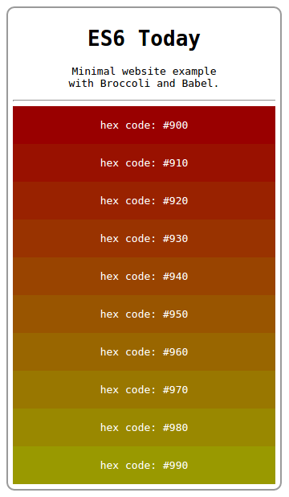

# 深入浅出 ES6（九）：学习 Babel 和 Broccoli，马上就用 ES6

作者 Gastón I. Silva ，译者 刘振涛

> **编者按：**ECMAScript 6 已经正式发布了，作为它最重要的方言，Javascript 也即将迎来语法上的重大变革，InfoQ 特开设“[深入浅出 ES6](http://www.infoq.com/cn/es6-in-depth/)”专栏，来看一下 ES6 将给我们带来哪些新内容。本专栏文章来自[Mozilla Web 开发者博客](https://hacks.mozilla.org/category/es6-in-depth/)，由作者授权翻译并发布。

自 ES6 正式发布，人们已经开始讨论 ES7：未来版本会保留哪些特性，新标准可能提供什么样的新特性。作为 Web 开发者，我们想知道如何发挥这一切的巨大能量。在[深入浅出 ES6 系列](http://www.infoq.com/cn/es6-in-depth/)之前的文章中，我们不断鼓励你开始在编码中加入 ES6 新特性，辅以一些有趣的工具，你完全可以从现在开始使用 ES6：

> 如果你想在 Web 端使用这种新语法，你可以通过[Babel](https://babeljs.io/)或 Google 的[Traceur](https://github.com/google/traceur-compiler)将你的 ES6 代码转译为 Web 友好的 ES5 代码。

现在，我们将向你分步展示如何做到的这一切。上面提及的工具被称为*转译器*，你可以将它理解为[源代码到源代码的编译器](https://en.wikipedia.org/wiki/Source-to-source_compiler)——一个在可比较的抽象层上操作不同编程语言相互转换的编译器。转译器允许我们用 ES6 编写代码，同时保证这些代码能在每一个浏览器中执行。

## 转译技术拯救了我们

转译器使用起来非常简单，只需两步即可描述它所做的事情：

1.  用 ES6 的语法编写代码。

    ```js
    let q = 99;
    let myVariable = `${q} bottles of beer on the wall, ${q} bottles of beer.`;
    ```

2.  用上面那段代码作为转译器的输入，经过处理后得到以下这段输出：

    ```js
    "use strict";

    var q = 99;
    var myVariable = "" + q + " bottles of beer on the wall, " + q + " bottles of beer."
    ```

这正是我们熟知的老式 JavaScript，这段代码可以在任意浏览器中运行。

转译器内部从输入到输出的逻辑高度复杂，完全超出本篇文章的讲解范围。正如我们无须知道所有的内部引擎结构就可以驾驶一辆汽车，现在，我们同样可以将转译器视为一个能够处理我们代码的黑盒。

## 实际体验 Babel

你可以通过几种不同的方法在项目中使用 Babel，有一个命令行工具，在这个工具中可以使用如下形式的指令：

```js
babel script.js --out-file script-compiled.js
```

Babel 也提供支持在浏览器中使用的版本。你可以将 Babel 作为一个普通的库引入，然后将你的 ES6 代码放置在类型为`text/babel`的 script 标签中。

```js
<script src="node_modules/babel-core/browser.js"></script>
<script type="text/babel">
// 你的 ES6 代码
</script>
```

```js
随着代码库爆炸式增长，你开始将所有代码划分为多个文件和文件夹，但是这些方法并不能随之扩展。到那时，你将需要一个构建工具以及一种将 Babel 与构建管道整合在一起的方法。
```

在接下来的章节中，我们将要把 Babel 整合到构建工具[Broccoli.js](http://broccolijs.com/)中，我们将在两个示例中编写并执行第一行 ES6 代码。如果你的代码无法正常运行，可以在这里（[broccoli-babel-examples](https://github.com/givanse/broccoli-babel-examples)）查看完整的源代码。在这个仓库中你可以找到三个示例项目：

1.  es6-fruits
2.  es6-website
3.  es6-modules

每一个项目都构建于前一个示例的基础之上，我们会从最小的项目开始，逐步得出一个一般的解决方案，为日后每一个雄心壮志的项目打下良好的开端。这篇文章只包含前两个示例，阅读文章后，你完全可以自行阅读第三个示例中的代码并加以理解。

如果你在想——我坐等浏览器支持这些新特性就好了啦——那么你一定会落后的！实现所有功能要花费很长时间，况且现在有成熟的转译器，而且 ECMAScript 加快了发布新版本的周期（每年一版），我们将会看到新标准比统一的浏览器平台更新得更频繁。所以赶快加入我们，一起发挥新特性的巨大威力吧！

## 我们的首个 Broccoli 与 Babel 项目

Broccoli 是一个用来快速构建项目的工具，你可以用它对文件进行混淆与压缩，还可以通过众多的[Broccoli 插件](https://www.npmjs.com/browse/keyword/broccoli-plugin)实现许多其它功能。它帮助我们处理文件和目录，每当项目变更时自动执行指令，很大程度上减轻了我们的负担。你不妨将它视为：

> 类似 Rails 的 asset 管道，但是 Broccoli 运行在 Node 上且可以对接任意后端。

### 配置项目

#### NODE

你可能已经猜到了，你需要[安装 Node 0.11 或更高版本](https://nodejs.org/)。

如果你使用 unix 系统，不要从包管理器（apt、yum 等）中安装，这样可以避免在安装过程中使用 root 权限，最好使用当前的用户权限，通过上面的链接手动安装。在文章《[不要 sudo npm](http://givan.se/do-not-sudo-npm/)》中可以了解为什么不推荐使用 root 权限，文章中也给出了[其它安装方案](http://givan.se/do-not-sudo-npm/#install-npm-properly)。

#### BROCCOLI

首先，我们要配置好 Broccoli 项目：

```js
mkdir es6-fruits
cd es6-fruits
npm init
# 创建一个名为 Brocfile.js 的空文件
touch Brocfile.js
```

现在我们安装`broccoli`和`broccoli-cli`

```js
# 安装 broccoli 库
npm install --save-dev broccoli
# 命令行工具
npm install -g broccoli-cli
```

### 编写一些 ES6 代码

创建 src 文件夹，在里面置入`fruits.js`文件。

```js
mkdir src
vim src/fruits.js
```

用 ES6 语法在新文件中写一小段脚本。

```js
let fruits = [
  {id: 100, name: '草莓'},
  {id: 101, name: '柚子'},
  {id: 102, name: '李子'}
];
for (let fruit of fruits) {
  let message = `ID: ${fruit.id} Name: ${fruit.name}`;
  console.log(message);
}
console.log(`List total: ${fruits.length}`);
```

上面的代码示例使用了三个 ES6 特性：

1.  用`let`进行局部作用域声明（在稍后的文章中讨论）
2.  [for-of 循环](http://www.infoq.com/cn/articles/es6-in-depth-iterators-and-the-for-of-loop)
3.  [模板字符串](http://www.infoq.com/cn/articles/es6-in-depth-template-string)

保存文件，尝试执行脚本。

```js
node src/fruits.js
```

目前这段代码不能正常运行，但是我们将会让它运行在 Node 与任何浏览器中。

```js
let fruits = [
    ^^^^^^
SyntaxError: Unexpected identifier
```

### 转译时刻

现在，我们用 Broccoli 加载代码，然后用 Babel 处理它。编辑`Brocfile.js`文件并加入以下这段代码：

```js
// 引入 babel 插件
var babel = require('broccoli-babel-transpiler');

// 获取源代码，执行转译指令（仅需 1 步）
fruits = babel('src'); // src/*.js

module.exports = fruits;
```

注意我们引入了包裹在 Babel 库中的 Broccoli 插件`broccoli-babel-transpiler`，所以我们一定要安装它：

```js
 npm install --save-dev broccoli-babel-transpiler
```

现在我们可以构建项目并执行脚本了：

```js
broccoli build dist # 编译
node dist/fruits.js # 执行 ES5
```

输出结果看起来应当是这样的：

```js
ID: 100 Name: 草莓
ID: 101 Name: 柚子
ID: 102 Name: 李子
List total: 3
```

那很简单！你可以打开`dist/fruits.js`查看转译后代码。Babel 转译器的一个优秀特性是它能够生产可读的代码。

## 为网站编写 ES6 代码

在第二个示例中，我们将做进一步提升。首先，退出`es6-fruits`文件夹，然后使用上述配置项目一章中列出的步骤创建新目录`es6-website`。

在 src 文件夹中创建三个文件：

`src/index.html`

```js
<!DOCTYPE html>
<html>
  <head>
    <title>马上使用 ES6</title>
  </head>
  <style>
    body {
      border: 2px solid #9a9a9a;
      border-radius: 10px;
      padding: 6px;
      font-family: monospace;
      text-align: center;
    }
    .color {
      padding: 1rem;
      color: #fff;
    }
  </style>
  <body>
    <h1>马上使用 ES6</h1>
    <div id="info"></div>
    <hr>
    <div id="content"></div>
    <script src="//code.jquery.com/jquery-2.1.4.min.js"></script>
    <script src="js/my-app.js"></script>
  </body>
</html>
```

`src/print-info.js`

```js
function printInfo() {
  $('#info')
  .append('<p>用 Broccoli 和 Babel 构建的' +
          '最小网站示例</p>');
}
$(printInfo);
```

`src/print-colors.js`

```js
// ES6 生成器
function* hexRange(start, stop, step) {
  for (var i = start; i < stop; i += step) {
    yield i;
  }
}

function printColors() {
  var content$ = $('#content');

  // 人为的示例
  for ( var hex of hexRange(900, 999, 10) ) {
    var newDiv = $('<div>')
      .attr('class', 'color')
      .css({ 'background-color': `#${hex}` })
      .append(`hex code: #${hex}`);
    content$.append(newDiv);
  }
}

$(printColors);
```

你可能已经注意到`function* hexRange`，是的，那是[ES6 的生成器](http://www.infoq.com/cn/articles/es6-in-depth-generators)。这个特性目前尚未被所有浏览器支持。为了能够使用这个特性，我们需要一个 polyfill，Babel 中已经支持，我们很快将投入使用。

下一步是合并所有 JS 文件然后在网站中使用。最难的部分是编写 Brocfile 文件，这一次我们要安装 4 个插件：

```js
npm install --save-dev broccoli-babel-transpiler
npm install --save-dev broccoli-funnel
npm install --save-dev broccoli-concat
npm install --save-dev broccoli-merge-trees
```

把它们投入使用：

```js
// Babel 转译器
var babel = require('broccoli-babel-transpiler');
// 过滤树（文件的子集）
var funnel = require('broccoli-funnel');
// 连结树
var concat = require('broccoli-concat');
// 合并树
var mergeTrees = require('broccoli-merge-trees');

// 转译源文件
var appJs = babel('src');

// 获取 Babel 库提供的 polyfill 文件
var babelPath = require.resolve('broccoli-babel-transpiler');
babelPath = babelPath.replace(/\/index.js$/, '');
babelPath += '/node_modules/babel-core';
var browserPolyfill = funnel(babelPath, {
  files: ['browser-polyfill.js']
});

// 给转译后的文件树添加 Babel polyfill
appJs = mergeTrees([browserPolyfill, appJs]);

// 将所有 JS 文件连结为一个单独文件
appJs = concat(appJs, {
  // 我们指定一个连结顺序
  inputFiles: ['browser-polyfill.js', '**/*.js'],
  outputFile: '/js/my-app.js'
});

// 获取入口文件
var index = funnel('src', {files: ['index.html']});

// 获取所有的树
// 并导出最终单一的树
module.exports = mergeTrees([index, appJs]);
```

现在开始构建并执行我们的代码。

```js
broccoli build dist
```

这次你在 dist 文件夹中应该看到以下结构：

```js
$> tree dist/
dist/
├── index.html
└── js
    └── my-app.js
```

那是一个静态网站，你可以用任意服务器伺服来验证那段代码正常运行。举个例子：

```js
cd dist/
python -m SimpleHTTPServer
# 访问 http://localhost:8000/
```

你应该可以看到：



## Babel 和 Broccoli 组合还有更多乐趣

上述第二个示例给出了一个通过 Babel 实现功能的思路，它可能足够你用上一阵子了。如果你想要更多有关 ES6、Babel 和 Broccoli 的内容，可以查看[broccoli-babel-boilerplate](https://github.com/jayphelps/broccoli-babel-boilerplate)，这个仓库中的代码可以提供 Broccoli+Babel 项目的配置，而且高出至少两个层次。这个样板可以文件处理模块、模块导入以及单元测试。

通过这些配置，你可以在示例[es6-modules](https://github.com/givanse/broccoli-babel-examples/tree/master/es6-modules)中亲自实践。Brocfile 魔力无穷，与我们之前实现的非常类似。

* * *

*正如你看到的，Babel 和 Broccoli 对于在 Web 网站中应用 ES6 新特性非常实用。感谢 Gastón I. Silva 贡献这篇文章！*

*下一篇，深入浅出 ES6 将为你带来一些 ES6 中威力更大的特性，届时请加入我们一起探索新世界。*

查看原文：[深入浅出 ES6（九）：学习 Babel 和 Broccoli，马上就用 ES6](http://www.infoq.com/cn/articles/es6-in-depth-babel-and-broccoli)

