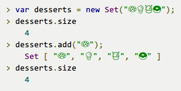

# 深入浅出 ES6（十）：集合

作者 Jason Orendorff ，译者 午川

> 编者按：ECMAScript 6 已经正式发布了，作为它最重要的方言，Javascript 也即将迎来语法上的重大变革，InfoQ 特开设“[深入浅出 ES6](http://www.infoq.com/cn/es6-in-depth/)”专栏，来看一下 ES6 将给我们带来哪些新内容。本专栏文章来自[Mozilla Web 开发者博客](https://hacks.mozilla.org/category/es6-in-depth/)，由作者授权翻译并发布。

前段时间，官方名为“ECMA-262，第六版，ECMAScript 2015 语言规范”的 ES6 规范终于结束了最后的征途，正式被认可为新的 ECMA 标准。让我们祝贺 TC39 等所有作出贡献人们，ES6 终于定稿了！

更好的消息是，下次更新不需要再等六年了。委员会现在努力要求，大约每 12 个月完成一个新的版本。[第七版提议](https://github.com/tc39/ecma262)已经开始。

现在是时候庆祝庆祝了，让我们来讨论一些很久以来我一直希望在 JS 里看到的东西——当然，它们以后仍然有改进的余地。

# 共同发展中的难题

JS 和其它编程语言有些特殊的差别，有时，它们会以令人惊奇的方式影响到这门语言的发展。

ES6 模块就是个很好的例子。其它语言的模块化系统中，Racket 做得特别棒，Python 也很好。那么，当标准委员会决定在 ES6 中增加模块时，为什么他们不直接仿照一套已经存在的系统呢？

因为 JS 是不同的，因为它要在浏览器里运行。读取和写入都可能花费较长时间，所以，JS 需要一套支持异步加载代码的模块化系统，同时，也不能允许在文件夹中挨个搜索，照搬已有的系统并不能解决问题。ES6 的模块化系统需要一些新技术。

讨论这些问题对最终设计的影响，会是个有趣的故事，不过我们今天要讨论的并不是模块。

这篇文章是关于 ES6 标准中所谓“键值集合”的：`Set`，`Map`，`WeakSet`和`WeakMap`。它们在大多数方面和其它语言中的[哈希表](https://en.wikipedia.org/wiki/Hash_table)一样，不过，正因为 JS 是不同的，标准委员会在其中做了些有趣的权衡与调整。

# 为什么要集合？

熟悉 JS 一定会知道，我们已经有了一种类似哈希表的东西：对象（`Object`）。

一个普通的对象毕竟就只是一个开放的键值对集合。你可以进行获取、设置、删除、遍历——任何一个哈希表支持的操作。所以我们到底为什么要增加新的特性？

好吧，大多数程序简单地用对象来存储键值对就够了，对它们而言，没什么必要换用`Map`或`Set`。但是，直接这样使用对象有一些广为人知的问题：

*   作为查询表使用的对象，不能既支持方法又保证避免冲突。
*   因而，要么得用`Object.create(null)`而非直接写`{}`，要么得小心地避免把`Object.prototype.toString`之类的内置方法名作为键名来存储数据。
*   对象的键名总是字符串（当然，ES6 中也可以是`Symbol`）而不能是另一个对象。
*   没有有效的获知属性个数的方法。

ES6 中又出现了新问题：纯粹的对象不[可遍历](http://www.infoq.com/cn/articles/es6-in-depth-iterators-and-the-for-of-loop)，也就是，它们不能配合`for-of`循环或`...`操作符等语法。

嗯，确实很多程序里这些问题都不重要，直接用纯对象仍然是正确的选择。`Map`和`Set`是为其它场合准备的。

这些 ES6 中的集合本来就是为避免用户数据与内置方法冲突而设计的，所以它们**不会**把数据作为属性暴露出来。也就是说，`obj.key`或`obj[key]`不能再用来访问数据了，取而代之的是`map.get(key)`。同时，不像属性，哈希表的键值不能通过原型链来继承了。

好消息是，不像纯粹的`Object`，`Map`和`Set`有自己的方法了，并且，更多标准或自定义的方法可以无需担心冲突地加入。

# Set

一个`Set`是一群值的集合。它是可变的，能够增删元素。现在，还没说到它和数组的区别，不过它们的区别就和相似点一样多。

首先，和数组不同，一个`Set`不会包含相同元素。试图再次加入一个已有元素不会产生任何效果。



这个例子里元素都是字符串，不过`Set`是可以包含 JS 中任何类型的值的。同样，重复加入已有元素不会产生效果。

其次，`Set`的数据存储结构专门为一种操作作了速度优化：包含性检测。

```
 > // 检查"zythum"是不是一个单词
    > arrayOfWords.indexOf("zythum") !== -1  // 慢
        true
    > setOfWords.has("zythum")               // 快
        true
```

`Set`不能提供的则是索引。

```
 > arrayOfWords[15000]
        "anapanapa"
    > setOfWords[15000]   // Set 不支持索引
        undefined
```

以下是`Set`支持的所有操作：

*   `new Set`：创建一个新的、空的`Set`。
*   `new Set(iterable)`：从任何[可遍历数据](https://hacks.mozilla.org/2015/04/es6-in-depth-iterators-and-the-for-of-loop/)中提取元素，构造出一个新的集合。
*   `set.size`：获取集合的大小，即其中元素的个数。
*   `set.has(value)`：判定集合中是否含有指定元素，返回一个布尔值。
*   `set.add(value)`：添加元素。如果与已有重复，则不产生效果。
*   `set.delete(value)`：删除元素。如果并不存在，则不产生效果。`.add()`和`.delete()`都会返回集合自身，所以我们可以用链式语法。
*   `set[Symbol.iterator]()`：返回一个新的遍历整个集合的迭代器。一般这个方法不会被直接调用，因为实际上就是它使集合能够被遍历，也就是说，我们可以直接写`for (v of set) {...}`等等。
*   `set.forEach(f)`：直接用代码来解释好了，它就像是`for (let value of set) { f(value, value, set); }`的简写，类似于数组的`.forEach()`方法。
*   `set.clear()`：清空集合。
*   `set.keys()`、`set.values()`和`set.entries()`返回各种迭代器，它们是为了兼容`Map`而提供的，所以我们待会儿再来看。

在这些特性中，负责构造集合的`new Set(iterable)`是唯一一个在整个数据结构层面上操作的。你可以用它把数组转化为集合，在一行代码内去重；也可以传递一个生成器，函数会逐个遍历它，并把生成的值收录为一个集合；也可以用来复制一个已有的集合。

上周我答应过要给 ES6 中的新集合们挑挑刺，就从这里开始吧。尽管`Set`已经很不错了，还是有些被遗漏的方法，说不定补充到将来某个标准里会挺不错：

*   目前数组已经有的一些辅助函数，比如`.map()`、`.filter()`、`.some()`和`.every()`。
*   不改变原值的交并操作，比如`set1.union(set2)`和`set1.intersection(set2)`。
*   批量操作，如`set.addAll(iterable)`、`set.removeAll(iterable)`和`set.hasAll(iterable)`。

好消息是，这些都可以用 ES6 已经提供了的方法来实现。

# Map

一个`Map`对象由若干键值对组成，支持：

*   `new Map`：返回一个新的、空的`Map`。
*   `new Map(pairs)`：根据所含元素形如`[key, value]`的数组`pairs`来创建一个新的`Map`。这里提供的`pairs`可以是一个已有的`Map` 对象，可以是一个由二元数组组成的数组，也可以是逐个生成二元数组的一个生成器，等等。
*   `map.size`：返回`Map`中项目的个数。
*   `map.has(key)`：测试一个键名是否存在，类似`key in obj`。
*   `map.get(key)`：返回一个键名对应的值，若键名不存在则返回`undefined`，类似`obj[key]`。
*   `map.set(key, value)`：添加一对新的键值对，如果键名已存在就覆盖。
*   `map.delete(key)`：按键名删除一项，类似`delete obj[key]`。
*   `map.clear()`：清空`Map`。
*   `map[Symbol.iterator]()`：返回遍历所有项的迭代器，每项用一个键和值组成的二元数组表示。
*   `map.forEach(f)` 类似`for (let [key, value] of map) { f(value, key, map); }`。这里诡异的参数顺序，和`Set`中一样，是对应着`Array.prototype.forEach()`。
*   `map.keys()`：返回遍历所有键的迭代器。
*   `map.values()`：返回遍历所有值的迭代器。
*   `map.entries()`：返回遍历所有项的迭代器，就像`map[Symbol.iterator]()`。实际上，它们就是同一个方法，不同名字。

还有什么要抱怨的？以下是我觉得会有用而 ES6 还没提供的特性：

*   键不存在时返回的默认值，类似 Python 中的`collections.defaultdict`。
*   一个可以叫`Map.fromObject(obj)`的辅助函数，以便更方便地用构造对象的语法来写出一个`Map`。

同样，这些特性也是很容易加上的。

到这里，还记不记得，开篇时我提到过运行于浏览器对语言特性设计的特殊影响？现在要好好谈一谈这个问题了。我已经有了三个例子，以下是前两个。

# JS 是不同的，第一部分：没有哈希代码的哈希表？

到目前为止，据我所知，ES6 的集合类完全不支持下述这种有用的特性。

比如说，我们有若干 URL 对象组成的 Set：

```
 var urls = new Set;
    urls.add(new URL(location.href));  // 两个 URL 对象。
    urls.add(new URL(location.href));  // 它们一样么？
    alert(urls.size);  // 2
```

这两个 URL 应该按相同处理，毕竟它们有完全一样的属性。但在 JavaScript 中，它们是各自独立、互不相同的，并且，绝对没有办法来重载相等运算符。

其它一些语言就支持这一特性。在 Java, Python, Ruby 中，每个类都可以重载它的相等运算符；Scheme 的许多实现中，每个哈希表可以使用不同的相等关系。C++则两者都支持。

但是，所有这些机制都需要编写者自行实现一个哈希函数并暴露出系统默认的哈希函数。在 JS 中，因为不得不考虑其它语言不必担心的互用性和安全性，委员会选择了不暴露——至少目前仍如此。

# JS 是不同的，第二部分：意料之外的可预测性

你多半觉得一台计算机具有确定性行为是理所应当的，但当我告诉别人遍历 Map 或 Set 的顺序就是其中元素的插入顺序时，他们总是很惊奇。没错，它就是确定的。

我们已经习惯了哈希表某些方面任性的行为，我们学会了接受它。不过，总有一些足够好的理由让我们希望尝试避免这种不确定性。2012 年我写过：

> *   有证据表明，部分程序员一开始会觉得遍历顺序的不确定性是令人惊奇又困惑的。[1](http://stackoverflow.com/questions/2453624/unsort-hashtable) [2](http://stackoverflow.com/questions/1872329/storing-python-dictionary-entries-in-the-order-they-are-pushed) [3](https://groups.google.com/group/comp.lang.python/browse_thread/thread/15f3b4a5cd6221b1/1b6621daf5d78d73) [4](http://bytes.com/topic/c-sharp/answers/439203-hashtable-items-order) [5](http://stackoverflow.com/questions/1419708/how-to-keep-the-order-of-elements-in-hashtable) [6](http://stackoverflow.com/questions/7105540/hashtable-values-reordered)
> *   ECMAScript 中没有明确规定遍历属性的顺序，但为了兼容互联网现状，几乎所有主流实现都不得不将其定义为插入顺序。因此，有人担心，假如 TC39 不确立一个确定的遍历顺序，“互联网社区也会在自行发展中替我们决定。” [7](https://mail.mozilla.org/pipermail/es-discuss/2012-February/020576.html)
> *   自定义哈希表的遍历顺序会暴露一些哈希对象的代码，继而引发关于哈希函数实现的一些恼人的安全问题。例如，暴露出的代码绝不能获知一个对象的地址。（向不受信任的 ES 代码透露对象地址而对其自身隐藏，将是互联网的一大安全漏洞。）

在 2012 年 2 月以上种种意见被提出时，我是[支持不确定遍历序](https://mail.mozilla.org/pipermail/es-discuss/2012-February/020541.html)的。然后，我决定用实验证明，保存插入序将过度降低哈希表的效率。我写了一个 C++的小型基准测试，结果却[令我惊奇地恰恰相反](https://wiki.mozilla.org/User%3aJorend/Deterministic_hash_tables)。

这就是我们最终为 JS 设计了按插入序遍历的哈希表的过程。

# 推荐使用弱集合的重要原因

[上篇文章](http://www.infoq.com/cn/articles/es6-in-depth-symbols)我们讨论了一个 JS 动画库相关的例子。我们试着要为每个 DOM 对象设置一个布尔值类型的标识属性，就像这样：

```
 if (element.isMoving) {
      smoothAnimations(element);
    }
    element.isMoving = true;
```

不幸的是，这样给一个 DOM 对象增加属性不是个好主意。原因我们上次已经解释过了。

上次的文章里，我们接着展示了用 Symbol 解决这个问题的方法。但是，可以用集合来实现同样的效果么？也许看上去会像这样：

```
 if (movingSet.has(element)) {
      smoothAnimations(element);
    }
    movingSet.add(element);
```

这只有一个坏处。Map 和 Set 都为内部的每个键或值保持了强引用，也就是说，如果一个 DOM 元素被移除了，回收机制无法取回它占用的内存，除非`movingSet`中也删除了它。在最理想的情况下，库在善后工作上对使用者都有复杂的要求，所以，这很可能引发内存泄露。

ES6 给了我们一个惊喜的解决方案：用`WeakSet`而非`Set`。和内存泄露说再见吧！

也 就是说，这个特定情景下的问题可以用弱集合(weak collection)或 Symbol 两种方法解决。哪个更好呢？不幸的是，完整地讨论利弊取舍会把这篇文章拖得有些长。简而言之，如果能在整个网页的生 命周期内使用同一个 Symbol，那就没什么问题；如果不得不使用一堆临时的 Symbol，那就危险了，是时候考虑 WeakMap 来避免内存泄露了。

# WeakMap 和 WeakSet

WeakMap 和 WeakSet 被设计来完成与 Map、Set 几乎一样的行为，除了以下一些限制：

*   WeakMap 只支持 new、has、get、set 和 delete。
*   WeakSet 只支持 new、has、add 和 delete。
*   WeakSet 的值和 WeakMap 的键必须是对象。

还要注意，这两种弱集合都不可迭代，除非专门查询或给出你感兴趣的键，否则不能获得一个弱集合中的项。

这些小心设计的限制让垃圾回收机制能回收仍在使用中的弱集合里的无效对象。这效果类似于弱引用或弱键字典，但 ES6 的弱集合可以在**不暴露脚本中正在垃圾回收**的前提下得到垃圾回收的效益。

# JS 是不同的，第三部分：隐藏垃圾回收的不确定性

弱集合实际上是用 [ephemeron 表](http://www.jucs.org/jucs_14_21/eliminating_cycles_in_weak/jucs_14_21_3481_3497_barros.pdf)实现的。

简单说，一个 WeakSet 并不对其中对象保持强引用。当 WeakSet 中的一个对象被回收时，它会简单地被从 WeakSet 中移除。WeakMap 也类似地不为它的键保持强引用。如果一个键仍被使用，相应的值也就仍被使用。

为什么要接受这些限制呢？为什么不直接在 JS 中引入弱引用呢？

再 次地，这是因为标准委员会很不愿意向脚本暴露未定义行为。孱弱的跨浏览器兼容性是互联网发展的痛苦之源。弱引用暴露了底层垃圾回收的实现细节——这正是与 平台相关的一个未定义行为。应用当然不应该依赖平台相关的细节，但弱引用使我们难于精确了解自己对测试使用的浏览器的依赖程度。这是件很不讲道理的事情。

相比之下，ES6 的弱集合只包含了一套有限的特性，但它们相当牢靠。一个键或值被回收从不会被观测到，所以应用将不会依赖于其行为，即使只是缘于意外。

这是针对互联网的特殊考量引发了一个惊人的设计、进而使 JS 成为一门更好语言的一个例子。

# 什么时候可以用上这些集合呢？

总计四种集合类在 Firefox、Chrome、Microsoft Edge、Safari 中都已实现，要支持旧浏览器则需要 [ES6 - Collections](https://github.com/WebReflection/es6-collections) 之类来补全。

Firefox 中的 WeakMap 最初由 Andreas Gal 实现，他后来当了一段时间 Mozilla 的 CTO。Tom Schuster 实现了 WeakSet，我实现了 Map 和 Set。感谢 Tooru Fujisawa 贡献的几个相关补丁。

下周开始是深入浅出 ES6 系列的两周暑假。这个系列已经覆盖了很多内容，不过几个 ES6 的最强特性还没涉及，敬请期待下次的新主题。

查看原文：[深入浅出 ES6（十）：集合](http://www.infoq.com/cn/articles/es6-in-depth-collections)

