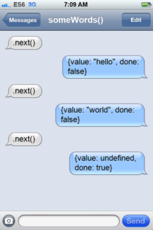
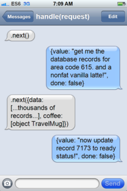

# 深入浅出 ES6（十一）：生成器 Generators，续篇

作者 Jason Orendorff ，译者 刘振涛

> 编者按：ECMAScript 6 已经正式发布了，作为它最重要的方言，Javascript 也即将迎来语法上的重大变革，InfoQ 特开设“[深入浅出 ES6](http://www.infoq.com/cn/es6-in-depth/)”专栏，来看一下 ES6 将给我们带来哪些新内容。本专栏文章来自[Mozilla Web 开发者博客](https://hacks.mozilla.org/category/es6-in-depth/)，由作者授权翻译并发布。

欢迎回到深入浅出 ES6 专栏，望你在 ES6 探索之旅中收获知识与快乐！程序员们在工作之余应当补充些额外的知识，现在我们继续深入浅出生成器，我已经为你们准备好非常棒的讨论话题。

在之前的文章《[深入浅出 ES6（三）：生成器 Generators](http://www.infoq.com/cn/articles/es6-in-depth-generators)》中，我为大家介绍了 ES6 中引入的新特性——生成器（Generators），我认为它是 ES6 中最具魔力的特性，很可能是异步编程下一步的发展方向。后来我这样写道：

> 生成器还有更多未提及的特性，例如：.throw()和.return()方法、可选参数.next()、yield*表达式语法。由于行文过长，估计观众老爷们已然疲乏，我们应该学习一下生成器，暂时 yield 在这里，剩下的干货择机为大家献上。

此时此刻，我们再续前缘。

阅读本文前，你最好先阅读一下[文章的第 1 部分](http://www.infoq.com/cn/articles/es6-in-depth-generators)，文章比较长，你可能看得云里雾里，但那儿有一只会说话的猫陪伴你，非常有趣！

## 快速回顾

在第三篇文章中，我们着重讲解了生成器的基本行为。你可能对此感到*陌生*，但是并不难理解。生成器函数与普通函数有很多相似之处，它们之间最大的不同是，普通函数一次执行完毕，而生成器函数体每次执行一部分，每当执行到一个 yield 表达式的时候就会暂停。

尽管在[那篇文章](http://www.infoq.com/cn/articles/es6-in-depth-generators)中我们进行过详细解释，但我们始终未把所有特性结合起来给大家讲解示例。现在就让我们出发吧！

```
 function* somewords() {
      yield "hello";
      yield "world";
    }
    for (var word of somewords()) {
      alert(word);
    }
```

这段脚本简单易懂，但是如果你把代码中不同的比特位当做戏剧中的任务，你会发现它变得如此与众不同。穿上新衣的代码看起来是这样的：

* * *

> （译者注：下面这是原作者创作的一个剧本，他将 ES6 中的各种函数和语法拟人化，以讲解生成器（Generator）的实现原理）

**场景 - 另一个世界的计算机，白天**

for loop 女士独自站在舞台上，戴着一顶安全帽，手里拿着一个笔记板，上面记载着所有的事情。

```
 for loop：
                （电话响起）
                somewords()！ 
```

generator 出现：这是一位高大的、有着一丝不苟绅士外表的黄铜机器人。
它看起来足够友善，但给人的感觉仍然是冷冰冰的金属。

```
 for loop：
            （潇洒地拍了拍她的手）
          好吧！我们去找些事儿做吧。
             （对 generator 说）
                  .next()！ 
```

generator 动了起来，就像突然拥有了生命。

```
 generator：
       {value: "hello", done: false} 
```

然而猝不及防的，它以一个滑稽的姿势停止了动作。

```
 for loop：
                   alert！ 
```

alert 小子飞快冲进舞台，眼睛大睁，上气不接下气。我们感觉的到他一向如此。

```
 for loop：
             对 user 说“hello”。 
```

alert 小子转身冲下舞台。

```
 alert：
            （舞台下，大声尖叫）
               一切都静止了！
             你正在访问的页面说，
                  “hello”！ 
```

停留了几秒钟后，alert 小子跑回舞台，穿过所有人滑停在 for loop 女士身边。

```
 alert：
                 user 说 ok。
                  for loop：
           （潇洒地拍了拍她的手）
          好吧！我们去找些事儿做吧。
           （回到 generator 身边）
                  .next()！ 
```

generator 又一次焕发生机。

```
 generator：
       {value: "world", done: false} 
```

它换了个姿势又一次冻结。

```
 for loop：
                   alert！
                   alert：
                （已经跑起来）
                  正在搞定！
              （舞台下，大声尖叫）
                一切都静止了！
              你正在访问的页面说，
                  “world”！ 
```

又一次暂停，然后 alert 突然跋涉回到舞台，垂头丧气的。

```
 alert：
            user 再一次说 ok，但是…
              但是请阻止这个页面
               创建额外的对话。 
```

他噘着嘴离开了。

```
 for loop：
            （潇洒地拍了拍她的手）
           好吧！我们去找些事儿做吧。
            （回到 generator 身边）
                  .next()！ 
```

generator 第三次焕发生机。

```
 generator：
                 （庄严的）
       {value: undefined, done: true} 
```

它的头低下了，光芒从它的眼里消失。它不再移动。

```
 for loop
               我的午餐时间到了。 
```

她离开了。

一会儿，garbage collector（垃圾收集器）老头进入，捡起了奄奄一息的 generator，将它带下舞台。

好吧，这一出戏不太像*哈姆雷特*，但你应该可以想象得出来。

* * *

好吧，这一出戏不太像*哈姆雷特*，但你应该可以想象得出来。

正如你在戏剧中看到的，当生成器对象第一次出现时，它立即暂停了。每当调用它的`.next()`方法，它都会苏醒并向前执行一部分。

所有动作都是单线程同步的。请注意，无论何时永远只有一个真正活动的角色，角色们不会互相打断，亦不会互相讨论，他们轮流讲话，只要他们的话没有说完都可以继续说下去。（就像莎士比亚一样！）

每当`for-of`循环遍历生成器时，这出戏的某个版本就展开了。这些`.next()`方法调用序列永远不会在你的代码的任何角落出现，在剧本里我把它们都放在舞台上了，但是对于你和你的程序而言，所有这一切都应该在幕后完成，因为生成器和`for-of`循环就是被设计成通过[迭代器接口](http://www.ecma-international.org/ecma-262/6.0/index.html#sec-iterator-interface)联结工作的。

所以，总结一下到目前为止所有的一切：

*   生成器对象是可以产生值的优雅的黄铜机器人。
*   每个生成器函数体构成的单一代码块就是一个机器人。

## 如何关停生成器

我在第 1 部分没有提到这些繁琐的生成器特性：

*   *generator.return()*
*   *generator.next()*的可选参数
*   *generator.throw(error)*
*   *yield**

如果你不理解这些特性存在得意义，就很难对它们提起兴趣，更不用说理解它们的实现细节，所以我选择直接跳过。但是当我们深入学习生成器时，势必要仔细了解这些特性的方方面面。

你或许曾使用过这样的模式：

```
 function dothings() {
      setup();
      try {
        // ... 做一些事情
      } finally {
        cleanup();
      }
    }
    dothings();
```

清理（cleanup）过程包括关闭连接或文件，释放系统资源，或者只是更新 dom 来关闭“运行中”的加载动画。我们希望无论任务成功完成与否都触发清理操作，所以执行流入到`finally`代码块。

那么生成器中的清理操作看起来是什么样的呢？

```
 function* producevalues() {
      setup();
      try {
        // ... 生成一些值
      } finally {
        cleanup();
      }
    }
    for (var value of producevalues()) {
      work(value);
    }
```

这段代码看起来很好，但是这里有一个问题：我们没在`try`代码块中调用`work(value)`，如果它抛出异常，我们的清理步骤会如何执行呢？

或者假设`for-of`循环包含一条`break`语句或`return`语句。清理步骤又会如何执行呢？

放心，清理步骤无论如何都会执行，ES6 已经为你做好了一切。

我们第一次讨论[迭代器和 for-of 循环](http://www.infoq.com/cn/articles/es6-in-depth-iterators-and-the-for-of-loop)时曾说过，迭代器接口支持一个可选的`.return()`方法，每当迭代在迭代器返回`{done:true}`之前退出都会自动调用这个方法。生成器支持这个方法，`mygenerator.return()`会触发生成器执行任一`finally`代码块然后退出，就好像当前的生成暂停点已经被秘密转换为一条`return`语句一样。

注意，`.return()`方法并不是在*所有的*上下文中都会被自动调用，只有当使用了迭代协议的情况下才会触发该机制。所以也有可能生成器没执行`finally`代码块就直接被垃圾回收了。

如何在舞台上模拟这些特性？生成器被冻结在一个需要一些配置的任务（例如，建造一幢摩天大楼）中间。突然有人抛出一个错误！`for`循环捕捉到这个错误并将它放置在一遍，她告诉生成器执行`.return()`方法。生成器冷静地拆除了所有脚手架并停工。然后`for`循环取回错误，继续执行正常的异常处理过程。

## 生成器主导模式

到目前为止，我们在剧本中看到的生成器（generator）和使用者（user）之间的对话非常有限，现在换一种方式继续解释：



在这里使用者主导一切流程，生成器根据需要完成它的任务，但这不是使用生成器进行编程的唯一方式。

在第 1 部分中我曾经说过，生成器可以用来实现异步编程，完成你用异步回调或 promise 链所做的一切。我知道你一定想知道它是如何实现的，为什么 yield 的能力（这可是生成器专属的特殊能力）足够应对这些任务。毕竟，异步代码不仅产生（yield）数据，还会*触发事件*，比如从文件或数据库中调用数据，向服务器发起请求并返回事件循环来等待异步过程结束。生成器如何实现这一切？它又是如何不借助回调力量从文件、数据库或服务器中接受数据？

为了开始找出答案，考虑一下如果`.next()`的调用者只有一种方法可以传值返回给生成器会发生什么？仅仅是这一点改变，我们就可能创造一种全新的会话形式：



事实上，生成器的`.next()`方法接受一个可选参数，参数稍后会作为`yield`表达式的返回值出现在生成器中。那就是说，`yield`语句与`return`语句不同，它是一个只有当生成器恢复时才会有值的表达式。

```
 var results = yield getdataandlatte(request.areacode);
```

这一行代码完成了许多功能：

*   调用`getdataandlatte()`，假设函数返回我们在截图中看到的字符串“`get me the database records for area code...`”。
*   暂停生成器，生成字符串值。
*   此时可以暂停任意长的时间。
*   最终，直到有人调用`.next({data: ..., coffee: ...})`，我们将这个对象存储在本地变量`results`中并继续执行下一行代码。

下面这段代码完整地展示了这一行代码完整的上下文会话：

```
 function* handle(request) {
      var results = yield getdataandlatte(request.areacode);
      results.coffee.drink();
      var target = mosturgentrecord(results.data);
      yield updatestatus(target.id, "ready");
    }
```

`yield`仍然保持着它的原始含义：暂停生成器，返回值给调用者。但是确实也发生了变化！这里的生成器期待来自调用者的非常具体的支持行为，就好像调用者是它的行政助理一样。

普通函数则与之不同，通常更倾向于满足调用者的需求。但是你可以借助生成器创造一段对话，拓展生成器与其调用者之间可能存在的关系。

这个行政助理生成器运行器可能是什么样的？它大可不必很复杂，就像这样：

```
 function rungeneratoronce(g, result) {
      var status = g.next(result);
      if (status.done) {
        return;  // phew!
      }
      // 生成器请我们去获取一些东西并且
      // 当我们搞定的时候再回调它
      doasynchronousworkincludingespressomachineoperations(
        status.value,
        (error, nextresult) => rungeneratoronce(g, nextresult));
    }
```

为了让这段代码运行起来，我们必须创建一个生成器并且运行一次，像这样：

```
 rungeneratoronce(handle(request), undefined);
```

在之前的文章中，我一个库的示例中提到`Q.async()`，在那个库中，生成器是可以根据需要自动运行的异步过程。`rungeneratoronce`正式这样的一个具体实现。事实上，生成器一般会生成 Promise 对象来告诉调用者要做的事情，而不是生成字符串来大声告诉他们。

如果你已经理解了 Promise 的概念，现在又理解了生成器的概念，你可以尝试修改`rungeneratoronce`的代码来支持 Promise。这个任务不简单，但是一旦成功，你将能够用 Promise 线性书写复杂的异步算法，而不仅仅通过`.then()`方法或回调函数来实现异步功能。

# 如何销毁生成器

你是否有看到`rungeneratoronce`的错误处理过程？答案一定是没有，因为上面的示例中直接忽略了错误！

是的，那样做不好，但是如果我们想要以某种方法给生成器报告错误，可以尝试一下这个方法：当有错误产生时，不要继续调用`generator.next(result)`方法，而应该调用`generator.throw(error)`方法来抛出`yield`表达式，进而像`.return()`方法一样终止生成器的执行。但是如果当前的生成暂停点在一个`try`代码块中，那么会`catch`到错误并执行`finally`代码块，生成器就恢复执行了。

另一项艰巨的任务来啦，你需要修改`rungeneratoronce`来确保`.throw()`方法能够被恰当地调用。请记住，生成器内部抛出的异常总是会传播到调用者。所以无论生成器是否捕获错误，`generator.throw(error)`都会抛出`error`并立即返回给你。

当生成器执行到一个`yield`表达式并暂停后可以实现以下功能：

*   调用`generator.next(value)`，生成器从离开的地方恢复执行。
*   调用`generator.return()`，传递一个可选值，生成器只执行`finally`代码块并不再恢复执行。
*   调用`generator.throw(error)`，生成器表现得像是`yield`表达式调用一个函数并抛出错误。
*   或者，什么也不做，生成器永远保持冻结状态。（是的，对于一个生成器来说，很可能执行到一个`try`代码块，永不执行`finally`代码块。这种状态下的生成器可以被垃圾收集器回收。）

看起来生成器函数与普通函数的复杂度相当，只有`.return()`方法显得不太一样。

事实上，`yield`与函数调用有许多共通的地方。当你调用一个函数，你就暂时停止了，对不对？你调用的函数取得主导权，它可能返回值，可能抛出错误，或者永远循环下去。

# 结合生成器实现更多功能

我再展示一个特性。假设我们写一个简单的生成器函数联结两个可迭代对象：

```
 function* concat(iter1, iter2) {
      for (var value of iter1) {
        yield value;
      }
      for (var value of iter2) {
        yield value;
      }
    }
```

es6 支持这样的简写方式：

```
 function* concat(iter1, iter2) {
      yield* iter1;
      yield* iter2;
    }
```

普通`yield`表达式只生成一个值，而`yield*`表达式可以通过迭代器进行迭代生成*所有*的值。

这个语法也可以用来解决另一个有趣的问题：在生成器中调用生成器。在普通函数中，我们可以从将一个函数重构为另一个函数并保留所有行为。很显然我们也想重构生成器，但我们需要一种调用提取出来的子例程的方法，我们还需要确保，子例程能够生成之前生成的每一个值。`yield*`可以帮助我们实现这一目标。

```
 function* factoredoutchunkofcode() { ... }
    function* refactoredfunction() {
      ...
      yield* factoredoutchunkofcode();
      ...
    }
```

考虑一下这样一个场景：一个黄铜机器人将子任务委托给另一个机器人，函数对组织同步代码来说至关重要，所以这种思想可以使基于生成器特性的大型项目保持简洁有序。

## 退场

好啦，这就是有关生成器的全部内容！我希望你如我般享受，很高兴回来。

下一篇文章，我们会讨论另一种令人兴奋的特性，它是在 es6 中加入的一种全新的对象，它很微妙，又很复杂，你可能到最后都不知道自己一直在使用这一特性。下一次请记得回来，我们一起深入浅出 es6 代理（proxy）。

查看原文：[深入浅出 ES6（十一）：生成器 Generators，续篇](http://www.infoq.com/cn/articles/es6-in-depth-generators-continued)

