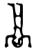

# 深入浅出 ES6（十七）：展望未来

作者 Jason Orendorff ，译者 刘振涛

*编者按：ECMAScript 6 已经正式发布了，作为它最重要的方言，Javascript 也即将迎来语法上的重大变革，InfoQ 特开设“[深入浅出 ES6](http://www.infoq.com/cn/es6-in-depth/)”专栏，来看一下 ES6 将给我们带来哪些新内容。本专栏文章来自[Mozilla Web 开发者博客](https://hacks.mozilla.org/category/es6-in-depth/)，由作者授权翻译并发布。*

在上一篇文章《[深入浅出 ES6（十六）：模块 Modules](http://www.infoq.com/cn/articles/es6-in-depth-modules)》中，我们彻底讲解完了 ES6 中的新特性，整个系列历经 4 月之久。

出于对文章长度的考虑，我们还保留了一些尚未提及的新特性，在最后的这篇文章中我会集中介绍一下这些新特性。你就当这是一次奇妙的旅程吧，无意间走进一幢语言大厦，路过形形色色的衣橱，穿梭于楼上奇形怪状的房间之间，偶尔还会看到一两个地下洞穴。如果你从未阅读过[此系列](http://www.infoq.com/cn/es6-in-depth/)中的其它文章，请务必提前浏览一遍，本文会提及许多过去文章中的内容，首次阅读的读者会略感吃力。


*“在你的左手边，你可以看到一个定型数组…”*

在这里我还要再多说一句：下面提及的许多特性目前尚未被广泛实现。

好的，那就让我们开始吧。

## 你可能正在使用的特性

ES6 除了新增特性外还有两类特殊的特性：其中一些特性早已被各大厂商广泛实现并使用，但是它们并没有被标准化；还有一些特性采自过去其它的标准。

*   **[定型数组（Typed arrays）](https://developer.mozilla.org/zh-CN/docs/Web/JavaScript/Reference/Global_Objects/TypedArray)、[数组缓冲（ArrayBuffer）](https://developer.mozilla.org/zh-CN/docs/Web/JavaScript/Reference/Global_Objects/ArrayBuffer)和[数据视图（DataView）](https://developer.mozilla.org/zh-CN/docs/Web/JavaScript/Reference/Global_Objects/DataView)。**这些特性全都来自 WebGL 标准，自这些特性出现后也被陆续用于实现许多其它的 API，例如 Canvas、Web Audio 还有 WebRTC。这些特性可以协助你处理大量原始的二进制数据或数值型数据。

    举个例子，如果`Canvas`的渲染上下文中缺少了你想要的特性，而你又认为这个特性足够重要，你可以借助以上特性自己实现一个：

    ```
     var context = canvas.getContext("2d");
        var image = context.getImageData(0, 0, canvas.width, canvas.height);
        var pixels = image.data;  // 一个 Uint8ClampedArray 对象
        // ... 你的代码
        // ... 直接修改原始的`像素`数据
        // ... 然后将修改后的数据写回 canvas:
        context.putImageData(image, 0, 0);
    ```

*   在标准化的进程中，定型数组采用了例如.slice()、.map()还有.filter()这样的[方法](https://developer.mozilla.org/en-US/docs/Web/JavaScript/Reference/Global_Objects/TypedArray#Methods)。

*   **Promise。**不要觉得 promise 很难，简而言之，它只不过是一段异步 JS 编程的构建代码块，它可以为你提供一些非立即可用的值。举个例子，当你调用[`fetch()`](https://developer.mozilla.org/zh-CN/docs/Web/API/GlobalFetch/fetch)方法获取数据时，它不会阻塞，而是会立即返回一个[promise](https://developer.mozilla.org/zh-CN/docs/Web/JavaScript/Reference/Global_Objects/Promise)对象。此时 fetch 函数一直在后台运行，直到响应到达时才会回调。结合 promise 的许多特性要优于单独使用回调实现各种功能，你可完美地将它们链接起来；它们是一等的值，相关操作非常有趣，例如[`promise.all()`](https://developer.mozilla.org/zh-CN/docs/Web/JavaScript/Reference/Global_Objects/Promise/all)可以等到所有 promise 都完成之后才运行，[`promise.race()`](https://developer.mozilla.org/zh-CN/docs/Web/JavaScript/Reference/Global_Objects/Promise/race)会在多个 promise 间制造一种竞争关系，当其中一个完成时，其它 promise 则被拒绝；用于错误处理的样板代码要简单得多。目前有一些浏览器暂不支持 promise 功能，可以加入 polyfill 为用户提供相关功能，如果你还不了解什么是 promise，那就来看看[Jake Archibald 深入剖析 promise 的文章](http://www.html5rocks.com/zh/tutorials/es6/promises/)吧。

*   **块级作用域内部函数。**这是一个*不推荐*使用的特性，但是你可能无意中已经使用过了。

    在 ES 1-5 中，下面这段代码从技术角度来看是非法的：

    ```
     if (temperature > 100) {
          function chill() {
            return fan.switchOn().then(obtainLemonade);
          }
          chill();
        }
    ```

    此处的函数声明位于`if`代码块内部，标准中不支持这样的声明操作。函数声明只有在最外层作用域或次外层函数作用域中才是合法的。

    但是这种方式却被几乎所有的主流浏览器所接受。

    虽然每一家厂商的实现相互之间不能完美兼容，但是基本都可以运行，而且目前有许多 web 页面仍在使用这种函数声明方式。

    谢天谢地，在 ES6 中将这种声明方式也纳入标准化范围啦，函数声明会被提升到封闭代码块的顶部。

    到目前为止，Firefox 和 Safari 中尚未实现这一新标准，如果需要请使用函数表达式来进行声明：

    ```
     if (temperature > 100) {
          var chill = function () {
            return fan.switchOn().then(obtainLemonade);
          };
          chill();
        }
    ```

    许多年前，委员会认为向后兼容的限制非常复杂，所以没有将块级作用域函数进行标准化。当时没有人可以解决这些问题，而在 ES6 中，委员会在非严格模式下添加了一个[非常奇怪的规则](http://www.ecma-international.org/ecma-262/6.0/index.html#sec-block-level-function-declarations-web-legacy-compatibility-semantics)从而克服了这个困难，我不便在这里作过多解释，请相信我，一定要使用严格模式，切记，切记！

*   **函数名称。**长久以来，所有主流的 JS 引擎都会为命名函数添加一个`.name`属性，而这一做法并没有得到标准的支持。ES6 标准对这一行为进行了支持，由于在这之前通过函数表达式声明的函数被认为是未命名函数，新标准通过命名感知的方式为其也添加了`.name`属性。

    ```
     > var lessThan = function (a, b) { return a < b; };
        > lessThan.name
            "lessThan"
    ```

    对于其它函数，例如为`.then`方法添加一个回调函数作为参数，新标准仍然不能断定这个函数的名称，因此`fn.name`就会被置为一个空字符串。

## 实用特性

*   **[Object.assign(target, ...sources)](https://developer.mozilla.org/zh-CN/docs/Web/JavaScript/Reference/Global_Objects/Object/assign)。**一个新的标准库函数，与 Underscore 中的[`_.extend()`](http://underscorejs.org/#extend)类似。

*   **应用于函数调用的展开（Spread）运算符。**这玩意儿跟 Nutella 没半毛钱关系，即使 Nutella 打开之后口感非常棒（译者注：Nutella 是一个巧克力酱品牌，其广告语中使用的 spread 一词深入人心）。但它的确是一个美味的特性，我想你会喜欢它的。

    在文章《[深入浅出 ES6（五）：不定参数和默认参数](http://www.infoq.com/cn/articles/es6-in-depth-rest-parameters-and-defaults)》中，我们介绍了不定参数（Rest），通过这种方式声明的函数可以接受任意数量的参数，相对于之前传递随机而又略显笨拙的`arguments`对象而言，这显然是一种更为优雅的选择。

    ```
     function log(...stuff) {  // stuff 是不定参数。
          var rendered = stuff.map(renderStuff); // 它实际上是一个数组
          $("#log").add($(rendered));
        }
    ```

    其实还有另外一种匹配语法，可以用这种语法给函数传递任意数量的参数，可以让`fn.apply()`函数看起来更优雅：

    ```
     // 记录数组中的所有值
        log(...myArray);
    ```

    展开运算符适用于所有[可迭代对象](http://www.infoq.com/cn/articles/es6-in-depth-iterators-and-the-for-of-loop)，所以你可以用`log(...mySet)`将所有的内容记录在一个`Set`中。

    与不定参数不同的是，你可以在同一个参数列表中多次使用展开操作符：

    ```
     // kicks 在 trids 之前
        log("Kicks:", ...kicks, "Trids:", ...trids);
    ```

    展开运算符也可以让多维数组展开变得不再复杂：

    ```
     > var smallArrays = [[], ["one"], ["two", "twos"]];
        > var oneBigArray = [].concat(...smallArrays);
        > oneBigArray
            ["one", "two", "twos"]
    ```

    ...但也可能只有我有这个迫切的需求。如果真的是这样，那还是去责备 Haskell 好啦。

*   **应用于构建数组的展开运算符。**在另外一篇文章《[深入浅出 ES6（六）：解构 Destructuring](http://www.infoq.com/cn/articles/es6-in-depth-destructuring)》中，我们还讨论了如何将解构改造为“不定（rest）”模式。你可以通过这种方法从数组中取出任意数量的元素。

    ```
     > var [head, ...tail] = [1, 2, 3, 4];
        > head
            1
        > tail
            [2, 3, 4]
    ```

    你猜怎么着！这儿还有一种匹配语法可以将任意数量的元素整合到数组中：

    ```
     > var reunited = [head, ...tail];
        > reunited
            [1, 2, 3, 4]
    ```

    此处所有的规则与应用于函数调用的展开运算符完全相同，也就是说，在相同的数组中你也可以使用多次展开运算符，等等。

*   **完全尾调用。**于我而言，很难用如此短的篇幅介绍这个优化后的新特性。

    《[Structure and Interpretation of Computer Programs](https://mitpress.mit.edu/sicp/full-text/book/book-Z-H-9.html#%_chap_1)》一书可以帮助你更好地理解这个特性，如果你喜欢这本书，就继续阅读下去吧，或者直接跳到[章节 1.2.1——线性递归和迭代](https://mitpress.mit.edu/sicp/full-text/book/book-Z-H-11.html#%_sec_1.2.1)，正如文中所述，在 ES6 标准中所有的实现也都必须是“尾递归（Tail-Recursive）”。

    目前尚无主流的 JS 引擎实现这一功能。虽然新功能实现起来很困难，但是都会尽快实现。

## 文本

*   **升级 Unicode 版本。** ES5 中要求至少支持 Unicode 3.0 中的所有的字符；而 ES6 要求至少支持 Unicode 5.1.0 中的所有字符。现在你可以用[古希腊 B 型线性文字](https://zh.wikipedia.org/wiki/%E7%BA%BF%E5%BD%A2%E6%96%87%E5%AD%97B)命名你的函数了！

    由于直到 Unicode 7.0 才会支持[A 型线性文字](https://zh.wikipedia.org/wiki/%E7%BA%BF%E5%BD%A2%E6%96%87%E5%AD%97A)，而且维护用一门尚未被译解的语言编写的代码可能很困难，所以目前不建议冒险使用。

    （有的 JavaScript 引擎支持了添加于 Unicode 6.1 的 emoji 表情，即使在这些引擎中也不能将 Unicode 特殊字符作为一个变量名称。出于某些原因，Unicode 财团决定不把它归类为标识符字符。）

*   **长 Unicode 转义序列。** ES6 新标准与之前的版本相似，也支持类似`\u212A`的 四位数 Unicode 转义序列，这个特性非常好，你可以在字符串中使用这种序列，如果纯粹出于好奇，或者你的项目没有任何代码审查的策略，也可以用它来类 命名变量哦。但是，对于像 U+13021 这样的字符就不能正常解析，数字 13021 有五位数字，比四位还多一位，你就无法看到埃及象形文字中一个倒立的人了。



`在 ES5 中，你需要用两个转义（亦即一个[UTF-16 代理对][26]）来表示，这种感觉完全像是生活在黑暗时代：冰冷、悲惨、野蛮。而 ES6，则像意大利文艺复兴时期的黎明一样，为我们带来了极大的改变：你现在可以直接写`\u{13021}`啦。`

*   **更好地支持基本多文种平面（BMP）以外的字符。**所以现在用[德赛莱特字母表](https://en.wikipedia.org/wiki/Deseret_alphabet)里的字符组成的字符串也可以调用`.toUpperCase()`和`.toLowerCase()`方法了！

    [`String.fromCodePoint(...codePoints)`](https://developer.mozilla.org/en-US/docs/Web/JavaScript/Reference/Global_Objects/String/fromCodePoint)与[`String.fromCharCode(...codeUnits)`](https://developer.mozilla.org/zh-CN/docs/Web/JavaScript/Reference/Global_Objects/String/fromCharCode)本质上相同，只不过额外增加了 BMP 外的码位支持。

*   **Unicode 正则表达式。** ES6 中的正则表达式支持一个新的修饰符：`u`。在加入修饰符 u 的正则表达式中，BMP 以外的字符都被视为单个字符，而不是两个相互分离的码元。举个例子，如果不加`u`，`/./`只能匹配字符`“&#x1f62d;”`的前半部分，但是`/./u`就可以匹配整个字符。

    想要支持更多能够处理 Unicode 的大小写不敏感匹配还有长 Unicode 转义序列，记得要给正则表达式添加修饰符`u`。欲了解详情，请阅读[Mathias Bynens 撰写的更详细的文章](https://mathiasbynens.be/notes/es6-unicode-regex)。

*   **粘性正则表达式。**该特性为正则表达式添加了一个[粘性修饰符](https://developer.mozilla.org/en-US/docs/Web/JavaScript/Reference/Global_Objects/RegExp/sticky)`y`，与 Unicode 无关。它只会查找始于特定偏移量的匹配，偏移量给自它的`.lastIndex`属性；如果没有相应匹配，它会立即返回`null`，不会在字符串中继续向前扫描来查找下一处匹配。

*   **官方版国际化标准。**标准规定，任何提供国际化相关特性的 ES6 实现必须支持[ECMAScript 2015 国际化 API 规范——ECMA-402](https://developer.mozilla.org/en-US/docs/Web/JavaScript/Reference/Global_Objects/Intl)。这个单立标准对[`Intl`对象](https://developer.mozilla.org/en-US/docs/Web/JavaScript/Reference/Global_Objects/Intl)进行了详细说明。Firefox、Chrome、IE 11+和 Node 0.12 已经全部支持了这一特性。

## 数字

*   **二进制和八进制数字字面量。**想要用不一样的方式来表示数字 8675309 么？`0x845fed`不是正确的答案。新标准中使用`0o`表示八进制，使用`0b`表示二进制，所以你可以写成`0o41057755`（八进制）或者`0b100001000101111111101101`（二进制）。

    `Number(str)`识别字符串的规则与之相同：`Number("0b101010")`会返回 42。

    （快速提示：`number.toString(base)`和`parseInt(string, base)`按照原始方式来对数字进行任意基底转换。）

*   **新的`Number`函数和常量。**这些新特性是专门为`Number`打造的，如果你感兴趣可以亲自浏览标准，从[Number.EPSILON](http://www.ecma-international.org/ecma-262/6.0/index.html#sec-number.epsilon)开始浏览。

    这其中最有趣的新思想当属“安全整数”范围，从-(2⁵³-1)到+(2⁵³-1)都在这个范围之中。从 JS 诞生开始这组特殊的数字范围就已经存在，这个范围中的每一个整数都可以表示一个 JS 数字，这也是`++`和`--`操作符合法的运行范围。超出这个范围之外的奇数整型数字不能被表示为 64 位浮点数，所以对能被表示的数字（都是偶数）进行递增或递减操作得不到正确的结果。为了让你的代码不受影响，代码中新增加了两个常量[`Number.MIN_SAFE_INTEGER`](https://developer.mozilla.org/en-US/docs/Web/JavaScript/Reference/Global_Objects/Number/MIN_SAFE_INTEGER)和[`Number.MAX_SAFE_INTEGER`](https://developer.mozilla.org/en-US/docs/Web/JavaScript/Reference/Global_Objects/Number/MAX_SAFE_INTEGER)，还增加了一个断言函数[`Number.isSafeInteger(n)`](https://developer.mozilla.org/zh-CN/docs/Web/JavaScript/Reference/Global_Objects/Number/isSafeInteger)。

*   **新的`Math`函数。** ES6 标准中新增了一些双曲三角函数和它们的逆函数，例如[`Math.sinh()`](https://developer.mozilla.org/en-US/docs/Web/JavaScript/Reference/Global_Objects/Math/sinh)、[`Math.cosh()`](https://developer.mozilla.org/en-US/docs/Web/JavaScript/Reference/Global_Objects/Math/cosh)、[`Math.tanh()`](https://developer.mozilla.org/en-US/docs/Web/JavaScript/Reference/Global_Objects/Math/tanh)、[`Math.asinh()`](https://developer.mozilla.org/en-US/docs/Web/JavaScript/Reference/Global_Objects/Math/asinh)、[`Math.acosh()`](https://developer.mozilla.org/en-US/docs/Web/JavaScript/Reference/Global_Objects/Math/acosh)、[`Math.atanh()`](https://developer.mozilla.org/en-US/docs/Web/JavaScript/Reference/Global_Objects/Math/atanh)，用于计算立方根的[`Math.cbrt(x)`](https://developer.mozilla.org/zh-CN/docs/Web/JavaScript/Reference/Global_Objects/Math/cbrt)函数、用于计算直角三角形斜边的[`Math.hypot(x, y)`](https://developer.mozilla.org/zh-CN/docs/Web/JavaScript/Reference/Global_Objects/Math/hypot)函数，用于计算同底对数的[`Math.log2(x)`](https://developer.mozilla.org/zh-CN/docs/Web/JavaScript/Reference/Global_Objects/Math/log2)和[`Math.log10(x)`](https://developer.mozilla.org/zh-CN/docs/Web/JavaScript/Reference/Global_Objects/Math/log10)函数，帮助计算整数对数的[`Math.clz32(x)`](https://developer.mozilla.org/zh-CN/docs/Web/JavaScript/Reference/Global_Objects/Math/clz32)函数以及其它的一些函数。

    [`Math.sign(x)`](https://developer.mozilla.org/zh-CN/docs/Web/JavaScript/Reference/Global_Objects/Math/sign)可以用来获取数字的符号。

    ES6 也添加了[`Math.imul(x, y)`](https://developer.mozilla.org/zh-CN/docs/Web/JavaScript/Reference/Global_Objects/Math/imul)函数，用以计算 x 的 y 次幂。JS 中没有 64 位整数或大整数是一件很奇怪的事情，所以在某些情况下这个函数非常有用，比如编译器可以用这个函数来优化代码操作，Emscripten 就用它来实现 JS 中的 64 位整数乘法。

与之类似的是，[`Math.fround(x)`](https://developer.mozilla.org/zh-CN/docs/Web/JavaScript/Reference/Global_Objects/Math/fround)用于支持 32 位浮点数操作。

## 最后的最后

以上就你想要讲的所有内容咯？

好吧，其实还有许多没有讲。我甚至没有提到所有内建迭代器通用的原型对象[IteratorPrototype](http://www.ecma-international.org/ecma-262/6.0/index.html#sec-%iteratorprototype%-object)，绝密的[GeneratorFunction](http://www.ecma-international.org/ecma-262/6.0/index.html#sec-generatorfunction-constructor)构造函数，[Object.is(v1, v2)](https://developer.mozilla.org/zh-CN/docs/Web/JavaScript/Reference/Global_Objects/Object/is)，用于支持像[Array](http://www.ecma-international.org/ecma-262/6.0/index.html#sec-arrayspeciescreate)和[Promise](http://www.ecma-international.org/ecma-262/6.0/index.html#sec-promise.prototype.then)这些的子类化内建方法的`Symbol.species`函数，甚或是在 ES6 标准中指定[多全局变量](http://www.ecma-international.org/ecma-262/6.0/index.html#sec-code-realms)的具体细节，这一部分之前从未得到正式的标准化。

我确信我也会遗漏许多有用的内容。

但是如果你一路跟着我们走下来，你自然会知道未来将发展向何处。你已经知道[现在就可以开始使用 ES6 特性](http://www.infoq.com/cn/articles/es6-in-depth-babel-and-broccoli)，而且一旦你这样做，无疑是选择了一门比之前更好的语言。

前些日子，[Josh Mock](https://twitter.com/JoshMock)对我说他现在会下意识地优先使用 ES6 的特性，在大约 50 行代码中已经用了[八种不同的新特性](https://gist.github.com/JoshMock/98f187c7a8bf745e4cf6)，包括：模块（`Module`）、类（`Class`）、默认参数（`Argument Default`）、`Set`、`Map`、模板字符串、箭头函数，还有`let`，是的，他忘记说`for-of`循环了。

这也是我目前所体会到的，互相结合的新特性非常实用，它们最终会渗透到你写的每一行 JS 代码中。

与此同时，每一个 JS 引擎都在加急实现并优化到目前为止我们讨论的所有特性。

我们的系列马上就完结了，此时各大引擎也将多多少少实现了大部分语言特性，这就是最后一篇文章啦，我得去找点儿其它的事情来做。

开玩笑啦。[ES7 标准的提案](https://github.com/tc39/ecma262)已经在加速筛选中，我们就选取几个来看一下吧：

*   **[乘方操作符](https://github.com/rwaldron/exponentiation-operator)。** `2 ** 8`将返回 256.在[Firefox Nightly](https://nightly.mozilla.org/)中已经实现。

*   **[`Array.prototype.includes(value)`](https://github.com/tc39/Array.prototype.includes/)。**如果数组中包含给定值将返回 true，这个特性在 Firefox Nightly 中也已实现，可以编写相应的 polyfill 在不支持该特性的浏览器中使用。

*   **[单指令多数据（SIMD）](https://docs.google.com/presentation/d/1MY9NHrHmL7ma7C8dyNXvmYNNGgVmmxXk8ZIiQtPlfH4/edit?usp=sharing)。**暴露现代 CPU 提供的 128 位[SIMD 指令](https://zh.wikipedia.org/wiki/%E5%8D%95%E6%8C%87%E4%BB%A4%E6%B5%81%E5%A4%9A%E6%95%B0%E6%8D%AE%E6%B5%81)， 这些指令可以对 2、4 或 8 组相邻的数组元素同时进行算数运算。它们能够加速各种各样的算法加速，为流媒体、密码学、游戏、图像处理以及很多其它领域提供客 观的性能提升。这些指令非常低阶但是非常实用，在 Firefox Nightly 中也已实现，同样可以编写相应的 polyfill 在不支持该特性的浏览器中使用。

*   **[Async 异步函数](https://github.com/tc39/ecmascript-asyncawait)。**我们在《[深入浅出 ES6（三）：生成器 Generators](http://www.infoq.com/cn/articles/es6-in-depth-generators)》一文中捎带着提到过这个特性。Async 函数与生成器类似，但是专门用于异步编程操作。当你调用生成器时，它会返回一个迭代器。当你调用 async 函数时，它会返回一个 promise。生成器使用`yield`关键词来暂停并产生值；async 函数使用`await`关键词来暂停并等待 promise。

    我很难用简短的几句话把这些特性描述清楚，但是 async 函数将成为 ES7 标准中具有里程碑意义的一个特性。

*   **[定型对象](https://github.com/dslomov/typed-objects-es7)。**定型数组中包含着定型元素，定型对象与定型数组的概念类似，简单来说定型对象中的属性都拥有确定的类型。

    ```
     // 创建一个新的结构类型，每一个 Point 都有两个字段
        // 分别命名为 x 和 y。
        var Point = new TypedObject.StructType({
          x: TypedObject.int32,
          y: TypedObject.int32
        });

        // 现在创建一个这个类型的实例。
        var p = new Point({x: 800, y: 600});
        console.log(p.x); // 800
    ```

    你可能只会出于性能的原因才指定具体的类型。定型对象与定型数组通过为变量、数组和对象指定具体的类型，压缩内存的使用量并提高应用的性能，但是在逐对象、选择性加入的基础上，却与处处都是静态类型的语言相反。

    将 JS 作为一个编译目标也很有趣。

    定型对象在 Firefox Nightly 已得到实现。

*   **[类和属性修饰符](https://github.com/wycats/javascript-decorators/blob/master/README.md)。**修饰符是你为属性、类或方法添加的标签。你可以通过这个示例初步了解一下：

    ```
     import debug from "jsdebug";

        class Person {
          @debug.logWhenCalled
          hasRoundHead(assert) {
            return this.head instanceof Spheroid;
          }
          ...
        }
    ```

    这里的`@debug.logWhenCalled`就是修饰符，你可以想象一下它都对方法做了些什么。

    [提案](https://github.com/wycats/javascript-decorators/blob/master/README.md)中对此做出了详细的解释，同时也举了许多示例。

我还想讨论一下更令人激动的标准发展进程，对，我们不介绍语言特性了。

ECMAScript 标准委员会 TC39 日后会提高新版本的发布速度，也会[提高公开标准进程的透明度](https://tc39.github.io/process-document/)。ES5 与 ES6 间隔六年之久，委员会下定决心要在 12 个月的时间内从 ES6 进化到 ES7，标准的后续版本将按照每 12 个月一次的节奏发布。以上列举的其中一些特性将在那时整装待发，争取赶上 ES7 这趟火车，届时时间表中尚未完成的特性可以赶下一趟火车。

哈哈，分享 ES6 中数量惊人的新特性非常有趣，这种大规模的特性发布可能再也见不到了，我为此感到无比荣幸。

感谢您一路走来陪伴我们一起《[深入浅出 ES6](http://www.infoq.com/cn/es6-in-depth/)》，希望你能喜欢。有任何问题欢迎随时联系我。

查看原文：[深入浅出 ES6（十七）：展望未来](http://www.infoq.com/cn/articles/es6-in-depth-the-future)