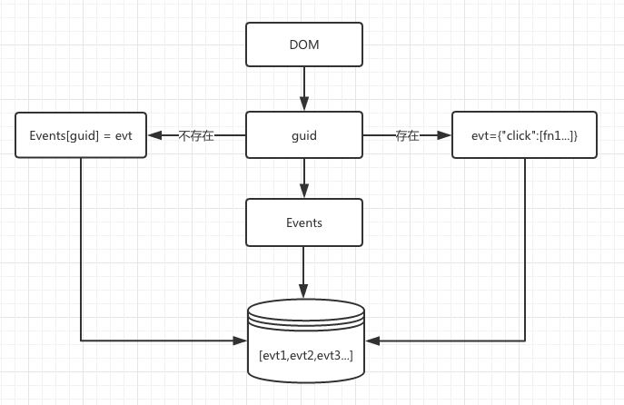
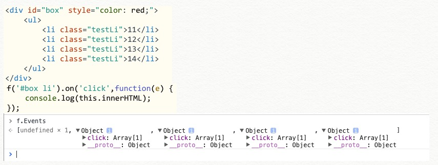
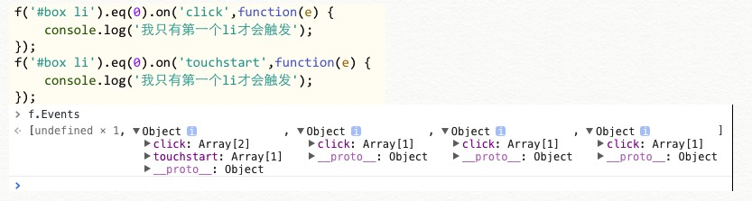

# 如何实现 on 与 off

# Lesson-9

* * *

关于事件部分,我思考了很久,也参考了许多,到底如何能用一个很简单的方法实现一模一样的 on、off 呢?

最后我的设计思路是:

> 1.有一个全局存储所有`Events`的数组，存放每个`dom`元素上的事件。
> 
> 2.给每个`DOM`一个`guid`的唯一标识符，通过这个`guid`来找出`Events`数组里的事件。

由于逻辑比较复杂，我们先来画个图看看。



首先，我们利用 DOM 可以增加自定义属性的原理，在它的身上存一个 guid。

之后整个事件机制就根据这个 guid 来进行查找与存储。

接下来是代码部分

```
Kodo.Events = []; //事件绑定存放的事件
Kodo.guid = 0; //事件绑定的唯一标识

on: function(type, selector, fn) {
    if (typeof selector == 'function') {
        fn = selector; //两个参数的情况
        for (var i = 0; i < this.length; i++) {
            if (!this[i].guid) {
                this[i].guid = ++Kodo.guid;
                //guid 不存在，给当前 dom 一个 guid

                Kodo.Events[Kodo.guid] = {};
                /*
                *给 Events[guid] 开辟一个新对象
                *用于存储这个 dom 上的所有事件方法
                */

                Kodo.Events[Kodo.guid][type] = [fn]; //每个方法都是一个数组
                //给这个新对象，赋予事件数组 "click" : [fn1,fn2,...]

                bind(this[i], type, this[i].guid);//绑定事件

            } else {//guid 存在的情况
                var id = this[i].guid;
                if (Kodo.Events[id][type]) {
                    //如果这存在是当前事件已经存过，不用在绑定事件,直接放入方法数组即可
                    Kodo.Events[id][type].push(fn);
                } else {
                    //这是存新事件，所以需要重新绑定一次
                    Kodo.Events[id][type] = [fn];
                    bind(this[i], type, id);
                }
            }
        }
    }
}

function bind(dom, type, guid) {
    dom.addEventListener(type, function(e) { //绑定相应事件
        for (var i = 0; i < Kodo.Events[guid][type].length; i++) {
            //循环执行那个方法数组即可
            Kodo.Events[guid][type][i].call(dom, e); //正确的 dom 回调
        }
    }, false);
} 
```

由于方法过长，我就把讲解的都写在了代码里，这样看的也会更方便一些。

代码还是不够形象！我们来看看 log 就能更清晰明白其中的奥秘。

通过控制台 log 出`f.Events` 发现正是我们想要的结果，每个`dom`对应一个自己的`evtObj`， 通过`Kodo.Events[guid]` 可以得到指定的`evtObj`。然后即可取出自己相应的事件。



如果我继续新增事件



可以发现，我只针对于第一个 li 增加了事件。log 出 Evnets 也就只有第一个 Object 有新增，并且会增加到对应的事件数组里。

理解了这个后要解除事件绑定，那就非常简单了。同样根据 guid 查找到对应的方法数组，delete 即可

```
off: function(type, selector) {
    if (arguments.length == 0) {
        //如果没传参数，清空所有事件
        for (var i = 0; i < this.length; i++) {
            var id = this[i].guid;
            for (var j in Kodo.Events[id]) {
                delete Kodo.Events[id][j];
            }
        }
    } else if (arguments.length == 1) {
        //指定一个参数，则清空对应 type 的事件
        for (var i = 0; i < this.length; i++) {
            var id = this[i].guid;
            delete Kodo.Events[id][type];
        }
    } 
} 
```

一个没有带有事件委托的 on、off 就可以这样实现了。

那如果我们要实现带委托的怎么办呢？

我们可以用这同样的思路实现，只是要多进行一个指定 selector 的存储。

这个我们就放在下一课最后讲解。

> star 是尊重作者知识果实最好的回报 :)