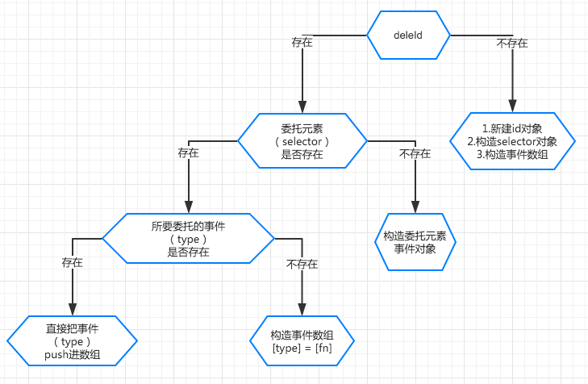
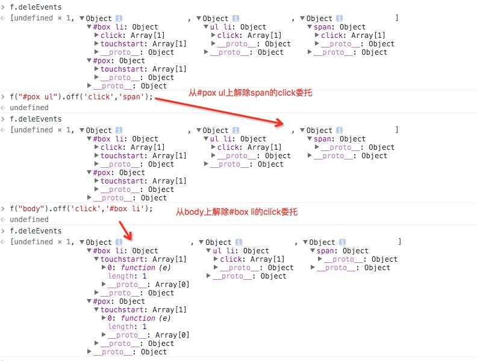

# 实现事件委托

# Lesson-10

* * *

实现 on,off 的事件委托!

我们能根据之前的思路,利用同样的方法实现一个事件委托.

先来看看流程图



然后先看看结果是如何，毕竟流程图看的也不一定能懂。



最后我们再来看看代码

```js
Kodo.deleEvents = []; //事件委托存放的事件
Kodo.deleId = 0; //事件委托的唯一标识

on: function(type, selector, fn) {
    if (typeof selector == 'function') {
        fn = selector; //两个参数的情况
        //事件绑定过程
    } else { 
        //事件委托过程
        for (var i = 0; i < this.length; i++) {
            if ( !this[i].deleId ) {
                this[i].deleId = ++Kodo.deleId;
                //同样是判断是否有唯一 id

                Kodo.deleEvents[Kodo.deleId] = {};
                //没有则创建 id 对象 也就是 f.deleEvents[]新开辟一个新对象

                Kodo.deleEvents[Kodo.deleId][selector] = {};

                //构造 selector 对象 
                /*
                *  如 Kodo.deleEvents[1] = 
                *  ｛
                *       "#box li" : {},
                *        "#pox" : {}
                *   ｝
                */

                Kodo.deleEvents[Kodo.deleId][selector][type] = [fn];
                //构造我们的事件数组
                /*
                *  如 Kodo.deleEvents["#box li"] = 
                *  {
                *       "click" : [fn1,fn2...],
                *        "touchstart" : [fn1,fn2....]
                *   }
                */
                delegate(this[i],type,selector);
                //用委托的方式进行绑定
            } else {
                //如果 id 存在的情况
                var id = this[i].deleId,
                    position = Kodo.deleEvents[id];//委托元素的事件存储位置

                if(!position[selector]) {
                    //先判断如果 selector 存储的对象不存在
                    position[selector] = {};
                    //新建 selector 对象 (与上面的 selector 构造相同)
                    position[selector][type] = [fn];
                    //构造事件数组对象   (与上面的 type 构造相同)

                    delegate(this[i],type,selector);
                    //因为是新的 selector 所以要再绑定
                } else { 
                    //selector 存储对象存在的情况
                    if ( position[selector][type] ) {
                        //如果事件数组已经有了，则直接 push 进来
                        position[selector][type].push(fn);

                    } else {
                        //如果事件数组没有，那就构造事件数组
                        position[selector][type] = [fn];

                        //因为是新的绑定的事件，所以要重新绑定
                        delegate(this[i],type,selector);
                    }

                }
            }
        }
    }
}, 
```

继续再看一遍 log 的结果，对比刚刚的代码


连同代码，我在注释里已经非常的详细解释了整个过程，大家结合控制台 log 的结果，在看看最初的流程图结合的看，我相信有点点耐心就能马上理解了。

绑定过程都会比较复杂，理解了绑定过程后，下面 off 的实现就很容易了。

off 本身是可以传 2 个参数的，第一个参数为事件 type，第二个参数是委托元素 selector

```js
off: function(type, selector) {
    if (arguments.length == 0) {
        //如果没传参数，清空所有事件

    } else if (arguments.length == 1) {
        //指定一个参数，则清空对应的事件

    } else {
        //直接根据 dom 上存有的 deleId，找到对应的 deleEvents 里的位置
        //删除委托元素上的 type 事件数组即可
        for (var i = 0; i < this.length; i++) {
            var id = this[i].deleId;
            delete Kodo.deleEvents[id][selector][type];
        }
    }
} 
```

最后看看我们修改过后的 delegate 方法

```js
function delegate(agent, type, selector) {
    var id = agent.deleId; //先获取被委托元素的 deleId
    agent.addEventListener(type, function(e) {
        var target = e.target;
        var ctarget = e.currentTarget;
        var bubble = true;

        while (bubble && target != ctarget) {
            if (filiter(agent, selector, target)) {
                for (var i = 0; i < Kodo.deleEvents[id][selector][type].length; i++) {
                    bubble = Kodo.deleEvents[id][selector][type][i].call(target, e);
                    //循环事件数组 直接 call
                }
            }
            target = target.parentNode;
            return bubble;
        }
    }, false);

    function filiter(agent, selector, target) {
        //过滤函数
    }
} 
```

这里修改的就只有二个地方

1.获取被委托元素的 deleId，因为我们整个委托机制都与他有关。 2.通过 id 在 deleEvents 里查找对应的事件数组，循环执行即可

以上就是整个委托的过程！

```js
 f("you").on('star','me',function(){
    console.log('success!');
}); 
```