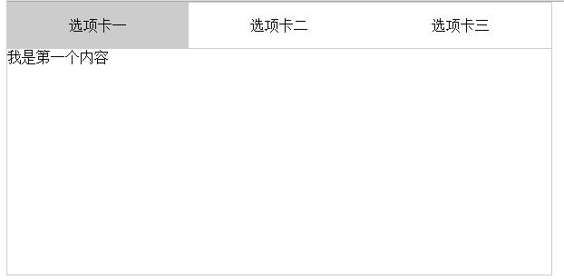

# 什么是 Tab？

## 1.3\. 什么是 Tab？



### 1.3.1\. 看一下小灰灰的 tab v1

v1

```
<!doctype html>
<html lang="en">
<head>
    <meta charset="UTF-8">
    <title>Document</title>
    <style>
    *{
        margin: 0; 
        padding: 0;
        list-style: none;
    }
    #tab {
        width: 600px;
        height: 300px;
        border: 1px solid #ccc;
    }
    #tab > div{
        display: none;
    }
    #tab_btn {
        height: 50px;
        line-height: 50px;
        border-bottom: 1px solid #ccc;
    }
    #tab_btn li {
        float: left;
        width: 200px;
        text-align: center;;
    }
    #tab_btn li.on{
        background: #ccc;
    }
    </style>
</head>
<body>
    <div id="tab">
        <ul id="tab_btn">
            <li class="on">选项卡一</li>
            <li>选项卡二</li>
            <li>选项卡三</li>
        </ul>

        <div style="display:block">我是第一个内容</div>
        <div>我是第二个内容</div>
        <div>我是第三个内容</div>
    </div>
    <script src="../lib/jquery-1.10.2.min.js"></script>
    <script>
    $('#tab_btn li').on('mouseover', function (){
        $('#tab_btn li').removeClass('on');
        $(this).addClass('on');

        $('#tab div').hide();
        $('#tab div').eq($(this).index()).show();
    })
    </script>
</body>
</html> 
```

### 1.3.2\. 它有几个明显问题

*   样式与 js 代码没有和 html 分离
*   tab 功能实现里，但无法复用，因为他用的是 id 方式
*   tab 的骨架 html 模板也不合理

### 1.3.3\. 狮子的故事

曾经有一个小伙伴，写下来这样的代码

```
<ul id="tab_btn">
    <li class="lion">选项卡一</li>
    <li>选项卡二</li>
    <li>选项卡三</li>
</ul> 
```

然后我在读 css 代码的时候，发现

```
.lion {
    ...
} 
```

我看了很久，lion 是狮子的意思，那这里呢？

后来才明白，原来是 li on 的意思，也就是选中的 tab 的状态是 on。

命名是非常容易闹笑话的，其实，这里用 active 更合适

### 1.3.4\. 看一下小灰灰的 tab v2

v2

提取 css 和 js 的部分不是本章重点，下面比较一下重构后的 tab 骨架结构

之前的 tab 骨架

```
<div id="tab">
    <ul id="tab_btn">
        <li class="on">选项卡一</li>
        <li>选项卡二</li>
        <li>选项卡三</li>
    </ul>

    <div style="display:block">我是第一个内容</div>
    <div>我是第二个内容</div>
    <div>我是第三个内容</div>
</div> 
```

重构后的代码

```
<div id="tab">
    <div class="tab_header">
        <ul>
            <li class="active">选项卡一</li>
            <li>选项卡二</li>
            <li>选项卡三</li>
        </ul>
    </div>
    <div class="tab_content">
        <div class='tab_content_item'  style="display:block">
            我是第一个内容
        </div>
        <div class='tab_content_item'>
            我是第二个内容
        </div>
        <div class='tab_content_item'>
            我是第三个内容
        </div>
    </div>
</div> 
```

这样的代码结构是不是更为清晰呢？

### 1.3.5\. 重构行内样式

还有点小瑕疵，下面代码用了行内样式

```
<div class='tab_content_item'  style="display:block">
    我是第一个内容
</div> 
```

修改如下

```
// html
<div class='tab_content_item active'>
    我是第一个内容
</div>

// css
.tab_content .active{
    display:block;
} 
```

把行内样式抽象成状态，继而让代码更具可读性

### 1.3.6\. v2 的 js

结构改了，js 也一定做了修改，tab.js 具体内容如下：

```
;$(function(){
    $('.tab_header li').on('mouseover', function (){
        $('.tab_header li').removeClass('active');
        $(this).addClass('active');

        $('.tab_content div').hide();
        $('.tab_content div').eq($(this).index()).show();
    })
}); 
```

### 1.3.7\. 点评

v2 的 js 只是根据 tab 的骨架接口修改而进行了简单修改，主要是 dom selector 的修改

没有什么特别值得说明的。

### 1.3.8\. 让我们看看一个页面多个 tab，它如何？

详见 jQuery.tab_more.html

出现的问题是在第二个 tab 上滑动的时候，更新的是第一个 tab content，这是为什么呢？

答：js 代码写的太随意，没有注意控制组件自身管控范围

***不严谨是写代码的大忌***