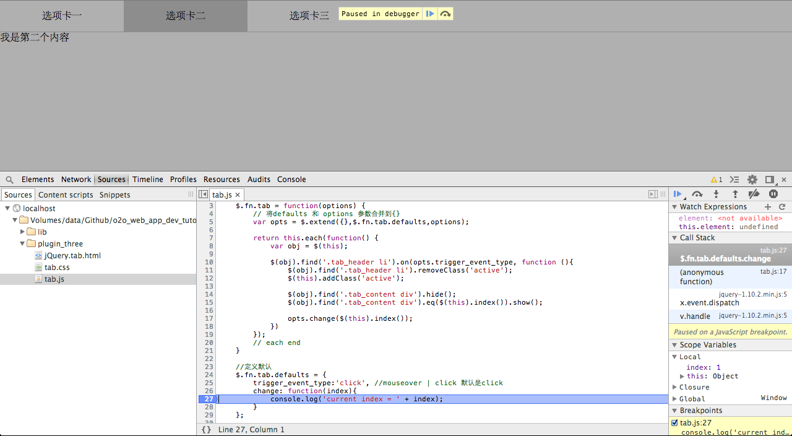

# jQuery 插件配置项

## 1.5\. jQuery 插件配置项

这其实算一个高级话题：

*   会用 jquery 是第一阶段
*   能抽象成插件是第二阶段
*   让插件足够灵活强大是第三阶段

代码位于 plugin_second

配置项分 2 类

*   普通配置项
*   回调函数

### 1.5.1\. 迭代 1：普通配置项

回顾一下之前 tab，发现我们的 tab 是只能鼠标移动到上面才能切换，那是不是所有 tab 都这样呢？ 当然不是了，我们看到很多网站的 tab 都是点击切换的，那么我们如何能让我们的 tab 支持这 2 种方式呢？

### 1.5.2\. 支持 tab 触发事件选项

```js
;(function($) { 

    $.fn.tab = function(options) {
        // 将 defaults 和 options 参数合并到{}
        var opts = $.extend({},$.fn.tab.defaults,options);

        return this.each(function() {
            var obj = $(this);

            $(obj).find('.tab_header li').on(opts.trigger_event_type, function (){
                $(obj).find('.tab_header li').removeClass('active');
                $(this).addClass('active');

                $(obj).find('.tab_content div').hide();
                $(obj).find('.tab_content div').eq($(this).index()).show();
            })      
        });
        // each end
    }

    //定义默认
    $.fn.tab.defaults = {
        trigger_event_type:'click', //mouseover | click 默认是 click
    };

})(jQuery); 
```

这就是普通配置项的例子，配置项的值是 js 支持的类型

### 1.5.3\. 示例 1

首先看一下 plugin_second/jQuery.tab.html 它没有任何变化

```js
<script>
    $(function(){
        $('.tab').tab();
    });
</script> 
```

默认项是 click，所以这个 tab 只能点击

### 1.5.4\. 示例 2

看一下 plugin_second/jQuery.tab_more.html，第一个 tab 只能点击，第二个 tab 只能鼠标划过

```js
<script>
    $(function(){
        $('.tab_click').tab({
            trigger_event_type:'click', //mouseover | click 默认是 click
        });
        $('.tab_mouseover').tab({
            trigger_event_type:'mouseover', //mouseover | click 默认是 click
        });
    });
</script> 
```

这里补充一点：第一个 tab 完全和例子一样，既然默认项都是 click，再写的话就真有点 ***脱裤子放屁-多此一举*** 了

plugin_2

### 1.5.5\. 迭代 2：回调函数

jquery_plugin/plugin_three

既然用 tab，就是利用它可以在一个地方显示多个内容，点击的时候切换对应的 tab content，tab 内容不可能都是静态的，那么这时候怎么办？

是不是应该在点击的时候更改内容呢？答案是回调函数，笨啦，前面不是说配置项有 2 种么？

### 1.5.6\. 回调函数

这就是普通配置项的例子，配置项的值是 js 支持的类型

```js
;(function($) { 

    $.fn.tab = function(options) {
        // 将 defaults 和 options 参数合并到{}
        var opts = $.extend({},$.fn.tab.defaults,options);

        return this.each(function() {
            var obj = $(this);

            $(obj).find('.tab_header li').on(opts.trigger_event_type, function (){
                $(obj).find('.tab_header li').removeClass('active');
                $(this).addClass('active');

                $(obj).find('.tab_content div').hide();
                $(obj).find('.tab_content div').eq($(this).index()).show();

                opts.change($(this).index());
            })      
        });
        // each end
    }

    //定义默认
    $.fn.tab.defaults = {
        trigger_event_type:'click', //mouseover | click 默认是 click
        change: function(index){
            console.log('current index = ' + index);
        }
    };

})(jQuery); 
```

### 1.5.7\. 生效了么？

打开 jquery_plugin/plugin_three/jQuery.tab.html



### 1.5.8\. 变动

1.  增加了 change 配置项

```js
``` 
```js

//定义默认 $.fn.tab.defaults = { ...... change: function(index){ console.log('current index = ' + index); } };

```
```js 
```

1.  在插件内部调用了此回调函数

```js
``` 
```js

return this.each(function() { var obj = $(this);

```
 $(obj).find('.tab_header li').on(opts.trigger_event_type, function (){
        ......

        opts.change($(this).index());
    })      
});
```js 
```

### 1.5.9\. 回调函数最需要注意的问题

*   调用场合，在什么地方调用，这是生命周期的核心问题
*   参数，确保在调用处有这些值
*   回调函数也要有默认行为的

plugin_3

### 1.5.10\. 总结

| 配置项类型 | 数据类型 | 特点 |
| --- | --- | --- |
| 普通配置项 | js 基本类型 | 不可变 |
| 回调函数配置项 | 函数 | 可变行为 |

### 1.5.11\. 迭代 3：重构代码

jquery_plugin/plugin_four

plugin_4

```js
;(function($) { 

    /**
     * 公共函数: 初始化 tab 出发事件
     */ 
    function init_tab_trigger_event(container,opts) {
        $(container).find('.tab_header li').on(opts.trigger_event_type, function (){
            $(container).find('.tab_header li').removeClass('active');
            $(this).addClass('active');

            $(container).find('.tab_content div').hide();
            $(container).find('.tab_content div').eq($(this).index()).show();

            opts.change($(this).index());
        })      
    }

    /**
     * 公共函数: 初始化 tab 出发事件
     */
    function init_with_config(opts){
        _init_aaa_with_config(opts);

        _init_bbb_with_config(opts);

        _init_ccc_with_config(opts);
    }

    /**
     * 私有函数
     */
    function _init_aaa_with_config(opts){

    }

    function _init_bbb_with_config(opts){

    }

    function _init_ccc_with_config(opts){

    }

    $.fn.tab = function(options) {
        // 将 defaults 和 options 参数合并到{}
        var opts = $.extend({},$.fn.tab.defaults,options);

        return this.each(function() {
            var obj = $(this);

            // 根据配置进行初始化
            init_with_config(opts);

            // 初始化 tab 出发事件
            init_tab_trigger_event(obj,opts);
        });
        // each end
    }

    //定义默认
    $.fn.tab.defaults = {
        trigger_event_type:'click', //mouseover | click 默认是 click
        change: function(index){
            console.log('current index = ' + index);
        }
    };

})(jQuery); 
```

### 1.5.12\. 将插件核心逻辑，抽象成公共函数

```js
return this.each(function() {
    var obj = $(this);

    // 根据配置进行初始化
    init_with_config(opts);

    // 初始化 tab 出发事件
    init_tab_trigger_event(obj,opts);
}); 
```

### 1.5.13\. 将大的公共函数拆解成 n 个私有函数

```js
/**
 * 公共函数: 初始化 tab 出发事件
 */
function init_with_config(opts) {
    // 调用私有函数
    _init_aaa_with_config(opts);

    // 调用私有函数
    _init_bbb_with_config(opts);

    // 调用私有函数
    _init_ccc_with_config(opts);
}

/**
 * 私有函数
 */
function _init_aaa_with_config(opts) {

}

function _init_bbb_with_config(opts) { 

}

function _init_ccc_with_config(opts) {

} 
```

### 1.5.14\. 注意注释和编码规范

函数注释

```js
/**
 * 私有函数
 */
function _init_aaa_with_config(opts) {

} 
```

函数内注释

```js
// 调用私有函数
_init_ccc_with_config(opts); 
```

函数体前面加一个空格