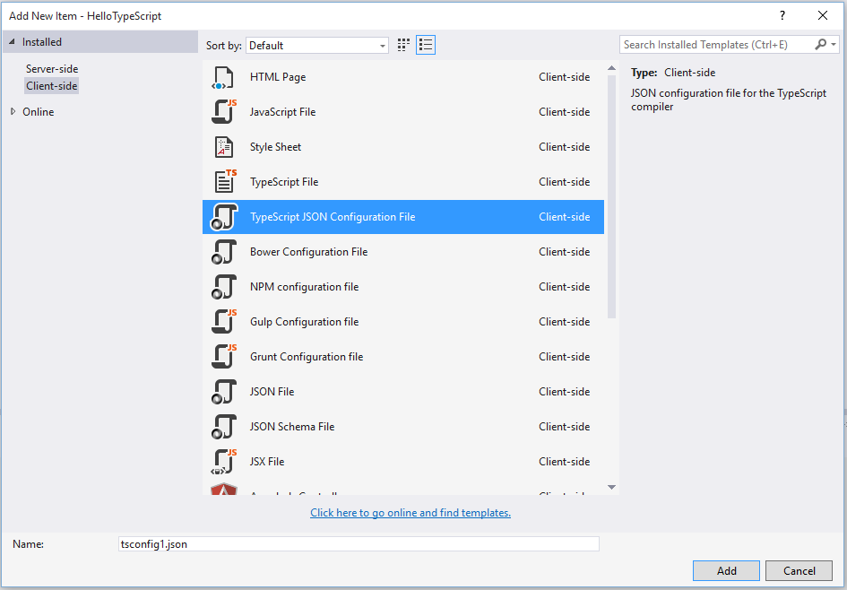
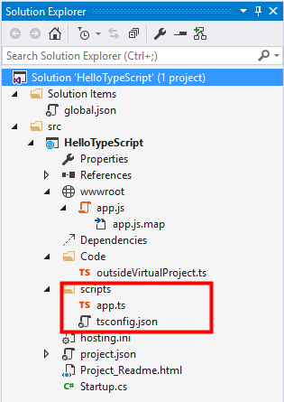

# tsconfig.json

## 概述

如果一个目录下存在一个`tsconfig.json`文件，那么它意味着这个目录是 TypeScript 项目的根目录。 `tsconfig.json`文件中指定了用来编译这个项目的根文件和编译选项。 `tsconfig.json`从 TypeScript 1.5 开始支持。 一个项目可以通过以下方式之一来编译：

## 使用 tsconfig.json

*   不带任何输入文件的情况下调用`tsc`，编译器会从当前目录开始去查找`tsconfig.json`文件，逐级向上搜索父目录。
*   不带任何输入文件的情况下调用`tsc`，且使用命令行参数`-project`（或`-p`）指定一个包含`tsconfig.json`文件的目录。

当命令行上指定了输入文件时，`tsconfig.json`文件会被忽略。

## 示例

`tsconfig.json`示例文件:

*   使用`"files"`属性

```js
{
    "compilerOptions": {
        "module": "commonjs",
        "noImplicitAny": true,
        "removeComments": true,
        "preserveConstEnums": true,
        "out": "../../built/local/tsc.js",
        "sourceMap": true
    },
    "files": [
        "core.ts",
        "sys.ts",
        "types.ts",
        "scanner.ts",
        "parser.ts",
        "utilities.ts",
        "binder.ts",
        "checker.ts",
        "emitter.ts",
        "program.ts",
        "commandLineParser.ts",
        "tsc.ts",
        "diagnosticInformationMap.generated.ts"
    ]
} 
```

*   使用`"exclude"`属性

```js
{
    "compilerOptions": {
        "module": "commonjs",
        "noImplicitAny": true,
        "removeComments": true,
        "preserveConstEnums": true,
        "out": "../../built/local/tsc.js",
        "sourceMap": true
    },
    "exclude": [
        "node_modules",
        "wwwroot"
    ]
} 
```

## 细节

`"compilerOptions"`可以被忽略，这时编译器会使用默认值。在这里查看完整的编译器选项列表。

如果`tsconfig.json`没有提供`"files"`属性，编译器会默认包含当前目录及子目录下的所有 TypeScript 文件（`*.ts` 或 `*.tsx`）。 如果提供了`"files"`属性值，只有指定的文件会被编译。

如果指定了`"exclude"`选项，编译器会包含当前目录及子目录下的所有 TypeScript 文件（`*.ts` 或 `*.tsx`），不包括这些指定要排除的文件。

`"files"`选项不能与`"exclude"`选项同时使用。如果同时指定了两个选项的话，只有`"files"`会生效。

所有被`"files"`属性里的文件所引用的文件同样会被包含进来。 就好比，`A.ts`引用了`B.ts`，因此`B.ts`不能被排除，除非引用它的`A.ts`在`"exclude"`列表中。

`tsconfig.json`可以是个空文件，那么编译器则使用默认编译选项，编译当前目录及其子目录下的所有文件。

命令行上提供的编译选项会覆盖`tsconfig.json`文件中的对应选项。

## 模式

到这里查看模式: [`json.schemastore.org/tsconfig`](http://json.schemastore.org/tsconfig)

# 编译选项

## 编译选项

| 选项 | 简写 | 描述 |
| --- | --- | --- |
| `--declaration` | `-d` | 生成相应的'.d.ts'文件。 |
| `--help` | `-h` | 打印帮助信息。 |
| `--version` | `-v` | 打印编译器版本号。 |
| `--module` | `-m` | 指定生成哪个模块系统代码：'commonjs'，'amd'，'system'，或 'umd'。只有'amd'和'system'能和`--outFile`一起使用。 |
| `--project` | `-p` | 编译指定目录下的项目。这个目录应该包含一个`tsconfig.json`文件来管理编译。查看 tsconfig.json 文档了解更多信息。 |
| `--target` | `-t` | 指定 ECMAScript 目标版本'ES3' (默认)，'ES5'，或'ES6'^([1]) |
| `--watch` | `-w` | 在监视模式下运行编译器。会监视输出文件，在它们改变时重新编译。 |
| `--charset` |  | 输入文件的字符集。 |
| `--diagnostics` |  | 显示诊断信息。 |
| `--emitBOM` |  | 在输出文件的开头加入 BOM 头（UTF-8 Byte Order Mark）。 |
| `--emitDecoratorMetadata`^([1]) |  | 给源码里的装饰器声明加上设计类型元数据。查看[issue #2577](https://github.com/Microsoft/TypeScript/issues/2577)了解更多信息。 |
| `--inlineSourceMap` |  | 生成单个 sourcemaps 文件，而不是将每 sourcemaps 生成不同的文件。 |
| `--inlineSources` |  | 将代码与 sourcemaps 生成到一个文件中，要求同时设置了`--inlineSourceMap`属性。 |
| `--isolatedModules` |  | 无条件地给没有解析的文件生成 imports。 |
| `--jsx` |  | 在'.tsx'文件里支持 JSX：'React' 或 'Preserve'。查看 JSX。 |
| `--listFiles` |  | 编译过程中打印文件名。 |
| `--locale` |  | 显示错误信息时使用的语言，比如：en-us。 |
| `--mapRoot` |  | 为调试器指定指定 sourcemap 文件的路径，而不是使用生成时的路径。当`.map`文件是在运行时指定的，并不同于`js`文件的地址时使用这个标记。指定的路径会嵌入到`sourceMap`里告诉调试器到哪里去找它们。 |
| `--moduleResolution`^([1]) |  | 决定如何处理模块。或者是'node'对于 Node.js/io.js，或者是'classic'（默认）。 |
| `--newLine` |  | 当生成文件时指定行结束符：'CRLF'（dos）或 'LF' （unix）。 |
| `--noEmit` |  | 不生成输出文件。 |
| `--noEmitOnError` |  | 报错时不生成输出文件。 |
| `--noEmitHelpers` |  | 不在输出文件中生成用户自定义的帮助函数代码，如`__extends`。 |
| `--noImplicitAny` |  | 在表达式和声明上有隐含的'any'类型时报错。 |
| `--noLib` |  | 不包含默认的库文件（lib.d.ts）。 |
| `--noResolve` |  | 不把`/// <reference``>`或模块导入的文件加到编译文件列表。 |
| `--out` |  | 弃用。使用 `--outFile` 代替。 |
| `--outDir` |  | 重定向输出目录。 |
| `--outFile` |  | 将输出文件合并为一个文件。合并的顺序是根据传入编译器的文件顺序和`///<reference``>`和`import`的文件顺序决定的。查看输出文件顺序文件了解详情。 |
| `--preserveConstEnums` |  | 保留`const`和`enum`声明。查看[const enums documentation](https://github.com/Microsoft/TypeScript/blob/master/doc/spec.md#94-constant-enum-declarations)了解详情。 |
| `--removeComments` |  | 删除所有注释，除了以`/!*`开头的版权信息 |
| `--rootDir` |  | 仅用来控制输出的目录结构`--outDir`。 |
| `--sourceMap` |  | 生成相应的'.map'文件。 |
| `--sourceRoot` |  | 指定 TypeScript 源文件的路径，以便调试器定位。当 TypeScript 文件的位置是在运行时指定时使用此标记。路径信息会被加到`sourceMap`里。 |
| `--stripInternal`^([1]) |  | 不对具有`/** @internal */` JSDoc 注解的代码生成代码。 |
| `--suppressImplicitAnyIndexErrors` |  | 阻止`--noImplicitAny`对缺少索引签名的索引对象报错。查看[issue #1232](https://github.com/Microsoft/TypeScript/issues/1232#issuecomment-64510362)了解详情。 |

^([1]) 这些选项是试验性的。

## 相关信息

*   对于 tsconfig.json 请查看 tsconfig.json
*   针对如何在 MSBuild 项目里使用编译器选项请查看在 MSBuild 项目里设置编译器选项

# 在 MSBuild 里使用编译选项

## 概述

编译选项可以在使用 MSBuild 的项目里通过 MSBuild 属性指定。

## 例子

```js
 <PropertyGroup Condition="'$(Configuration)' == 'Debug'">
    <TypeScriptRemoveComments>false</TypeScriptRemoveComments>
    <TypeScriptSourceMap>true</TypeScriptSourceMap>
  </PropertyGroup>
  <PropertyGroup Condition="'$(Configuration)' == 'Release'">
    <TypeScriptRemoveComments>true</TypeScriptRemoveComments>
    <TypeScriptSourceMap>false</TypeScriptSourceMap>
  </PropertyGroup>
  <Import Project="$(MSBuildExtensionsPath32)\Microsoft\VisualStudio\v$(VisualStudioVersion)\TypeScript\Microsoft.TypeScript.targets"
          Condition="Exists('$(MSBuildExtensionsPath32)\Microsoft\VisualStudio\v$(VisualStudioVersion)\TypeScript\Microsoft.TypeScript.targets')" /> 
```

## 映射

| 编译选项 | MSBuild 属性名称 | 可用值 |
| --- | --- | --- |
| `--declaration` | TypeScriptGeneratesDeclarations | 布尔值 |
| `--module` | TypeScriptModuleKind | `AMD`, `CommonJs`, `UMD` 或 `System` |
| `--target` | TypeScriptTarget | `ES3`, `ES5`, or `ES6` |
| `--charset` | TypeScriptCharset |  |
| `--emitBOM` | TypeScriptEmitBOM | 布尔值 |
| `--emitDecoratorMetadata` | TypeScriptEmitDecoratorMetadata | 布尔值 |
| `--experimentalDecorators` | TypeScriptExperimentalDecorators | 布尔值 |
| `--inlineSourceMap` | TypeScriptInlineSourceMap | 布尔值 |
| `--inlineSources` | TypeScriptInlineSources | 布尔值 |
| `--locale` | *自动的* | 自动设置成 PreferredUILang 的值 |
| `--mapRoot` | TypeScriptMapRoot | 文件路径 |
| `--newLine` | TypeScriptNewLine | `CRLF` 或 `LF` |
| `--noEmitOnError` | TypeScriptNoEmitOnError | 布尔值 |
| `--noEmitHelpers` | TypeScriptNoEmitHelpers | 布尔值 |
| `--noImplicitAny` | TypeScriptNoImplicitAny | 布尔值 |
| `--noLib` | TypeScriptNoLib | 布尔值 |
| `--noResolve` | TypeScriptNoResolve | 布尔值 |
| `--out` | TypeScriptOutFile | 文件路径 |
| `--outDir` | TypeScriptOutDir | 文件路径 |
| `--preserveConstEnums` | TypeScriptPreserveConstEnums | 布尔值 |
| `--removeComments` | TypeScriptRemoveComments | 布尔值 |
| `--rootDir` | TypeScriptRootDir | 文件路径 |
| `--isolatedModules` | TypeScriptIsolatedModules | 布尔值 |
| `--sourceMap` | TypeScriptSourceMap | 文件路径 |
| `--sourceRoot` | TypeScriptSourceRoot | 文件路径 |
| `--suppressImplicitAnyIndexErrors` | TypeScriptSuppressImplicitAnyIndexErrors | 布尔值 |
| `--suppressExcessPropertyErrors` | TypeScriptSuppressExcessPropertyErrors | 布尔值 |
| `--moduleResolution` | TypeScriptModuleResolution | `Classic` or `NodeJs` |
| `--jsx` | TypeScriptJSXEmit | `React` or `Preserve` |
| `--project` | *VS 不支持* |  |
| `--watch` | *VS 不支持* |  |
| `--diagnostics` | *VS 不支持* |  |
| `--listFiles` | *VS 不支持* |  |
| `--noEmit` | *VS 不支持* |  |
| *VS 特有选项* | TypeScriptAdditionalFlags | *任意编译选项* |

## 我使用的 Visual Studio 版本里支持哪些选项

查找 `C:\Program Files (x86)\MSBuild\Microsoft\VisualStudio\v$(VisualStudioVersion)\TypeScript\Microsoft.TypeScript.targets` 文件。 可用的 MSBuild XML 标签与相应的`tsc`编译选项的映射都在那里。

# 与其它构建工具整合

# Browserify

### 安装

```js
npm install tsify 
```

### 使用命令行交互

```js
browserify main.ts -p [ tsify --noImplicitAny ] > bundle.js 
```

### 使用 API

```js
var browserify = require("browserify");
var tsify = require("tsify");

browserify()
    .add('main.ts')
    .plugin('tsify', { noImplicitAny: true })
    .bundle()
    .pipe(process.stdout); 
```

更多详细信息：[smrq/tsify](https://github.com/smrq/tsify)

# Duo

### 安装

```js
npm install duo-typescript 
```

### 使用命令行交互

```js
duo --use duo-typescript entry.ts 
```

### 使用 API

```js
var Duo = require('duo');
var fs = require('fs')
var path = require('path')
var typescript = require('duo-typescript');

var out = path.join(__dirname, "output.js")

Duo(__dirname)
    .entry('entry.ts')
    .use(typescript())
    .run(function (err, results) {
        if (err) throw err;
        // Write compiled result to output file
        fs.writeFileSync(out, results.code);
    }); 
```

更多详细信息：[frankwallis/duo-typescript](https://github.com/frankwallis/duo-typescript)

# Grunt

### 安装

```js
npm install grunt-ts 
```

### 基本 Gruntfile.js

```js
module.exports = function(grunt) {
    grunt.initConfig({
        ts: {
            default : {
                src: ["**/*.ts", "!node_modules/**/*.ts"]
            }
        }
    });
    grunt.loadNpmTasks("grunt-ts");
    grunt.registerTask("default", ["ts"]);
}; 
```

更多详细信息：[TypeStrong/grunt-ts](https://github.com/TypeStrong/grunt-ts)

# gulp

### 安装

```js
npm install gulp-typescript 
```

### 基本 gulpfile.js

```js
var gulp = require("gulp");
var ts = require("gulp-typescript");

gulp.task("default", function () {
    var tsResult = gulp.src("src/*.ts")
        .pipe(ts({
              noImplicitAny: true,
              out: "output.js"
        }));
    return tsResult.js.pipe(gulp.dest('built/local'));
}); 
```

更多详细信息：[ivogabe/gulp-typescript](https://github.com/ivogabe/gulp-typescript)

# jspm

### 安装

```js
npm install -g jspm@beta 
```

*注意：目前 jspm 的 0.16beta 版本支持 TypeScript*

更多详细信息：[TypeScriptSamples/jspm](https://github.com/Microsoft/TypeScriptSamples/tree/jspm/jspm)

# webpack

### 安装

```js
npm install ts-loader --save-dev 
```

### 基本 webpack.config.js

```js
module.exports = {
    entry: "./src/index.tsx",
    output: {
        filename: "bundle.js"
    },
    resolve: {
        // Add '.ts' and '.tsx' as a resolvable extension.
        extensions: ["", ".webpack.js", ".web.js", ".ts", ".tsx", ".js"]
    },
    module: {
        loaders: [
            // all files with a '.ts' or '.tsx' extension will be handled by 'ts-loader'
            { test: /\.tsx?$/, loader: "ts-loader" }
        ]
    }
}; 
```

查看[更多关于 ts-loader 的详细信息](https://www.npmjs.com/package/ts-loader)

或者

*   [awesome-typescript-loader](https://www.npmjs.com/package/awesome-typescript-loader)

# MSBuild

更新工程文件，包含本地安装的`Microsoft.TypeScript.Default.props`（在顶端）和`Microsoft.TypeScript.targets`（在底部）文件：

```js
<?xml version="1.0" encoding="utf-8"?>
<Project ToolsVersion="4.0" DefaultTargets="Build" xmlns="http://schemas.microsoft.com/developer/msbuild/2003">
  <!-- Include default props at the bottom -->
  <Import
      Project="$(MSBuildExtensionsPath32)\Microsoft\VisualStudio\v$(VisualStudioVersion)\TypeScript\Microsoft.TypeScript.Default.props"
      Condition="Exists('$(MSBuildExtensionsPath32)\Microsoft\VisualStudio\v$(VisualStudioVersion)\TypeScript\Microsoft.TypeScript.Default.props')" />

  <!-- TypeScript configurations go here -->
  <PropertyGroup Condition="'$(Configuration)' == 'Debug'">
    <TypeScriptRemoveComments>false</TypeScriptRemoveComments>
    <TypeScriptSourceMap>true</TypeScriptSourceMap>
  </PropertyGroup>
  <PropertyGroup Condition="'$(Configuration)' == 'Release'">
    <TypeScriptRemoveComments>true</TypeScriptRemoveComments>
    <TypeScriptSourceMap>false</TypeScriptSourceMap>
  </PropertyGroup>

  <!-- Include default targets at the bottom -->
  <Import
      Project="$(MSBuildExtensionsPath32)\Microsoft\VisualStudio\v$(VisualStudioVersion)\TypeScript\Microsoft.TypeScript.targets"
      Condition="Exists('$(MSBuildExtensionsPath32)\Microsoft\VisualStudio\v$(VisualStudioVersion)\TypeScript\Microsoft.TypeScript.targets')" />
</Project> 
```

关于配置 MSBuild 编译器选项的更多详细信息，请参考：在 MSBuild 里使用编译选项

# NuGet

*   右键点击 -> Manage NuGet Packages
*   查找`Microsoft.TypeScript.MSBuild`
*   点击`Install`
*   安装完成后，Rebuild。

更多详细信息请参考[Package Manager Dialog](http://docs.nuget.org/Consume/Package-Manager-Dialog)和[using nightly builds with NuGet](https://github.com/Microsoft/TypeScript/wiki/Nightly-drops#using-nuget-with-msbuild)

# NPM 包的类型

TypeScript 编译器处理 nodejs 模块名时使用的是[Node.js 模块解析算法](https://nodejs.org/api/modules.html#modules_all_together)。 TypeScript 编译器可以同时加载与 npm 包绑在一起的类型信息。 编译通过下面的规则来查找`"foo"`模块的类型信息：

1.  尝试加载相应代码包目录下`package.json`文件（`node_modules/foo/`）。

如果存在，从`"typings"`字段里读取类型文件的路径。比如，在下面的`package.json`里，编译器会认为类型文件位于`node_modules/foo/lib/foo.d.ts`。

```js
{
    "name": "foo",
    "author": "Vandelay Industries",
    "version": "1.0.0",
    "main": "./lib/foo.js",
    "typings": "./lib/foo.d.ts"
} 
```

1.  尝试加载在相应代码包目录下的名字为`index.d.ts`的文件（`node_modules/foo/`） - 这个文件应该包含了这个代码包的类型信息。

解析模块的详细算法可以在[这里](https://github.com/Microsoft/TypeScript/issues/2338)找到。

### 类型信息文件应该是什么样子的

*   是一个`.d.ts`文件
*   是一个外部模块
*   不包含`///<reference>`引用

基本的原理是类型文件不能引入新的可编译代码； 否则真正的实现文件就可能会在编译时被重盖。 另外，**加载类型信息不应该污染全局空间**，当从同一个库的不同版本中引入潜在冲突的实体的时候。

# TypeScript 里的 this

## 介绍

在 JavaScript 里（还有 TypeScript），`this`关键字的行为与其它语言相比大为不同。这可能会很令人吃惊，特别是对于那些使用其它语言的用户凭借其直觉来想象`this`关键字的行为。

这篇文章会教你怎么识别及调试 TypeScript 里的`this`问题，并且提供了一些解决方案和各自的利弊。

## 典型症状和危险系数

丢失`this`上下文的典型症状包含：

*   类的某字段（`this.foo`）为`undefined`，但其它值没有问题
*   `this`的值指向全局的`window`对象而不是类实例对象（在非严格模式下）
*   `this`的值为`undefined`而不是类实例对象（严格模式下）
*   调用类方法（`this.doBa()`）失败，错误信息如“TypeError: undefined is not a function”，“Object doesn't support property or method 'doBar'”或“this.doBar is not a function”

下面的代码应该出现在程序中：

*   事件监听，比如`window.addEventListener('click', myClass.doThing);`
*   Promise 解决，比如`myPromise.then(myClass.theNextThing);`
*   第三方库回调，比如`$(document).ready(myClass.start);`
*   函数回调，比如`someArray.map(myClass.convert)`
*   ViewModel 类型的库里的类，比如`<div data-bind="click: myClass.doSomething">`
*   可选包里的函数，比如`$.ajax(url, { success: myClass.handleData })`

## JavaScript 里的`this`究竟是什么？

已经有大量的文章讲述了 JavaScript 里`this`关键字的危险性。查看[这里](http://www.quirksmode.org/js/this.html)，[this one](http://javascriptissexy.com/understand-javascripts-this-with-clarity-and-master-it/)，或[这里](http://bjorn.tipling.com/all-this)。

当 JavaScript 里的一个函数被调用时，你可以按照下面的顺序来推断出`this`指向的是什么（这些规则是按优先级顺序排列的）：

*   如果这个函数是`function#bind`调用的结果，那么`this`指向的是传入`bind`的参数
*   如果函数是以`foo.func()`形式调用的，那么`this`值为`foo`
*   如果是在严格模式下，`this`将为`undefined`
*   否则，`this`将是全局对象（浏览器环境里为`window`）

这些规则会产生与直觉相反的效果。比如：

```js
class Foo {
  x = 3;
  print() {
    console.log('x is ' + this.x);
  }
}

var f = new Foo();
f.print(); // Prints 'x is 3' as expected

// Use the class method in an object literal
var z = { x: 10, p: f.print };
z.p(); // Prints 'x is 10'

var p = z.p;
p(); // Prints 'x is undefined' 
```

## `this`的危险信号

你要注意地最大的危险信号是*在要使用类的方法时没有立即调用它*。任何时候你看到类方法被*引用了*却没有使用相同的表达式来*调用*时，`this`可能已经不对了。

例子：

```js
var x = new MyObject();
x.printThing(); // SAFE, method is invoked where it is referenced

var y = x.printThing; // DANGER, invoking 'y()' may not have correct 'this'

window.addEventListener('click', x.printThing, 10); // DANGER, method is not invoked where it is referenced

window.addEventListener('click', () => x.printThing(), 10); // SAFE, method is invoked in the same expression 
```

## 修复

可以通过一些方法来保持`this`的上下文。

### 使用实例函数

代替 TypeScript 里默认的*原型*方法，你可以使用一个*实例箭头函数*来定义类成员：

```js
class MyClass {
    private status = "blah";

    public run = () => { // <-- note syntax here
        alert(this.status);
    }
}
var x = new MyClass();
$(document).ready(x.run); // SAFE, 'run' will always have correct 'this' 
```

*   好与坏：这会创建额外的闭包对于每个类实例的每个方法。如果这个方法通常是正常调用的，那么这么做有点过了。然而，它经常会在回调函数里调用，让类实例捕获到`this`上下文会比在每次调用时都创建一个闭包来得更有效率一些。
*   好：其它外部使用者不可能忘记处理`this`上下文
*   好：在 TypeScript 里是类型安全的
*   好：如果函数带参数不需要额外的工作
*   坏：派生类不能通过使用`super`调用基类方法
*   坏：在类与用户之前产生了额外的非类型安全的约束：明确了哪些方法提前绑定了以及哪些没有

### 本地的胖箭头

在 TypeScrip 里（这里为了讲解添加了一些参数） :

```js
var x = new SomeClass();
someCallback((n, m) => x.doSomething(n, m)); 
```

*   好与坏：内存/效能上的利弊与实例函数相比正相反
*   好：在 TypeScript，100%的类型安全
*   好：在 ECMAScript 3 里同样生效
*   好：你只需要输入一次实例名
*   坏：你要输出 2 次参数名
*   坏：对于可变参数不起作用（'rest'）

### Function.bind

```js
var x = new SomeClass();
// SAFE: Functions created from function.bind are always preserve 'this'
window.setTimeout(x.someMethod.bind(x), 100); 
```

*   好与坏：内存/效能上的利弊与实例函数相比正相反
*   好：如果函数带参数不需要额外的工作
*   坏：目前在 TypeScript 里，不是类型安全的
*   坏：只在 ECMAScript 5 里生效
*   坏：你要输入 2 次实例名

# 编码规范

这个编码规范是给 TypeScript 开发团队在开发 TypeScript 时使用的。 对于使用 TypeScript 的普通用户来说不一定适用，但是可以做为一个参考。

## 命名

1.  使用 PascalCase 为类型命名。
2.  不要使用`I`做为接口名前缀。
3.  使用 PascalCase 为枚举值命名。
4.  使用 camelCase 为函数命名。
5.  使用 camelCase 为属性或本地变量命名。
6.  不要为私有属性名添加`_`前缀。
7.  尽可能使用完整的单词拼写命名。

## 组件

1.  1 个文件对应一个逻辑组件 （比如：解析器，检查器）。
2.  不要添加新的文件。 :)
3.  `.generated.*`后缀的文件是自动生成的，不要手动改它。

## 类型

1.  不要导出类型/函数，除非你要在不同的组件中共享它。
2.  不要在全局命名空间内定义类型/值。
3.  共享的类型应该在`types.ts`里定义。
4.  在一个文件里，类型定义应该出现在顶部。

## `null` 和 `undefined`：

1.  使用 **undefined**，不要使用 null。

## 一般假设

1.  假设像 Nodes，Symbols 等这样的对象在定义它的组件外部是不可改变的。不要去改变它们。
2.  假设数组是不能改变的。

## 类

1.  为了保持一致，在核心编译链中不要使用类，使用函数闭包代替。

## 标记

1.  一个类型中有超过 2 个布尔属性时，把它变成一个标记。

## 注释

为函数，接口，枚举类型和类使用 JSDoc 风格的注释。

## 字符串

1.  使用双引号`""`
2.  所有要展示给用户看的信息字符串都要做好本地化工作（在 diagnosticMessages.json 中创建新的实体）。

## 错误提示信息

1.  在句子结尾使用`.`。
2.  对不确定的实体使用不定冠词。
3.  确切的实体应该使用名字（变量名，类型名等）
4.  当创建一条新的规则时，主题应该使用单数形式（比如：An external module cannot...而不是 External modules cannot）。
5.  使用现在时态。

## 错误提示信息代码

提示信息被划分类成了一般的区间。如果要新加一个提示信息，在上条代码上加 1 做为新的代码。

*   1000 语法信息
*   2000 语言信息
*   4000 声明生成信息
*   5000 编译器选项信息
*   6000 命令行编译器信息
*   7000 noImplicitAny 信息

## 普通方法

由于种种原因，我们避免使用一些方法，而使用我们自己定义的。

1.  不使用 ECMAScript 5 函数；而是使用[core.ts](https://github.com/Microsoft/TypeScript/blob/master/src/compiler/core.ts)这里的。
2.  不要使用`for..in`语句；而是使用`ts.forEach`，`ts.forEachKey`和`ts.forEachValue`。注意它们之间的区别。
3.  如果可能的话，尝试使用`ts.forEach`，`ts.map`和`ts.filter`代替循环。

## 风格

1.  使用 arrow 函数代替匿名函数表达式。
2.  只要需要的时候才把 arrow 函数的参数括起来。
    比如，`(x) => x + x`是错误的，下面是正确的做法：

    1.  `x => x + x`
    2.  `(x,y) => x + y`
    3.  `<T>(x: T, y: T) => x === y`
3.  总是使用`{}`把循环体和条件语句括起来。

4.  开始的`{`总是在同一行。
5.  小括号里开始不要有空白.
    逗号，冒号，分号后要有一个空格。比如：

    1.  `for (var i = 0, n = str.length; i < 10; i++) { }`
    2.  `if (x < 10) { }`
    3.  `function f(x: number, y: string): void { }`
6.  每个变量声明语句只声明一个变量
    （比如 使用 `var x = 1; var y = 2;` 而不是 `var x = 1, y = 2;`）。

7.  `else`要在结束的`}`后另起一行。

# 常见编译错误

# 介绍

下面列出了一些在使用 TypeScript 语言和编译器过程中常见的容易让人感到困惑的错误信息。

# 令人困惑的常见错误

## "tsc.exe" exited with error code 1

*修复：*

*   检查文件编码，确保为 UTF-8 - [`typescript.codeplex.com/workitem/1587`](https://typescript.codeplex.com/workitem/1587)

## external module XYZ cannot be resolved

*修复：*

*   检查模块路径是否大小写敏感 - [`typescript.codeplex.com/workitem/2134`](https://typescript.codeplex.com/workitem/2134)

# 支持 TypeScript 的编辑器

# 快捷列表

*   Atom
*   Eclipse
*   Emacs
*   NetBeans
*   Sublime Text
*   TypeScript Builder
*   Vim
*   Visual Studio
*   Visual Studio Code
*   WebStorm

# Atom

[Atom-TypeScript](https://atom.io/packages/atom-typescript)，由 TypeStrong 开发的针对 Atom 的 TypeScript 语言服务。

# Eclipse

[Eclipse TypeScript 插件](https://github.com/palantir/eclipse-typescript)，由 Palantir 开发的 Eclipse 插件。

# Emacs

[tide](https://github.com/ananthakumaran/tide) - TypeScript Interactive Development Environment for Emacs

# NetBeans

*   [nbts](https://github.com/Everlaw/nbts) - NetBeans TypeScript editor plugin
*   [Geertjan's TypeScript NetBeans Plugin](https://github.com/GeertjanWielenga/TypeScript)

# Sublime Text

[Sublime 的 TypeScript 插件](https://github.com/Microsoft/TypeScript-Sublime-Plugin)，可以通过[Package Control](https://packagecontrol.io/)来安装，支持 Sublime Text 2 和 Sublime Text 3.

# TypeScript Builder

[TypeScript Builder](http://www.typescriptbuilder.com/)，TypeScript 专用 IDE.

# Vim

### 语法高亮

*   [leafgarland/typescript-vim](https://github.com/leafgarland/typescript-vim)提供了语法文件用来高亮显示`.ts`和`.d.ts`。
*   [HerringtonDarkholme/yats.vim](https://github.com/HerringtonDarkholme/yats.vim)提供了更多语法高亮和 DOM 关键字。

### 语言服务工具

有两个主要的 TypeScript 插件：

*   [Quramy/tsuquyomi](https://github.com/Quramy/tsuquyomi)
*   [clausreinke/typescript-tools.vim](https://github.com/clausreinke/typescript-tools.vim)

如果你想要输出时自动补全功能，你可以安装[YouCompleteMe](https://github.com/Valloric/YouCompleteMe)并添加以下代码到`.vimrc`里，以指定哪些符号能用来触发补全功能。YouCompleteMe 会调用它们各自 TypeScript 插件来进行语义查询。

```js
if !exists("g:ycm_semantic_triggers")
  let g:ycm_semantic_triggers = {}
endif
let g:ycm_semantic_triggers['typescript'] = ['.'] 
```

# Visual Studio 2013/2015

[Visual Studio](https://www.visualstudio.com/)里安装 Microsoft Web Tools 时就带了 TypeScript。

TypeScript for Visual Studio 2015 在[这里](http://www.microsoft.com/en-us/download/details.aspx?id=48593)

TypeScript for Visual Studio 2013 在[这里](https://www.microsoft.com/en-us/download/details.aspx?id=48739)

# Visual Studio Code

[Visual Studio Code](https://code.visualstudio.com/)，是一个轻量级的跨平台编辑器，内置了对 TypeScript 的支持。

# Webstorm

[WebStorm](https://www.jetbrains.com/webstorm/)，同其它 JetBrains IDEs 一样，直接包含了对 TypeScript 的支持。

# 结合 ASP.NET v5 使用 TypeScript

与 ASP.NET v5 一起使用 TypeScript 需要你用特定的方式来设置你的工程。 更多关于 ASP.NET v5 的详细信息请查看[ASP.NET v5 文档](http://docs.asp.net/en/latest/conceptual-overview/index.html) 在 Visual Studio 的工程里支持当前的 tsconfig.json 还在开发之中，可以在这里查看进度[#3983](https://github.com/Microsoft/TypeScript/issues/3983)。

# 工程设置

我们就以在 Visual Studio 2015 里创建一个空的 ASP.NET v5 工程开始，如果你对 ASP.NET v5 还不熟悉，可以查看[这个教程](http://docs.asp.net/en/latest/tutorials/your-first-aspnet-application.html)。


然后在工程根目录下添加一个`scripts`目录。 这就是我们将要添加 TypeScript 文件和`tsconfig.json`文件来设置编译选项的地方。 请注意目录名和路径都必须这样才能正常工作。 添加`tsconfig.json`文件，右键点击`scripts`目录，选择`Add`，`New Item`。 在`Client-side`下，你能够找到它，如下所示。




最后我们还要将下面的选项添加到`tsconfig.json`文件的`"compilerOptions"`节点里，让编译器输出重定向到`wwwroot`文件夹：

```js
"outDir": "../wwwroot/" 
```

下面是配置好`tsconfig.json`后可能的样子

```js
{
    "compilerOptions": {
        "noImplicitAny": false,
        "noEmitOnError": true,
        "removeComments": false,
        "sourceMap": true,
        "target": "es5",
        "outDir": "../wwwroot"
    }
} 
```

现在如果我们构建这个工程，你就会注意到`app.js`和`app.js.map`文件被创建在`wwwroot`目录里。


## 工程与虚拟工程

当添加了一个`tsconfig.json`文件，你要明白很重要的一点是我们创建了一个虚拟 TypeScript 工程，在包含`tsconfig.json`文件的目录下。 被当作这个虚拟工程一部分的 TypeScript 文件是不会在保存的时候编译的。 在包含`tsconfig.json`文件的目录*外层*里存在的 TypeScript 文件*不会*被当作虚拟工程的一部分。 下图中，可以见到这个虚拟工程，在红色矩形里。



## 保存时编译

想要启用 ASP.NET v5 项目的*保存时编译*功能，你必须为不是虚拟 TypeScript 工程一部分的 TypeScript 文件启用*保存时编译*功能。 如果工程里存在`tsconfig.json`文件，那么模块类型选项的设置会被忽略。


# 架构概述

## 层次概述


*   **核心 TypeScript 编译器**

    *   **语法分析器（Parser）：** 以一系列原文件开始, 根据语言的语法, 生成抽象语法树（AST）

    *   **联合器（Binder）：** 使用一个`Symbol`将针对相同结构的声明联合在一起（例如：同一个接口或模块的不同声明，或拥有相同名字的函数和模块）。这能帮助类型系统推导出这些具名的声明。

    *   **类型解析器与检查器（Type resolver / Checker）：** 解析每种类型的构造，检查读写语义并生成适当的诊断信息。

    *   **生成器（Emitter）：** 从一系列输入文件（.ts 和.d.ts）生成输出，它们可以是以下形式之一：JavaScript（.js），声明（.d.ts），或者是 source maps（.js.map）。

    *   **预处理器（Pre-processor）：** “编译上下文”指的是某个“程序”里涉及到的所有文件。上下文的创建是通过检查所有从命令行上传入编译器的文件，按顺序，然后再加入这些文件直接引用的其它文件或通过`import`语句和`/// <reference path=... />`标签间接引用的其它文件。

沿着引用图走下来你会发现它是一个有序的源文件列表，它们组成了整个程序。 当解析导出（import）的时候，会优先选择“.ts”文件而不是“.d.ts”文件，以确保处理的是最新的文件。 编译器会进行与 Nodejs 相似的流程来解析导入，沿着目录链查找与将要导入相匹配的带.ts 或.d.ts 扩展名的文件。 导入失败不会报 error，因为可能已经声明了外部模块。

*   **独立编译器（tsc）：** 批处理编译命令行界面。主要处理针对不同支持的引擎读写文件（比如：Node.js）。

*   **语言服务：** “语言服务”在核心编译器管道上暴露了额外的一层，非常适合类编辑器的应用。

语言服务支持一系列典型的编辑器操作比如语句自动补全，函数签名提示，代码格式化和突出高亮，着色等。 基本的重构功能比如重命名，调试接口辅助功能比如验证断点，还有 TypeScript 特有的功能比如支持增量编译（在命令行上使用`--watch`）。 语言服务是被设计用来有效的处理在一个长期存在的编译上下文中文件随着时间改变的情况；在这样的情况下，语言服务提供了与其它编译器接口不同的角度来处理程序和源文件。

> 请参考 [[Using the Language Service API]] 以了解更多详细内容。

## 数据结构

*   **Node:** 抽象语法树（AST）的基本组成块。通常`Node`表示语言语法里的非终结符；一些终结符保存在语法树里比如标识符和字面量。

*   **SourceFile:** 给定源文件的 AST。`SourceFile`本身是一个`Node`；它提供了额外的接口用来访问文件的源码，文件里的引用，文件里的标识符列表和文件里的某个位置与它对应的行号与列号的映射。

*   **Program:** `SourceFile`的集合和一系列编译选项代表一个编译单元。`Program`是类型系统和生成代码的主入口。

*   **Symbol:** 具名的声明。`Symbols`是做为联合的结果而创建。`Symbols`连接了树里的声明节点和其它对同一个实体的声明。`Symbols`是语义系统的基本构建块。

*   **Type:** `Type`是语义系统的其它部分。`Type`可能被命名（比如，类和接口），或匿名（比如，对象类型）。

*   **Signature:** 一共有三种`Signature`类型：调用签名（call），构造签名（construct）和索引签名（index）。

## 编译过程概述

整个过程从预处理开始。 预处理器会算出哪些文件参与编译，它会去查找如下引用（`/// <reference path=... />`标签和`import`语句）。

语法分析器（Parser）生成抽象语法树（AST）`Node`. 这些仅为用户输出的抽象表现，以树的形式。 一个`SourceFile`对象表示一个给定文件的 AST 并且带有一些额外的信息如文件名及源文件内容。

然后，联合器（Binder）处理 AST 节点，结合并生成`Symbols`。 一个`Symbol`会对应到一个命名实体。 这里有个一微妙的差别，几个声明节点可能会是名字相同的实体。 也就是说，有时候不同的`Node`具有相同的`Symbol`，并且每个`Symbol`保持跟踪它的声明节点。 比如，一个名字相同的`class`和`namespace`可以*合并*，并且拥有相同的`Symbol`。 联合器也会处理作用域，以确保每个`Symbol`都在正确的封闭作用域里创建。

生成`SourceFile`（还带有它的`Symbols`们）是通过调用`createSourceFile` API。

到目前为止，`Symbol`代表的命名实体可以在单个文件里看到，但是有些声明可以从多文件合并，因此下一步就是构建一个全局的包含所有文件的视图，也就是创建一个`Program`。

一个`Program`是`SourceFile`的集合并带有一系列`CompilerOptions`。 通过调用`createProgram` API 来创建`Program`。

通过一个`Program`实例创建`TypeChecker`。 `TypeChecker`是 TypeScript 类型系统的核心。 它负责计算出不同文件里的`Symbols`之间的关系，将`Type`赋值给`Symbol`，并生成任何语义`Diagnostic`（比如：error）。

`TypeChecker`首先要做的是合并不同的`SourceFile`里的`Symbol`到一个单独的视图，创建单一的`Symbol`表，合并所有普通的`Symbol`（比如：不同文件里的`namespace`）。

在原始状态初始化完成后，`TypeChecker`就可以解决关于这个程序的任何问题了。 这些“问题”可以是：

*   这个`Node`的`Symbol`是什么？
*   这个`Symbol`的`Type`是什么？
*   在 AST 的某个部分里有哪些`Symbol`是可见的？
*   某个函数声明的`Signature`都有哪些？
*   针对某个文件应该报哪些错误？

`TypeChecker`计算所有东西都是“懒惰的”；为了回答一个问题它仅“解决”必要的信息。 `TypeChecker`仅会检测和这个问题有关的`Node`，`Symbol`或`Type`，不会检测额外的实体。

对于一个`Program`同样会生成一个`Emitter`。 `Emitter`负责生成给定`SourceFile`的输出；它包括：`.js`，`.jsx`，`.d.ts`和`.js.map`。

## 术语

##### **完整开始/令牌开始（Full Start/Token Start）**

令牌本身就具有我们称为一个“完整开始”和一个“令牌开始”。“令牌开始”是指更自然的版本，它表示在文件中令牌开始的位置。“完整开始”是指从上一个有意义的令牌之后扫描器开始扫描的起始位置。当关心琐事时，我们往往更关心完整开始。

| 函数 | 描述 |
| --- | --- |
| `ts.Node.getStart` | 取得某节点的第一个令牌起始位置。 |
| `ts.Node.getFullStart` | 取得某节点拥有的第一个令牌的完整开始。 |

#### **琐碎内容（Trivia）**

语法的琐碎内容代表源码里那些对理解代码无关紧要的内容，比如空白，注释甚至一些冲突的标记。

因为琐碎内容不是语言正常语法的一部分（不包括 ECMAScript API 规范）并且可能在任意 2 个令牌中的任意位置出现，它们不会包含在语法树里。但是，因为它们对于像重构和维护高保真源码很重要，所以需要的时候还是能够通过我们的 APIs 访问。

因为`EndOfFileToken`后面可以没有任何内容（令牌和琐碎内容），所有琐碎内容自然地在非琐碎内容之前，而且存在于那个令牌的“完整开始”和“令牌开始”之间。

虽然这个一个方便的标记法来说明一个注释“属于”一个`Node`。比如，在下面的例子里，可以明显看出`genie`函数拥有两个注释：

```js
var x = 10; // This is x.

/**
 * Postcondition: Grants all three wishes.
 */
function genie([wish1, wish2, wish3]: [Wish, Wish, Wish]) {
    while (true) {
    }
} // End function 
```

这是尽管事实上，函数声明的完整开始是在`var x = 10;`后。

我们依据[Roslyn's notion of trivia ownership](https://github.com/dotnet/roslyn/wiki/Roslyn%20Overview#syntax-trivia)处理注释所有权。通常来讲，一个令牌拥有同一行上的所有的琐碎内容直到下一个令牌开始。任何出现在这行之后的注释都属于下一个令牌。源文件的第一个令牌拥有所有的初始琐碎内容，并且最后面的一系列琐碎内容会添加到`end-of-file`令牌上。

对于大多数普通用户，注释是“有趣的”琐碎内容。属于一个节点的注释内容可以通过下面的函数来获取：

| 函数 | 描述 |
| --- | --- |
| `ts.getLeadingCommentRanges` | 提供源文件和一个指定位置，返回指定位置后的第一个换行与令牌之间的注释的范围（与`ts.Node.getFullStart`配合会更有用）。 |
| `ts.getTrailingCommentRanges` | 提供源文件和一个指定位置，返回到指定位置后第一个换行为止的注释的范围（与`ts.Node.getEnd`配合会更有用）。 |

做为例子，假设有下面一部分源代码：

```js
debugger;/*hello*/
    //bye
  /*hi*/    function 
```

`function`关键字的完整开始是从`/*hello*/`注释，但是`getLeadingCommentRanges`仅会返回后面 2 个注释：

```js
d e b u g g e r ; / * h e l l o * / _ _ _ _ _ [CR] [NL] _ _ _ _ / / b y e [CR] [NL] _ _ / * h i * / _ _ _ _ f u n c t i o n
                  ↑                                     ↑       ↑                       ↑                   ↑
                  完整开始                              查找      第一个注释               第二个注释     令牌开始
                                                       开始注释 
```

适当地，在`debugger`语句后调用`getTrailingCommentRanges`可以提取出`/*hello*/`注释。

如果你关心令牌流的更多信息，`createScanner`也有一个`skipTrivia`标记，你可以设置成`false`，然后使用`setText`/`setTextPos`来扫描文件里的不同位置。

# 发展路线图

# 2.1

*   调查 [Function bind 操作符](https://github.com/Microsoft/TypeScript/issues/3508)
*   [支持工程引用](https://github.com/Microsoft/TypeScript/issues/3469)
*   [`readonly` 修饰符](https://github.com/Microsoft/TypeScript/issues/12)
*   调查 [具名类型支持](https://github.com/Microsoft/TypeScript/issues/202)
*   Language Service API 里支持代码重构功能
*   [扁平化声明](https://github.com/Microsoft/TypeScript/issues/4433)

# 2.0

*   切换到[基于转换的生成器](https://github.com/Microsoft/TypeScript/issues/5595)
*   [支持 ES5/ES3 `async`/`await`](https://github.com/Microsoft/TypeScript/issues/1664)
*   支持[ES7 对象属性展开及剩余属性](https://github.com/Microsoft/TypeScript/issues/2103)
*   [规定函数的`this`类型](https://github.com/Microsoft/TypeScript/issues/3694)
*   [属性访问上的类型保护](https://github.com/Microsoft/TypeScript/issues/186)
*   [切换类型保护](https://github.com/Microsoft/TypeScript/issues/2214)
*   支持[常量和 Symbol 上计算属性的类型检查](https://github.com/Microsoft/TypeScript/issues/5579)
*   [可变类型](https://github.com/Microsoft/TypeScript/issues/5453)
*   [外部装饰器](https://github.com/Microsoft/TypeScript/issues/2900)
*   [弃用的装饰器](https://github.com/Microsoft/TypeScript/issues/390)
*   [条件装饰器](https://github.com/Microsoft/TypeScript/issues/3538)
*   函数表达式及箭头函数的装饰器
*   [支持节点注册勾子](https://github.com/Microsoft/TypeScript/issues/1823)
*   [在 tsconfig.json 里支持 Glob](https://github.com/Microsoft/TypeScript/issues/1927)
*   在语言服务 API 里支持快速修复
*   在 tsserver/语言服务 API 里集成 tsd
*   [从 js 文件的 JSDoc 里撮类型信息](https://github.com/Microsoft/TypeScript/issues/4790)
*   [增强 lib.d.ts 模块化](https://github.com/Microsoft/TypeScript/issues/494)
*   支持[外部辅助代码库](https://github.com/Microsoft/TypeScript/issues/3364)
*   调查[语言服务的可扩展性](https://github.com/Microsoft/TypeScript/issues/6508)

# 1.8

*   [在 TypeScript 编译时使用`--allowjs`允许 JavaScript](https://github.com/Microsoft/TypeScript/issues/4792)
*   [在循环里允许捕获的`let`/`const`](https://github.com/Microsoft/TypeScript/issues/3915)
*   [标记死代码](https://github.com/Microsoft/TypeScript/pull/4788)
*   [使用`--outFile`连接模块输出](https://github.com/Microsoft/TypeScript/pull/5090)
*   [tsconfig.json 里支持注释](https://github.com/Microsoft/TypeScript/issues/4987)
*   [使用`--pretty`为终端里的错误信息添加样式](https://github.com/Microsoft/TypeScript/pull/5140)
*   [支持`--outFile`给命名的管道套接字和特殊设备](https://github.com/Microsoft/TypeScript/issues/4841)
*   [支持使用名字字面量的计算属性](https://github.com/Microsoft/TypeScript/issues/4653)
*   [字符串字面量类型](https://github.com/Microsoft/TypeScript/pull/5185)
*   [JSX 无状态的功能性组件](https://github.com/Microsoft/TypeScript/issues/5478)
*   [优化联合/交类型接口](https://github.com/Microsoft/TypeScript/pull/5738)
*   [支持 F-Bounded 多态性](https://github.com/Microsoft/TypeScript/pull/5949)
*   [支持全路径`-project`/`-p`参数](https://github.com/Microsoft/TypeScript/issues/2869)
*   [在 SystemJS 使用`--allowSyntheticDefaultImports`支持`default`导入操作](https://github.com/Microsoft/TypeScript/issues/5285)
*   [识别 JavaScript 里原型的赋值](https://github.com/Microsoft/TypeScript/pull/5876)
*   [在模块里使用路径映射](https://github.com/Microsoft/TypeScript/issues/5039)
*   [在其它模块里增加 global/module 作用域](https://github.com/Microsoft/TypeScript/issues/4166)
*   [在 Visual Studio 使用 tsconfig.json 做为高优先级的配置](https://github.com/Microsoft/TypeScript/issues/5287)
*   [基于`this`类型保护](https://github.com/Microsoft/TypeScript/pull/5906)
*   支持[自定义 JSX 工厂通过`--reactNamespace`](https://github.com/Microsoft/TypeScript/pull/6146)
*   [增强 for-in 语句检查](https://github.com/Microsoft/TypeScript/pull/6379)
*   [JSX 代码在 VS 2015 里高亮](https://github.com/Microsoft/TypeScript/issues/4835)
*   发布[TypeScript NuGet 包](https://github.com/Microsoft/TypeScript/issues/3940)

# 1.7

*   [ES7 幂运算符](https://github.com/Microsoft/TypeScript/issues/4812)
*   [多态的`this`类型](https://github.com/Microsoft/TypeScript/pull/4910)
*   [支持`--module`的`--target es6`](https://github.com/Microsoft/TypeScript/issues/4806)
*   [支持目标为 ES3 时使用装饰器](https://github.com/Microsoft/TypeScript/pull/4741)
*   [为 ES6 支持`async`/`await`(Node v4)](https://github.com/Microsoft/TypeScript/pull/5231)
*   [增强的字面量初始化器解构检查](https://github.com/Microsoft/TypeScript/pull/4598)

# 1.6

*   [ES6 Generators](https://github.com/Microsoft/TypeScript/issues/2873)
*   [Local types](https://github.com/Microsoft/TypeScript/pull/3266)
*   [泛型别名](https://github.com/Microsoft/TypeScript/issues/1616)
*   [类继承语句里使用表达式](https://github.com/Microsoft/TypeScript/pull/3516)
*   [Class 表达式](https://github.com/Microsoft/TypeScript/issues/497)
*   [tsconfig.json 的`exclude`属性](https://github.com/Microsoft/TypeScript/pull/3188)
*   [用户定义的类型保护函数](https://github.com/Microsoft/TypeScript/issues/1007)
*   [增强外部模块解析](https://github.com/Microsoft/TypeScript/issues/2338)
*   [JSX 支持](https://github.com/Microsoft/TypeScript/pull/3564)
*   [交叉类型](https://github.com/Microsoft/TypeScript/pull/3622)
*   [`abstract`类和方法](https://github.com/Microsoft/TypeScript/issues/3578)
*   [严格的对象字面量赋值检查](https://github.com/Microsoft/TypeScript/pull/3823)
*   [类和接口的声明合并](https://github.com/Microsoft/TypeScript/pull/3333)
*   新增[--init](https://github.com/Microsoft/TypeScript/issues/3079)

# 1.5

*   支持[解构](https://github.com/Microsoft/TypeScript/pull/1346)
*   支持[展开操作符](https://github.com/Microsoft/TypeScript/pull/1931)
*   支持[ES6 模块](https://github.com/Microsoft/TypeScript/issues/2242)
*   支持[for..of](https://github.com/Microsoft/TypeScript/pull/2207)
*   支持[ES6 Unicode 规范](https://github.com/Microsoft/TypeScript/pull/2169)
*   支持[Symbols](https://github.com/Microsoft/TypeScript/pull/1978)
*   支持[计算属性](https://github.com/Microsoft/TypeScript/issues/1082)
*   支持[tsconfig.json 文件](https://github.com/Microsoft/TypeScript/pull/1692)
*   支持[ES3/ES5 的 let 和 const](https://github.com/Microsoft/TypeScript/pull/2161)
*   支持[ES3/ES5 带标记的模版](https://github.com/Microsoft/TypeScript/pull/1589)
*   暴露一个新的编辑器接口通过[TS Server](https://github.com/Microsoft/TypeScript/pull/2041)
*   支持[ES7 装饰器提案](https://github.com/Microsoft/TypeScript/issues/2249)
*   支持[装饰器类型元信息](https://github.com/Microsoft/TypeScript/pull/2589)
*   新增[--rootDir](https://github.com/Microsoft/TypeScript/pull/2772)
*   新增[ts.transpile API](https://github.com/Microsoft/TypeScript/issues/2499)
*   支持[--module umd](https://github.com/Microsoft/TypeScript/issues/2036)
*   支持[--module system](https://github.com/Microsoft/TypeScript/issues/2616)
*   新增[--noEmitHelpers](https://github.com/Microsoft/TypeScript/pull/2901)
*   新增[--inlineSourceMap](https://github.com/Microsoft/TypeScript/pull/2484)
*   新增[--inlineSources](https://github.com/Microsoft/TypeScript/pull/2484)
*   新增[--newLine](https://github.com/Microsoft/TypeScript/pull/2921)
*   新增[--isolatedModules](https://github.com/Microsoft/TypeScript/issues/2499)
*   支持新的[`namespace`关键字](https://github.com/Microsoft/TypeScript/issues/2159)
*   支持[Visual Studio 2015 的 tsconfig.json](https://github.com/Microsoft/TypeScript/issues/3124)
*   增强[Visual Studio 2013 的模块字面量高亮](https://github.com/Microsoft/TypeScript/pull/2026)

# 1.4

*   支持[联合类型和类型保护](https://github.com/Microsoft/TypeScript/pull/824)
*   新增[--noEmitOnError](https://github.com/Microsoft/TypeScript/pull/966)
*   新增[--target ES6](https://github.com/Microsoft/TypeScript/commit/873c1df74b7c7dcba59eaccc1bb4bd4b0da18a35)
*   支持[Let and Const](https://github.com/Microsoft/TypeScript/pull/904)
*   支持[模块字面量](https://github.com/Microsoft/TypeScript/pull/960)
*   Library typings for ES6
*   支持[Const enums](https://github.com/Microsoft/TypeScript/issues/1029)
*   导出语言服务公共 API

# 1.3

*   为新的编译器重写语言服务
*   支持[受保护的成员](https://github.com/Microsoft/TypeScript/pull/688) in classes
*   支持[元组类型](https://github.com/Microsoft/TypeScript/pull/428)

# React 和 webpack

这个快速上手指南将会教你如何将 TypeScript 和[React](http://facebook.github.io/react/)还有[webpack](http://webpack.github.io/)连结在一起使用。

我们假设已经在使用[Node.js](https://nodejs.org/)和[npm](https://www.npmjs.com/)。

# 初始化项目结构

让我们新建一个目录。 将会命名为`proj`，但是你可以改成任何你喜欢的名字。

```js
mkdir proj
cd proj 
```

我们会像下面的结构组织我们的工程：

```js
proj/
   +- src/
   |    +- components/
   |
   +- dist/ 
```

TypeScript 文件会放在`src`文件夹里，通过 TypeScript 编译器编译，然后经 webpack 处理，最后生成一个`bundle.js`文件放在`dist`目录下。 我们自定义的组件将会放在`src/components`文件夹下。

下面来创建基本结构：

```js
mkdir src
cd src
mkdir components
cd ..
mkdir dist 
```

# 初始化工程

现在把这个目录变成 npm 包。

```js
npm init 
```

你会看到一些提示。 你可以使用默认项除了开始脚本。 使用`./lib/bundle.js`做为开始脚本。 当然，你也可以随时到生成的`package.json`文件里修改。

# 安装依赖

首先确保 TypeScript，typings 和 webpack 已经全局安装了。

```js
npm install -g typescript typings webpack 
```

Webpack 这个工具可以将你的所有代码和可选择地将依赖捆绑成一个单独的`.js`文件。 [Typings](https://www.npmjs.com/package/typings)是一个包管理器，它是用来获取定义文件的。

现在我们添加 React 和 React-DOM 依赖到`package.json`文件里：

```js
npm install --save react react-dom 
```

接下来，我们要添加开发时依赖[ts-loader](https://www.npmjs.com/package/ts-loader)和[source-map-loader](https://www.npmjs.com/package/source-map-loader)。

```js
npm install --save-dev ts-loader source-map-loader
npm link typescript 
```

这些依赖会让 TypeScript 和 webpack 在一起良好地工作。 ts-loader 可以让 webpack 使用 TypeScript 的标准配置文件`tsconfig.json`编译 TypeScript 代码。 source-map-loader 使用 TypeScript 输出的 sourcemap 文件来告诉 webpack 何时生成*自己的*sourcemaps。 这就允许你在调试最终生成的文件时就好像在调试 TypeScript 源码一样。

链接 TypeScript，允许 ts-loader 使用全局安装的 TypeScript，而不需要单独的本地拷贝。 如果你想要一个本地的拷贝，执行`npm install typescript`。

最后，我们使用`typings`工具来获取 React 的声明文件：

```js
typings install --ambient --save react
typings install --ambient --save react-dom 
```

`--ambient`标记告诉 typings 从[DefinitelyTyped](https://github.com/DefinitelyTyped/DefinitelyTyped)获取声明文件，这是由社区维护的`.d.ts`文件仓库。 这个命令会创建一个名为`typings.json`的文件和一个`typings`目录在当前目录下。

# 写一些代码

下面使用 React 写一段 TypeScript 代码。 首先，在`src/components`目录下创建一个名为`Hello.tsx`的文件，代码如下：

```js
import * as React from "react";
import * as ReactDOM from "react-dom";

class HelloComponent extends React.Component<any, any> {
    render() {
        return <h1>Hello from {this.props.compiler} and {this.props.framework}!</h1>;
    }
}

ReactDOM.render(
    <HelloComponent />,
    document.getElementById("example")
); 
```

注意一点这个例子已经很像类了，我们不再需要使用类。 使用 React 的其它方式（比如[无状态的功能组件](https://facebook.github.io/react/docs/reusable-components.html#stateless-functions)）。

接下来，在`src`下创建`index.tsx`文件，源码如下：

```js
import * as React from "react";
import * as ReactDOM from "react-dom";

import { Hello } from "./components/Hello";

ReactDOM.render(
    <Hello compiler="TypeScript" framework="React" />,
    document.getElementById("example")
); 
```

我们仅仅将`Hello`组件导入`index.tsx`。 注意，不同于`"react"`或`"react-dom"`，我们使用`index.tsx`的*相对路径* - 这很重要。 如果不这样做，TypeScript 只会尝试在`node_modules`文件夹里查找。 其它使用 React 的方法也应该可以。

我们还需要一个页面来显示`Hello`组件。 在根目录`proj`创建一个名为`index.html`的文件，如下：

```js
<!DOCTYPE html>
<html>
    <head>
        <meta charset="UTF-8" />
        <title>Hello React!</title>
    </head>
    <body>
        <div id="example"></div>
        <script src="./dist/bundle.js"></script>
    </body>
</html> 
```

# 添加 TypeScript 配置文件

现在，可以把所有 TypeScript 文件放在一起 - 包括我们编写的代码和必要的 typings 文件。

现在需要创建`tsconfig.json`文件，它包含输入文件的列表和编译选项。 在根目录下执行下在命令：

```js
tsc --init ./typings/main.d.ts ./src/index.tsx --jsx react --outDir ./dist --sourceMap --noImplicitAny 
```

你可以在这里学习到更多关于`tsconfig.json`。

# 创建 webpack 配置文件

新建一个`webpack.config.js`文件在工程根目录下。

```js
module.exports = {
    entry: "./src/index.tsx",
    output: {
        filename: "./dist/bundle.js",
    },

    // Enable sourcemaps for debugging webpack's output.
    devtool: "source-map",

    resolve: {
        // Add '.ts' and '.tsx' as resolvable extensions.
        extensions: ["", ".webpack.js", ".web.js", ".ts", ".tsx", ".js"]
    },

    module: {
        loaders: [
            // All files with a '.ts' or '.tsx' extension will be handled by 'ts-loader'.
            { test: /\.tsx?$/, loader: "ts-loader" }
        ],

        preLoaders: [
            // All output '.js' files will have any sourcemaps re-processed by 'source-map-loader'.
            { test: /\.js$/, loader: "source-map-loader" }
        ]
    }
}; 
```

你可以在[这里](http://webpack.github.io/docs/configuration.html)了解更多如何配置 webpack。

# 整合在一起

执行：

```js
webpack 
```

在浏览器里打开`index.html`，工程应该已经可以用了！ 你可以看到页面上显示着“Hello from TypeScript and React!”