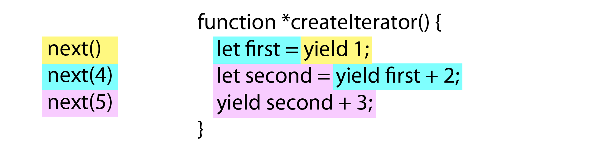
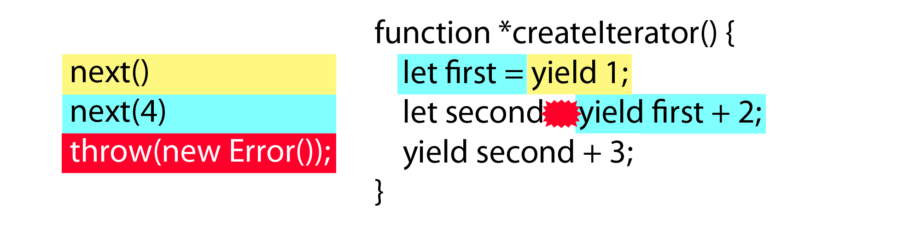

# 第八章 迭代器与生成器

## 第八章 迭代器与生成器

许多编程语言都将迭代数据的方式从使用 `for` 循环转变到使用迭代器对象， `for` 循环需要初始化变量以便追踪集合内的位置，而迭代器则以编程方式返回集合中的下一个项。迭代器能使操作集合变得更简单，因此 ES6 也将其添加到 JS 中。当新的数组方法与新的集合类型（例如 Set 与 Map ）结合时，迭代器就是高效数据处理的关键。并且还能在 JS 语言的很多新成分中找到迭代器：新增的 `for-of` 与它协同工作，扩展运算符（ `...` ）也使用了它，而它甚至还能让异步操作更易完成。

本章涵盖了迭代器的许多用法，但首先来说，理解迭代器为何被加入 JS 是很重要的。

*   循环的问题
*   何为迭代器？
*   何为生成器？
    *   生成器函数表达式
    *   生成器对象方法
*   可迭代对象与 for-of 循环
    *   访问默认迭代器
    *   创建可迭代对象
*   内置的迭代器
    *   集合的迭代器
        *   entries() 迭代器
        *   values() 迭代器
        *   keys() 迭代器
        *   集合类型的默认迭代器
    *   字符串的迭代器
    *   NodeList 的迭代器
*   扩展运算符与非数组的可迭代对象
*   迭代器高级功能
    *   传递参数给迭代器
    *   在迭代器中抛出错误
    *   生成器的 Return 语句
    *   生成器委托
*   异步任务运行
    *   一个简单的任务运行器
    *   带数据的任务运行
    *   异步任务运行器
*   总结

### 循环的问题

如果你曾用 JS 编写过程序，那么或许写过如下代码：

```
var colors = ["red", "green", "blue"];

for (var i = 0, len = colors.length; i < len; i++) {
    console.log(colors[i]);
} 
```

此处使用了 `for` 循环的标准方式，借助 `i` 变量来追踪 `colors` 数组中的位置索引。当 `i` 的值小于暂存在 `len` 变量中的数组长度时，循环每一次执行都会递增 `i` 的值。

虽然这个循环非常直观，然而当它被嵌套使用并要追踪多个变量时，情况就会变得非常复杂。额外的复杂度会引发错误，而 `for` 循环的样板性也增加了自身出错的可能性，因为相似的代码会被写在多个地方。迭代器正是用来解决此问题的。

### 何为迭代器？

迭代器是被设计专用于迭代的对象，带有特定接口。所有的迭代器对象都拥有 `next()` 方法，会返回一个结果对象。该结果对象有两个属性：对应下一个值的 `value` ，以及一个布尔类型的 `done` ，其值为 `true` 时表示没有更多值可供使用。迭代器持有一个指向集合位置的内部指针，每当调用了 `next()` 方法，迭代器就会返回相应的下一个值。

若你在最后一个值返回后再调用 `next()` ，所返回的 `done` 属性值会是 `true` ，并且 `value` 属性值会是迭代器自身的**返回值**（ **return value** ，即使用 return 语句明确返回的值）。该“返回值”不是原数据集的一部分，却会成为相关数据的最后一个片段，或在迭代器未提供返回值的时候使用 `undefined` 。迭代器自身的返回值类似于函数的返回值，是向调用者返回信息的最后手段。

记住这些后，在 ES5 中创建一个迭代器就相当简单了：

```
function createIterator(items) {

    var i = 0;

    return {
        next: function() {

            var done = (i >= items.length);
            var value = !done ? items[i++] : undefined;

            return {
                done: done,
                value: value
            };

        }
    };
}

var iterator = createIterator([1, 2, 3]);

console.log(iterator.next());           // "{ value: 1, done: false }"
console.log(iterator.next());           // "{ value: 2, done: false }"
console.log(iterator.next());           // "{ value: 3, done: false }"
console.log(iterator.next());           // "{ value: undefined, done: true }"

// 之后的所有调用
console.log(iterator.next());           // "{ value: undefined, done: true }" 
```

`createIterator()` 函数返回一个带有 `next()` 方法的对象。每当调用此方法时， `items` 数组的下一个值就会成为所返回的 `value` 属性的值。当 `i` 的值为 3 时， `done` 属性变成 `true` ，并且利用三元运算符将 `value` 设置为 `undefined` 。这两个结果符合 ES6 迭代器最后的特殊情况，也就是在数据的最后片段被迭代器使用之后、再调用 `next()` 方法所会返回的结果。

正如此例演示，根据 ES6 制定的规则来书写迭代器，是有一点复杂的。

幸好， ES6 还提供了生成器，让创建迭代器对象变得更简单。

### 何为生成器？

**生成器**（ **generator** ）是能返回一个迭代器的函数。生成器函数由放在 `function` 关键字之后的一个星号（ `*` ）来表示，并能使用新的 `yield` 关键字。将星号紧跟在 `function` 关键字之后，或是在中间留出空格，都是没问题的，正如下例：

```
// 生成器
function *createIterator() {
    yield 1;
    yield 2;
    yield 3;
}

// 生成器能像正规函数那样被调用，但会返回一个迭代器
let iterator = createIterator();

console.log(iterator.next().value);     // 1
console.log(iterator.next().value);     // 2
console.log(iterator.next().value);     // 3 
```

`createIterator()` 前面的星号让此函数变成一个生成器。 `yield` 关键字也是 ES6 新增的，指定了迭代器在被 `next()` 方法调用时应当按顺序返回的值。此例所生成的迭代器能够在 `next()` 方法调用成功时返回三个不同的值： 先是 `1` ，然后是 `2` ，最后则是 `3` 。生成器能像任意其他函数那样被调用，正如示例中创建 `iterator` 的代码。

生成器函数最有意思的方面可能就是它们会在每个 `yield` 语句后停止执行。例如，此代码中 `yield 1` 执行后，该函数将不会再执行任何操作，直到迭代器的 `next()` 方法被调用，此时才继续执行 `yield 2` 。在函数中停止执行的能力是极其强大的，并能引出生成器函数的一些有趣的用法（详见“迭代器高级功能”一节）。

`yield` 关键字可以和值或是表达式一起使用，因此你可以通过生成器给迭代器添加项目，而不是机械化地将项目一个个列出。作为一个例子，此处给出了在 `for` 循环内使用 `yield` 的方法：

```
function *createIterator(items) {
    for (let i = 0; i < items.length; i++) {
        yield items[i];
    }
}

let iterator = createIterator([1, 2, 3]);

console.log(iterator.next());           // "{ value: 1, done: false }"
console.log(iterator.next());           // "{ value: 2, done: false }"
console.log(iterator.next());           // "{ value: 3, done: false }"
console.log(iterator.next());           // "{ value: undefined, done: true }"

// 之后的所有调用
console.log(iterator.next());           // "{ value: undefined, done: true }" 
```

此例传递了一个名为 `items` 的数组给 `createIterator()` 生成器函数。在此函数内， `for` 循环在循环执行时从数组中返回元素给迭代器。每当遇到 `yield` ，循环就会停止；而每当 `iterator` 上的 `next()` 方法被调用，循环就会再次执行到 `yield` 语句处。

生成器函数是 ES6 的一个重要特性，并且因为它就是函数，就能被用于所有可用函数的位置。本节剩余部分会集中于书写生成器的其他有用方法。

> `yield` 关键字只能用在生成器内部，用于其他任意位置都是语法错误，即使在生成器内部的函数中也不行，正如此例：
> 
> ```
> function *createIterator(items) {
> 
>   items.forEach(function(item) {
> 
>       // 语法错误
>       yield item + 1;
>   });
> } 
> ```
> 
> 尽管 `yield` 严格位于 `createIterator()` 内部，此代码仍然有语法错误，因为 `yield` 无法穿越函数边界。从这点上来说， `yield` 与 `return` 非常相似，在一个被嵌套的函数中无法将值返回给包含它的函数。

#### 生成器函数表达式

你可以使用函数表达式来创建一个生成器，只要在 `function` 关键字与圆括号之间使用一个星号（ `*` ）即可。例如：

```
let createIterator = function *(items) {
    for (let i = 0; i < items.length; i++) {
        yield items[i];
    }
};

let iterator = createIterator([1, 2, 3]);

console.log(iterator.next());           // "{ value: 1, done: false }"
console.log(iterator.next());           // "{ value: 2, done: false }"
console.log(iterator.next());           // "{ value: 3, done: false }"
console.log(iterator.next());           // "{ value: undefined, done: true }"

// 之后的所有调用
console.log(iterator.next());           // "{ value: undefined, done: true }" 
```

此代码中的 `createIterator()` 是一个生成器函数表达式，而不是一个函数声明。星号放置在 `function` 关键字与圆括号之间，是因为这个函数表达式是匿名的。除此之外，此例与前一个版本的 `createIterator()` 函数没有区别，都使用了一个 `for` 循环。

> 不能将箭头函数创建为生成器。

#### 生成器对象方法

由于生成器就是函数，因此也可以被添加到对象中。例如，你可以在 ES5 风格的对象字面量中使用函数表达式来创建一个生成器：

```
var o = {

    createIterator: function *(items) {
        for (let i = 0; i < items.length; i++) {
            yield items[i];
        }
    }
};

let iterator = o.createIterator([1, 2, 3]); 
```

你也可以使用 ES6 方法的速记法，只要在方法名之前加上一个星号（ `*` ）：

```
var o = {

    *createIterator(items) {
        for (let i = 0; i < items.length; i++) {
            yield items[i];
        }
    }
};

let iterator = o.createIterator([1, 2, 3]); 
```

这些例子的功能等价于“生成器函数表达式”小节中的例子，只是语法有区别。在速记法版本中，由于 `createIterator()` 方法没有使用 `function` 关键字来定义，星号就紧贴在方法名之前，不过其实你可以在星号与方法名之间留下空格。

### 可迭代对象与 for-of 循环

与迭代器紧密相关的是，**可迭代对象**（ **iterable** ）是包含 `Symbol.iterator` 属性的对象。这个 `Symbol.iterator` 知名符号定义了为指定对象返回迭代器的函数。在 ES6 中，所有的集合对象（数组、 Set 与 Map ）以及字符串都是可迭代对象，因此它们都被指定了默认的迭代器。可迭代对象被设计用于与 ES 新增的 `for-of` 循环配合使用。

> 生成器创建的所有迭代器都是可迭代对象，因为生成器默认就会为 `Symbol.iterator` 属性赋值。

在本章开头我曾提到过在 `for` 循环中追踪索引的问题。迭代器是解决此问题的第一部分； `for-of` 循环则是第二部分：它完全删除了追踪集合索引的需要，让你无拘束地专注于操作集合内容。

`for-of` 循环在循环每次执行时会调用可迭代对象的 `next()` 方法，并将结果对象的 `value` 值存储在一个变量上。循环过程会持续到结果对象的 `done` 属性变成 `true` 为止。此处有个范例：

```
let values = [1, 2, 3];

for (let num of values) {
    console.log(num);
} 
```

此代码输出了如下内容：

```
1
2
3 
```

这个 `for-of` 循环首先调用了 `values` 数组的 `Symbol.iterator` 方法，获取了一个迭代器（对 `Symbol.iterator` 的调用发生在 JS 引擎后台）。接下来 `iterator.next()` 被调用，迭代器结果对象的 `value` 属性被读出并放入了 `num` 变量。 `num` 变量的值开始为 1 ，接下来是 2 ，最后变成 3 。当结果对象的 `done` 变成 `true` ，循环就退出了，因此 `num` 绝不会被赋值为 `undefined` 。

如果你只是简单地迭代数组或集合的值，那么使用 `for-of` 循环而不是 `for` 循环就是个好主意。 `for-of` 循环一般不易出错，因为需要留意的条件更少；传统的 `for` 循环被保留用于处理更复杂的控制条件。

> 在不可迭代对象、 `null` 或 `undefined` 上使用 `for-of` 语句，会抛出错误。

#### 访问默认迭代器

你可以使用 `Symbol.iterator` 来访问对象上的默认迭代器，就像这样：

```
let values = [1, 2, 3];
let iterator = values[Symbol.iterator]();

console.log(iterator.next());           // "{ value: 1, done: false }"
console.log(iterator.next());           // "{ value: 2, done: false }"
console.log(iterator.next());           // "{ value: 3, done: false }"
console.log(iterator.next());           // "{ value: undefined, done: true }" 
```

此代码获取了 `values` 数组的默认迭代器，并用它来迭代数组中的项。这个过程与使用 `for-of` 循环时在后台发生的过程一致。

既然 `Symbol.iterator` 指定了默认迭代器，你就可以使用它来检测一个对象是否能进行迭代，正如下例：

```
function isIterable(object) {
    return typeof object[Symbol.iterator] === "function";
}

console.log(isIterable([1, 2, 3]));     // true
console.log(isIterable("Hello"));       // true
console.log(isIterable(new Map()));     // true
console.log(isIterable(new Set()));     // true
console.log(isIterable(new WeakMap())); // false
console.log(isIterable(new WeakSet())); // false 
```

这个 `isIterable()` 函数仅仅查看对象是否存在一个类型为函数的默认迭代器。 `for-of` 循环在执行之前会做类似的检查。

本节至今的范例已经展示了在内置的可迭代类型上使用 `Symbol.iterator` 的方法，但还能用 `Symbol.iterator` 属性来创建你自己的可迭代对象。

#### 创建可迭代对象

开发者自定义对象默认情况下不是可迭代对象，但你可以创建一个包含生成器的 `Symbol.iterator` 属性，让它们成为可迭代对象。例如：

```
let collection = {
    items: [],
    *[Symbol.iterator]() {
        for (let item of this.items) {
            yield item;
        }
    }

};

collection.items.push(1);
collection.items.push(2);
collection.items.push(3);

for (let x of collection) {
    console.log(x);
} 
```

此代码输出了如下内容：

```
1
2
3 
```

本例首先为 `collection` 对象定义了一个默认的迭代器。这个默认迭代器是用 `Symbol.iterator` 方法创建的，此方法是一个生成器（注意名称之前依然有星号）。接下来该生成器使用了一个 `for-of` 循环来对 `this.items` 中的值进行迭代，并使用了 `yield` 来返回每个值。 `collection` 对象依靠 `this.items` 的默认迭代器来工作，而非在定义的值上手动进行迭代。

> 本章后面的“生成器委托”描述了另一种方法，能使用另一个对象的迭代器。

现在你已经看到了数组默认迭代器的一些用法，但 ES6 中还内置了更多的迭代器，让处理数据集合更轻易。

### 内置的迭代器

迭代器是 ES6 的一个重要部分，正因为此，你无须为许多内置类型创建你自己的迭代器，语言已经默认包含它们了。只有当内置的迭代器无法满足你的需要时，才有必要创建自定义迭代器，这最常发生在定义你自己的对象或类时，否则完全可以依靠内置的迭代器来完成工作。最常用的迭代器或许就是集合上的迭代器。

#### 集合的迭代器

ES6 具有三种集合对象类型：数组、 Map 与 Set 。这三种类型都拥有如下的迭代器，有助于探索它们的内容：

*   `entries()` ：返回一个包含键值对的迭代器；
*   `values()` ：返回一个包含集合中的值的迭代器；
*   `keys()` ：返回一个包含集合中的键的迭代器。

你可以调用上述方法之一来提取集合中的迭代器。

##### entries() 迭代器

`entries()` 迭代器会在每次 `next()` 被调用时返回一个双项数组，此数组代表了集合中每个元素的键与值：对于数组来说，第一项是数值索引；对于 Set ，第一项也是值（因为它的值也会被视为键）；对于 Map ，第一项就就是键。

这里有一些使用此迭代器的范例：

```
let colors = [ "red", "green", "blue" ];
let tracking = new Set([1234, 5678, 9012]);
let data = new Map();

data.set("title", "Understanding ES6");
data.set("format", "ebook");

for (let entry of colors.entries()) {
    console.log(entry);
}

for (let entry of tracking.entries()) {
    console.log(entry);
}

for (let entry of data.entries()) {
    console.log(entry);
} 
```

调用 `console.log()` 输出了以下内容：

```
[0, "red"]
[1, "green"]
[2, "blue"]
[1234, 1234]
[5678, 5678]
[9012, 9012]
["title", "Understanding ES6"]
["format", "ebook"] 
```

此代码在每种集合类型上使用了 `entries()` 方法来提取迭代器，并且使用 `for-of` 循环来迭代它们的项。此处的控制台输出说明了每个对象的键与值是如何被成对返回的。

##### values() 迭代器

`values()` 迭代器仅仅能返回存储在集合内的值，例如：

```
let colors = [ "red", "green", "blue" ];
let tracking = new Set([1234, 5678, 9012]);
let data = new Map();

data.set("title", "Understanding ES6");
data.set("format", "ebook");

for (let value of colors.values()) {
    console.log(value);
}

for (let value of tracking.values()) {
    console.log(value);
}

for (let value of data.values()) {
    console.log(value);
} 
```

此代码输出了如下内容：

```
"red"
"green"
"blue"
1234
5678
9012
"Understanding ES6"
"ebook" 
```

正如本例所显示的，调用 `values()` 迭代器返回了每种类型中包含的准确数据，而无须提供这些数据在集合内的任何位置信息。

##### keys() 迭代器

`keys()` 迭代器能返回集合中的每一个键。对于数组来说，它只返回了数值类型的键，永不返回数组的其他自有属性； Set 的键与值是相同的，因此它的 `keys()` 与 `values()` 返回了相同的迭代器；对于 Map ， `keys()` 迭代器返回了每个不重复的键。这里有个例子演示了这三种情况：

```
let colors = [ "red", "green", "blue" ];
let tracking = new Set([1234, 5678, 9012]);
let data = new Map();

data.set("title", "Understanding ES6");
data.set("format", "ebook");

for (let key of colors.keys()) {
    console.log(key);
}

for (let key of tracking.keys()) {
    console.log(key);
}

for (let key of data.keys()) {
    console.log(key);
} 
```

本例输出了如下内容：

```
0
1
2
1234
5678
9012
"title"
"format" 
```

`keys()` 迭代器获取了 `colors` 、 `tracking` 与 `data` 各自的键，这些键在三个 `for-of` 循环中被打印出来。对于数组对象来说，只有数值类型索引被打印了，即使你向数组添加了具名属性也依然如此。这与在数组上使用 `for-in` 循环是不同的，因为 `for-in` 循环会迭代所有属性而不仅是数值索引。

##### 集合类型的默认迭代器

当 `for-of` 循环没有显式指定迭代器时，每种集合类型都有一个默认的迭代器供循环使用。 `values()` 方法是数组与 Set 的默认迭代器，而 `entries()` 方法则是 Map 的默认迭代器。在 `for-of` 循环中使用集合对象时，这些默认迭代器会让处理更容易一些。作为例子，研究如下代码：

```
let colors = [ "red", "green", "blue" ];
let tracking = new Set([1234, 5678, 9012]);
let data = new Map();

data.set("title", "Understanding ES6");
data.set("format", "print");

// 与使用 colors.values() 相同
for (let value of colors) {
    console.log(value);
}

// 与使用 tracking.values() 相同
for (let num of tracking) {
    console.log(num);
}

// 与使用 data.entries() 相同
for (let entry of data) {
    console.log(entry);
} 
```

此处没有指定迭代器，因此默认的迭代器函数会被使用。数组、 Set 与 Map 的默认迭代器反映了这些对象是如何被初始化的，于是此代码就输出了如下内容：

```
"red"
"green"
"blue"
1234
5678
9012
["title", "Understanding ES6"]
["format", "print"] 
```

数组与 Set 默认输出了它们的值，而 Map 返回的则是可以直接传给 `Map` 构造器的数组格式。另一方面， Weak Set 与 Weak Map 并未拥有内置的迭代器，使用弱引用意味着无法获知这些集合内部到底有多少个值，同时意味着没有方法可以迭代这些值。

> **解构与 `for-of` 循环**
> 
> Map 默认构造器的行为有助于在 `for-of` 循环中使用解构，正如此例：
> 
> ```
> let data = new Map();
> 
> data.set("title", "Understanding ES6");
> data.set("format", "ebook");
> 
> // 与使用 data.entries() 相同
> for (let [key, value] of data) {
>   console.log(key + "=" + value);
> } 
> ```
> 
> 此代码中的 `for-of` 循环使用了数组解构，来将 Map 中的每个项存入 `key` 与 `value` 变量。使用这种方式，你能轻易同时处理键与值，而无须访问一个双项数组，或是回到 Map 中去获取键或值。在 Map 上进行 `for-of` 循环时使用数组解构，能让这种循环像在处理 Set 或数组时一样有用。

#### 字符串的迭代器

从 ES5 发布开始， JS 的字符串就慢慢变得越来越像数组。例如 ES5 标准化了字符串的方括号表示法，用于访问其中的字符（即：使用 `text[0]` 来获取第一个字符，以此类推）。不过方括号表示法工作在码元而非字符上，因此它不能被用于正确访问双字节的字符，正如此例所演示的：

```
var message = "A 𠮷 B";

for (let i=0; i < message.length; i++) {
    console.log(message[i]);
} 
```

此代码使用了方括号表示法与 `length` 属性来迭代字符串并打印字符，该字符串包含一个 Unicode 字符，输出结果有点出人意料：

```
A
(blank)
(blank)
(blank)
(blank)
B 
```

> 译注： `(blank)` 代表空行。

由于双字节字符被当作两个分离的码元来对待，此处的输出在 `A` 与 `B` 之间就有了四个空行。

幸好， ES6 旨在为 Unicode 提供完全支持（详见第二章），字符串的默认迭代器就是解决字符串迭代问题的一种尝试。这样一来，借助字符串默认迭代器就能处理字符而不是码元。将上个范例修改为使用字符串默认迭代器配合 `for-of` 循环，会得到更加合适的输出。以下是调整之后的代码：

```
var message = "A 𠮷 B";

for (let c of message) {
    console.log(c);
} 
```

此代码输出了如下内容：

```
A
(blank)
𠮷
(blank)
B 
```

作用对象是字符，让本次的结果更符合预期：循环成功地打印出了这个 Unicode 字符以及其余字符。

#### NodeList 的迭代器

文档对象模型（ DOM ）具有一种 `NodeList` 类型，用于表示页面文档中元素的集合。对于需要书写在浏览器中运行的 JS 代码的开发者，要理解 `NodeList` 对象与数组之间的差异总是稍有困难。 `NodeList` 对象与数组都使用了 `length` 属性来标明项的数量，并且都使用方括号表示法来访问各个项。然而本质上来说， `NodeList` 与数组的行为是完全不同的，这会引发许多混乱。

随着默认迭代器被附加到 ES6 ， DOM 关于 `NodeList` 的规定也包含了一个默认迭代器（此规定在 HTML 规范而非 ES6 规范中），其表现方式与数组的默认迭代器一致。这意味着你可以将 `NodeList` 用于 `for-of` 循环，或用于其他使用对象默认迭代器的场合。例如：

```
var divs = document.getElementsByTagName("div");

for (let div of divs) {
    console.log(div.id);
} 
```

此代码调用 `getElementsByTagName()` 来获取一个包含 `document` 对象中的所有 `<div>` 元素的 `NodeList` 。接下来 `for-of` 循环迭代了每个元素并打印出它们的 ID ，实际上这段代码与在标准数组上使用时并无二致。

### 扩展运算符与非数组的可迭代对象

回顾一下第七章，扩展运算符（ `...` ）可以被用于将一个 Set 转换为数组，例如：

```
let set = new Set([1, 2, 3, 3, 3, 4, 5]),
    array = [...set];

console.log(array);             // [1,2,3,4,5] 
```

此代码在数组字面量中使用扩展运算符，以便将 `set` 中的值填充到数组。扩展运算符能作用于所有可迭代对象，并且会使用默认迭代器来判断需要使用哪些值。所有的值都从迭代器中被读取出来并插入数组，遵循迭代器返回值的顺序。此例工作正常是由于 Set 是可迭代对象，但这种方式同样还能用于任意的可迭代对象。此处有另一个例子：

```
let map = new Map([ ["name", "Nicholas"], ["age", 25]]),
    array = [...map];

console.log(array);         // [ ["name", "Nicholas"], ["age", 25]] 
```

此处的扩展运算符将 `map` 转换为一个由数组构成的数组。由于 Map 的默认迭代器返回的是键值对，最终的数组看起来与调用 `new Map()` 时所传入的参数一模一样。

你能不限次数地在数组字面量中使用扩展运算符，而且可以在任意位置用扩展运算符将可迭代对象的多个项插入数组，这些项在新数组中将会出现在扩展运算符对应的位置，例如：

```
let smallNumbers = [1, 2, 3],
    bigNumbers = [100, 101, 102],
    allNumbers = [0, ...smallNumbers, ...bigNumbers];

console.log(allNumbers.length);     // 7
console.log(allNumbers);    // [0, 1, 2, 3, 100, 101, 102] 
```

此处的扩展运算符使用 `smallNumbers` 与 `bigNumbers` 中的数据来创建 `allNumbers` 数组。在 `allNumbers` 被创建时，值在其中的排列顺序与数组被添加的顺序一致： 首先是 `0` ，其次是来自 `smallNumbers` 数组的元素，最后是来自 `bigNumbers` 数组的元素。原始数组并没有被改变，只是它们的值被复制到了 `allNumbers` 数组中。

既然扩展运算符能用在任意可迭代对象上，它就成为了将可迭代对象转换为数组的最简单方法。你可以将字符串转换为包含字符（而非码元）的数组，也能将浏览器中的 `NodeList` 对象转换为节点数组。

现在你已基本了解迭代器是如何工作的（包括 `for-of` 与扩展运算符），是时候去看看迭代器的一些更复杂用法了。

### 迭代器高级功能

使用迭代器的基本功能，并使用生成器来方便地创建迭代器，你就已经可以完成很多工作了。然而，在单纯迭代集合的值之外的任务中，迭代器会显得更加强大。在 ES6 的开发过程中，许多独特的思想与模式出现了，激励着规范制定者去添加更多的功能。这些附加功能可能很细微，但将它们结合使用就能形成一些有趣的互动。

#### 传递参数给迭代器

本章中的范例已经展示了迭代器能够将值传递出来，通过 `next()` 方法或者在生成器中使用 `yield` 都可以。但你还能通过 `next()` 方法向迭代器传递参数。当一个参数被传递给 `next()` 方法时，该参数就会成为生成器内部 `yield` 语句的值。这种能力对于更多高级功能（例如异步编程）来说是非常重要的。此处有个基本范例：

```
function *createIterator() {
    let first = yield 1;
    let second = yield first + 2;       // 4 + 2
    yield second + 3;                   // 5 + 3
}

let iterator = createIterator();

console.log(iterator.next());           // "{ value: 1, done: false }"
console.log(iterator.next(4));          // "{ value: 6, done: false }"
console.log(iterator.next(5));          // "{ value: 8, done: false }"
console.log(iterator.next());           // "{ value: undefined, done: true }" 
```

对于 `next()` 的首次调用是一个特殊情况，传给它的任意参数都会被忽略。由于传递给 `next()` 的参数会成为 `yield` 语句的值，该 `yield` 语句指的是上次生成器中断执行处的语句；而 `next()` 方法第一次被调用时，生成器函数才刚刚开始执行，没有所谓的“上一次中断处的 `yield` 语句”可供赋值。因此在第一次调用 `next()` 时，不存在任何向其传递参数的理由。

> 译注：原文的表述是：
> 
> > 由于传递给 `next()` 的参数会成为 `yield` 语句的值，则首次调用给 `next()` 提供的参数就只会替换生成器函数中的第一个 `yield` 语句；但若要在生成器内部使用该值，又要求它在此 `yield` 语句之前就必须能被访问到，而这是不可能的。
> 
> 但译者不赞成这种说法，因此对这段表述进行了修改。

在第二次调用 `next()` 时， `4` 作为参数被传递进去，这个 `4` 最终被赋值给了生成器函数内部的 `first` 变量。在包含赋值操作的第一个 `yield` 语句中，表达式右侧在第一次调用 `next()` 时被计算，而表达式左侧则在第二次调用 `next()` 方法时、并在生成器函数继续执行前被计算。由于第二次调用 `next()` 传入了 `4` ，这个值就被赋给了 `first` 变量，之后生成器继续执行。

第二个 `yield` 使用了第一个 `yield` 的结果并加上了 2 ，也就是返回了一个 `6` 。当 `next()` 被第三次调用时，传入了参数 `5` 。这个值被赋给了 `second` 变量，并随后用在了第三个 `yield` 语句中，返回了 `8` 。

通过考虑在生成器函数内部每次继续运行时都执行了什么代码，会有助于思考到底发生了什么。示意图 8-1 用颜色演示了代码在 yield 之前是如何执行的。



示意图 8-1: 在一个生成器内部的代码执行

黄色表示对于 `next()` 的第一次调用、以及在生成器内部执行的所有代码；水蓝色表示了对 `next(4)` 的调用以及随之执行的代码；而紫色则表示对 `next(5)` 的调用以及随之执行的代码。棘手的部分在于：在左侧代码执行之前，右侧的各个表达式是如何执行与停止的。这使得调试错综复杂的生成器要比调试正规函数更麻烦一些。

你目前已看到了当一个值传递给 `next()` 方法时， `yield` 的表现就好像 `return` 一样。然而，这并不是在一个生成器内部仅能使用的执行技巧，你还可以让迭代器抛出一个错误。

#### 在迭代器中抛出错误

能传递给迭代器的不仅是数据，还可以是错误条件。迭代器可以选择实现一个 `throw()` 方法，用于指示迭代器应在恢复执行时抛出一个错误。这是对异步编程来说很重要的一个能力，同时也会增加生成器内部的灵活度，能够既模仿返回一个值，又模仿抛出错误（也就是退出函数的两种方式）。你可以传递一个错误对象给 `throw()` 方法，当迭代器继续进行处理时应当抛出此错误。例如：

```
function *createIterator() {
    let first = yield 1;
    let second = yield first + 2;       // yield 4 + 2 ，然后抛出错误
    yield second + 3;                   // 永不会被执行
}

let iterator = createIterator();

console.log(iterator.next());                   // "{ value: 1, done: false }"
console.log(iterator.next(4));                  // "{ value: 6, done: false }"
console.log(iterator.throw(new Error("Boom"))); // 从生成器中抛出了错误 
```

在本例中，前两个 `yield` 表达式照常被运算，但当 `throw()` 被调用时，一个错误在 `let second` 运算之前就被抛出了。这有效停止了代码执行，类似于直接抛出错误，其中唯一区别是错误在何处被抛出。示意图 8-2 演示了每一步所执行的是什么代码。



示意图 8-2: 在一个生成器内部抛出错误

在此示意图中，红色表示当 `throw()` 被调用时所执行的代码，红星说明了错误在生成器内部大约何时被抛出。前两个 `yield` 语句被执行之后，当调用 `throw()` 时，在任何其他代码执行之前错误就被抛出了。

了解这些之后，你就可以在生成器内部使用一个 `try-catch` 块来捕捉这种错误：

```
function *createIterator() {
    let first = yield 1;
    let second;

    try {
        second = yield first + 2;       // yield 4 + 2 ，然后抛出错误
    } catch (ex) {
        second = 6;                     // 当出错时，给变量另外赋值
    }
    yield second + 3;
}

let iterator = createIterator();

console.log(iterator.next());                   // "{ value: 1, done: false }"
console.log(iterator.next(4));                  // "{ value: 6, done: false }"
console.log(iterator.throw(new Error("Boom"))); // "{ value: 9, done: false }"
console.log(iterator.next());                   // "{ value: undefined, done: true }" 
```

本例使用一个 `try-catch` 块包裹了第二个 `yield` 语句。尽管这个 `yield` 自身的执行不会出错，但在对 `second` 变量赋值之前，错误就在此时被抛出，于是 `catch` 部分捕捉错误并将这个变量赋值为 6 ，然后再继续执行到下一个 `yield` 处并返回了 9 。

要注意一件有趣的事情发生了： `throw()` 方法就像 `next()` 方法一样返回了一个结果对象。由于错误在生成器内部被捕捉，代码继续执行到下一个 `yield` 处并返回了下一个值，也就是 `9` 。

将 `next()` 与 `throw()` 都当作迭代器的指令，会有助于思考。 `next()` 方法指示迭代器继续执行（可能会带着给定的值），而 `throw()` 方法则指示迭代器通过抛出一个错误继续执行。在调用点之后会发生什么，根据生成器内部的代码来决定。

`next()` 与 `throw()` 方法控制着迭代器在使用 `yield` 时内部的执行，但你也可以使用 `return` 语句。不过 `return` 的工作方式与它在正规函数中有一些差异，正如你将在下一节中看到的那样。

#### 生成器的 Return 语句

由于生成器是函数，你可以在它内部使用 `return` 语句，既可以让生成器早一点退出执行，也可以指定在 `next()` 方法最后一次调用时的返回值。在本章大多数例子中，对迭代器上的 `next()` 的最后一次调用都返回了 `undefined` ，但你还可以像在其他函数中那样，使用 `return` 来指定另一个返回值。在生成器内， `return` 表明所有的处理已完成，因此 `done` 属性会被设为 `true` ，而如果提供了返回值，就会被用于 `value` 字段。此处有个例子，单纯使用 `return` 让生成器更早返回：

```
function *createIterator() {
    yield 1;
    return;
    yield 2;
    yield 3;
}

let iterator = createIterator();

console.log(iterator.next());           // "{ value: 1, done: false }"
console.log(iterator.next());           // "{ value: undefined, done: true }" 
```

此代码中的生成器在一个 `yield` 语句后跟随了一个 `return` 语句。这个 `return` 表明将不会再有任何值，也因此剩余的 `yield` 语句就不会再执行（它们是不可到达的）。

你也可以指定一个返回值，会被用于最终返回的结果对象中的 `value` 字段。例如：

```
function *createIterator() {
    yield 1;
    return 42;
}

let iterator = createIterator();

console.log(iterator.next());           // "{ value: 1, done: false }"
console.log(iterator.next());           // "{ value: 42, done: true }"
console.log(iterator.next());           // "{ value: undefined, done: true }" 
```

此处，当第二次调用 `next()` 方法时，值 `42` 被返回在 `value` 字段中，此时 `done` 字段的值才第一次变为了 `true` 。第三次调用 `next()` 返回了一个对象，其 `value` 属性再次变回 `undefined` ，你在 `return` 语句中指定的任意值都只会在结果对象中出现一次，此后 `value` 字段就会被重置为 `undefined` 。

> 扩展运算符与 `for-of` 循环会忽略 `return` 语句所指定的任意值。一旦它们看到 `done` 的值为 `true` ，它们就会停止操作而不会读取对应的 `value` 值。不过，在生成器进行委托时，迭代器的返回值会非常有用。

#### 生成器委托

在某些情况下，将两个迭代器的值合并器一起会更有用。生成器可以用星号（ `*` ）配合 `yield` 这一特殊形式来委托另一个生成器。正如生成器的定义，星号出现在何处是不重要的，只要落在 `yield` 关键字与生成器函数名之间即可。此处有个范例：

```
function *createNumberIterator() {
    yield 1;
    yield 2;
}

function *createColorIterator() {
    yield "red";
    yield "green";
}

function *createCombinedIterator() {
    yield *createNumberIterator();
    yield *createColorIterator();
    yield true;
}

var iterator = createCombinedIterator();

console.log(iterator.next());           // "{ value: 1, done: false }"
console.log(iterator.next());           // "{ value: 2, done: false }"
console.log(iterator.next());           // "{ value: "red", done: false }"
console.log(iterator.next());           // "{ value: "green", done: false }"
console.log(iterator.next());           // "{ value: true, done: false }"
console.log(iterator.next());           // "{ value: undefined, done: true }" 
```

此例中的 `createCombinedIterator()` 生成器依次委托了 `createNumberIterator()` 与 `createColorIterator()` 。返回的迭代器从外部看来就是一个单一的迭代器，用于产生所有的值。每次对 `next()` 的调用都会委托给合适的生成器，直到使用 `createNumberIterator()` 与 `createColorIterator()` 创建的迭代器全部清空为止。然后最终的 `yield` 会被执行以返回 `true` 。

生成器委托也能让你进一步使用生成器的返回值。这是访问这些返回值的最简单方式，并且在执行复杂任务时会非常有用。例如：

```
function *createNumberIterator() {
    yield 1;
    yield 2;
    return 3;
}

function *createRepeatingIterator(count) {
    for (let i=0; i < count; i++) {
        yield "repeat";
    }
}

function *createCombinedIterator() {
    let result = yield *createNumberIterator();
    yield *createRepeatingIterator(result);
}

var iterator = createCombinedIterator();

console.log(iterator.next());           // "{ value: 1, done: false }"
console.log(iterator.next());           // "{ value: 2, done: false }"
console.log(iterator.next());           // "{ value: "repeat", done: false }"
console.log(iterator.next());           // "{ value: "repeat", done: false }"
console.log(iterator.next());           // "{ value: "repeat", done: false }"
console.log(iterator.next());           // "{ value: undefined, done: true }" 
```

此处 `createCombinedIterator()` 生成器委托了 `createNumberIterator()` 并将它的返回值赋值给了 `result` 变量。由于 `createNumberIterator()` 包含 `return 3` 语句，该返回值就是 `3` 。 `result` 变量接下来会作为参数传递给 `createRepeatingIterator()` 生成器，指示同一个字符串需要被重复几次（在本例中是三次）。

注意值 `3` 从未在对于 `next()` 方法的任何调用中被输出。当前它仅仅存在于 `createCombinedIterator()` 生成器内部。但你也可以通过添加另一个 `yield` 语句来输出这个值，正如：

```
function *createNumberIterator() {
    yield 1;
    yield 2;
    return 3;
}

function *createRepeatingIterator(count) {
    for (let i=0; i < count; i++) {
        yield "repeat";
    }
}

function *createCombinedIterator() {
    let result = yield *createNumberIterator();
    yield result;
    yield *createRepeatingIterator(result);
}

var iterator = createCombinedIterator();

console.log(iterator.next());           // "{ value: 1, done: false }"
console.log(iterator.next());           // "{ value: 2, done: false }"
console.log(iterator.next());           // "{ value: 3, done: false }"
console.log(iterator.next());           // "{ value: "repeat", done: false }"
console.log(iterator.next());           // "{ value: "repeat", done: false }"
console.log(iterator.next());           // "{ value: "repeat", done: false }"
console.log(iterator.next());           // "{ value: undefined, done: true }" 
```

在此代码中，额外的 `yield` 语句明确地将 `createNumberIterator()` 生成器的返回值进行了输出。

使用返回值的生成器委托是一种非常强大的范式，能引出一些非常有趣的应用可能，尤其是在用于与异步操作结合时。

> 你可以直接在字符串上使用 `yield *` （例如 `yield * "hello"` ），字符串的默认迭代器会被使用。

### 异步任务运行

围绕着生成器的许多兴奋点都与异步编程直接相关。 JS 中的异步编程是一把双刃剑：简单任务很容易用异步实现，但复杂任务就会变成代码组织方面的苦差事。由于生成器能让你在执行过程中有效地暂停代码操作，它就开启了与异步编程相关的许多可能性。

执行异步操作的传统方式是调用一个包含回调的函数。例如，考虑在 Node.js 中从磁盘读取一个文件：

```
let fs = require("fs");

fs.readFile("config.json", function(err, contents) {
    if (err) {
        throw err;
    }

    doSomethingWith(contents);
    console.log("Done");
}); 
```

能使用文件名与一个回调函数去调用 `fs.readFile()` 方法，在读取操作结束之后，回调函数就会被调用。此回调函数查看是否存在错误，若否则处理返回的 `contents` 数据。当你拥有数量少而有限的任务需要完成时，这么做很有效；然而当你需要嵌套回调函数，或者要按顺序处理一系列的异步任务时，此方式就会非常麻烦了。在这种场合下，生成器与 `yield` 会很有用。

#### 一个简单的任务运行器

由于 `yield` 能停止运行，并在重新开始运行前等待 `next()` 方法被调用，你就可以在没有回调函数的情况下实现异步调用。首先，你需要一个能够调用生成器并启动迭代器的函数，就像这样：

```
function run(taskDef) {

    // 创建迭代器，让它在别处可用
    let task = taskDef();

    // 启动任务
    let result = task.next();

    // 递归使用函数来保持对 next() 的调用
    function step() {

        // 如果还有更多要做的
        if (!result.done) {
            result = task.next();
            step();
        }
    }

    // 开始处理过程
    step();

} 
```

`run()` 函数接受一个任务定义（即一个生成器函数）作为参数，它会调用生成器来创建一个迭代器，并将迭代器存放在 `task` 变量上。 `task` 变量放在函数的外层，因此它可以被函数内的其他函数访问到，在后面的章节你会发现这么做的好处。第一次对 `next()` 的调用启动了迭代器，并将结果存储下来以便稍后使用。 `step()` 函数查看 `result.done` 是否为 false ，如果是就在递归调用自身之前调用 `next()` 方法。每次调用 `next()` 都会把返回的结果保存在 `result` 变量上，它总是会被最新的信息所重写。对于 `step()` 的初始调用启动了处理过程，该过程会查看 `result.done` 来判断是否还有更多要做的工作。

配合这个已实现的 `run()` 函数，你就可以运行一个包含多条 `yield` 语句的生成器，就像这样：

```
run(function*() {
    console.log(1);
    yield;
    console.log(2);
    yield;
    console.log(3);
}); 
```

此例只是将三个数值输出到控制台，单纯用于表明对 `next()` 的所有调用都已被执行。然而，仅仅使用几次 yield 并不太有意义，下一步是要把值传进迭代器并获取返回数据。

#### 带数据的任务运行

传递数据给任务运行器最简单的方式，就是把 `yield` 返回的值传入下一次的 `next()` 调用。为此，你仅需传递 `result.value` ，正如以下代码：

```
function run(taskDef) {

    // 创建迭代器，让它在别处可用
    let task = taskDef();

    // 启动任务
    let result = task.next();

    // 递归使用函数来保持对 next() 的调用
    function step() {

        // 如果还有更多要做的
        if (!result.done) {
            result = task.next(result.value);
            step();
        }
    }

    // 开始处理过程
    step();

} 
```

现在 `result.value` 作为参数被传递给了 `next()` ，这样就能在 `yield` 调用之间传递数据了，就像这样：

```
run(function*() {
    let value = yield 1;
    console.log(value);         // 1

    value = yield value + 3;
    console.log(value);         // 4
}); 
```

此例向控制台输出了两个值： 1 与 4 。数值 1 由 `yield 1` 语句而来，随之 1 又被传回给了 `value` 变量。数值 4 是在 `value` 上加了 3 的结果，并将运算结果再度赋值给 `value` 。现在数据在对 `yield` 的调用之间流动了起来，仅需再来个微小改动，就能支持异步调用。

#### 异步任务运行器

上个例子只是在 `yield` 之间来回传递静态数据，但等待一个异步处理与此稍微有点差异。任务运行器需要了解回调函数，并了解如何使用它们。并且由于 `yield` 表达式将它们的值传递给了任务运行器，这就意味着任意函数调用都必须返回一个值，并以某种方式标明该返回值是个异步操作调用，而任务运行器应当等待此操作。

此处是将返回值标明为异步操作的一种方法：

```
function fetchData() {
    return function(callback) {
        callback(null, "Hi!");
    };
} 
```

此例的目的是：任何打算让任务运行器调用的函数，都应当返回一个能够执行回调函数的函数。 `fetchData()` 函数所返回的函数能接受一个回调函数作为其参数，当返回的函数被调用时，它会执行回调函数并附加一点额外数据（即 `"Hi!"` 字符串）。该回调函数需要由任务运行器提供，以确保回调函数能与当前的迭代器正确交互。虽然 `fetchData()` 函数是同步的，但你能延迟对回调函数的调用，从而轻易地将它改造为异步函数，就像这样：

```
function fetchData() {
    return function(callback) {
        setTimeout(function() {
            callback(null, "Hi!");
        }, 50);
    };
} 
```

此版本的 `fetchData()` 在调用回调函数之前引入了 50 毫秒的延迟，说明此模式在同步或异步代码上都能同样良好运作。你只要保证每个需要被 `yield` 调用的函数都遵循此模式。

在深入理解函数如何标注自己是一个异步处理后，你就可以结合这种模式来改造任务运行器。只要 `result.value` 是一个函数，任务运行器就应当执行它，而不是仅仅将它传递给 `next()` 方法。此处有更新后的代码：

```
function run(taskDef) {

    // 创建迭代器，让它在别处可用
    let task = taskDef();

    // 启动任务
    let result = task.next();

    // 递归使用函数来保持对 next() 的调用
    function step() {

        // 如果还有更多要做的
        if (!result.done) {
            if (typeof result.value === "function") {
                result.value(function(err, data) {
                    if (err) {
                        result = task.throw(err);
                        return;
                    }

                    result = task.next(data);
                    step();
                });
            } else {
                result = task.next(result.value);
                step();
            }

        }
    }

    // 开始处理过程
    step();

} 
```

当 `result.value` 是个函数时（使用 `===` 运算符来判断），它会被使用一个回调函数进行调用。该回调函数遵循了 Node.js 的惯例，将任何潜在错误作为第一个参数（ `err` ）传入，而处理结果则作为第二个参数。若 `err` 非空，也就表示有错误发生，需要使用该错误对象去调用 `task.throw()` ，而不是调用 `task.next()` ，这样错误就会在恰当的位置被抛出；若不存在错误， `data` 参数将会被传入 `task.next()` ，而其调用结果也会被保存下来。接下来，调用 `step()` 来继续处理过程。若 `result.value` 并非函数，它就会被直接传递给 `next()` 方法。

任务运行器的这个新版本已经为所有的异步任务准备好了。为了在 Node.js 中从一个文件读取数据，你需要创建对于 `fs.readFile()` 的一个封装，它类似于本节起始处的 `fetchData()` 函数，能返回另一个函数。例如：

```
let fs = require("fs");

function readFile(filename) {
    return function(callback) {
        fs.readFile(filename, callback);
    };
} 
```

这个 `readFile()` 方法接受单个参数，即文件名，并返回一个能执行回调函数的函数。此回调函数会被直接传递给 `fs.readFile()` 方法，后者会在操作完成后执行回调。接下来你就可以使用 `yield` 来运行这个任务，如下：

```
run(function*() {
    let contents = yield readFile("config.json");
    doSomethingWith(contents);
    console.log("Done");
}); 
```

此例执行了异步的 `readFile()` 操作，而在主要代码中并未暴露出任何回调函数。除了 `yield` 之外，此代码看起来与同步代码并无二致。既然执行异步操作的函数都遵循了同一接口，你就可以用貌似同步的代码来书写处理逻辑。

当然，这些范例中所使用的模式也有缺点：你无法完全确认一个能返回函数的函数是异步的。但现在唯一重要的是让你理解任务运行背后的原理。 promise 提供了更强有力的方式来调度异步任务，第十一章会进一步介绍这个主题。

### 总结

迭代器是 ES6 重要的一部分，并且也是语言若干关键元素的根源。在表面上，迭代器提供了一种使用简单接口来返回值序列的简单方式。然而，在 ES6 中使用迭代器，还有着种种更加复杂的方式。

`Symbol.iterator` 符号被用于定义对象的默认迭代器。内置对象与开发者自定义对象都可以使用这个符号，以提供一个能返回迭代器的方法。当 `Symbol.iterator` 在一个对象上存在时，该对象就会被认为是可迭代对象。

`for-of` 循环在循环中使用可迭代对象来返回一系列数据。与使用传统 `for` 循环进行迭代相比，使用 `for-of` 要容易得多，因为你不再需要追踪计数器并控制循环何时结束。 `for-of` 循环会自动从迭代器中读取所有数据，直到没有更多数据为止，然后退出循环。

为了让 `for-of` 更易使用， ES6 中的许多类型都具有默认的迭代器。所有的集合类型（也就是数组、 Map 与 Set ）都具有迭代器，让它们的内容更易被访问。字符串同样具有一个默认迭代器，能更加轻易地迭代字符串中的字符（而非码元）。

扩展运算符能操作任意的可迭代对象，同时也能更简单地将可迭代对象转换为数组。转换工作会从一个迭代器中读取数据，并将它们依次插入数组。

生成器是一个特殊的函数，可以在被调用时自动创建一个迭代器。生成器的定义用一个星号（ `*` ）来表示，使用 `yield` 关键字能指明在每次成功的 `next()` 方法调用时应当返回什么值。

生成器委托促进了对迭代器行为的良好封装，让你能将已有的生成器重用在新的生成器中。通过调用 `yield *` 而非 `yield` ，你就能把已有生成器用在其他生成器内部。这种处理方式能创建一个从多个迭代器中返回值的新迭代器。

生成器与迭代器最有趣、最令人激动的方面，或许就是可能创建外观清晰的异步操作代码。你不必到处使用回调函数，而是可以建立貌似同步的代码，但实际上却使用 `yield` 来等待异步操作结束。