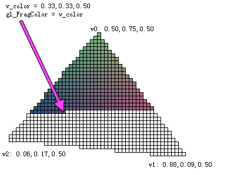

# 一、WebGL 基础

## WebGL 基本原理

WebGL 的出现使得在浏览器上面实时显示 3D 图像成为，WebGL 本质上是基于光栅化的 API ,而不是基于 3D 的 API。

WebGL 只关注两个方面，即投影矩阵的坐标和投影矩阵的颜色。使用 WebGL 程序的任务就是实现具有投影矩阵坐标和颜色的 WebGL 对象即可。可以使用“着色器”来完成上述任务。顶点着色器可以提供投影矩阵的坐标，片段着色器可以提供投影矩阵的颜色。

无论要实现的图形尺寸有多大，其投影矩阵的坐标的范围始终是从 -1 到 1 。下面是一个关于实现 WebGL 对象的一个简单例子。

```js
// Get A WebGL context
var canvas = document.getElementById("canvas");
var gl = canvas.getContext("experimental-webgl");

// setup a GLSL program
var program = createProgramFromScripts(gl, ["2d-vertex-shader", "2d-fragment-shader"]);
gl.useProgram(program);

// look up where the vertex data needs to go.
var positionLocation = gl.getAttribLocation(program, "a_position");

// Create a buffer and put a single clipspace rectangle in
// it (2 triangles)
var buffer = gl.createBuffer();
gl.bindBuffer(gl.ARRAY_BUFFER, buffer);
gl.bufferData(
gl.ARRAY_BUFFER,
new Float32Array([
-1.0, -1.0,
 1.0, -1.0,
-1.0,  1.0,
-1.0,  1.0,
 1.0, -1.0,
 1.0,  1.0]),
gl.STATIC_DRAW);
gl.enableVertexAttribArray(positionLocation);
gl.vertexAttribPointer(positionLocation, 2, gl.FLOAT, false, 0, 0);

// draw
gl.drawArrays(gl.TRIANGLES, 0, 6); 
```

下面是两个着色器。

```js
<script id="2d-vertex-shader" type="x-shader/x-vertex">
attribute vec2 a_position;

void main() {
  gl_Position = vec4(a_position, 0, 1);
}
</script>

<script id="2d-fragment-shader" type="x-shader/x-fragment">
void main() {
  gl_FragColor = vec4(0, 1, 0, 1);  // green
}
</script> 
```

它将绘出一个绿色的长方形来填充整个画板。


后面内容还会更精彩，我们继续：-P

我们再次降调一下，无论画板尺寸多大，投影矩阵坐标的范围只会在 -1 到 1 之间。从上面的例子中，我们可以看出我们只是将位置信息直接写在了程序里。 因为位置信息已经在投影矩阵中，所以并没有其他额外的工作要做。 如果想实现 3D 的效果，那么可以使用着色器来将 3D 转换为投影矩阵，这是因为 *WebGL* 是基于光栅的 API。

对于 2D 的图像，也许会使用像素而不是投影矩阵来表述尺寸，那么这里我们就更改这里的着色器，使得我们实现的矩形可以以像素的方式来度量，下面是新的顶点着色器。

```js
<script id="2d-vertex-shader" type="x-shader/x-vertex">
attribute vec2 a_position;

uniform vec2 u_resolution;

void main() {
   // convert the rectangle from pixels to 0.0 to 1.0
   vec2 zeroToOne = a_position / u_resolution;

   // convert from 0->1 to 0->2
   vec2 zeroToTwo = zeroToOne * 2.0;

   // convert from 0->2 to -1->+1 (clipspace)
   vec2 clipSpace = zeroToTwo - 1.0;

   gl_Position = vec4(clipSpace, 0, 1);
}
</script> 
```

下面我们将我们的数据从投影矩阵改为像素。

```js
// set the resolution
var resolutionLocation = gl.getUniformLocation(program, "u_resolution");
gl.uniform2f(resolutionLocation, canvas.width, canvas.height);

// setup a rectangle from 10,20 to 80,30 in pixels
gl.bufferData(gl.ARRAY_BUFFER, new Float32Array([
10, 20,
80, 20,
10, 30,
10, 30,
80, 20,
80, 30]), gl.STATIC_DRAW); 
```


上面例子矩阵位于底部边框，下面我们让它位于左上边框：

修改代码如下：

```js
   gl_Position = vec4(clipSpace * vec2(1, -1), 0, 1);
```

效果如下图：


下面我们将上述关于矩阵的实现写成函数以便可以以函数调用的方式来实现不同尺寸的矩阵。 然而，这里的颜色应该是可变的。

首先，我们为片段着色器设计一个关于颜色的输入。

```js
<script id="2d-fragment-shader" type="x-shader/x-fragment">
precision mediump float;

uniform vec4 u_color;

void main() {
   gl_FragColor = u_color;
}
</script> 
```

下面是实现绘画 50 个尺寸和颜色均随机的矩阵的代码。

```js
var colorLocation = gl.getUniformLocation(program, "u_color");
  ...
  // Create a buffer
  var buffer = gl.createBuffer();
  gl.bindBuffer(gl.ARRAY_BUFFER, buffer);
  gl.enableVertexAttribArray(positionLocation);
  gl.vertexAttribPointer(positionLocation, 2, gl.FLOAT, false, 0, 0);

  // draw 50 random rectangles in random colors
  for (var ii = 0; ii < 50; ++ii) {
// Setup a random rectangle
setRectangle(
gl, randomInt(300), randomInt(300), randomInt(300), randomInt(300));

// Set a random color.
gl.uniform4f(colorLocation, Math.random(), Math.random(), Math.random(), 1);

// Draw the rectangle.
gl.drawArrays(gl.TRIANGLES, 0, 6);
  }
}

// Returns a random integer from 0 to range - 1.
function randomInt(range) {
  return Math.floor(Math.random() * range);
}

// Fills the buffer with the values that define a rectangle.
function setRectangle(gl, x, y, width, height) {
  var x1 = x;
  var x2 = x + width;
  var y1 = y;
  var y2 = y + height;
  gl.bufferData(gl.ARRAY_BUFFER, new Float32Array([
 x1, y1,
 x2, y1,
 x1, y2,
 x1, y2,
 x2, y1,
 x2, y2]), gl.STATIC_DRAW);
} 
```

下面就是实现出来的效果。


到此可以看出 WebGL 实质上是一种轻量级的 API。但是，它可以实现较为复杂的 3D 效果，其复杂性由程序定制。WebGL API 本身是 2D 的且相对比较简单。

## WebGL 是如何工作的

这部分是上一节 WebGL 基本原理的延续。在继续之前，我们需要讨论 WebGL 和 GPU 是如何运作的。GPU 有两个基础任务，第一个就是将点处理为投影矩阵。第二部分就是基于第一部分将相应的像素点描绘出来。

当用户调用

```js
gl.drawArrays(gl.TRIANGLE, 0, 9); 
```

这里的 9 就意味着“处理 9 个顶点”，所以就有 9 个顶点需要被处理。


上图左侧的是用户自己提供的数据。定点着色器就是用户在 GLSL 中写的函数。处理每个定点时，均会被调用一次。用户可以将投影矩阵的值存储在特定的变量 `gl_Position` 中。GPU 会处理这些值，并将他们存储在其内部。

假设用户希望绘制三角形 `TRIANGLES`, 那么每次绘制时，上述的第一部分就会产生三个顶点，然后 GPU 会使用他们来绘制三角形。首先 GPU 会将三个顶点对应的像素绘制出来，然后将三角形光栅化，或者说是使用像素点绘制出来。对每一个像素点，GPU 都会调用用户定义的片段着色器来确定该像素点该涂成什么颜色。当然，用户定义的片段着色器必须在 `gl_FragColor` 变量中设置对应的值。

我们例子中的片段着色器中并没有存储每一个像素的信息。我们可以在其中存储更丰富的信息。我们可以为每一个值定义不同的意义从定点着色器传递到片段着色器。

作为一个简单的例子，我们将直接计算出来的投影矩阵坐标从定点着色器传递给片段着色器。

我们将绘制一个简单的三角形。我们在上个例子的基础上更改一下。

```js
// Fill the buffer with the values that define a triangle.
function setGeometry(gl) {
  gl.bufferData(
  gl.ARRAY_BUFFER,
  new Float32Array([
 0, -100,
   150,  125,
  -175,  100]),
  gl.STATIC_DRAW);
} 
```

然后，我们绘制三个顶点。

```js
// Draw the scene.
function drawScene() {
  ...
  // Draw the geometry.
  gl.drawArrays(gl.TRIANGLES, 0, 3);
} 
```

然后，我们可以在顶点着色器中定义变量来将数据传递给片段着色器。

```js
varying vec4 v_color;
...
void main() {
  // Multiply the position by the matrix.
  gl_Position = vec4((u_matrix * vec3(a_position, 1)).xy, 0, 1);

  // Convert from clipspace to colorspace.
  // Clipspace goes -1.0 to +1.0
  // Colorspace goes from 0.0 to 1.0
  v_color = gl_Position * 0.5 + 0.5;
} 
```

然后，我们在片段着色器中声明相同的变量。

```js
precision mediump float;

varying vec4 v_color;

void main() {
  gl_FragColor = v_color;
} 
```

WebGL 将会连接顶点着色器中的变量和片段着色器中的相同名字和类型的变量。

下面是可以交互的版本。

[`webglfundamentals.org/webgl/webgl-2d-triangle-with-position-for-color.html`](http://webglfundamentals.org/webgl/webgl-2d-triangle-with-position-for-color.html)

移动、缩放或旋转这个三角形。注意由于颜色是从投影矩阵计算而来，所以，颜色并不会随着三角形的移动而一直一样。他们完全是根据背景色设定的。

现在我们考虑下面的内容。我们仅仅计算三个顶点。我们的顶点着色器被调用了三次，因此，仅仅计算了三个颜色。而我们的三角形可以有好多颜色，这就是为何被称为 *`varying`*。

WebGL 使用了我们为每个定点计算的三个值，然后将三角形光栅化。对于每一个像素，都会使用被修改过的值来调用片段着色器。

基于上述例子，我们以三个顶点开始.


我们的顶点着色器会引用矩阵来转换、旋转、缩放和转化为投影矩阵。转换、旋转和缩放的默认值是转换为 200,150，旋转为 0，缩放为 1,1，所以实际上只进行转换。我们的后台缓存是 400x300。我们的顶点矩阵应用矩阵然后计算下面的三个投影矩阵顶点。


同样也会将这些转换到颜色空间上，然后将他们写到我们声明的多变变量 v_color。


这三个值会写回到 v_color，然后它会被传递到片段着色器用于每一个像素进行着色。



v_color 被修改为 v0，v1 和 v2 三个值中的一个。

我们也可以在顶点着色器中存储更多的数据以便往片段着色器中传递。所以，对于以两种颜色绘制包含两个三角色的矩形的例子。为了实现这个例子，我们需要往顶点着色器中附加更多的属性，以便传递更多的数据，这些数据会直接传递到片段着色器中。

```js
attribute vec2 a_position;
attribute vec4 a_color;
...
varying vec4 v_color;

void main() {
   ...
  // Copy the color from the attribute to the varying.
  v_color = a_color;
} 
```

我们现在需要使用 WebGL 颜色相关的功能。

```js
`// look up where the vertex data needs to go.
      var positionLocation = gl.getAttribLocation    (program, "a_position");
  var colorLocation = gl.getAttribLocation(program, "a_color");
  ...
  // Create a buffer for the colors.
  var buffer = gl.createBuffer();
  gl.bindBuffer(gl.ARRAY_BUFFER, buffer);
  gl.enableVertexAttribArray(colorLocation);
  gl.vertexAttribPointer(colorLocation, 4, gl.FLOAT, false, 0, 0);

  // Set the colors.
      setColors(gl);

// Fill the buffer with colors for the 2 triangles
// that make the rectangle.
function setColors(gl) {
  // Pick 2 random colors.
  var r1 = Math.random();
  var b1 = Math.random();
  var g1 = Math.random();
  var r2 = Math.random();
  var b2 = Math.random();
  var g2 = Math.random();
  gl.bufferData(
  gl.ARRAY_BUFFER,
  new Float32Array(
[ r1, b1, g1, 1,
  r1, b1, g1, 1,
  r1, b1, g1, 1,
  r2, b2, g2, 1,
  r2, b2, g2, 1,
  r2, b2, g2, 1]),
  gl.STATIC_DRAW);
}  ` 
```

下面是结果。

[`webglfundamentals.org/webgl/webgl-2d-rectangle-with-2-colors.html`](http://webglfundamentals.org/webgl/webgl-2d-rectangle-with-2-colors.html)

注意，在上面的例子中，有两个苦点颜色的三角形。我们仍将要传递的值存储在多变变量中，所以，该变量会相关三角形区域内改变。我们只是对于每个三角形的三个顶点使用了相同的颜色。如果我们使用了不同的颜色，我们可以看到整个渲染过程。

```js
/ Fill the buffer with colors for the 2 triangles
// that make the rectangle.
function setColors(gl) {
  // Make every vertex a different color.
  gl.bufferData(
  gl.ARRAY_BUFFER,
  new Float32Array(
[ Math.random(), Math.random(), Math.random(), 1,
  Math.random(), Math.random(), Math.random(), 1,
  Math.random(), Math.random(), Math.random(), 1,
  Math.random(), Math.random(), Math.random(), 1,
  Math.random(), Math.random(), Math.random(), 1,
  Math.random(), Math.random(), Math.random(), 1]),
  gl.STATIC_DRAW);
} 
```

现在我们看一下被渲染后的多变变量。

[`webglfundamentals.org/webgl/webgl-2d-rectangle-with-random-colors.html`](http://webglfundamentals.org/webgl/webgl-2d-rectangle-with-random-colors.html)

从定点着色器往片段着色器可以传递更多更丰富的数据。如果我们来检验[图像处理示例](http://webglfundamentals.org/webgl/lessons/webgl-image-processing.html)，就会发现在纹理坐标中会传递更多的属性.

### 缓存和属性指令究竟做了什么？

缓存是获取定点和顶点相关数据到 GPU 中的方法。`gl.createBuffer` 用于创建缓存。 `gl.bindBuffer` 方法用于将缓存激活来处于准备工作的状态。 `gl.bufferData` 方法可以将数据拷贝到缓存中。

一旦，数据到了缓存中，就需要告诉 WebGL 如何从里面错去数据，并将它提供给顶点着色器以给相应的属性赋值。

为了实现这个功能，首先我们需要求 WebGL 提供一个属性存储位置。下面是示例代码。

```js
// look up where the vertex data needs to go.
var positionLocation = gl.getAttribLocation(program, "a_position");
var colorLocation = gl.getAttribLocation(program, "a_color"); 
```

一旦我们知道了对应的属性，我们可以触发两个指令。

```js
gl.enableVertexAttribArray(location); 
```

这个指令会告诉 WebGL 我们希望将缓存中的数据赋值给一个变量。

```js
gl.vertexAttribPointer(
location,
numComponents,
typeOfData,
normalizeFlag,
strideToNextPieceOfData,
offsetIntoBuffer); 
```

这个指令会告诉 WebGL 会从缓存中获取数据，这个缓存会与 `gl.bindBuffer` 绑定。每个顶点可以有 1 到 4 个部件，数据的类型可以是 BYTE,FLOAT,INT,UNSIGNED_SHORT 等。跳跃意味着从数据的这片到那片会跨越多少个字节。跨越多远会以偏移量的方式存储在缓存中。

部件的数目一般会是 1 到 4。

如果每个数据类型仅使用一个缓存，那么跨越和偏移量都会是 0。跨越为 0 意味着“使用一个跨越连匹配类型和尺寸”。偏移量为 0 意味着是在缓存的开头部分。将这个值赋值为除 O 之外其他的值会实现更为灵活的功能。虽然在性能方面它有些优势，但是并不值得搞得很复杂，除非程序员希望将 WebGL 运用到极致。

我希望到此就可以将缓冲区和属性相关内容已经介绍清楚了。

下面我们学习着色器和 GLSL。

### 什么是顶点属性指针 vertexAttribPointer 的规范化标志 normalizeFlag ?

规范化标志应用于非浮点指针类型。如果该值置为 false, 就意味着该值就会被翻译为类型。BYTE 的标示范围是-128 到 127。UNSIGNED_BYTE 范围是 0 到 255，SHORT 是从-32768 到 32767。

如果将规范化标志置为 true，那么 BYTE 的标示范围将为变为-1.0 到 +1.0,UNSIGNED_BYTE 将会变为 0.0 到 +1.0，规范化后的 SHORT 将会变为 -1.0 到 +1.0，它将有比 BYTE 更高的精确度.

标准化数据最通用的地方就是用于颜色。大部分时候，颜色范围为 0.0 到 1.0 红色、绿色和蓝色需要个浮点型的值来表示，alpha 需要 16 字节来表示顶点的每个颜色。如果要实现更为复杂的图形，可以增加更多的字节。相反的，程序可以将颜色转为 UNSIGNED_BYTE 类型，这个类型使用 0 表示 0.0，使用 255 表示 1.0。那么仅需要 4 个字节来表示顶点的每个颜色，这将节省 75% 的存储空间。

我们按照下面的方式来更改我们的代码。当我们告诉 WebGL 如何获取颜色。

```js
 gl.vertexAttribPointer(colorLocation, 4, gl.UNSIGNED_BYTE, true, 0, 0); 
```

我们可以使用下面的代码来填充我们的缓冲区。

```js
// Fill the buffer with colors for the 2 triangles
// that make the rectangle.
function setColors(gl) {
  // Pick 2 random colors.
  var r1 = Math.random() * 256; // 0 to 255.99999
  var b1 = Math.random() * 256; // these values
  var g1 = Math.random() * 256; // will be truncated
  var r2 = Math.random() * 256; // when stored in the
  var b2 = Math.random() * 256; // Uint8Array
  var g2 = Math.random() * 256;

  gl.bufferData(
  gl.ARRAY_BUFFER,
  new Uint8Array(   // Uint8Array
[ r1, b1, g1, 255,
  r1, b1, g1, 255,
  r1, b1, g1, 255,
  r2, b2, g2, 255,
  r2, b2, g2, 255,
  r2, b2, g2, 255]),
  gl.STATIC_DRAW);
} 
```

下面是个例子。

[`webglfundamentals.org/webgl/webgl-2d-rectangle-with-2-byte-colors.html`](http://webglfundamentals.org/webgl/webgl-2d-rectangle-with-2-byte-colors.html)

## WebGL 着色器和 GLSL

我们已经讨论了一些关于着色器和 GLSL 的相关内容，但是仍然介绍的不是很仔细。可以通过一个例子来更清楚的了解的更清楚。

正如 WebGL 是如何工作中讲到的，每次绘制，都需要两个着色器，分别是顶点着色器和片段着色器。每个着色器都是一个函数。顶点着色器和片段着色器都是链接在程序中的。一个典型的 WebGL 程序都会包含很多这样的着色器程序。

### 顶点着色器

顶点着色器的任务就是产生投影矩阵的坐标。其形式如下：

```js
void main() {
   gl_Position = doMathToMakeClipspaceCoordinates
} 
```

每一个顶点都会调用你的着色器。每次调用程序都需要设置特定的全局变量 `gl_Position` 来表示投影矩阵的坐标。

顶点着色器需要数据，它以下面三种方式来获取这些数据。

*   属性（从缓冲区中获取数据）
*   一致变量（每次绘画调用时都保持一致的值）
*   纹理（从像素中得到的数据）

**属性**

最常用的方式就是使用缓存区和属性。WebGL 如何工作中已经涵盖了缓冲区和属性。

程序可以以下面的方式创建缓存区。

```js
var buf = gl.createBuffer(); 
```

在这些缓存中存储数据。

```js
gl.bindBuffer(gl.ARRAY_BUFFER, buf);
gl.bufferData(gl.ARRAY_BUFFER, someData, gl.STATIC_DRAW); 
```

于是，给定一个着色器程序，程序可以去查找属性的位置。

```js
var positionLoc = gl.getAttribLocation(someShaderProgram, "a_position"); 
```

下面告诉 WebGL 如何从缓存区中获取数据并存储到属性中。

```js
// turn on getting data out of a buffer for this attribute
gl.enableVertexAttribArray(positionLoc);

var numComponents = 3;  // (x, y, z)
var type = gl.FLOAT;
var normalize = false;  // leave the values as they are
var offset = 0; // start at the beginning of the buffer
var stride = 0; // how many bytes to move to the next vertex
// 0 = use the correct stride for type and numComponents

gl.vertexAttribPointer(positionLoc, numComponents, type, false, stride, offset); 
```

在 WebGL 基本原理中我们展示了我们可以在着色器中附加一些逻辑，然后将值直接传递。

```js
attribute vec4 a_position;

void main() {
   gl_Position = a_position;
} 
```

如果我们可以将投影矩阵放入我们的缓存区中，它就会开始运作。

属性可以使用 float，vec2，vec3，vec4，mat2，mat3 和 mat4 作为类型。

**一致性变量**

对于顶点着色器，一致性变量就是在绘画每次调用时，在着色器中一直保持不变的值。下面是一个往顶点中添加偏移量着色器的例子。

```js
attribute vec4 a_position;
uniform vec4 u_offset;

void main() {
   gl_Position = a_position + u_offset;
} 
```

下面，我们需要对每一个顶点都偏移一定量。首先，我们需要先找到一致变量的位置。

```js
var offsetLoc = gl.getUniformLocation(someProgram, "u_offset"); 
```

然后，我们在绘制前需要设置一致性变量。

```js
gl.uniform4fv(offsetLoc, [1, 0, 0, 0]);  // offset it to the right half the screen 
```

一致性变量可以有很多种类型。对每一种类型都可以调用相应的函数来设置。

```js
gl.uniform1f (floatUniformLoc, v); // for float
gl.uniform1fv(floatUniformLoc, [v]);   // for float or float array
gl.uniform2f (vec2UniformLoc,  v0, v1);// for vec2
gl.uniform2fv(vec2UniformLoc,  [v0, v1]);  // for vec2 or vec2 array
gl.uniform3f (vec3UniformLoc,  v0, v1, v2);// for vec3
gl.uniform3fv(vec3UniformLoc,  [v0, v1, v2]);  // for vec3 or vec3 array
gl.uniform4f (vec4UniformLoc,  v0, v1, v2, v4);// for vec4
gl.uniform4fv(vec4UniformLoc,  [v0, v1, v2, v4]);  // for vec4 or vec4 array

gl.uniformMatrix2fv(mat2UniformLoc, false, [  4x element array ])  // for mat2 or mat2 array
gl.uniformMatrix3fv(mat3UniformLoc, false, [  9x element array ])  // for mat3 or mat3 array
gl.uniformMatrix4fv(mat4UniformLoc, false, [ 17x element array ])  // for mat4 or mat4 array

gl.uniform1i (intUniformLoc,   v); // for int
gl.uniform1iv(intUniformLoc, [v]); // for int or int array
gl.uniform2i (ivec2UniformLoc, v0, v1);// for ivec2
gl.uniform2iv(ivec2UniformLoc, [v0, v1]);  // for ivec2 or ivec2 array
gl.uniform3i (ivec3UniformLoc, v0, v1, v2);// for ivec3
gl.uniform3iv(ivec3UniformLoc, [v0, v1, v2]);  // for ivec3 or ivec3 array
gl.uniform4i (ivec4UniformLoc, v0, v1, v2, v4);// for ivec4
gl.uniform4iv(ivec4UniformLoc, [v0, v1, v2, v4]);  // for ivec4 or ivec4 array

gl.uniform1i (sampler2DUniformLoc,   v);   // for sampler2D (textures)
gl.uniform1iv(sampler2DUniformLoc, [v]);   // for sampler2D or sampler2D array

gl.uniform1i (samplerCubeUniformLoc,   v); // for samplerCube (textures)
gl.uniform1iv(samplerCubeUniformLoc, [v]); // for samplerCube or samplerCube array 
```

一般类型都有 bool，bvec2，bvec3 和 bvec4。他们相应的调用函数形式为 `gl.uniform?f?` 或 `gl.uniform?i?`。

可以一次性设置数组中的所有一致性变量。比如：

```js
// in shader
uniform vec2 u_someVec2[3];

// in JavaScript at init time
var someVec2Loc = gl.getUniformLocation(someProgram, "u_someVec2");

// at render time
gl.uniform2fv(someVec2Loc, [1, 2, 3, 4, 5, 6]);  // set the entire array of u_someVec3 
```

但是，如果程序希望单独设置数组中的成员，那么必须单个的查询每个成员的位置。

```js
// in JavaScript at init time
var someVec2Element0Loc = gl.getUniformLocation(someProgram, "u_someVec2[0]");
var someVec2Element1Loc = gl.getUniformLocation(someProgram, "u_someVec2[1]");
var someVec2Element2Loc = gl.getUniformLocation(someProgram, "u_someVec2[2]");

// at render time
gl.uniform2fv(someVec2Element0Loc, [1, 2]);  // set element 0
gl.uniform2fv(someVec2Element1Loc, [3, 4]);  // set element 1
gl.uniform2fv(someVec2Element2Loc, [5, 6]);  // set element 2 
```

类似的，可以创建一个结构体。

```js
struct SomeStruct {
  bool active;
  vec2 someVec2;
};
uniform SomeStruct u_someThing; 
```

程序可以单独的查询每一个成员。

```js
var someThingActiveLoc = gl.getUniformLocation(someProgram, "u_someThing.active");
var someThingSomeVec2Loc = gl.getUniformLocation(someProgram, "u_someThing.someVec2"); 
```

**顶点着色器中的纹理**

参考[片段着色器中的纹理](http://webglfundamentals.org/webgl/lessons/webgl-shaders-and-glsl.html#textures-in-fragment-shaders)

### 片段着色器

片段着色器的任务就是为当前被栅格化的像素提供颜色。它通常以下面的方式呈现出来。

```js
precision mediump float;

void main() {
   gl_FragColor = doMathToMakeAColor;
} 
```

片段着色器对每一个像素都会调用一次。每次调用都会设置全局变量 `gl_FragColor` 来设置一些颜色。

片段着色器需要存储获取数据，通常有下面这三种方式。

*   一致变量（每次绘制像素点时都会调用且一直保持一致）
*   纹理（从像素中获取数据）
*   多变变量（从定点着色器中传递出来且被栅格化的值）

**片段着色器中的一致变量**

参考[顶点着色器中的一致变量](http://webglfundamentals.org/webgl/lessons/webgl-shaders-and-glsl.html#uniforms)。

**片段着色器中的纹理**

我们可以从纹理中获取值来创建 `sampler2D` 一致变量, 然后使用 GLSL 函数 `texture2D` 来从中获取值。

```js
precision mediump float;

uniform sampler2D u_texture;

void main() {
   vec2 texcoord = vec2(0.5, 0.5)  // get a value from the middle of the texture
   gl_FragColor = texture2D(u_texture, texcoord);
} 
```

从纹理中提取的值是要[依据很多设置](http://webglfundamentals.org/webgl/lessons/webgl-3d-textures.html)的。最基本的，我们需要创建并在文理中存储值。比如，

```js
var tex = gl.createTexture();
gl.bindTexture(gl.TEXTURE_2D, tex);
var level = 0;
var width = 2;
var height = 1;
var data = new Uint8Array([255, 0, 0, 255, 0, 255, 0, 255]);
gl.texImage2D(gl.TEXTURE_2D, level, gl.RGBA, width, height, 0, gl.RGBA, gl.UNSIGNED_BYTE, data); 
```

然后，在着色器程序中查询一致变量的位置。

```js
var someSamplerLoc = gl.getUniformLocation(someProgram, "u_texture"); 
```

WebGL 需要将它绑定到纹理单元中。

```js
var unit = 5;  // Pick some texture unit
gl.activeTexture(gl.TEXTURE0 + unit);
gl.bindTexture(gl.TEXTURE_2D, tex); 
```

然后告知着色器哪个单元会被绑定到纹理中。

```js
gl.uniform1i(someSamplerLoc, unit); 
```

**多变变量**

多变变量是从顶点着色器往片段着色器中传递的值,这些在 WebGL 如何工作的已经涵盖了。

为了使用多变变量，需要在顶点着色器和片段着色器中均设置匹配的多变变量。我们在顶点着色器中设置多变变量。当 WebGL 绘制像素时，它会栅格化该值，然后传递到片段着色器中相对应的片段着色器。

**顶点着色器**

```js
attribute vec4 a_position;

uniform vec4 u_offset;

varying vec4 v_positionWithOffset;

void main() {
  gl_Position = a_position + u_offset;
  v_positionWithOffset = a_position + u_offset;
} 
```

**片段着色器**

```js
precision mediump float;

varying vec4 v_positionWithOffset;

void main() {
  // convert from clipsapce (-1 <-> +1) to color space (0 -> 1).
  vec4 color = v_positionWithOffset * 0.5 + 0.5
  gl_FragColor = color;
} 
```

上面的例子是无关紧要的例子。它一般不会直接复制投影矩阵的值到片段着色器中。

### GLSL

GLSL 是图像库着色器语言的简称。语言着色器就是被写在这里。它具有一些 JavaScript 中不存在的独特的特性。 它用于实现一些逻辑来渲染图像。比如，它可以创建类似于 vec2，vec3 和 vec4 分别表示 2、3、4 个值。类似的，mat2，mat3 和 mat4 来表示 2x2,3x3,4x4 的矩阵。可以实现 vec 来乘以一个标量。

```js
vec4 a = vec4(1, 2, 3, 4);
vec4 b = a * 2.0;
// b is now vec4(2, 4, 6, 8); 
```

类似的，可以实现矩阵的乘法和矩阵的向量乘法。

```js
mat4 a = ???
mat4 b = ???
mat4 c = a * b;

vec4 v = ???
vec4 y = c * v; 
```

也可以选择 vec 的部分，比如，vec4

```js
vec4 v; 
```

*   v.x 等价于 v.s，v.r，v[0]
*   v.y 等价于 v.t，v.g，v[1]
*   v.z 等价于 v.p，v.b，v[2]
*   v.w 等价于 v.q，v.a，v[3]

可以调整 vec 组件意味着可以交换或重复组件。

```js
v.yyyy 
```

这等价于

```js
vec4(v.y, v.y, v.y, v.y) 
```

类似的

```js
v.bgra 
```

等价于

```js
vec4(v.b, v.g, v.r, v.a) 
```

当创建一个 vec 或 一个 mat 时，程序可以一次操作多个部分。比如，

```js
vec4(v.rgb, 1) 
```

这等价于

```js
vec4(v.r, v.g, v.b, 1) 
```

你可能意识到 GLSL 是一种很严格类型的语言。

```js
float f = 1;  // ERROR 1 is an int. You can't assign an int to a float 
```

正确的方式如下：

```js
float f = 1.0;  // use float
float f = float(1)  // cast the integer to a float 
```

上面例子的 `vec4(v.rgb, 1)` 并不会对 1 进行混淆，这是因为 vec4 是类似于 float（1）。

GLSL 是内置函数的分支.可以同时操作多个组件。比如，

```js
T sin(T angle) 
```

这意味着 T 可以是 float，vec2，vec3 或 vec4。如果用户在 vec4 中传递数据。也就是说 v 是 vec4，

```js
vec4 s = sin(v); 
```

折等价于

```js
vec4 s = vec4(sin(v.x), sin(v.y), sin(v.z), sin(v.w)); 
```

有时候，一个参数是 float，另一个是 T。这意味着 float 将应用到所有的部件。比如，如果 v1，v2 是 vec4，f 是 flat，然后

```js
vec4 m = mix(v1, v2, f); 
```

这等价于

```js
vec4 m = vec4(
  mix(v1.x, v2.x, f),
  mix(v1.y, v2.y, f),
  mix(v1.z, v2.z, f),
  mix(v1.w, v2.w, f)); 
```

可以在 [WebGL 参考目录](https://www.khronos.org/files/webgl/webgl-reference-card-1_0.pdf)的最后一页查看 GLSL 函数。如果你希望查看一些仔细的可以查看 [GLSL 规范](https://www.khronos.org/files/opengles_shading_language.pdf).

### 混合起来看

WebGL 是关于创建各种着色器的，将数据存储在这些着色器上，然后调用 `gl.drawArrays` 或 `gl.drawElements` 来使 WebGL 处理顶点通过为每个顶点调用当前的顶点着色器，然后为每一个像素调用当前的片段着色器。

实际上，着色器的创建需要写几行代码。因为，这些代码在大部分 WebGL 程序中的是一样的，又因为一旦写了，可以几乎可以忽略他们如何编译 GLSL 着色器和链接成一个着色器程序。