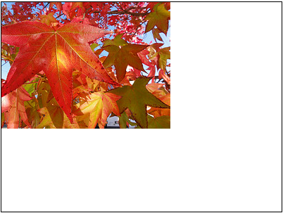
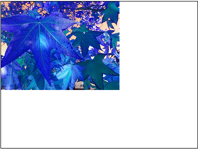
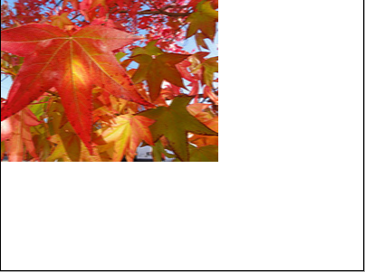

# 二、图像处理

## WebGL 图像处理

在 WebGL 中图像处理是很简单的，多么简单？

为了在 WebGL 中绘制图像，我们需要使用纹理。类似于当渲染代替像素时，WebGL 会需要操作投影矩阵的坐标，WebGL 读取纹理时需要获取纹理坐标。纹理坐标范围是从 0.0 到 1.0。

因为我们仅需要绘制由两个三角形组成的矩形，我们需要告诉 WebGL 在矩阵中纹理对应的那个点。我们可以使用特殊的被称为多变变量，会将这些信息从顶点着色器传递到片段着色器。WebGL 将会插入这些值，这些值会在顶点着色器中，当对每个像素绘制时均会调用片段着色器。

我们需要在纹理坐标传递过程中添加更多的信息，然后将他们传递到片段着色器中。

```js
attribute vec2 a_texCoord;
...
varying vec2 v_texCoord;

void main() {
   ...
   // pass the texCoord to the fragment shader
   // The GPU will interpolate this value between points
   v_texCoord = a_texCoord;
} 
```

然后，我们提供一个片段着色器来查找颜色纹理。

```js
<script id="2d-fragment-shader" type="x-shader/x-fragment">
precision mediump float;

// our texture
uniform sampler2D u_image;

// the texCoords passed in from the vertex shader.
varying vec2 v_texCoord;

void main() {
   // Look up a color from the texture.
   gl_FragColor = texture2D(u_image, v_texCoord);
}
</script> 
```

最后，我们需要加载一个图片，然后创建一个问题，将该图片传递到纹理里面。因为，是在浏览器里面显示，所以图片是异步加载，所以我们安置我们的代码来等待纹理的加载。一旦，加载完成就可以绘制。

```js
function main() {
  var image = new Image();
  image.src = "http://someimage/on/our/server";  // MUST BE SAME DOMAIN!!!
  image.onload = function() {
render(image);
  }
}

function render(image) {
  ...
  // all the code we had before.
  ...
  // look up where the texture coordinates need to go.
  var texCoordLocation = gl.getAttribLocation(program, "a_texCoord");

  // provide texture coordinates for the rectangle.
  var texCoordBuffer = gl.createBuffer();
  gl.bindBuffer(gl.ARRAY_BUFFER, texCoordBuffer);
  gl.bufferData(gl.ARRAY_BUFFER, new Float32Array([
  0.0,  0.0,
  1.0,  0.0,
  0.0,  1.0,
  0.0,  1.0,
  1.0,  0.0,
  1.0,  1.0]), gl.STATIC_DRAW);
  gl.enableVertexAttribArray(texCoordLocation);
  gl.vertexAttribPointer(texCoordLocation, 2, gl.FLOAT, false, 0, 0);

  // Create a texture.
  var texture = gl.createTexture();
  gl.bindTexture(gl.TEXTURE_2D, texture);

  // Set the parameters so we can render any size image.
  gl.texParameteri(gl.TEXTURE_2D, gl.TEXTURE_WRAP_S, gl.CLAMP_TO_EDGE);
  gl.texParameteri(gl.TEXTURE_2D, gl.TEXTURE_WRAP_T, gl.CLAMP_TO_EDGE);
  gl.texParameteri(gl.TEXTURE_2D, gl.TEXTURE_MIN_FILTER, gl.NEAREST);
  gl.texParameteri(gl.TEXTURE_2D, gl.TEXTURE_MAG_FILTER, gl.NEAREST);

  // Upload the image into the texture.
  gl.texImage2D(gl.TEXTURE_2D, 0, gl.RGBA, gl.RGBA, gl.UNSIGNED_BYTE, image);
  ...
} 
```

如下是 WebGL 渲染出来的图像。



下面我们对这个图片进行一些操作，来交换图片中的红色和蓝色。

```js
...
gl_FragColor = texture2D(u_image, v_texCoord).bgra;
... 
```

现在红色和蓝色已经被交换了。效果如下:



假如我们想做一些图像处理，那么我们可以看一下其他像素。自从 WebGL 引用纹理的纹理坐标从 0.0 到 1.0 。然后，我们可以计算移动的多少个像素 `onePixel = 1.0 / textureSize`。

这里有个片段着色器来平均纹理中每个像素的左侧和右侧的像素。

```js
<script id="2d-fragment-shader" type="x-shader/x-fragment">
precision mediump float;

// our texture
uniform sampler2D u_image;
uniform vec2 u_textureSize;

// the texCoords passed in from the vertex shader.
varying vec2 v_texCoord;

void main() {
   // compute 1 pixel in texture coordinates.
   vec2 onePixel = vec2(1.0, 1.0) / u_textureSize;

   // average the left, middle, and right pixels.
   gl_FragColor = (
   texture2D(u_image, v_texCoord) +
   texture2D(u_image, v_texCoord + vec2(onePixel.x, 0.0)) +
   texture2D(u_image, v_texCoord + vec2(-onePixel.x, 0.0))) / 3.0;
}
</script> 
```

然后,我们需要通过 JavaScript 传递出纹理的大小。

```js
...
var textureSizeLocation = gl.getUniformLocation(program, "u_textureSize");
...
// set the size of the image
gl.uniform2f(textureSizeLocation, image.width, image.height);
... 
```

比较上述两个图片



现在，我们知道如何让使用像素卷积内核做一些常见的图像处理。这里，我们会使用 3x3 的内核。卷积内核就是一个 3x3 的矩阵，矩阵中的每个条目代表有多少像素渲染。然后，我们将这个结果除以内核的权重或 1.0.[这里是一个非常好的参考文章](http://docs.gimp.org/en/plug-in-convmatrix.html)。[这里有另一篇文章显示出一些实际代码，它是使用 C++ 写的](http://www.codeproject.com/KB/graphics/ImageConvolution.aspx)。

在我们的例子中我们要在着色器中做这样工作，这里是一个新的片段着色器。

```js
<script id="2d-fragment-shader" type="x-shader/x-fragment">
precision mediump float;

// our texture
uniform sampler2D u_image;
uniform vec2 u_textureSize;
uniform float u_kernel[9];
uniform float u_kernelWeight;

// the texCoords passed in from the vertex shader.
varying vec2 v_texCoord;

void main() {
   vec2 onePixel = vec2(1.0, 1.0) / u_textureSize;
   vec4 colorSum =
 texture2D(u_image, v_texCoord + onePixel * vec2(-1, -1)) * u_kernel[0] +
 texture2D(u_image, v_texCoord + onePixel * vec2( 0, -1)) * u_kernel[1] +
 texture2D(u_image, v_texCoord + onePixel * vec2( 1, -1)) * u_kernel[2] +
 texture2D(u_image, v_texCoord + onePixel * vec2(-1,  0)) * u_kernel[3] +
 texture2D(u_image, v_texCoord + onePixel * vec2( 0,  0)) * u_kernel[4] +
 texture2D(u_image, v_texCoord + onePixel * vec2( 1,  0)) * u_kernel[5] +
 texture2D(u_image, v_texCoord + onePixel * vec2(-1,  1)) * u_kernel[6] +
 texture2D(u_image, v_texCoord + onePixel * vec2( 0,  1)) * u_kernel[7] +
 texture2D(u_image, v_texCoord + onePixel * vec2( 1,  1)) * u_kernel[8] ;

   // Divide the sum by the weight but just use rgb
   // we'll set alpha to 1.0
   gl_FragColor = vec4((colorSum / u_kernelWeight).rgb, 1.0);
}
</script> 
```

在 JavaScript 中，我们需要提供一个卷积内核和它的权重。

```js
 function computeKernelWeight(kernel) {
   var weight = kernel.reduce(function(prev, curr) {
   return prev + curr;
   });
   return weight <= 0 ? 1 : weight;
 }

 ...
 var kernelLocation = gl.getUniformLocation(program, "u_kernel[0]");
 var kernelWeightLocation = gl.getUniformLocation(program, "u_kernelWeight");
 ...
 var edgeDetectKernel = [
 -1, -1, -1,
 -1,  8, -1,
 -1, -1, -1
 ];
 gl.uniform1fv(kernelLocation, edgeDetectKernel);
 gl.uniform1f(kernelWeightLocation, computeKernelWeight(edgeDetectKernel));
 ... 
```

我们在列表框内选择不同的内核。

[`webglfundamentals.org/webgl/webgl-2d-image-3x3-convolution.html`](http://webglfundamentals.org/webgl/webgl-2d-image-3x3-convolution.html)

我们希望通过这篇文章讲解，能够让你觉得使用 WebGL 做图像处理很简单。下面，我们将讲解如何在一个图像上应用更多的效果。

## WebGL 图像处理（续）

这篇文章是 WebGL 图像处理内容扩展。

下一个关于图像处理的显著问题就是如何应用多重效果？读者当然可以尝试着写一下着色器。生成一个 UI 来让用户使用不同的着色器选择他们希望的效果。这通常是不太可能的，因为这个技术通常需要[实时的渲染效果](http://www.youtube.com/watch?v=cQUn0Zeh-0Q)。

一种比较灵活的方式是使用两种或更多的纹理和渲染效果来交替渲染,每次应用一个效果，然后反复应用。

```js
Original Image -> [Blur]-> Texture 1
Texture 1  -> [Sharpen] -> Texture 2
Texture 2  -> [Edge Detect] -> Texture 1
Texture 1  -> [Blur]-> Texture 2
Texture 2  -> [Normal]  -> Canvas 
```

要做到这一点，就需要创建帧缓存区。在 WebGL 和 OpenGL 中，帧缓存区实际上是一个非常不正式的名称。 WebGL/OpenGL 中的帧缓存实际上仅仅是一些状态的集合，而不是真正的缓存。但是，每当一种纹理到达帧缓存，我们就会渲染出这种纹理。

首先让我们把[旧的纹理创建代码](http://webglfundamentals.org/webgl/lessons/webgl-image-processing.html)写成一个函数。

```js
 function createAndSetupTexture(gl) {
var texture = gl.createTexture();
gl.bindTexture(gl.TEXTURE_2D, texture);

// Set up texture so we can render any size image and so we are
// working with pixels.
gl.texParameteri(gl.TEXTURE_2D, gl.TEXTURE_WRAP_S, gl.CLAMP_TO_EDGE);
gl.texParameteri(gl.TEXTURE_2D, gl.TEXTURE_WRAP_T, gl.CLAMP_TO_EDGE);
gl.texParameteri(gl.TEXTURE_2D, gl.TEXTURE_MIN_FILTER, gl.NEAREST);
gl.texParameteri(gl.TEXTURE_2D, gl.TEXTURE_MAG_FILTER, gl.NEAREST);

return texture;
  }

  // Create a texture and put the image in it.
  var originalImageTexture = createAndSetupTexture(gl);
  gl.texImage2D(gl.TEXTURE_2D, 0, gl.RGBA, gl.RGBA, gl.UNSIGNED_BYTE, image); 
```

然后，我们使用这两个函数来生成两种问题，并且附在两个帧缓存中。

```js
// create 2 textures and attach them to framebuffers.
  var textures = [];
  var framebuffers = [];
  for (var ii = 0; ii < 2; ++ii) {
var texture = createAndSetupTexture(gl);
textures.push(texture);

// make the texture the same size as the image
gl.texImage2D(
gl.TEXTURE_2D, 0, gl.RGBA, image.width, image.height, 0,
gl.RGBA, gl.UNSIGNED_BYTE, null);

// Create a framebuffer
var fbo = gl.createFramebuffer();
framebuffers.push(fbo);
gl.bindFramebuffer(gl.FRAMEBUFFER, fbo);

// Attach a texture to it.
gl.framebufferTexture2D(
gl.FRAMEBUFFER, gl.COLOR_ATTACHMENT0, gl.TEXTURE_2D, texture, 0);
  } 
```

现在，我们生成一些核的集合，然后存储到列表里来应用。

```js
 // Define several convolution kernels
  var kernels = {
normal: [
  0, 0, 0,
  0, 1, 0,
  0, 0, 0
],
gaussianBlur: [
  0.045, 0.122, 0.045,
  0.122, 0.332, 0.122,
  0.045, 0.122, 0.045
],
unsharpen: [
  -1, -1, -1,
  -1,  9, -1,
  -1, -1, -1
],
emboss: [
   -2, -1,  0,
   -1,  1,  1,
0,  1,  2
]
  };

  // List of effects to apply.
  var effectsToApply = [
"gaussianBlur",
"emboss",
"gaussianBlur",
"unsharpen"
  ]; 
```

最后，我们应用每一个，然后交替渲染。

```js
// start with the original image
  gl.bindTexture(gl.TEXTURE_2D, originalImageTexture);

  // don't y flip images while drawing to the textures
  gl.uniform1f(flipYLocation, 1);

  // loop through each effect we want to apply.
  for (var ii = 0; ii < effectsToApply.length; ++ii) {
// Setup to draw into one of the framebuffers.
setFramebuffer(framebuffers[ii % 2], image.width, image.height);

drawWithKernel(effectsToApply[ii]);

// for the next draw, use the texture we just rendered to.
gl.bindTexture(gl.TEXTURE_2D, textures[ii % 2]);
  }

  // finally draw the result to the canvas.
  gl.uniform1f(flipYLocation, -1);  // need to y flip for canvas
  setFramebuffer(null, canvas.width, canvas.height);
  drawWithKernel("normal");

  function setFramebuffer(fbo, width, height) {
// make this the framebuffer we are rendering to.
gl.bindFramebuffer(gl.FRAMEBUFFER, fbo);

// Tell the shader the resolution of the framebuffer.
gl.uniform2f(resolutionLocation, width, height);

// Tell webgl the viewport setting needed for framebuffer.
gl.viewport(0, 0, width, height);
  }

  function drawWithKernel(name) {
// set the kernel
gl.uniform1fv(kernelLocation, kernels[name]);

// Draw the rectangle.
gl.drawArrays(gl.TRIANGLES, 0, 6);
  } 
```

下面是更灵活的 UI 的可交互版本。勾选相应的效果即可检查效果。

[`webglfundamentals.org/webgl/webgl-2d-image-processing.html`](http://webglfundamentals.org/webgl/webgl-2d-image-processing.html)

以空值调用 `gl.bindFramebuffer` 即可告诉 WebGL 程序希望渲染到画板而不是帧缓存中的纹理.

WebGL 不得不将[投影矩阵](http://webglfundamentals.org/webgl/lessons/webgl-fundamentals.html)转换为像素。这是基于 `gl.viewport` 的设置。当我们初始化 WebGL 的时候， `gl.viewport` 的设置默认为画板的尺寸。因为，我们会将帧缓存渲染为不同的尺寸，所以画板需要设置合适的视图。

最后，在[原始例子](http://webglfundamentals.org/webgl/lessons/webgl-fundamentals.html)中，当需要渲染的时候，我们会翻转 Y 坐标。这是因为 WebGL 会以 0 来显示面板。 0 表示是左侧底部的坐标，这不同于 2D 图像的顶部左侧的坐标。当渲染为帧缓存时就不需要了。这是因为帧缓存并不会显示出来。其部分是顶部还是底部是无关紧要的。所有重要的就是像素 0，0 在帧缓存里就对应着 0。为了解决这一问题，我们可以通过是否在着色器中添加更多输入信息的方法来设置是否快读交替。

```js
<script id="2d-vertex-shader" type="x-shader/x-vertex">
...
uniform float u_flipY;
...

void main() {
   ...
   gl_Position = vec4(clipSpace * vec2(1, u_flipY), 0, 1);
   ...
}
</script> 
```

当我们渲染的时候，就可以设置它。

```js
 var flipYLocation = gl.getUniformLocation(program, "u_flipY");
  ...
  // don't flip
  gl.uniform1f(flipYLocation, 1);
  ...
  // flip
  gl.uniform1f(flipYLocation, -1); 
```

在这个简单的例子中，通过使用单个 GLSL 程序可以实现多个效果。

如果你想做完整的图像处理你可能需要许多 GLSL 程序。一个程序实现色相、饱和度和亮度调整。另一个实现亮度和对比度。一个实现反相，另一个用于调整水平。你可能需要更改代码以更新 GLSL 程序和更新特定程序的参数。我本来考虑写出这个例子，但这是一个练习，所以最好留给读者自己实现，因为多个 GLSL 项目中每一种方法都有自己的参数，可能意味着需要一些重大重构，这很可能导致成为意大利面条似的大混乱。

我希望从这里和前面的示例中可以看出 WebGL 似乎更平易近人，我希望从 2D 方面入手，以有助于使 WebGL 更容易理解。