# 三、2D 转换、旋转、伸缩、矩阵

## WebGL 2D 图像转换

在学习 3D 相关知识之前，请首先看看 2D 的知识。请保持耐心。这篇文章某些人看起来可能非常简单，但是我们将要讲解的知识是建立在前几篇的文章的基础之上。如果你没有阅读过，我建议你至少阅读第一章之后再回到这里继续学习。

Translation 指的是一些奇特的数学名称，它的基本意思是“移动”某物。它同样适用于将一个句子从英文“移动”成为日语这一说法，但是此处我们谈论的是几何中的移动。通过使用以 [the first post](http://webglfundamentals.org/webgl/lessons/webgl-fundamentals.html) 结尾的代码，你可以仅仅通过修改 setRectangle 距离右边的的值来使矩形移动。如下是一个基于我们[初始示例](http://webglfundamentals.org/webgl/lessons/webgl-fundamentals.html)的代码：

```
  // First lets make some variables 
  // to hold the translation of the rectangle
  var translation = [0, 0];

  // then let's make a function to
  // re-draw everything. We can call this
  // function after we update the translation.

  // Draw a the scene.
  function drawScene() {
    // Clear the canvas.
    gl.clear(gl.COLOR_BUFFER_BIT);

    // Setup a rectangle
    setRectangle(gl, translation[0], translation[1], width, height);

    // Draw the rectangle.
    gl.drawArrays(gl.TRIANGLES, 0, 6);
  }
```

在上面的例子中，我在界面中放置了两个可滑动栏，你可以通过滑动按钮来修改 translation[0] 和 translation[1] 的值，而且在这个两个值发生修改时调用 drawScene 函数对界面进行更新。拖动滑动条对矩阵进行移动。

[`webglfundamentals.org/webgl/webgl-2d-rectangle-translate.html`](http://webglfundamentals.org/webgl/webgl-2d-rectangle-translate.html)

到此处你已经觉得很不错。然而，现在假设我们想要利用相同的操作，但是处理更复杂的图形，那么该如何实现了。

假设我们想要画一个包含 6 个三角形的 'F' 形状，如下所示：

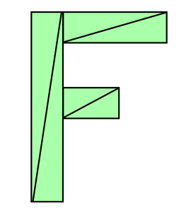

**图片 3.1** F

如下是我们将要使用的改变 setRectangle 值的代码：

```
// Fill the buffer with the values that define a letter 'F'.
function setGeometry(gl, x, y) {
  var width = 100;
  var height = 150;
  var thickness = 30;
  gl.bufferData(
      gl.ARRAY_BUFFER,
      new Float32Array([
          // left column
          x, y,
          x + thickness, y,
          x, y + height,
          x, y + height,
          x + thickness, y,
          x + thickness, y + height,

          // top rung
          x + thickness, y,
          x + width, y,
          x + thickness, y + thickness,
          x + thickness, y + thickness,
          x + width, y,
          x + width, y + thickness,

          // middle rung
          x + thickness, y + thickness * 2,
          x + width * 2 / 3, y + thickness * 2,
          x + thickness, y + thickness * 3,
          x + thickness, y + thickness * 3,
          x + width * 2 / 3, y + thickness * 2,
          x + width * 2 / 3, y + thickness * 3]),
      gl.STATIC_DRAW);
}
```

你会发现画出来的图形伸缩比例不是很好。如果你想画出有几百或者几千条线组成的几何图形，我们就需要编写一些相当复杂的代码。在上面的代码中，每次用 JavaScript 就需要更新所有的点。

有一种更简单的方式。仅仅只需要更新几何图形，接着修改渲染器部分。

如下是渲染器部分：

```
<script id="2d-vertex-shader" type="x-shader/x-vertex">
attribute vec2 a_position;

uniform vec2 u_resolution;
uniform vec2 u_translation;

void main() {
   // Add in the translation.
   vec2 position = a_position + u_translation;

   // convert the rectangle from pixels to 0.0 to 1.0
   vec2 zeroToOne = position / u_resolution;
   ... 
```

接着我们将会稍微重构下代码。我们仅仅需要设置几何图形一次。

```
// Fill the buffer with the values that define a letter 'F'.
function setGeometry(gl) {
  gl.bufferData(
      gl.ARRAY_BUFFER,
      new Float32Array([
          // left column
          0, 0,
          30, 0,
          0, 150,
          0, 150,
          30, 0,
          30, 150,

          // top rung
          30, 0,
          100, 0,
          30, 30,
          30, 30,
          100, 0,
          100, 30,

          // middle rung
          30, 60,
          67, 60,
          30, 90,
          30, 90,
          67, 60,
          67, 90]),
      gl.STATIC_DRAW);
}
```

在实现我们想要的移动之前需要更新下 `u_translation` 变量的值。

```
  ...
  var translationLocation = gl.getUniformLocation(
             program, "u_translation");
  ...
  // Set Geometry.
  setGeometry(gl);
  ..
  // Draw scene.
  function drawScene() {
    // Clear the canvas.
    gl.clear(gl.COLOR_BUFFER_BIT);

    // Set the translation.
    gl.uniform2fv(translationLocation, translation);

    // Draw the rectangle.
    gl.drawArrays(gl.TRIANGLES, 0, 18);
  }
```

注意 `setGeometry` 只是被调用一次。在 drawScene 中不需要。

如下是一个示例。同样，你可以通过拖动滑动条来更新图形的位置。

[`webglfundamentals.org/webgl/webgl-2d-geometry-translate-better.html`](http://webglfundamentals.org/webgl/webgl-2d-geometry-translate-better.html)

现在，当我们绘制 WebGL 图像就包括要实现上面所有的事。我们所作的所有事指的是设置移动变量接着调用函数进行绘制。即使我们的几何图形包含成千上万的点，main 代码仍然是相同的。

## WebGL 2D 图像旋转

首先我要承认下我不是很清楚如何讲解这个让它看起来更容易理解，但是，不管怎么样，我想尽力尝试下。首先，我想介绍下什么叫做“单位圆”。你如果还记得高中数学中(不要睡着了！)一个圆又一个半径。半径指的是从圆心到圆的圆边的距离。单位圆指的是它的半径是 1.0。

如下是一个单位圆：

[`webglfundamentals.org/webgl/unit-circle.html`](http://webglfundamentals.org/webgl/unit-circle.html)

打开上面的链接之后，你可以拖动圆环上面的小圆，接着 X 和 Y 的值也会随之发生变化。这个左边值表示的是圆环上的点。在圆上的最高点处，Y 为 1 和 X 为 0。在最右的位置时 X 为 1 和 Y 为 0。

如果你还记得基础的三年级数学，把某个数乘以 1 以后结果仍然是该数。那么 123*1 = 123。相当基础对吧？那么半径为 1.0 的单位圆也是一种形式的 1。它是一种旋转的 1。因此你可以将这个单位圆与某物相乘，它执行的操作和乘以 1 类似，除了一些奇异的事情发生改变这种方式。

我们将从单位圆上得到任何点的 X 和 Y 值，接着将他们乘以[上一节示例](http://webglfundamentals.org/webgl/lessons/webgl-2d-translation.html)中的几何图形。

如下是更新渲染器：

```
<script id="2d-vertex-shader" type="x-shader/x-vertex">
attribute vec2 a_position;

uniform vec2 u_resolution;
uniform vec2 u_translation;
uniform vec2 u_rotation;

void main() {
  // Rotate the position
  vec2 rotatedPosition = vec2(
 a_position.x * u_rotation.y + a_position.y * u_rotation.x,
 a_position.y * u_rotation.y - a_position.x * u_rotation.x);

  // Add in the translation.
  vec2 position = rotatedPosition + u_translation; 
```

接着修改 JavaScript 代码，这样我们就可以传递上面的两个参数：

```
...
  var rotationLocation = gl.getUniformLocation(program, "u_rotation");
  ...
  var rotation = [0, 1];
  ..
  // Draw the scene.
  function drawScene() {
    // Clear the canvas.
    gl.clear(gl.COLOR_BUFFER_BIT);

    // Set the translation.
    gl.uniform2fv(translationLocation, translation);

    // Set the rotation.
    gl.uniform2fv(rotationLocation, rotation);

    // Draw the rectangle.
    gl.drawArrays(gl.TRIANGLES, 0, 18);
  }
```

如下是代码运行的结果。拖动单位圆上的小环使图形进行旋转或者拖动滑动条使图形进行移动。

[`webglfundamentals.org/webgl/webgl-2d-geometry-rotation.html`](http://webglfundamentals.org/webgl/webgl-2d-geometry-rotation.html)

为什么上面的代码能够起作用？首先，让我们看下数学公式：

```
rotatedX = a_position.x * u_rotation.y + a_position.y * u_rotation.x;
rotatedY = a_position.y * u_rotation.y - a_position.x * u_rotation.x;
```

假设你有一个矩形，并且你想旋转它。在你把它旋转到右上角 (3.0，9.0) 这个位置之前。我们先在单位圆中选择一个从 12 点钟的位置顺时针偏移 30 度的点。

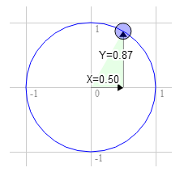

**图片 3.2** 30 degrees clockwise from 12 o'clock

在圆上那个位置的点的坐标为 0.50 和 0.87：

```
3.0 * 0.87 + 9.0 * 0.50 = 7.1
9.0 * 0.87 - 3.0 * 0.50 = 6.3 
```

那刚刚好是我们需要的位置：

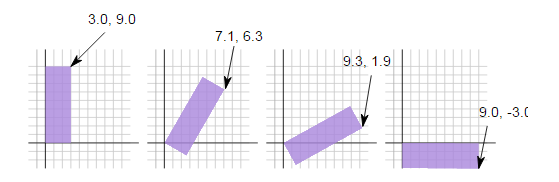

**图片 3.3** rotate rectangle

旋转 60 度和上面的操作一样：

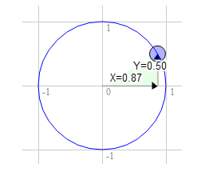

**图片 3.4** rotate 60 degrees

圆上面的位置的坐标是 0.87 和 0.50:

```
 3.0 * 0.50 + 9.0 * 0.87 = 9.3
 9.0 * 0.50 - 3.0 * 0.87 = 1.9 
```

你可以发现当我们顺时针向右旋转那个点时，X 的值变得更大而 Y 的值在变小。如果接着旋转超过 90 度，X 的值将再次变小而 Y 的值将变得更大。这个形式就能够达到旋转的目的。

圆环上的那些点还有另外一个名称。他们被称作为 sine 和 cosine。因此，对任意给定的角度，我们就只需查询它所对应的 sine 和 cosine 值：

```
function printSineAndCosineForAnyAngle(angleInDegrees) {
  var angleInRadians = angleInDegrees * Math.PI / 180;
  var s = Math.sin(angleInRadians);
  var c = Math.cos(angleInRadians);
  console.log("s = " + s + " c = " + c);
}
```

如果你把上面的代码复制粘贴到 JavaScript 控制台中，接着输入 `printSineAndCosineForAnyAngle(30)`，接着你会看到输出 `s = 0.49 c = 0.87`(注意：这个数字是近似值。)

如果你把上面的代码整合在一起的话，你就可以将你的几何体按照你想要的任何角度进行旋转。仅仅只需要将你需要旋转的角度值传给 sine 和 cosine 就可以了。

```
 ...
  var angleInRadians = angleInDegrees * Math.PI / 180;
  rotation[0] = Math.sin(angleInRadians);
  rotation[1] = Math.cos(angleInRadians);
```

如下是设置一个角度旋转的版本。拖动滑动条旋转或者移动。

[`webglfundamentals.org/webgl/webgl-2d-geometry-rotation-angle.html`](http://webglfundamentals.org/webgl/webgl-2d-geometry-rotation-angle.html)

## WebGL 2D 图像伸缩

图像伸缩和[转换](http://webglfundamentals.org/webgl/lessons/webgl-2d-translation.html)一样简单。我们只需对需要变换的点乘以我们想要的比例。如下是从[以前的代码](http://webglfundamentals.org/webgl/lessons/webgl-2d-rotation.html)改变而来的。

```
<script id="2d-vertex-shader" type="x-shader/x-vertex">
attribute vec2 a_position;

uniform vec2 u_resolution;
uniform vec2 u_translation;
uniform vec2 u_rotation;
uniform vec2 u_scale;

void main() {
  // Scale the positon
  vec2 scaledPosition = a_position * u_scale;

  // Rotate the position
  vec2 rotatedPosition = vec2(
 scaledPosition.x * u_rotation.y + scaledPosition.y * u_rotation.x,
 scaledPosition.y * u_rotation.y - scaledPosition.x * u_rotation.x);

  // Add in the translation.
  vec2 position = rotatedPosition + u_translation; 
```

接着当我们需要绘图时添加必要的 JavaScript 代码来设置伸缩比例。

```
 ...
  var scaleLocation = gl.getUniformLocation(program, "u_scale");
  ...
  var scale = [1, 1];
  ...
  // Draw the scene.
  function drawScene() {
    // Clear the canvas.
    gl.clear(gl.COLOR_BUFFER_BIT);

    // Set the translation.
    gl.uniform2fv(translationLocation, translation);

    // Set the rotation.
    gl.uniform2fv(rotationLocation, rotation);

    // Set the scale.
    gl.uniform2fv(scaleLocation, scale);

    // Draw the rectangle.
    gl.drawArrays(gl.TRIANGLES, 0, 18);
  }
```

现在我们就可以通过拖动滑动条对图像进行伸缩变换。

[`webglfundamentals.org/webgl/webgl-2d-geometry-scale.html`](http://webglfundamentals.org/webgl/webgl-2d-geometry-scale.html)

需要注意的一件事是如果设置伸缩比例为负值，那么几何图形就会发生翻转。

希望这相邻的三篇文章能够帮助你理解图形转换，旋转和伸缩。接下来我们将讲解拥有魔力的矩阵，它能够很容易的将这三种操作集合在一起，而且通常是更有用的形式。

## WebGL 2D 矩阵

在前面三篇文章中我们讲解了如何平移几何图形，如何旋转几何图形，如何伸缩变换图形。平移，旋转和伸缩都被认为是一种变化类型。每一种变化都需要改变渲染器，而且他们依赖于操作的顺序。在[前面的例子](http://webglfundamentals.org/webgl/lessons/webgl-2d-scale.html)中我们进行了伸缩，旋转和平移操作。如果他们执行操作的顺序改变将会得到不同的结果。例如 XY 伸缩变换为 2，1，旋转 30%，接着平移变换 100，0。

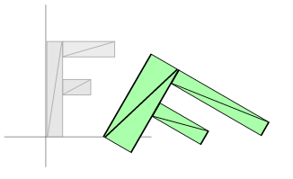

**图片 3.5** transformation1

如下是平移 100，0，旋转 30%，接着伸缩变换 2，1。

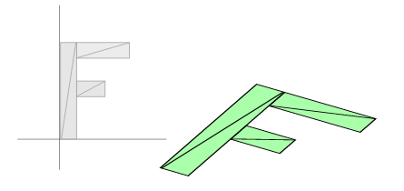

**图片 3.6** transformation2

结果是完全不同的。更糟糕的是，如果我们需要得到的是第二个示例的效果，就必须编写一个不同的渲染器，按照我们想要的执行顺序进行平移，旋转和伸缩变换。

然而，有些比我聪明的人利用数学中的矩阵能够解决上面这个问题。对于 2d 图形，使用一个 3X3 的矩阵。3X3 的矩阵类似了 9 宫格。

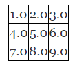

**图片 3.7** 9 boxes

数学中的操作是与列相乘然后把结果加在一起。一个位置有两个值，用 x 和 y 表示。但是为了实现这个需要三个值，因为我们对第三个值设为 1。

在上面的例子中就变成了：

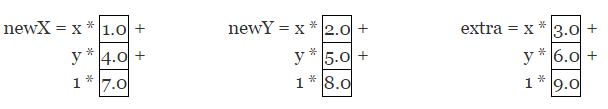

**图片 3.8** matrix transformation

对于上面的处理你也许会想“这样处理的原因在哪里”。假设要执行平移变换。我们将想要执行的平移的总量为 tx 和 ty。构造如下的矩阵：

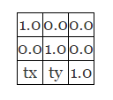

**图片 3.9** matrix

接着进行计算：

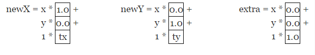

**图片 3.10** multiply matrix

如果你还记得代数学，就可以那些乘积结果为零的位置。乘以 1 的效果相当于什么都没做，那么将计算简化看看发生了什么：

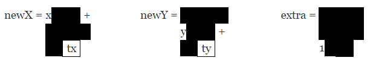

**图片 3.11** simplify result

或者更简洁的方式：

```
newX = x + tx;
newY = y + ty; 
```

extra 变量我们并不用在意。这个处理和我们在平移中编写的代码惊奇的相似。

同样地，让我们看看旋转。正如在旋转那篇中指出当我们想要进行旋转的时候，我们只需要角度的 sine 和 cosine 值。

```
s = Math.sin(angleToRotateInRadians);
c = Math.cos(angleToRotateInRadians); 
```

构造如下的矩阵：

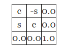

**图片 3.12** rotate_matrix

执行上面的矩形操作：

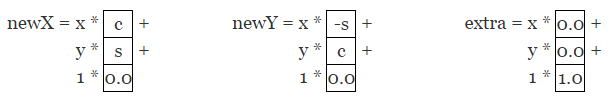

**图片 3.13** rotate_apply_matrix

将得到 0 和 1 结果部分用黑色块表示了。

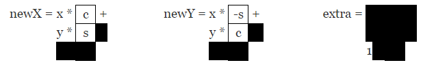

**图片 3.14** rotate_matrix_result

同样可以简化计算：

```
newX = x * c + y * s;
newY = x * -s + y * c; 
```

上面处理的结果刚好和[旋转例子](http://webglfundamentals.org/webgl/lessons/webgl-2d-rotation.html)效果一样。

最后是伸缩变换。称两个伸缩变换因子为 sx 和 sy。

构造如下的矩阵：

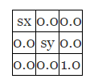

**图片 3.15** scale_matrix

进行矩阵操作会得到如下：

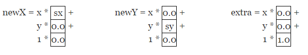

**图片 3.16** scale apply matrix

实际需要计算：

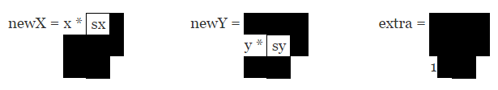

**图片 3.17** scale matrix result

简化为：

```
newX = x * sx;
newY = y * sy; 
```

和我们以前讲解的[伸缩示例](http://webglfundamentals.org/webgl/lessons/webgl-2d-scale.html)是一样的。

到了这里，我坚信你仍然在思考，这样处理之后了？有什么意义。看起来好象它只是做了和我们以前一样的事。

接下来就是魔幻的地方。已经被证明了我们可以将多个矩阵乘在一起，接着一次执行完所有的变换。假设有函数 `matrixMultiply`，它带两个矩阵做参数，将他们俩相乘，返回乘积结果。

为了让上面的做法更清楚，于是编写如下的函数构建一个用来平移，旋转和伸缩的矩阵：

```
function makeTranslation(tx, ty) {
  return [
    1, 0, 0,
    0, 1, 0,
    tx, ty, 1
  ];
}

function makeRotation(angleInRadians) {
  var c = Math.cos(angleInRadians);
  var s = Math.sin(angleInRadians);
  return [
    c,-s, 0,
    s, c, 0,
    0, 0, 1
  ];
}

function makeScale(sx, sy) {
  return [
    sx, 0, 0,
    0, sy, 0,
    0, 0, 1
  ];
}
```

接下来，修改渲染器。以往的渲染器是如下的形式：

```
<script id="2d-vertex-shader" type="x-shader/x-vertex">
attribute vec2 a_position;

uniform vec2 u_resolution;
uniform vec2 u_translation;
uniform vec2 u_rotation;
uniform vec2 u_scale;

void main() {
  // Scale the positon
  vec2 scaledPosition = a_position * u_scale;

  // Rotate the position
  vec2 rotatedPosition = vec2(
scaledPosition.x * u_rotation.y + scaledPosition.y * u_rotation.x,
   scaledPosition.y * u_rotation.y - scaledPosition.x * u_rotation.x);

  // Add in the translation.
  vec2 position = rotatedPosition + u_translation;
  ... 
```

新的渲染器将会变得更简单：

```
<script id="2d-vertex-shader" type="x-shader/x-vertex">
attribute vec2 a_position;

uniform vec2 u_resolution;
uniform mat3 u_matrix;

void main() {
  // Multiply the position by the matrix.
  vec2 position = (u_matrix * vec3(a_position, 1)).xy;
  ... 
```

如下是我们使用它的方式：

```
// Draw the scene.
  function drawScene() {
    // Clear the canvas.
    gl.clear(gl.COLOR_BUFFER_BIT);

    // Compute the matrices
    var translationMatrix = makeTranslation(translation[0], translation[1]);
    var rotationMatrix = makeRotation(angleInRadians);
    var scaleMatrix = makeScale(scale[0], scale[1]);

    // Multiply the matrices.
    var matrix = matrixMultiply(scaleMatrix, rotationMatrix);
    matrix = matrixMultiply(matrix, translationMatrix);

    // Set the matrix.
    gl.uniformMatrix3fv(matrixLocation, false, matrix);

    // Draw the rectangle.
    gl.drawArrays(gl.TRIANGLES, 0, 18);
  }
```

如下是使用新的代码的示例。平移，旋转和伸缩滑动条是一样的。但是他们在渲染器上应用的更简单。

[`webglfundamentals.org/webgl/webgl-2d-geometry-matrix-transform.html`](http://webglfundamentals.org/webgl/webgl-2d-geometry-matrix-transform.html)

此时，你仍然会问，之后了？这个看起来并没有方便多少。然而，此时如果你想改变执行的顺序，就不再需要编写一个新的渲染器了。我们仅仅只需要改变数序公式。

```
  ...
    // Multiply the matrices.
    var matrix = matrixMultiply(translationMatrix, rotationMatrix);
    matrix = matrixMultiply(matrix, scaleMatrix);
    ...
```

如下是新版本:

[`webglfundamentals.org/webgl/webgl-2d-geometry-matrix-transform-trs.html`](http://webglfundamentals.org/webgl/webgl-2d-geometry-matrix-transform-trs.html)

能够按照这种方式执行矩阵操作是特别重要的，特别是对于层级动画的实现比如身体上手臂的，在一个星球上看月球同时在围绕着太阳旋转，或者数上的树枝等都是很重要的。举一个简单的层级动画例子，现在想要绘制 5 次 ‘F’，但是每次绘制是从上一个 ‘F’ 开始的。

```
  // Draw the scene.
  function drawScene() {
    // Clear the canvas.
    gl.clear(gl.COLOR_BUFFER_BIT);

    // Compute the matrices
    var translationMatrix = makeTranslation(translation[0], translation[1]);
    var rotationMatrix = makeRotation(angleInRadians);
    var scaleMatrix = makeScale(scale[0], scale[1]);

    // Starting Matrix.
    var matrix = makeIdentity();

    for (var i = 0; i < 5; ++i) {
      // Multiply the matrices.
      matrix = matrixMultiply(matrix, scaleMatrix);
      matrix = matrixMultiply(matrix, rotationMatrix);
      matrix = matrixMultiply(matrix, translationMatrix);

      // Set the matrix.
      gl.uniformMatrix3fv(matrixLocation, false, matrix);

      // Draw the geometry.
      gl.drawArrays(gl.TRIANGLES, 0, 18);
    }
  }
```

为了实现这个，我们要编写自己的函数 `makeIdentity`，这个函数返回单位矩阵。单位矩阵实际上表示的类似于 1.0 的矩阵，如果一个矩阵乘以单位矩阵，那么得到的还是原先那个矩阵。就如：

```
X*1 = X 
```

同样：

```
matrixX*identity = matrixX 
```

如下是构造单位矩阵的代码：

```
function makeIdentity() {
  return [
    1, 0, 0,
    0, 1, 0,
    0, 0, 1
  ];
}
```

如下是 5 个 F：

[`webglfundamentals.org/webgl/webgl-2d-geometry-matrix-transform-hierarchical.html`](http://webglfundamentals.org/webgl/webgl-2d-geometry-matrix-transform-hierarchical.html)

再来一个示例，在前面示例中，‘F’ 旋转总是绕坐上角。这是因为我们使用的数学方法总是围着源点旋转，并且 ‘F’ 的左上角就是原点，(0，0)。

但是现在，因为我们能够使用矩阵，那么就可以选择变化的顺序，可以在执行其他的变换之前先移动原点。

```
 // make a matrix that will move the origin of the 'F' to its center.
    var moveOriginMatrix = makeTranslation(-50, -75);
    ...

    // Multiply the matrices.
    var matrix = matrixMultiply(moveOriginMatrix, scaleMatrix);
    matrix = matrixMultiply(matrix, rotationMatrix);
    matrix = matrixMultiply(matrix, translationMatrix);
```

如下所示，注意 F 可以围着中心点进行旋转和伸缩。

[`webglfundamentals.org/webgl/webgl-2d-geometry-matrix-transform-center-f.html`](http://webglfundamentals.org/webgl/webgl-2d-geometry-matrix-transform-center-f.html)

使用如上的方法，你可以围着任何点进行旋转或者伸缩。现在你就明白了 Photoshop 或者 Flash 中实现绕某点旋转的原理。

让我们学习更深入点。如果你回到本系列的第一篇文章 WebGL 基本原理，你也许还记得我们编写的渲染器的代码中将像素转换成投影空间，如下所示：

```
  ...
  // convert the rectangle from pixels to 0.0 to 1.0
  vec2 zeroToOne = position / u_resolution;

  // convert from 0->1 to 0->2
  vec2 zeroToTwo = zeroToOne * 2.0;

  // convert from 0->2 to -1->+1 (clipspace)
  vec2 clipSpace = zeroToTwo - 1.0;

  gl_Position = vec4(clipSpace * vec2(1, -1), 0, 1);
```

如果你现在反过来看下每一步，第一步，“将像素变换成 0.0 变成 1.0”，其实是一个伸缩操作。第二步同样是伸缩变换。接下来是平移变换，并且 Y 的伸缩因子是 -1。我们可以通过将该矩阵传给渲染器实现上面的所有操作。可以构造二维伸缩矩阵，其中一个伸缩因子设置为 1.0/分辨率，另外一个伸缩因子设置为 2.0，第三个使用 -1.0，-1.0 来进行移动，并且第四个设置伸缩因子 Y 为 -1，接着将他们乘在一起，然而，因为数学是很容易的，我们仅仅只需编写一个函数，能够直接将给定的分辨率转换成投影矩阵。

```
function make2DProjection(width, height) {
  // Note: This matrix flips the Y axis so that 0 is at the top.
  return [
    2 / width, 0, 0,
    0, -2 / height, 0,
    -1, 1, 1
  ];
}
```

现在我们能进一步简化渲染器。如下是完整的顶点渲染器。

```
<script id="2d-vertex-shader" type="x-shader/x-vertex">
attribute vec2 a_position;

uniform mat3 u_matrix;

void main() {
  // Multiply the position by the matrix.
  gl_Position = vec4((u_matrix * vec3(a_position, 1)).xy, 0, 1);
}
</script> 
```

在 JavaScript 中我们需要与投影矩阵相乘。

```
  // Draw the scene.
  function drawScene() {
    ...
    // Compute the matrices
    var projectionMatrix = make2DProjection(
        canvas.clientWidth, canvas.clientHeight);
    ...

    // Multiply the matrices.
    var matrix = matrixMultiply(scaleMatrix, rotationMatrix);
    matrix = matrixMultiply(matrix, translationMatrix);
    matrix = matrixMultiply(matrix, projectionMatrix);
    ...
  }
```

我们也移出了设置分辨率的代码。最后一步，通过使用数学矩阵就将原先需要 6-7 步操作复杂的渲染器变成仅仅只需要 1 步操作的更简单的渲染器。

[`webglfundamentals.org/webgl/webgl-2d-geometry-matrix-transform-with-projection.html`](http://webglfundamentals.org/webgl/webgl-2d-geometry-matrix-transform-with-projection.html)

希望这篇文章能够让你理解矩阵数学。接下来会讲解 3D 空间的知识。在 3D 中矩阵数学遵循同样的规律和使用方式。从 2D 开始讲解是希望让知识简单易懂。