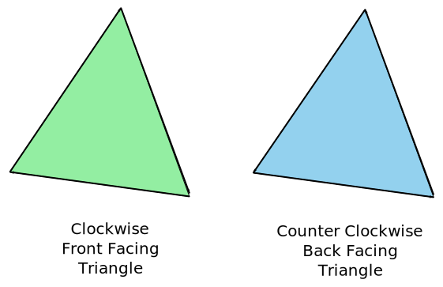
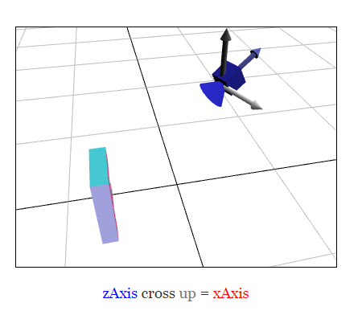

# 四、3D

## WebGL 正交 3D

在上一篇文章中，我们就学习过二维矩阵是如何进行工作的。我们谈到的平移，旋转，缩放，甚至像素到剪辑空间的投影都可以通过一个矩阵和一些神奇的矩阵数学来完成。做三维只是一个从那里向前的一小步。

在我们以前的二维的例子中，我们有二维点（x，y），我们乘以一个 3x3 的矩阵。做三维我们需要三维点（x，y，z）和一个 4x4 矩阵。

让我们看最后一个例子，把它改为三维，我们将再次使用一个 F，但这一次的三维 'F'。

我们需要做的第一件事就是改变顶点着色来处理三维，这里是旧的着色。

```
<script id="2d-vertex-shader" type="x-shader/x-vertex">
attribute vec2 a_position;

uniform mat3 u_matrix;

void main() {
  // Multiply the position by the matrix.
  gl_Position = vec4((u_matrix * vec3(a_position, 1)).xy, 0, 1);
}
</script> 
```

下面是新的

```
<script id="3d-vertex-shader" type="x-shader/x-vertex">
attribute vec4 a_position;

uniform mat4 u_matrix;

void main() {
  // Multiply the position by the matrix.
  gl_Position = u_matrix * a_position;
}
</script> 
```

它甚至更简单！

然后我们需要提供三维数据。

```
 ...

  gl.vertexAttribPointer(positionLocation, 3, gl.FLOAT, false, 0, 0);

  ...

// Fill the buffer with the values that define a letter 'F'.
function setGeometry(gl) {
  gl.bufferData(
      gl.ARRAY_BUFFER,
      new Float32Array([
          // left column
            0,   0,  0,
           30,   0,  0,
            0, 150,  0,
            0, 150,  0,
           30,   0,  0,
           30, 150,  0,

          // top rung
           30,   0,  0,
          100,   0,  0,
           30,  30,  0,
           30,  30,  0,
          100,   0,  0,
          100,  30,  0,

          // middle rung
           30,  60,  0,
           67,  60,  0,
           30,  90,  0,
           30,  90,  0,
           67,  60,  0,
           67,  90,  0]),
      gl.STATIC_DRAW);
} 
```

接下来，我们需要把所有的矩阵函数从二维变到三维

这是 maketranslation，makerotation 和 makescale 的二维（前面的）版本

```
function makeTranslation(tx, ty) {
  return [
    1, 0, 0,
    0, 1, 0,
    tx, ty, 1
  ];
}

function makeRotation(angleInRadians) {
  var c = Math.cos(angleInRadians);
  var s = Math.sin(angleInRadians);
  return [
    c,-s, 0,
    s, c, 0,
    0, 0, 1
  ];
}

function makeScale(sx, sy) {
  return [
    sx, 0, 0,
    0, sy, 0,
    0, 0, 1
  ];
} 
```

这是更新的三维版本。

```
function makeTranslation(tx, ty, tz) {
  return [
     1,  0,  0,  0,
     0,  1,  0,  0,
     0,  0,  1,  0,
     tx, ty, tz, 1
  ];
}

function makeXRotation(angleInRadians) {
  var c = Math.cos(angleInRadians);
  var s = Math.sin(angleInRadians);

  return [
    1, 0, 0, 0,
    0, c, s, 0,
    0, -s, c, 0,
    0, 0, 0, 1
  ];
};

function makeYRotation(angleInRadians) {
  var c = Math.cos(angleInRadians);
  var s = Math.sin(angleInRadians);

  return [
    c, 0, -s, 0,
    0, 1, 0, 0,
    s, 0, c, 0,
    0, 0, 0, 1
  ];
};

function makeZRotation(angleInRadians) {
  var c = Math.cos(angleInRadians);
  var s = Math.sin(angleInRadians);
  return [
     c, s, 0, 0,
    -s, c, 0, 0,
     0, 0, 1, 0,
     0, 0, 0, 1,
  ];
}

function makeScale(sx, sy, sz) {
  return [
    sx, 0,  0,  0,
    0, sy,  0,  0,
    0,  0, sz,  0,
    0,  0,  0,  1,
  ];
} 
```

注意，我们现在有 3 个旋转函数。在二维中我们只需要一个旋转函数，因为我们只需要绕 Z 轴旋转。现在虽然做三维我们也希望能够绕 X 轴和 Y 轴旋转。你可以从中看出，它们都非常相似。如果我们让它们工作，你会看到它们像以前一样简化

Z 旋转

<

p align="center"> newX = x * c + y * s;

<

p align="center"> newY = x * -s + y * c;

Y 旋转

<

p align="center"> newX = x * c + z * s;

<

p align="center"> newZ = x * -s + z * c;

X 旋转

<

p align="center"> newY = y * c + z * s;

<

p align="center"> newZ = y * -s + z * c;

它给你这些旋转。

我们还需要更新投影函数。这是旧的

```
function make2DProjection(width, height) {
  // Note: This matrix flips the Y axis so 0 is at the top.
  return [
    2 / width, 0, 0,
    0, -2 / height, 0,
    -1, 1, 1
  ];
} 
```

它从像素转换到剪辑空间。作为我们扩展到三维的第一次尝试，让我们试一下

```
function make2DProjection(width, height, depth) {
  // Note: This matrix flips the Y axis so 0 is at the top.
  return [
     2 / width, 0, 0, 0,
     0, -2 / height, 0, 0,
     0, 0, 2 / depth, 0,
    -1, 1, 0, 1,
  ];
} 
```

就像我们需要把 X 和 Y 从像素转换到剪辑空间，对于 Z 我们需要做同样的事情。在这种情况下，我们制作 Z 空间像素单元。我会把一些类似 *width* 的值传入 depth ，所以我们的空间宽度为 0 到宽度像素，高为 0 到高度像素，但深度是 -depth / 2 到 +depth / 2。

最后，我们需要更新计算矩阵的代码。

```
 // Compute the matrices
  var projectionMatrix =
      make2DProjection(canvas.clientWidth, canvas.clientHeight, 400);
  var translationMatrix =
      makeTranslation(translation[0], translation[1], translation[2]);
  var rotationXMatrix = makeXRotation(rotation[0]);
  var rotationYMatrix = makeYRotation(rotation[1]);
  var rotationZMatrix = makeZRotation(rotation[2]);
  var scaleMatrix = makeScale(scale[0], scale[1], scale[2]);

  // Multiply the matrices.
  var matrix = matrixMultiply(scaleMatrix, rotationZMatrix);
  matrix = matrixMultiply(matrix, rotationYMatrix);
  matrix = matrixMultiply(matrix, rotationXMatrix);
  matrix = matrixMultiply(matrix, translationMatrix);
  matrix = matrixMultiply(matrix, projectionMatrix);

  // Set the matrix.
  gl.uniformMatrix4fv(matrixLocation, false, matrix); 
```

下面是例子。

[`webglfundamentals.org/webgl/webgl-3d-step1.html`](http://webglfundamentals.org/webgl/webgl-3d-step1.html)

我们的第一个问题是几何体是一个平面的 F，这使得很难看到任何 3D。为了解决这个问题让我们将几何体扩展到三维。我们目前的 F 由 3 个矩形组成，每个有 2 个三角形。为使其成为三维将需要 16 个矩形。太多了就不列举在这里了。16 个矩形，每个有 2 个三角形，每个三角形有 3 个顶点，一共是 96 个顶点。如果你想看到所有的视图来源的样本。

我们必须画更多的顶点，因此

```
 // Draw the geometry.
    gl.drawArrays(gl.TRIANGLES, 0, 16 * 6); 
```

这是这个版本

[`webglfundamentals.org/webgl/webgl-3d-step2.html`](http://webglfundamentals.org/webgl/webgl-3d-step2.html)

移动滚动条，很难说它是 3D 的。让我们尝试一种不同的颜色着色每个矩形。要做到这一点，我们将为我们的顶点着色添加另一个属性和 varying 来把它从顶点着色传到到片段着色。

这里是新的顶点着色

```
<script id="3d-vertex-shader" type="x-shader/x-vertex">
attribute vec4 a_position;
attribute vec4 a_color;

uniform mat4 u_matrix;

varying vec4 v_color;

void main() {
  // Multiply the position by the matrix.
  gl_Position = u_matrix * a_position;

  // Pass the color to the fragment shader.
  v_color = a_color;
}
</script> 
```

我们需要在片段着色器中使用颜色

```
<script id="3d-vertex-shader" type="x-shader/x-fragment">
precision mediump float;

// Passed in from the vertex shader.
varying vec4 v_color;

void main() {
   gl_FragColor = v_color;
}
</script> 
```

我们需要查找提供颜色的 location，然后设置另一个缓冲和属性给它的颜色。

```
 ...
  var colorLocation = gl.getAttribLocation(program, "a_color");

  ...
  // Create a buffer for colors.
  var buffer = gl.createBuffer();
  gl.bindBuffer(gl.ARRAY_BUFFER, buffer);
  gl.enableVertexAttribArray(colorLocation);

  // We'll supply RGB as bytes.
  gl.vertexAttribPointer(colorLocation, 3, gl.UNSIGNED_BYTE, true, 0, 0);

  // Set Colors.
  setColors(gl);

  ...
// Fill the buffer with colors for the 'F'.

function setColors(gl) {
  gl.bufferData(
      gl.ARRAY_BUFFER,
      new Uint8Array([
          // left column front
        200,  70, 120,
        200,  70, 120,
        200,  70, 120,
        200,  70, 120,
        200,  70, 120,
        200,  70, 120,

          // top rung front
        200,  70, 120,
        200,  70, 120,
        ...
        ...
      gl.STATIC_DRAW);
} 
```

现在我们得到这个。

[`webglfundamentals.org/webgl/webgl-3d-step3.html`](http://webglfundamentals.org/webgl/webgl-3d-step3.html)

哦，那是什么？好了，它把三维 ‘F’的各个部分，前面，后面，边等等按它们出现在我们的几何体里的顺序画。这并不能给我们带来预期的结果，因为有时在后面的那些要在前面的那些之后画。

在 WebGL 中的三角形有前向和后向的概念。一个正向的三角形的顶点以顺时针方向画。后向的三角形的顶点按逆时针方向画。



WebGL 也只有向前或向后画三角形的能力。我们可以使用这个功能

```
 gl.enable(gl.CULL_FACE); 
```

我们只做了一次，就在我们程序的开始。这个功能开启后， WebGL 的默认 “culling” 后向三角形。在这里 “culling” 是 "not drawing" 的意思。

注意到就 WebGL 而言，一个三角形是顺时针或逆时针取决于剪辑空间中该三角形的顶点。换句话说，WebGL 通过你在顶点着色器的顶点上应用的数学函数辨别三角形是前面或后面。这意味着例如在 X 轴按 -1 度量的顺时针三角形成为一个逆时针或顺时针三角形三角形旋转 180 度成为一个逆时针三角形。因为我们使 CULL_FACE 失去作用，我们就能看到顺时针（前）和逆时针（回）三角形。现在我们打开它，任何时候一个前置三角形因为缩放或旋转或是什么原因左右翻转，WebGL 就不会画。这是一件好事，因为当你在三维空间里的时候，你通常想要的是正面面对你的那个三角形。

CULL_FACE 打开后，这是我们得到的

[`webglfundamentals.org/webgl/webgl-3d-step4.html`](http://webglfundamentals.org/webgl/webgl-3d-step4.html)

嘿！所有的三角形都去哪儿了？事实证明，它们中的许多都面朝着错误的方向。旋转它，当你看向另一边是你会看到他们出现了。幸运的是这很容易解决。我们只看哪一个是朝后的，并且交换 2 个顶点。例如，如果一个一个朝后的三角形是

```
 1,   2,   3,
          40,  50,  60,
         700, 800, 900, 
```

我们只是翻转最后两个顶点以使它朝前。

```
 1,   2,   3,
         700, 800, 900,
          40,  50,  60, 
```

这样处理所有的后向三角形让我们得到

[`webglfundamentals.org/webgl/webgl-3d-step5.html`](http://webglfundamentals.org/webgl/webgl-3d-step5.html)

这更接近，但仍然有一个问题。甚至所有三角形面对在正确的方向，后向三角形被剔除，我们还有应该在后面的三角形被画在前面三角形应该被画的地方。

进入深度缓冲区。

深度缓冲，有时被称为一个 Z-缓冲，是一个 *depth* 像素的矩形区域，每个彩色像素的深度像素用于形成图像。随着 WebGL 绘制每个彩色像素它还可以画一个深度像素。它做这些都基于我们从顶点着色器返回的 Z 的值。就像我们不得不转换剪辑空间对 X 和 Y，我们在剪辑空间也对 Z 做同样处理或（- 1 至 + 1）。该值，然后转换成一个深度空间值（0 至 1）。在 WebGL 绘制一个彩色像素之前它会检查相应的深度像素。如果要画的像素深度值大于相应的深度像素 WebGL 就不画新的彩色像素。否则，它从你的片段着色器绘制颜色的新的彩色像素，并且根据新的深度值绘制深度像素。这意味着，在其他像素后面的像素不会被绘制。

我们可以打开这个功能就像打开 culling 一样简单，用下面语句

```
 gl.enable(gl.DEPTH_TEST); 
```

我们还需要在我们开始绘画之前清除深度缓冲回到 1.0。

```
 // Draw the scene.
  function drawScene() {
    // Clear the canvas AND the depth buffer.
    gl.clear(gl.COLOR_BUFFER_BIT | gl.DEPTH_BUFFER_BIT);
    ... 
```

现在我们得到

[`webglfundamentals.org/webgl/webgl-3d-step6.html`](http://webglfundamentals.org/webgl/webgl-3d-step6.html)

这是一个 3D!

## WebGL 3D 透视

在上一篇文章中，我们就学习过如何做三维，但三维没有任何透视。它是利用一个所谓的“正交”的观点，它固然有其用途，但这通常不是人们说 “3D” 时他们想要的。

相反，我们需要补充透视。只不过什么是透视？它基本上是一种事物越远显得更小的特征。


看上面的例子，我们看到越远的东西被画得越小。鉴于我们目前样品的一个让较远的物体显得更小简单的方法就是将 clipspace X 和 Y 除以 Z。

可以这样想：如果你有一条从（10，15）到 (20,15) 的线段，10 个单位长。在我们目前的样本中，它将绘制 10 像素长。但是如果我们除以 Z，例如例子中如果是 Z 是 1

```
10 / 1 = 10
20 / 1 = 20
abs(10-20) = 10
```

这将是 10 像素，如果 Z 是 2，则有

```
10 / 2 = 5
20 / 2 = 10
abs(5 - 10) = 5
```

5 像素长。如果 Z = 3，则有

```
10 / 3 = 3.333
20 / 3 = 6.666
abs(3.333 - 6.666) = 3.333
```

你可以看到，随着 Z 的增加，随着它变得越来越远，我们最终会把它画得更小。如果我们在 clipspace 中除，我们可能得到更好的结果，因为 Z 将是一个较小的数字（-1 到 +1）。如果在除之前我们加一个 fudgeFactor 乘以 Z，对于一个给定的距离我们可以调整事物多小。

让我们尝试一下。首先让我们在乘以我们的 “fudgefactor” 后改变顶点着色器除以 Z 。

```
<script id="2d-vertex-shader" type="x-shader/x-vertex">
...
uniform float u_fudgeFactor;
...
void main() {
  // Multiply the position by the matrix.
  vec4 position = u_matrix * a_position;

  // Adjust the z to divide by
  float zToDivideBy = 1.0 + position.z * u_fudgeFactor;

  // Divide x and y by z.
  gl_Position = vec4(position.xy / zToDivideBy, position.zw);
}
</script> 
```

注意，因为在 clipspace 中 Z 从 -1 到 +1，我加 1 得到 **zToDivideBy** 从 0 到 +2 * fudgeFactor

我们也需要更新代码，让我们设置 fudgeFactor。

```
 ...
  var fudgeLocation = gl.getUniformLocation(program, "u_fudgeFactor");

  ...
  var fudgeFactor = 1;
  ...
  function drawScene() {
    ...
    // Set the fudgeFactor
    gl.uniform1f(fudgeLocation, fudgeFactor);

    // Draw the geometry.
    gl.drawArrays(gl.TRIANGLES, 0, 16 * 6); 
```

下面是结果。

[`webglfundamentals.org/webgl/webgl-3d-perspective.html`](http://webglfundamentals.org/webgl/webgl-3d-perspective.html)

如果没有明确的把 “fudgefactor” 从 1 变化到 0 来看事物看起来像什么样子在我们除以 Z 之前。


WebGL 在我们的顶点着色器中把 X，Y，Z，W 值分配给 **gl_Position** 并且自动除以 W。

我们可以证明通过改变着色这很容易实现，而不是自己做除法，在 **gl_Position.w** 中加 **zToDivideBy** 。

```
<script id="2d-vertex-shader" type="x-shader/x-vertex">
...
uniform float u_fudgeFactor;
...
void main() {
  // Multiply the position by the matrix.
  vec4 position = u_matrix * a_position;

  // Adjust the z to divide by
  float zToDivideBy = 1.0 + position.z * u_fudgeFactor;

  // Divide x, y and z by zToDivideBy
  gl_Position = vec4(position.xyz,  zToDivideBy);
}
</script> 
```

看看这是完全相同的。

[`webglfundamentals.org/webgl/webgl-3d-perspective-w.html`](http://webglfundamentals.org/webgl/webgl-3d-perspective-w.html)

为什么有这样一个事实： WebGL 自动除以 W ？因为现在，使用更多维的矩阵，我们可以使用另一个矩阵复制 z 到 w。

矩阵如下

```
1, 0, 0, 0,
0, 1, 0, 0,
0, 0, 1, 1,
0, 0, 0, 0,
```

将复制 z 到 w.你可以看看这些列如下

```
x_out = x_in * 1 +
        y_in * 0 +
        z_in * 0 +
        w_in * 0 ;

y_out = x_in * 0 +
        y_in * 1 +
        z_in * 0 +
        w_in * 0 ;

z_out = x_in * 0 +
        y_in * 0 +
        z_in * 1 +
        w_in * 0 ;

w_out = x_in * 0 +
        y_in * 0 +
        z_in * 1 +
        w_in * 0 ;
```

简化后如下

```
x_out = x_in;
y_out = y_in;
z_out = z_in;
w_out = z_in;
```

我们可以加 1 我们之前用的这个矩阵，因为我们知道 w_in 总是 1.0。

```
1, 0, 0, 0,
0, 1, 0, 0,
0, 0, 1, 1,
0, 0, 0, 1,
```

这将改变 W 计算如下

```
w_out = x_in * 0 +
        y_in * 0 +
        z_in * 1 +
        w_in * 1 ;
```

因为我们知道 w_in = 1.0 所以就有

```
w_out = z_in + 1;
```

最后我们可以将 fudgeFactor 加到矩阵，矩阵如下

```
1, 0, 0, 0,
0, 1, 0, 0,
0, 0, 1, fudgeFactor,
0, 0, 0, 1,
```

这意味着

```
w_out = x_in * 0 +
        y_in * 0 +
        z_in * fudgeFactor +
        w_in * 1 ;
```

简化后如下

```
w_out = z_in * fudgeFactor + 1;
```

所以，让我们再次修改程序只使用矩阵。　　　　

首先让我们放回顶点着色器。这很简单

```
<script id="2d-vertex-shader" type="x-shader/x-vertex">
uniform mat4 u_matrix;

void main() {
  // Multiply the position by the matrix.
  gl_Position = u_matrix * a_position;
  ...
}
</script> 
```

接下来让我们做一个函数使 Z - > W 矩阵。

```
function makeZToWMatrix(fudgeFactor) {
  return [
    1, 0, 0, 0,
    0, 1, 0, 0,
    0, 0, 1, fudgeFactor,
    0, 0, 0, 1,
  ];
} 
```

我们将更改代码，以使用它。

```
 ...
    // Compute the matrices
    var zToWMatrix =
        makeZToWMatrix(fudgeFactor);

    ...

    // Multiply the matrices.
    var matrix = matrixMultiply(scaleMatrix, rotationZMatrix);
    matrix = matrixMultiply(matrix, rotationYMatrix);
    matrix = matrixMultiply(matrix, rotationXMatrix);
    matrix = matrixMultiply(matrix, translationMatrix);
    matrix = matrixMultiply(matrix, projectionMatrix);
    matrix = matrixMultiply(matrix, zToWMatrix);

    ... 
```

注意，这一次也是完全相同的。

[`webglfundamentals.org/webgl/webgl-3d-perspective-w-matrix.html`](http://webglfundamentals.org/webgl/webgl-3d-perspective-w-matrix.html)

以上基本上是向你们展示，除以 Z 给了我们透视图，WebGL 方便地为我们除以 Z。　　　　

但是仍然有一些问题。例如如果你设置 Z 到 -100 左右，你会看到类似下面的动画。


发生了什么事？为什么 F 消失得很早？就像 WebGL 剪辑 X 和 Y 或+ 1 到 - 1 它也剪辑 Z。这里看到的就是 Z＜-1 的地方。

我可以详细了解如何解决它，但你可以以我们做二维投影相同的方式来[得到它](http://stackoverflow.com/a/28301213/128511)。我们需要利用 Z，添加一些数量和测量一定量，我们可以做任何我们想要得到的 -1 到 1 的映射范围。

真正酷的事情是所有这些步骤可以在 1 个矩阵内完成。甚至更好的，我们来决定一个 **fieldOfView** 而不是一个 **fudgeFactor**，并且计算正确的值来做这件事。

这里有一个函数来生成矩阵。

```
function makePerspective(fieldOfViewInRadians, aspect, near, far) {
  var f = Math.tan(Math.PI * 0.5 - 0.5 * fieldOfViewInRadians);
  var rangeInv = 1.0 / (near - far);

  return [
    f / aspect, 0, 0, 0,
    0, f, 0, 0,
    0, 0, (near + far) * rangeInv, -1,
    0, 0, near * far * rangeInv * 2, 0
  ];
}; 
```

这个矩阵将为我们做所有的转换。它将调整单位，所以他们在 clipspace 中它会做数学运算，因此我们可以通过角度选择视野，它会让我们选择我们的 z-clipping 空间。它假定有一个 eye 或 camera 在原点（0，0，0）并且给定一个 zNear 和 fieldOfView 计算它需要什么，因此在 zNear 的物体在 z = - 1 结束以及在 zNear 的物体它们在中心以上或以下半个 fieldOfView，分别在 y = - 1 和 y = 1 结束。计算 X 所使用的只是乘以传入的 aspect。我们通常将此设置为显示区域的 width / height。最后，它计算出在 Z 区域物体的规模，因此在 zFar 的物体在 z = 1 处结束。

下面是动作矩阵的图。

[`webglfundamentals.org/webgl/frustum-diagram.html`](http://webglfundamentals.org/webgl/frustum-diagram.html)

形状像四面锥的立方体旋转称为“截锥”。矩阵在截锥内占空间并且转换到 clipspace。zNear 定义夹在前面的物体，zfar 定义夹在后面的物体。设置 zNear 为 23 你会看到旋转的立方体的前面得到裁剪。设置 zFar 为 24 你会看到立方体的后面得到剪辑。

只剩下一个问题。这个矩阵假定有一个视角在 0，0，0 并假定它在 Z 轴负方向，Y 的正方向。我们的矩阵到目前为止已经以不同的方式解决问题。为了使它工作，我们需要我们的对象在前面的视图。

我们可以通过移动我们的 F 做到。 我们在（45，150，0）绘图。让我们将它移到（0，150，- 360）

现在，要想使用它，我们只需要用对 makePerspective 的调用取代对 make2DProjection 旧的调用

```
 var aspect = canvas.clientWidth / canvas.clientHeight;
    var projectionMatrix =
        makePerspective(fieldOfViewRadians, aspect, 1, 2000);
    var translationMatrix =
        makeTranslation(translation[0], translation[1], translation[2]);
    var rotationXMatrix = makeXRotation(rotation[0]);
    var rotationYMatrix = makeYRotation(rotation[1]);
    var rotationZMatrix = makeZRotation(rotation[2]);
    var scaleMatrix = makeScale(scale[0], scale[1], scale[2]); 
```

结果如下

[`webglfundamentals.org/webgl/webgl-3d-perspective-matrix.html`](http://webglfundamentals.org/webgl/webgl-3d-perspective-matrix.html)

我们回到了一个矩阵乘法，我们得到两个领域的视图，我们可以选择我们的 z 空间。受篇幅限制我们没有做。下一节，摄像机。

## WebGL 3D 摄像机

在过去的章节里我们将 F 移动到截锥的前面，因为 **makePerspective** 函数从原点（0，0，0）度量它，并且截锥的对象从 -zNear 到 -zFar 都在它前面。

视点前面移动的物体似乎没有正确的方式去做吗？在现实世界中，你通常会移动你的相机来给建筑物拍照。

将摄像机移动到对象前


你通常不会将建筑移动到摄像机前。

将对象移动到摄像机前


但在我们最后一篇文章中，我们提出了一个投影，这就需要物体在 Z 轴的原点前面。为了实现它，我们想做的是把摄像机移动到原点，然后把所有的其它物体都移动恰当的距离，所以它相对于摄像机仍然是在同一个地方。

将对象移动到视图


我们需要有效地将现实中的物体移动到摄像机的前面。能达到这个目的的最简单的方法是使用“逆”矩阵。一般情况下的逆矩阵的计算是复杂的，但从概念上讲，它是容易的。逆是你用来作为其他数值的对立的值。例如，123 的是相反数是 -123。缩放比例为 5 的规模矩阵的逆是 1/5 或 0.2。在 X 域旋转 30° 的矩阵的逆是一个在 X 域旋转 -30° 的矩阵。

直到现在我们已经使用了平移，旋转和缩放来影响我们的 'F' 的位置和方向。把所有的矩阵相乘后，我们有一个单一的矩阵，表示如何将 “F” 以我们希望的大小和方向从原点移动到相应位置。使用摄像机我们可以做相同的事情。一旦我们的矩阵告诉我们如何从原点到我们想要的位置移动和旋转摄像机，我们就可以计算它的逆，它将给我们一个矩阵来告诉我们如何移动和旋转其它一切物体的相对数量，这将有效地使摄像机在点（0，0，0），并且我们已经将一切物体移动到它的前面。

让我们做一个有一圈 'F' 的三维场景，就像上面的图表那样。

下面是实现代码。

```
 var numFs = 5;
  var radius = 200;

  // Compute the projection matrix
  var aspect = canvas.clientWidth / canvas.clientHeight;
  var projectionMatrix =
      makePerspective(fieldOfViewRadians, aspect, 1, 2000);

  // Draw 'F's in a circle
  for (var ii = 0; ii < numFs; ++ii) {
    var angle = ii * Math.PI * 2 / numFs;

    var x = Math.cos(angle) * radius;
    var z = Math.sin(angle) * radius;
    var translationMatrix = makeTranslation(x, 0, z);

    // Multiply the matrices.
    var matrix = translationMatrix;
    matrix = matrixMultiply(matrix, projectionMatrix);

    // Set the matrix.
    gl.uniformMatrix4fv(matrixLocation, false, matrix);

    // Draw the geometry.
    gl.drawArrays(gl.TRIANGLES, 0, 16 * 6);
  } 
```

就在我们计算出我们的投影矩阵之后，我们就可以计算出一个就像上面的图表中显示的那样围绕 ‘F’ 旋转的摄像机。

```
 // Compute the camera's matrix
  var cameraMatrix = makeTranslation(0, 0, radius * 1.5);
  cameraMatrix = matrixMultiply(
      cameraMatrix, makeYRotation(cameraAngleRadians)); 
```

然后，我们根据相机矩阵计算“视图矩阵”。“视图矩阵”是将一切物体移动到摄像机相反的位置，这有效地使摄像机相对于一切物体就像在原点（0,0,0）。

```
 // Make a view matrix from the camera matrix.
  var viewMatrix = makeInverse(cameraMatrix); 
```

最后我们需要应用视图矩阵来计算每个 ‘F’ 的矩阵

```
 // Multiply the matrices.
    var matrix = translationMatrix;
    matrix = matrixMultiply(matrix, viewMatrix);  // <=-- added
    matrix = matrixMultiply(matrix, projectionMatrix); 
```

一个摄像机可以绕着一圈 “F”。拖动 **cameraAngle** 滑块来移动摄像机。

[`webglfundamentals.org/webgl/webgl-3d-camera.html`](http://webglfundamentals.org/webgl/webgl-3d-camera.html)

这一切都很好，但使用旋转和平移来移动一个摄像头到你想要的地方，并且指向你想看到的地方并不总是很容易。例如如果我们想要摄像机总是指向特定的　‘F’　就要进行一些非常复杂的数学计算来决定当摄像机绕　‘F’　圈旋转的时候如何旋转摄像机来指向那个　‘F’。

幸运的是，有一个更容易的方式。我们可以决定摄像机在我们想要的地方并且可以决定它指向什么，然后计算矩阵，这个矩阵可以将把摄像机放到那里。基于矩阵的工作原理这非常容易实现。

首先，我们需要知道我们想要摄像机在什么位置。我们将称之为 **CameraPosition**。然后我们需要了解我们看过去或瞄准的物体的位置。我们将把它称为 **target**。如果我们将 **CameraPosition** 减去 **target** 我们将得到一个向量，它指向从摄像头获取目标的方向。让我们称它为 **zAxis**。因为我们知道摄像机指向 -Z 方向，我们可以从另一方向做减法 **cameraPosition - target**。我们将结果规范化，并直接复制到 **z** 区域矩阵。

```
+----+----+----+----+
|    |    |    |    |
+----+----+----+----+
|    |    |    |    |
+----+----+----+----+
| Zx | Zy | Zz |    |
+----+----+----+----+
|    |    |    |    |
+----+----+----+----+
```

这部分矩阵表示的是 Z 轴。在这种情况下，是摄像机的 Z 轴。一个向量的标准化意味着它代表了 1.0。如果你回到二维旋转的文章，在哪里我们谈到了如何与单位圆以及二维旋转，在三维中我们需要单位球面和一个归一化的向量来代表在单位球面上一点。


虽然没有足够的信息。只是一个单一的向量给我们一个点的单位范围内，但从这一点到东方的东西？我们需要把矩阵的其他部分填好。特别的 X 轴和 Y 轴类零件。我们知道这 3 个部分是相互垂直的。我们也知道，“一般”我们不把相机指向。因为，如果我们知道哪个方向是向上的，在这种情况下（0,1,0），我们可以使用一种叫做“跨产品和“计算 X 轴和 Y 轴的矩阵。

我不知道一个跨产品意味着在数学方面。我所知道的是，如果你有 2 个单位向量和你计算的交叉产品，你会得到一个向量，是垂直于这 2 个向量。换句话说，如果你有一个向量指向东南方，和一个向量指向上，和你计算交叉产品，你会得到一个向量指向北西或北东自这 2 个向量，purpendicular 到东南亚和。根据你计算交叉产品的顺序，你会得到相反的答案。



现在，我们有 **xAxis**，我们可以通过 **zAxis** 和 **xAxis** 得到摄像机的 **yAxis**


现在我们所要做的就是将 3 个轴插入一个矩阵。这使得矩阵可以指向物体，从 **cameraPosition** 指向 **target**。我们只需要添加 **position**

```
+----+----+----+----+
| Xx | Xy | Xz |  0 |  <- x axis
+----+----+----+----+
| Yx | Yy | Yz |  0 |  <- y axis
+----+----+----+----+
| Zx | Zy | Zz |  0 |  <- z axis
+----+----+----+----+
| Tx | Ty | Tz |  1 |  <- camera position
+----+----+----+----+
```

下面是用来计算 2 个向量的交叉乘积的代码。

```
function cross(a, b) {
  return [a[1] * b[2] - a[2] * b[1],
          a[2] * b[0] - a[0] * b[2],
          a[0] * b[1] - a[1] * b[0]];
} 
```

这是减去两个向量的代码。

```
function subtractVectors(a, b) {
  return [a[0] - b[0], a[1] - b[1], a[2] - b[2]];
} 
```

这里是规范化一个向量（使其成为一个单位向量）的代码。

```
function normalize(v) {
  var length = Math.sqrt(v[0] * v[0] + v[1] * v[1] + v[2] * v[2]);
  // make sure we don't divide by 0.
  if (length > 0.00001) {
    return [v[0] / length, v[1] / length, v[2] / length];
  } else {
    return [0, 0, 0];
  }
} 
```

下面是计算一个 "lookAt" 矩阵的代码。

```
function makeLookAt(cameraPosition, target, up) {
  var zAxis = normalize(
      subtractVectors(cameraPosition, target));
  var xAxis = cross(up, zAxis);
  var yAxis = cross(zAxis, xAxis);

  return [
     xAxis[0], xAxis[1], xAxis[2], 0,
     yAxis[0], yAxis[1], yAxis[2], 0,
     zAxis[0], zAxis[1], zAxis[2], 0,
     cameraPosition[0],
     cameraPosition[1],
     cameraPosition[2],
     1];
} 
```

这是我们如何使用它来使相机随着我们移动它指向在一个特定的 ‘F’ 的。

```
 ...

  // Compute the position of the first F
  var fPosition = [radius, 0, 0];

  // Use matrix math to compute a position on the circle.
  var cameraMatrix = makeTranslation(0, 50, radius * 1.5);
  cameraMatrix = matrixMultiply(
      cameraMatrix, makeYRotation(cameraAngleRadians));

  // Get the camera's postion from the matrix we computed
  cameraPosition = [
      cameraMatrix[12],
      cameraMatrix[13],
      cameraMatrix[14]];

  var up = [0, 1, 0];

  // Compute the camera's matrix using look at.
  var cameraMatrix = makeLookAt(cameraPosition, fPosition, up);

  // Make a view matrix from the camera matrix.
  var viewMatrix = makeInverse(cameraMatrix);

  ... 
```

下面是结果。

[`webglfundamentals.org/webgl/webgl-3d-camera-look-at.html`](http://webglfundamentals.org/webgl/webgl-3d-camera-look-at.html)

拖动滑块，注意到相机追踪一个 ‘F’。

请注意，您可以不只对摄像机使用 “lookAt” 函数。共同的用途是使一个人物的头跟着某人。使小塔瞄准一个目标。使对象遵循一个路径。你计算目标的路径。然后你计算出目标在未来几分钟在路径的什么地方。把这两个值放进你的 lookAt 函数，你会得到一个矩阵，使你的对象跟着路径并且朝向路径。