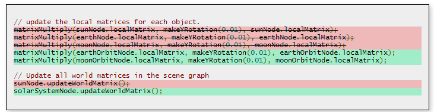

# 五、结构与组织

## WebGL - 更少的代码，更多的乐趣

WebGL 程序要求你编写必须编译和链接的着色器程序，然后你需要查看对于这些着色器程序的输入的位置。这些输入被称为制服和属性，同时用来查找它们的位置的代码可能是冗长而乏味的。

假设我们已经有了[用来编译和链接着色器程序的 WebGL 代码的典型样本](http://webglfundamentals.org/webgl/lessons/webgl-boilerplate.html)。下面给出了一组着色器。

顶点着色器：

```js
uniform mat4 u_worldViewProjection;
uniform vec3 u_lightWorldPos;
uniform mat4 u_world;
uniform mat4 u_viewInverse;
uniform mat4 u_worldInverseTranspose;

attribute vec4 a_position;
attribute vec3 a_normal;
attribute vec2 a_texcoord;

varying vec4 v_position;
varying vec2 v_texCoord;
varying vec3 v_normal;
varying vec3 v_surfaceToLight;
varying vec3 v_surfaceToView;

void main() {
  v_texCoord = a_texcoord;
  v_position = (u_worldViewProjection * a_position);
  v_normal = (u_worldInverseTranspose * vec4(a_normal, 0)).xyz;
  v_surfaceToLight = u_lightWorldPos - (u_world * a_position).xyz;
  v_surfaceToView = (u_viewInverse[3] - (u_world * a_position)).xyz;
  gl_Position = v_position;
} 
```

片段着色器：

```js
precision mediump float;

varying vec4 v_position;
varying vec2 v_texCoord;
varying vec3 v_normal;
varying vec3 v_surfaceToLight;
varying vec3 v_surfaceToView;

uniform vec4 u_lightColor;
uniform vec4 u_ambient;
uniform sampler2D u_diffuse;
uniform vec4 u_specular;
uniform float u_shininess;
uniform float u_specularFactor;

vec4 lit(float l ,float h, float m) {
  return vec4(1.0,
  max(l, 0.0),
  (l > 0.0) ? pow(max(0.0, h), m) : 0.0,
  1.0);
}

void main() {
  vec4 diffuseColor = texture2D(u_diffuse, v_texCoord);
  vec3 a_normal = normalize(v_normal);
  vec3 surfaceToLight = normalize(v_surfaceToLight);
  vec3 surfaceToView = normalize(v_surfaceToView);
  vec3 halfVector = normalize(surfaceToLight + surfaceToView);
  vec4 litR = lit(dot(a_normal, surfaceToLight),
dot(a_normal, halfVector), u_shininess);
  vec4 outColor = vec4((
  u_lightColor * (diffuseColor * litR.y + diffuseColor * u_ambient +
u_specular * litR.z * u_specularFactor)).rgb,
  diffuseColor.a);
  gl_FragColor = outColor;
} 
```

你最终不得不像以下这样编写代码，来对所有要绘制的各种各样的值进行查找和设置。

```js
// At initialization time
var u_worldViewProjectionLoc   = gl.getUniformLocation(program, "u_worldViewProjection");
var u_lightWorldPosLoc = gl.getUniformLocation(program, "u_lightWorldPos");
var u_worldLoc = gl.getUniformLocation(program, "u_world");
var u_viewInverseLoc   = gl.getUniformLocation(program, "u_viewInverse");
var u_worldInverseTransposeLoc = gl.getUniformLocation(program, "u_worldInverseTranspose");
var u_lightColorLoc= gl.getUniformLocation(program, "u_lightColor");
var u_ambientLoc   = gl.getUniformLocation(program, "u_ambient");
var u_diffuseLoc   = gl.getUniformLocation(program, "u_diffuse");
var u_specularLoc  = gl.getUniformLocation(program, "u_specular");
var u_shininessLoc = gl.getUniformLocation(program, "u_shininess");
var u_specularFactorLoc= gl.getUniformLocation(program, "u_specularFactor");

var a_positionLoc  = gl.getAttribLocation(program, "a_position");
var a_normalLoc= gl.getAttribLocation(program, "a_normal");
var a_texCoordLoc  = gl.getAttribLocation(program, "a_texcoord");

// At init or draw time depending on use.
var someWorldViewProjectionMat = computeWorldViewProjectionMatrix();
var lightWorldPos  = [100, 200, 300];
var worldMat   = computeWorldMatrix();
var viewInverseMat = computeInverseViewMatrix();
var worldInverseTransposeMat   = computeWorldInverseTransposeMatrix();
var lightColor = [1, 1, 1, 1];
var ambientColor   = [0.1, 0.1, 0.1, 1];
var diffuseTextureUnit = 0;
var specularColor  = [1, 1, 1, 1];
var shininess  = 60;
var specularFactor = 1;

// At draw time
gl.useProgram(program);

// Setup all the buffers and attributes
gl.bindBuffer(gl.ARRAY_BUFFER, positionBuffer);
gl.enableVertexAttribArray(a_positionLoc);
gl.vertexAttribPointer(a_positionLoc, positionNumComponents, gl.FLOAT, false, 0, 0);
gl.bindBuffer(gl.ARRAY_BUFFER, normalBuffer);
gl.enableVertexAttribArray(a_normalLoc);
gl.vertexAttribPointer(a_normalLoc, normalNumComponents, gl.FLOAT, false, 0, 0);
gl.bindBuffer(gl.ARRAY_BUFFER, texcoordBuffer);
gl.enableVertexAttribArray(a_texcoordLoc);
gl.vertexAttribPointer(a_texcoordLoc, texcoordNumComponents, gl.FLOAT, 0, 0);

// Setup the textures used
gl.activeTexture(gl.TEXTURE0 + diffuseTextureUnit);
gl.bindTexture(gl.TEXTURE_2D, diffuseTexture);

// Set all the uniforms.
gl.uniformMatrix4fv(u_worldViewProjectionLoc, false, someWorldViewProjectionMat);
gl.uniform3fv(u_lightWorldPosLoc, lightWorldPos);
gl.uniformMatrix4fv(u_worldLoc, worldMat);
gl.uniformMatrix4fv(u_viewInverseLoc, viewInverseMat);
gl.uniformMatrix4fv(u_worldInverseTransposeLoc, worldInverseTransposeMat);
gl.uniform4fv(u_lightColorLoc, lightColor);
gl.uniform4fv(u_ambientLoc, ambientColor);
gl.uniform1i(u_diffuseLoc, diffuseTextureUnit);
gl.uniform4fv(u_specularLoc, specularColor);
gl.uniform1f(u_shininessLoc, shininess);
gl.uniform1f(u_specularFactorLoc, specularFactor);

gl.drawArrays(...); 
```

这是大量的输入。

这里有许多方法可以用来简化它。其中一项建议是要求 WebGL 告诉我们所有的制服和位置，然后设置函数，来帮助我们建立它们。然后我们可以通过 JavaScript 对象来使设置我们的设置更加容易。如果还是不清楚，我们的代码将会跟以下代码类似

```js
// At initialiation time
var uniformSetters = createUniformSetters(gl, program);
var attribSetters  = createAttributeSetters(gl, program);

var attribs = {
  a_position: { buffer: positionBuffer, numComponents: 3, },
  a_normal:   { buffer: normalBuffer,   numComponents: 3, },
  a_texcoord: { buffer: texcoordBuffer, numComponents: 2, },
};

// At init time or draw time depending on use.
var uniforms = {
  u_worldViewProjection:   computeWorldViewProjectionMatrix(...),
  u_lightWorldPos: [100, 200, 300],
  u_world: computeWorldMatrix(),
  u_viewInverse:   computeInverseViewMatrix(),
  u_worldInverseTranspose: computeWorldInverseTransposeMatrix(),
  u_lightColor:[1, 1, 1, 1],
  u_ambient:   [0.1, 0.1, 0.1, 1],
  u_diffuse:   diffuseTexture,
  u_specular:  [1, 1, 1, 1],
  u_shininess: 60,
  u_specularFactor:1,
};

// At draw time
gl.useProgram(program);

// Setup all the buffers and    attributes
setAttributes(attribSetters, attribs);

// Set all the uniforms and textures used.
setUniforms(uniformSetters, uniforms);

gl.drawArrays(...); 
```

这对于我来说，看起来是很多的更小，更容易，更少的代码。

你甚至可以使用多个 JavaScript 对象，如果那样适合你的话。如下所示

```js
// At initialiation time
var uniformSetters = createUniformSetters(gl, program);
var attribSetters  = createAttributeSetters(gl, program);

var attribs = {
  a_position: { buffer: positionBuffer, numComponents: 3, },
  a_normal:   { buffer: normalBuffer,   numComponents: 3, },
  a_texcoord: { buffer: texcoordBuffer, numComponents: 2, },
};

// At init time or draw time depending
var uniformsThatAreTheSameForAllObjects = {
  u_lightWorldPos: [100, 200, 300],
  u_viewInverse:   computeInverseViewMatrix(),
  u_lightColor:[1, 1, 1, 1],
};

var uniformsThatAreComputedForEachObject = {
  u_worldViewProjection:   perspective(...),
  u_world: computeWorldMatrix(),
  u_worldInverseTranspose: computeWorldInverseTransposeMatrix(),
};

var objects = [
  { translation: [10, 50, 100],
materialUniforms: {
  u_ambient:   [0.1, 0.1, 0.1, 1],
  u_diffuse:   diffuseTexture,
  u_specular:  [1, 1, 1, 1],
  u_shininess: 60,
  u_specularFactor:1,
},
  },
  { translation: [-120, 20, 44],
materialUniforms: {
  u_ambient:   [0.1, 0.2, 0.1, 1],
  u_diffuse:   someOtherDiffuseTexture,
  u_specular:  [1, 1, 0, 1],
  u_shininess: 30,
  u_specularFactor:0.5,
},
  },
  { translation: [200, -23, -78],
materialUniforms: {
  u_ambient:   [0.2, 0.2, 0.1, 1],
  u_diffuse:   yetAnotherDiffuseTexture,
  u_specular:  [1, 0, 0, 1],
  u_shininess: 45,
  u_specularFactor:0.7,
},
  },
];

// At draw time
gl.useProgram(program);

// Setup the parts that are common for all objects
setAttributes(attribSetters, attribs);
setUniforms(uniformSetters, uniformThatAreTheSameForAllObjects);

objects.forEach(function(object) {
  computeMatricesForObject(object, uniformsThatAreComputedForEachObject);
  setUniforms(uniformSetters, uniformThatAreComputedForEachObject);
  setUniforms(unifromSetters, objects.materialUniforms);
  gl.drawArrays(...);
}); 
```

这里有一个使用这些帮助函数的例子

[`webglfundamentals.org/webgl/webgl-less-code-more-fun.html`](http://webglfundamentals.org/webgl/webgl-less-code-more-fun.html)

让我们向前更进一小步。在上面代码中，我们设置了一个拥有我们创建的缓冲区的变量 `attribs`。在代码中不显示设置这些缓冲区的代码。例如，如果你想要设置位置，法线和纹理坐标，你可能会需要这样的代码

```js
// a single triangle
var positions = [0, -10, 0, 10, 10, 0, -10, 10, 0];
var texcoords = [0.5, 0, 1, 1, 0, 1];
var normals   = [0, 0, 1, 0, 0, 1, 0, 0, 1];

var positionBuffer = gl.createBuffer();
gl.bindBuffer(gl.ARRAY_BUFFER, positionBuffer);
gl.bufferData(gl.ARRAY_BUFFER, new Float32Array(positions), gl.STATIC_DRAW);

var texcoordBuffer = gl.createBuffer();
gl.bindBuffer(gl.ARRAY_BUFFER, texcoordsBuffer);
gl.bufferData(gl.ARRAY_BUFFER, new Float32Array(texcoords), gl.STATIC_DRAW);

var normalBuffer = gl.createBuffer();
gl.bindBuffer(gl.ARRAY_BUFFER, normalBuffer);
gl.bufferData(gl.ARRAY_BUFFER, new Float32Array(normals), gl.STATIC_DRAW); 
```

看起来像一种我们也可以简化的模式。

```js
 // a single triangle
var arrays = {
   position: { numComponents: 3, data: [0, -10, 0, 10, 10, 0, -10, 10, 0], },
   texcoord: { numComponents: 2, data: [0.5, 0, 1, 1, 0, 1],   },
   normal:   { numComponents: 3, data: [0, 0, 1, 0, 0, 1, 0, 0, 1],},
};

var bufferInfo = createBufferInfoFromArrays(gl, arrays); 
```

更短！现在我们可以在渲染时间这样做

```js
// Setup all the needed buffers and attributes.
setBuffersAndAttributes(gl, attribSetters, bufferInfo);

...

// Draw the geometry.
gl.drawArrays(gl.TRIANGLES, 0, bufferInfo.numElements); 
```

如下所示

[`webglfundamentals.org/webgl/webgl-less-code-more-fun-triangle.html`](http://webglfundamentals.org/webgl/webgl-less-code-more-fun-triangle.html)

如果我们有 indices，这可能会奏效。setAttribsAndBuffers 将会设置所有的属性，同时用你的 `indices` 来设置 `ELEMENT-ARRAY-BUFFER`。 所以你可以调用 `gl.drawElements`.

```js
// an indexed quad
var arrays = {
   position: { numComponents: 3, data: [0, 0, 0, 10, 0, 0, 0, 10, 0, 10, 10, 0], },
   texcoord: { numComponents: 2, data: [0, 0, 0, 1, 1, 0, 1, 1], },
   normal:   { numComponents: 3, data: [0, 0, 1, 0, 0, 1, 0, 0, 1, 0, 0, 1], },
   indices:  { numComponents: 3, data: [0, 1, 2, 1, 2, 3],   },
};

var bufferInfo = createBufferInfoFromTypedArray(gl, arrays); 
```

同时在渲染时，我们可以调用 `gl.drawElements`，而不是 `gl.drawArrays`。

```js
// Setup all the needed buffers and attributes.
setBuffersAndAttributes(gl, attribSetters, bufferInfo);

...

// Draw the geometry.
gl.drawElements(gl.TRIANGLES, bufferInfo.numElements, gl.UNSIGNED_SHORT, 0); 
```

如下所示

[`webglfundamentals.org/webgl/webgl-less-code-more-fun-quad.html`](http://webglfundamentals.org/webgl/webgl-less-code-more-fun-quad.html)

`createBufferInfoFromArrays` 基本上使一个对象与如下代码相似

```js
 bufferInfo = {
   numElements: 4,// or whatever the number of elements is
   indices: WebGLBuffer,  // this property will not exist if there are no indices
   attribs: {
 a_position: { buffer: WebGLBuffer, numComponents: 3, },
 a_normal:   { buffer: WebGLBuffer, numComponents: 3, },
 a_texcoord: { buffer: WebGLBuffer, numComponents: 2, },
   },
 }; 
```

同时 `setBuffersAndAttributes` 使用这个对象来设置所有的缓冲区和属性。

最后我们可以进展到我之前认为可能太远的地步。给出的 `position` 几乎总是拥有 3 个组件 (x, y, z)，同时 `texcoords` 几乎总是拥有 2 个组件，indices 几乎总是有 3 个组件，同时 normals 总是有 3 个组件，我们就可以让系统来猜想组件的数量。

```js
// an indexed quad
var arrays = {
   position: [0, 0, 0, 10, 0, 0, 0, 10, 0, 10, 10, 0],
   texcoord: [0, 0, 0, 1, 1, 0, 1, 1],
   normal:   [0, 0, 1, 0, 0, 1, 0, 0, 1, 0, 0, 1],
   indices:  [0, 1, 2, 1, 2, 3],
}; 
```

以下是另一个版本。

[`webglfundamentals.org/webgl/webgl-less-code-more-fun-quad-guess.html`](http://webglfundamentals.org/webgl/webgl-less-code-more-fun-quad-guess.html)

我不确认我个人喜欢那种版本。我可能猜测出错，因为它可能猜错。例如，我可能选择在我的 texcoord 属性中添加额外的一组结构坐标，然后它会猜测 2，是错误的。当然，如果它猜错了，你可以像以上示例中那样指定个数。我想我担心的，如果猜测代码改变了人们的日常的情况可能会打破。全都取决于你。一些人喜欢让东西尽量像他们考虑的那样简单。

我们为什么不在着色器程序中查看这些属性来得出组件的数量？那是因为，从一个缓冲区中提供 3 组件 (x, y, z)，但是在着色器中使用 `vec4` 是非常普遍的 。对于属性 WebGL 会自动设置 `w = 1`.但是那意味着，我们不可能很容易的就知道用户的意图，因为他们在他们的着色器中声明的可能与他们提供的组件的数量不匹配。

如果想要寻找更多的模式，如下所示

```js
var program = createProgramFromScripts(gl, ["vertexshader", "fragmentshader"]);
var uniformSetters = createUniformSetters(gl, program);
var attribSetters  = createAttributeSetters(gl, program); 
```

让我们将上述代码简化成如下代码

```js
var programInfo = createProgramInfo(gl, ["vertexshader", "fragmentshader"]); 
```

它将返回与下面代码类似的东西

```js
programInfo = {
   program: WebGLProgram,  // program we just compiled
   uniformSetters: ...,// setters as returned from createUniformSetters,
   attribSetters: ..., // setters as returned from createAttribSetters,
} 
```

那是另一个更小的简化。在我们开始使用多个程序时，它将会派上用场，因为它自动保持与它们的相关联的程序的设定。

[`webglfundamentals.org/webgl/webgl-less-code-more-fun-quad-programinfo.html`](http://webglfundamentals.org/webgl/webgl-less-code-more-fun-quad-programinfo.html)

无论如何，这是我想要编写我自己的 WebGL 程序的风格。在这些教程中的课程中，尽管我已经感觉到我需要使用标准的 **verbose** 方法，这样人们就不会对 WebGL 是什么和什么是我自己的风格感到困惑。在一些点上，尽管显示所有的可以获取这些点的方式的步骤，所以继续学习这些课程的可以在这种风格中被使用。

在你自己的代码中随便使用这种风格。 `createUniformSetters`, `createAttributeSetters`, `createBufferInfoFromArrays`, `setUniforms` 和 `setBuffersAndAttributes` 这些函数都包含在 [webgl-utils.js](https://github.com/greggman/webgl-fundamentals/blob/master/webgl/resources/webgl-utils.js) 文件中，可以在所有的例子中使用。如果你想要一些更多有组织的东西，可以查看 [TWGL.js](http://twgljs.org/)。

## WebGL 绘制多个东西

在 WebGL 中第一次得到东西后最常见的问题之一是，我怎样绘制多个东西。

除了少数例外情况，首先要意识到的东西是，WebGL 就像某人写的包含某个函数，而不是向函数中传递大量参数，相反，你有一个独自的函数来绘制东西，同时有 70 + 函数来为一个函数设置状态。因此，例如假设你有一个可以绘制一个圆的函数。你可以像如下一样编写程序

```js
function drawCircle(centerX, centerY, radius, color) { ... } 
```

或者你可以像如下一样编写代码

```js
var centerX;
var centerY;
var radius;
var color;

function setCenter(x, y) {
   centerX = x;
   centerY = y;
}

function setRadius(r) {
   radius = r;
}

function setColor(c) {
   color = c;
}

function drawCircle() {
   ...
} 
```

WebGL 以第二种方式工作。函数，诸如 `gl.createBuffer`, `gl.bufferData`, `gl.createTexture` 和 `gl.texImage2D`，让你可以上传缓冲区（ 顶点 ）和质地 （ 颜色，等等 ）数据到 **WebGL**。`gl.createProgram`, `gl.createShader`, `gl.compileProgram` 和 `gl.linkProgram` 让你可以创建你的 **GLSL** 着色器。当 `gl.drawArrays`或者 `gl.drawElements` 函数被调用时，几乎所有的 **WebGL** 的其余函数都正在设置要被使用的全局变量或者状态。

我们知道，这个典型的 WebGL 程序基本上遵循这个结构。

在初始化时

*   创建所有的着色器和程序

*   创建缓冲区和上传顶点数据

*   创建质地和上传质地数据

在渲染时

*   清除并且设置视区和其他全局状态（启用深度测试，开启扑杀，等等）

*   对于你想要绘制的每一件事

    *   为你想要书写的程序调用 `gl.useProgram`

        *   为你想要绘制的东西设置属性

        *   对于每个属性调用 `gl.bindBuffer`, `gl.vertexAttribPointer`, `gl.enableVertexAttribArray` 函数

        *   为你想要绘制的东西设置制服

        *   为每一个制服调用 `gl.uniformXXX`

        *   调用 `gl.activeTexture` 和 `gl.bindTexture` 来为质地单元分配质地

        *   调用 `gl.drawArrays` 或者 `gl.drawElements`

这就是最基本的。怎样组织你的代码来完成这一任务取决于你。

一些事情诸如上传质地数据（ 甚至顶点数据 ）可能会异步的发生，因为你需要等待他们在网上下载完。

让我们来做一个简单的应用程序来绘制 3 种东西。一个立方体，一个球体和一个圆锥体。

我不会去详谈如何计算立方体，球体和圆锥体的数据。假设我们有函数来创建它们，然后我们返回在之前篇章中介绍的 bufferInfo 对象。

所以这里是代码。我们的着色器，与从我们的[角度看示例](http://webglfundamentals.org/webgl/lessons/webgl-3d-perspective.html)的一个简单着色器相同，除了我们已经通过添加另外一个 `u-colorMult` 来增加顶点颜色。

```js
// Passed in from the vertex shader.
varying vec4 v_color;

uniform vec4 u_colorMult;

void main() {
   gl_FragColor = v_color * u_colorMult;
} 
```

在初始化时

```js
// Our uniforms for each thing we want to draw
var sphereUniforms = {
  u_colorMult: [0.5, 1, 0.5, 1],
  u_matrix: makeIdentity(),
};
var cubeUniforms = {
  u_colorMult: [1, 0.5, 0.5, 1],
  u_matrix: makeIdentity(),
};
var coneUniforms = {
  u_colorMult: [0.5, 0.5, 1, 1],
  u_matrix: makeIdentity(),
};

// The translation for each object.
var sphereTranslation = [  0, 0, 0];
var cubeTranslation   = [-40, 0, 0];
var coneTranslation   = [ 40, 0, 0]; 
```

在绘制时

```js
var sphereXRotation =  time;
var sphereYRotation =  time;
var cubeXRotation   = -time;
var cubeYRotation   =  time;
var coneXRotation   =  time;
var coneYRotation   = -time;

// ------ Draw the sphere --------

gl.useProgram(programInfo.program);

// Setup all the needed attributes.
setBuffersAndAttributes(gl, programInfo.attribSetters, sphereBufferInfo);

sphereUniforms.u_matrix = computeMatrix(
viewMatrix,
projectionMatrix,
sphereTranslation,
sphereXRotation,
sphereYRotation);

// Set the uniforms we just computed
setUniforms(programInfo.uniformSetters, sphereUniforms);

gl.drawArrays(gl.TRIANGLES, 0, sphereBufferInfo.numElements);

// ------ Draw the cube --------

// Setup all the needed attributes.
setBuffersAndAttributes(gl, programInfo.attribSetters, cubeBufferInfo);

cubeUniforms.u_matrix = computeMatrix(
viewMatrix,
projectionMatrix,
cubeTranslation,
cubeXRotation,
cubeYRotation);

// Set the uniforms we just computed
setUniforms(programInfo.uniformSetters, cubeUniforms);

gl.drawArrays(gl.TRIANGLES, 0, cubeBufferInfo.numElements);

// ------ Draw the cone --------

// Setup all the needed attributes.
setBuffersAndAttributes(gl, programInfo.attribSetters, coneBufferInfo);

coneUniforms.u_matrix = computeMatrix(
viewMatrix,
projectionMatrix,
coneTranslation,
coneXRotation,
coneYRotation);

// Set the uniforms we just computed
setUniforms(programInfo.uniformSetters, coneUniforms);

gl.drawArrays(gl.TRIANGLES, 0, coneBufferInfo.numElements); 
```

如下所示

[`webglfundamentals.org/webgl/webgl-multiple-objects-manual.html`](http://webglfundamentals.org/webgl/webgl-multiple-objects-manual.html)

需要注意的一件事情是，因为我们只有一个着色器程序，我们仅调用了 `gl.useProgram` 一次。如果我们有不同的着色器程序，你需要在使用每个程序之前调用 `gl.useProgram`。

这是另外一个值得去简化的地方。这里结合了 3 个主要的有效的事情。

1.  一个着色器程序（同时还有它的制服和属性 信息/设置）

2.  你想要绘制的东西的缓冲区和属性

3.  制服需要用给出的着色器来绘制你想要绘制的东西

所以，一个简单的简化可能会绘制出一个数组的东西，同时在这个数组中将 3 个东西放在一起。

```js
var objectsToDraw = [
  {
programInfo: programInfo,
bufferInfo: sphereBufferInfo,
uniforms: sphereUniforms,
  },
  {
programInfo: programInfo,
bufferInfo: cubeBufferInfo,
uniforms: cubeUniforms,
  },
  {
programInfo: programInfo,
bufferInfo: coneBufferInfo,
uniforms: coneUniforms,
  },
]; 
```

在绘制时，我们仍然需要更新矩阵

```js
var sphereXRotation =  time;
var sphereYRotation =  time;
var cubeXRotation   = -time;
var cubeYRotation   =  time;
var coneXRotation   =  time;
var coneYRotation   = -time;

// Compute the matrices for each object.
sphereUniforms.u_matrix = computeMatrix(
viewMatrix,
projectionMatrix,
sphereTranslation,
sphereXRotation,
sphereYRotation);

cubeUniforms.u_matrix = computeMatrix(
viewMatrix,
projectionMatrix,
cubeTranslation,
cubeXRotation,
cubeYRotation);

coneUniforms.u_matrix = computeMatrix(
viewMatrix,
projectionMatrix,
coneTranslation,
coneXRotation,
coneYRotation); 
```

但是这个绘制代码现在只是一个简单的循环

```js
// ------ Draw the objects --------

objectsToDraw.forEach(function(object) {
  var programInfo = object.programInfo;
  var bufferInfo = object.bufferInfo;

  gl.useProgram(programInfo.program);

  // Setup all the needed attributes.
  setBuffersAndAttributes(gl, programInfo.attribSetters, bufferInfo);

  // Set the uniforms.
  setUniforms(programInfo.uniformSetters, object.uniforms);

  // Draw
  gl.drawArrays(gl.TRIANGLES, 0, bufferInfo.numElements);
}); 
```

这可以说是大多数 3 D 引擎的主渲染循环都存在的。一些代码所在的地方或者是代码决定将什么放入 `objectsToDraw` 的列表中，基本上是这样。

[`webglfundamentals.org/webgl/webgl-multiple-objects-list.html`](http://webglfundamentals.org/webgl/webgl-multiple-objects-list.html)

这里有几个基本的优化。如果这个我们想要绘制东西的程序与我们已经绘制东西的之前的程序一样，就不需要重新调用 `gl.useProgram` 了。同样，如果我们现在正在绘制的与我们之前已经绘制的东西有相同的形状 / 几何 / 顶点，就不需要再次设置上面的东西了。

所以，一个很简单的优化会与以下代码类似

```js
var lastUsedProgramInfo = null;
var lastUsedBufferInfo = null;

objectsToDraw.forEach(function(object) {
  var programInfo = object.programInfo;
  var bufferInfo = object.bufferInfo;
  var bindBuffers = false;

  if (programInfo !== lastUsedProgramInfo) {
lastUsedProgramInfo = programInfo;
gl.useProgram(programInfo.program);

// We have to rebind buffers when changing programs because we
// only bind buffers the program uses. So if 2 programs use the same
// bufferInfo but the 1st one uses only positions the when the
// we switch to the 2nd one some of the attributes will not be on.
bindBuffers = true;
  }

  // Setup all the needed attributes.
  if (bindBuffers || bufferInfo != lastUsedBufferInfo) {
lastUsedBufferInfo = bufferInfo;
setBuffersAndAttributes(gl, programInfo.attribSetters, bufferInfo);
  }

  // Set the uniforms.
  setUniforms(programInfo.uniformSetters, object.uniforms);

  // Draw
  gl.drawArrays(gl.TRIANGLES, 0, bufferInfo.numElements);
}); 
```

这次让我们来绘制更多的对象。与之前的仅仅 3 个东西不同，让我们做一系列的东西来绘制更大的东西。

```js
// put the shapes in an array so it's easy to pick them at random
var shapes = [
  sphereBufferInfo,
  cubeBufferInfo,
  coneBufferInfo,
];

// make 2 lists of objects, one of stuff to draw, one to manipulate.
var objectsToDraw = [];
var objects = [];

// Uniforms for each object.
var numObjects = 200;
for (var ii = 0; ii < numObjects; ++ii) {
  // pick a shape
  var bufferInfo = shapes[rand(0, shapes.length) | 0];

  // make an object.
  var object = {
uniforms: {
  u_colorMult: [rand(0, 1), rand(0, 1), rand(0, 1), 1],
  u_matrix: makeIdentity(),
},
translation: [rand(-100, 100), rand(-100, 100), rand(-150, -50)],
xRotationSpeed: rand(0.8, 1.2),
yRotationSpeed: rand(0.8, 1.2),
  };
  objects.push(object);

  // Add it to the list of things to draw.
  objectsToDraw.push({
programInfo: programInfo,
bufferInfo: bufferInfo,
uniforms: object.uniforms,
  });
} 
```

在渲染时

```js
// Compute the matrices for each object.
objects.forEach(function(object) {
  object.uniforms.u_matrix = computeMatrix(
  viewMatrix,
  projectionMatrix,
  object.translation,
  object.xRotationSpeed * time,
  object.yRotationSpeed * time);
}); 
```

然后使用上面的循环绘制对象

[`webglfundamentals.org/webgl/webgl-multiple-objects-list-optimized.html`](http://webglfundamentals.org/webgl/webgl-multiple-objects-list-optimized.html)

你也可以通过 `programInfo` 和 / 或者 `bufferInfo` 来对列表进行排序，以便优化开始的更加频繁。大多数游戏引擎都是这样做。不幸的是它不是那么简单。如果你现在正在绘制的任何东西都不透明，然后你可以只排序。但是，一旦你需要绘制半透明的东西，你就需要以特定的顺序来绘制它们。大多数 3 D 引擎都通过有 2 个或者更多的要绘制的对象的列表来处理这个问题。不透明的东西有一个列表。透明的东西有另外一个列表。不透明的列表按程序和几何来排序。透明的列表按深度排序。对于其他东西，诸如覆盖或后期处理效果，还会有其他单独的列表。

[这里有一个已经排好序的例子](http://webglfundamentals.org/webgl/webgl-multiple-objects-list-optimized-sorted.html)。在我的机器上，我得到了未排序的 ~31 fps 和排好序的 ~37.发现几乎增长了 20 %。但是，它是在最糟糕的案例和最好的案例相比较下，大多数的程序将会做的更多，因此，它可能对于所有情况来说不值得考虑，但是最特别的案例值得考虑。

注意到你不可能仅仅使用任何着色器来仅仅绘制任何几何是非常重要的。例如，一个需要法线的着色器在没有法线的几何情况下将不会起作用。同样，一个组要质地的着色器在没有质地时将不会工作。

选择一个像 [Three.js](http://threejs.org/) 的 3D 库是很重要的，这是众多原因之一，因为它会为你处理所有这些东西。你创建了一些几何，你告诉 three.js 你想让它怎样呈现，它会在运行时产生着色器来处理你需要的东西。几乎所有的 3D 引擎都将它们从 Unity3D 到虚幻的 Crytek 源。一些离线就可以生成它们，但是最重要的事是意识到是它们生成了着色器。

当然，你正在读这些文章的原因，是你想要知道接下来将会发生什么。你自己写任何东西都是非常好且有趣的。意识到 [WebGL 是超级低水平的](http://webglfundamentals.org/webgl/lessons/webgl-2d-vs-3d-library.html)是非常重要的，因此如果你想要自己做，这里有许多你可以做的工作，这经常包括写一个着色器生成器，因为不同的功能往往需要不同的着色器。

你将会注意到我并没有在循环中放置 `computeMatrix`。那是因为呈现应该与计算矩阵分开。从[场景图和我们将另一篇文章中读到的内容](http://webglfundamentals.org/webgl/lessons/webgl-scene-graph.html)，计算矩阵是非常常见的。

现在，我们已经有了一个绘制多对象的框架，[让我们来绘制一些文本](http://webglfundamentals.org/webgl/lessons/webgl-text-html.html)。

## WebGL 场景图

我很肯定一些 CS 大师或者图形大师会给我们讲很多东西，但是...一个场景图通常是一个树结构，在这个树结构中的每个节点都生成一个矩阵...嗯，这并不是一个非常有用的定义。也许讲一些例子会非常有用。

大多数的 3D 引擎都使用一个场景图。你在场景图中放置你想要在场景图中出现的东西。引擎然后按场景图行进，同时计算出需要绘制的一系列东西。场景图都是有层次感的，例如，如果你想要去制作一个宇宙模拟图，你可能需要一个图与下面所示的图相似


一个场景图的意义是什么？一个场景图的 #1 特点是它为矩阵提供了一个父母子女关系，正如我们在二维矩阵数学中讨论的。因此，例如在一个简单的宇宙中（ 但是不是实际的 ）模拟星星（ 孩子 ），随着它们的星系移动（ 父母 ）。同样，一个月亮（ 孩子 ）随着行星移动，如果你移动了地球，月亮会跟着它一起移动。如果你移动一个星系，在这个星系中的所有的星星也会随着它一起移动。在上面的图中拖动名称，希望你可以看到它们之间的关系。

如果你回到二维矩阵数学，你可能会想起我们将大量矩阵相乘来达到转化，旋转和缩放对象。一个场景图提供了一个结构来帮助决定要将哪个矩阵数学应用到对象上。

通常，在一个场景图中的每个`节点`都表示一个*局部空间*。给出了正确的矩阵数学，在这个*局部空间*的任何东西都可以忽略在他上面的任何东西。用来说明同一件事的另一种方式是月亮只关心绕地球轨道运行。它不关心绕太阳的轨道运行。没有场景图结构，你需要做更多的复杂数学，来计算怎样才可以得到月亮绕太阳的轨道，因为它绕太阳的轨道看起来像这样


使用场景图，你可以将月球看做是地球的孩子，然后简单的绕地球转动。场景图很注意地球围绕太阳转的事实。它是通过节点和它走的矩阵相乘来完成的。

```js
worldMatrix = greatGrandParent * grandParent * parent * self(localMatrix) 
```

在具体的条款中，我们的宇宙模型可能是

```js
worldMatrixForMoon = galaxyMatrix * starMatrix * planetMatrix * moonMatrix; 
```

我们可以使用一个有效的递归函数来非常简单的完成这些

```js
function computeWorldMatrix(currentNode, parentWorldMatrix) {
// compute our world matrix by multplying our local matrix with
// our parent's world matrix.
var worldMatrix = matrixMultiply(currentNode.localMatrix, parentWorldMatrix);

// now do the same for all of our children
currentNode.children.forEach(function(child) {
computeWorldMatrix(child, worldMatrix);
});
} 
```

这将会给我们引进一些在 3D 场景图中非常常见的术语。

*   `localMatrix`：当前节点的本地矩阵。它在原点转换它和在局部空间它的孩子。

*   `worldMatrix`：对于给定的节点，它需要获取那个节点的局部空间的东西，同时将它转换到场景图的根节点的空间。或者，换句话说，将它置于世界中。如果我们为月球计算世界矩阵，我们将会得到上面我们看到的轨道。

制作场景图非常简单。让我们定义一个简单的`节点`对象。还有无数个方式可以组织场景图，我不确定哪一种方式是最好的。最常见的是有一个可以选择绘制东西的字段。

```js
 var node = {
   localMatrix: ...,  // the "local" matrix for this node
   worldMatrix: ...,  // the "world" matrix for this node
   children: [],  // array of children
   thingToDraw: ??,   // thing to draw at this node
}; 
```

让我们来做一个太阳系场景图。我不准备使用花式纹理或者类似的东西，因为它会使例子变的混乱。首先让我们来制作一些功能来帮助管理这些节点。首先我们将做一个节点类

```js
var Node = function() {
  this.children = [];
  this.localMatrix = makeIdentity();
  this.worldMatrix = makeIdentity();
}; 
```

我们给出一种设置一个节点的父母的方式

```js
Node.prototype.setParent = function(parent) {
  // remove us from our parent
  if (this.parent) {
var ndx = this.parent.children.indexOf(this);
if (ndx >= 0) {
  this.parent.children.splice(ndx, 1);
}
  }

  // Add us to our new parent
  if (parent) {
parent.children.append(this);
  }
  this.parent = parent;
}; 
```

这里，这里的代码是从基于它们的父子关系的本地矩阵计算世界矩阵。如果我们从父母和递归访问它孩子开始，我们可以计算它们的世界矩阵。

```js
Node.prototype.updateWorldMatrix = function(parentWorldMatrix) {
  if (parentWorldMatrix) {
// a matrix was passed in so do the math and
// store the result in `this.worldMatrix`.
matrixMultiply(this.localMatrix, parentWorldMatrix, this.worldMatrix);
  } else {
// no matrix was passed in so just copy.
copyMatrix(this.localMatrix, this.worldMatrix);
  }

  // now process all the children
  var worldMatrix = this.worldMatrix;
  this.children.forEach(function(child) {
child.updateWorldMatrix(worldMatrix);
  });
}; 
```

让我们仅仅做太阳，地球，月亮，来保持场景图简单。当然我们会使用假的距离，来使东西适合屏幕。我们将只使用一个单球体模型，然后太阳为淡黄色，地球为蓝 - 淡绿色，月球为淡灰色。如果你对 `drawInfo`，`bufferInfo` 和 `programInfo` 并不熟悉，你可以查看前一篇文章。

```js
// Let's make all the nodes
var sunNode = new Node();
sunNode.localMatrix = makeTranslation(0, 0, 0);  // sun at the center
sunNode.drawInfo = {
  uniforms: {
u_colorOffset: [0.6, 0.6, 0, 1], // yellow
u_colorMult:   [0.4, 0.4, 0, 1],
  },
  programInfo: programInfo,
  bufferInfo: sphereBufferInfo,
};

var earthNode = new Node();
earthNode.localMatrix = makeTranslation(100, 0, 0);  // earth 100 units from the sun
earthNode.drawInfo = {
  uniforms: {
u_colorOffset: [0.2, 0.5, 0.8, 1],  // blue-green
u_colorMult:   [0.8, 0.5, 0.2, 1],
  },
  programInfo: programInfo,
  bufferInfo: sphereBufferInfo,
};

var moonNode = new Node();
moonNode.localMatrix = makeTranslation(20, 0, 0);  // moon 20 units from the earth
moonNode.drawInfo = {
  uniforms: {
u_colorOffset: [0.6, 0.6, 0.6, 1],  // gray
u_colorMult:   [0.1, 0.1, 0.1, 1],
  },
  programInfo: programInfo,
  bufferInfo: sphereBufferInfo,
}; 
```

现在我们已经得到了节点，让我们来连接它们。

```js
// connect the celetial objects
moonNode.setParent(earthNode);
earthNode.setParent(sunNode); 
```

我们会再一次做一个对象的列表和一个要绘制的对象的列表。

```js
var objects = [
  sunNode,
  earthNode,
  moonNode,
];

var objectsToDraw = [
  sunNode.drawInfo,
  earthNode.drawInfo,
  moonNode.drawInfo,
]; 
```

在渲染时，我们将会通过稍微旋转它来更新每一个对象的本地矩阵。

```js
// update the local matrices for each object.
matrixMultiply(sunNode.localMatrix, makeYRotation(0.01), sunNode.localMatrix);
matrixMultiply(earthNode.localMatrix, makeYRotation(0.01), earthNode.localMatrix);
matrixMultiply(moonNode.localMatrix, makeYRotation(0.01), moonNode.localMatrix); 
```

现在，本地矩阵都更新了，我们会更新所有的世界矩阵。

```js
sunNode.updateWorldMatrix(); 
```

最后，我们有了世界矩阵，我们需要将它们相乘来为每个对象获取一个世界观投射矩阵。

```js
// Compute all the matrices for rendering
objects.forEach(function(object) {
  object.drawInfo.uniforms.u_matrix = matrixMultiply(object.worldMatrix, viewProjectionMatrix);
}); 
```

渲染是我们在上一篇文章中看到的相同的循环。

[`webglfundamentals.org/webgl/webgl-scene-graph-solar-system.html`](http://webglfundamentals.org/webgl/webgl-scene-graph-solar-system.html)

你将会注意到所有的行星都是一样的尺寸。我们试着让地球更大点。

```js
earthNode.localMatrix = matrixMultiply(
makeScale(2, 2, 2),   // make the earth twice as large
makeTranslation(100, 0, 0));  // earth 100 units from the sun 
```

[`webglfundamentals.org/webgl/webgl-scene-graph-solar-system-larger-earth.html`](http://webglfundamentals.org/webgl/webgl-scene-graph-solar-system-larger-earth.html)

哦。月亮也越来越大。为了解决这个问题，我们可以手动的缩小月亮。但是一个更好的解决方法是在我们的场景图中增加更多的节点。而不仅仅是如下图所示。

```js
 sun
   |
  earth
   |
  moon 
```

我们将改变它为

```js
 solarSystem
   ||
   |   sun
   |
 earthOrbit
   ||
   |  earth
   |
  moonOrbit
  |
 moon 
```

这将会使地球围绕太阳系旋转，但是我们可以单独的旋转和缩放太阳，它不会影响地球。同样，地球与月球可以单独旋转。让我们给`太阳系`，`地球轨道`和`月球轨道`设置更多的节点。

```js
var solarSystemNode = new Node();
var earthOrbitNode = new Node();
earthOrbitNode.localMatrix = makeTranslation(100, 0, 0);  // earth orbit 100 units from the sun
var moonOrbitNode = new Node();
moonOrbitNode.localMatrix = makeTranslation(20, 0, 0);  // moon 20 units from the earth 
```

这些轨道距离已经从旧的节点移除


现在连接它们，如下所示

```js
// connect the celetial objects
sunNode.setParent(solarSystemNode);
earthOrbitNode.setParent(solarSystemNode);
earthNode.setParent(earthOrbitNode);
moonOrbitNode.setParent(earthOrbitNode);
moonNode.setParent(moonOrbitNode); 
```

同时，我们只需要更新轨道



现在你可以看到地球是两倍大小，而月球不会。

[`webglfundamentals.org/webgl/webgl-scene-graph-solar-system-larger-earth-fixed.html`](http://webglfundamentals.org/webgl/webgl-scene-graph-solar-system-larger-earth-fixed.html)

你可能还会注意到太阳和地球不再旋转到位。它们现在是无关的。

让我们调整更多的东西。


[`webglfundamentals.org/webgl/webgl-scene-graph-solar-system-adjusted.html`](http://webglfundamentals.org/webgl/webgl-scene-graph-solar-system-adjusted.html)

目前我们有一个 `localMatrix`，我们在每一帧都修改它。但是有一个问题，即在每一帧中我们数学都将收集一点错误。有许多可以解决这种被称为*邻位的正常化矩阵*的数学的方式，但是，甚至是它都不总是奏效。例如，让我们想象我们缩减零。让我们为一个值 `x` 这样做。

```js
x = 246;   // frame #0, x = 246

scale = 1;
x = x * scale  // frame #1, x = 246

scale = 0.5;
x = x * scale  // frame #2, x = 123

scale = 0;
x = x * scale  // frame #3, x = 0

scale = 0.5;
x = x * scale  // frame #4, x = 0  OOPS!

scale = 1;
x = x * scale  // frame #5, x = 0  OOPS! 
```

我们失去了我们的值。我们可以通过添加其他一些从其他值更新矩阵的类来解决它。让我们通过拥有一个 `source` 来改变 `Node` 的定义。如果它存在，我们会要求 `source` 给出我们一个本地矩阵。


现在我们来创建一个源。一个常见的源是那些提供转化，旋转和缩放的，如下所示。

```js
var TRS = function() {
  this.translation = [0, 0, 0];
  this.rotation = [0, 0, 0];
  this.scale = [1, 1, 1];
};

TRS.prototype.getMatrix = function(dst) {
  dst = dst || new Float32Array(16);
  var t = this.translation;
  var r = this.rotation;
  var s = this.scale;

  // compute a matrix from translation, rotation, and scale
  makeTranslation(t[0], t[1], t[2], dst);
  matrixMultiply(makeXRotation(r[0]), dst, dst);
  matrixMultiply(makeYRotation(r[1]), dst, dst);
  matrixMultiply(makeZRotation(r[2]), dst, dst);
  matrixMultiply(makeScale(s[0], s[1], s[2]), dst, dst);
  return dst;
}; 
```

我们可以像下面一样使用它

```js
// at init time making a node with a source
var someTRS  = new TRS();
var someNode = new Node(someTRS);

// at render time
someTRS.rotation[2] += elapsedTime; 
```

现在没有问题了，因为我们每次都重新创建矩阵。

你可能会想，我没做一个太阳系，所以这样的意义何在？好吧，如果你想要去动画一个人，你可能会有一个跟下面所示一样的场景图。


为手指和脚趾添加多少关节全部取决于你。你有的关节越多，它用于计算动画的力量越多，同时它为所有的关节提供的动画数据越多。像虚拟战斗机的旧游戏大约有 15 个关节。在 2000 年代早期至中期，游戏有 30 到 70 个关节。如果你为每个手都设置关节，在每个手中至少有 20 个，所以两只手是 40 个关节。许多想要动画手的游戏都把大拇指处理为一个，其他的四个作为一个大的手指处理，以节省时间（ 所有的 CPU/GPU 和艺术家的时间 ）和内存。

不管怎样，这是一个我组件在一起的块人。它为上面提到的每个节点使用 `TRS` 源。艺术程序员和动画程序员万岁。

[`webglfundamentals.org/webgl/webgl-scene-graph-block-guy.html`](http://webglfundamentals.org/webgl/webgl-scene-graph-block-guy.html)

如果你查看一下，几乎所有的 3D 图书馆，你都会发现一个与下图类似的场景图。