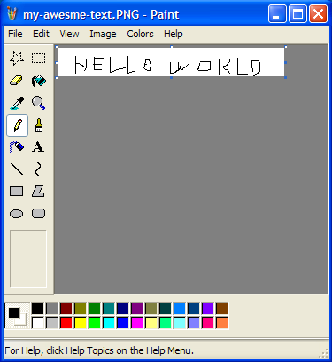
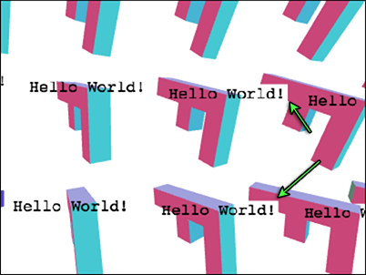
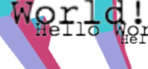

# 六、文本

## WebGL 文本 HTML

“在 WebGL 中如何绘制文本”是一个我们常见的问题。那么第一件事就是我们要问自己绘制文本的目的何在。现在有一个浏览器，浏览器用来显示文本。所以你的第一个答案应该是如何使用 HTML 来显示文本。

让我们从最简单的例子开始：你只是想在你的 WebGL 上绘制一些文本。我们可以称之为一个文本覆盖。基本上这是停留在同一个位置的文本。

简单的方法是构造一些 HTML 元素，使用 CSS 使它们重叠。

例如：先构造一个容器，把画布和一些 HTML 元素重叠放置在容器内部。

```js
<div class="container">
  <canvas id="canvas" width="400" height="300"></canvas>
  <div id="overlay">
<div>Time: <span id="time"></span></div>
<div>Angle: <span id="angle"></span></div>
  </div>
</div> 
```

接下来设置 CSS，以达到画布和 HTML 重叠的目的。

```js
.container {
position: relative;
}
#overlay {
position: absolute;
left: 10px;
top: 10px;
} 
```

现在按照初始化和创建时间查找这些元素，或者查找你想要改变的区域。

```js
// look up the elements we want to affect
var timeElement = document.getElementById("time");
var angleElement = document.getElementById("angle");

// Create text nodes to save some time for the browser.
var timeNode = document.createTextNode("");
var angleNode = document.createTextNode("");

// Add those text nodes where they need to go
timeElement.appendChild(timeNode);
angleElement.appendChild(angleNode); 
```

最后在渲染时更新节点。

```js
function drawScene() {
...

// convert rotation from radians to degrees
var angle = radToDeg(rotation[1]);

// only report 0 - 360
angle = angle % 360;

// set the nodes
angleNode.nodeValue = angle.toFixed(0);  // no decimal place
timeNode.nodeValue = clock.toFixed(2);   // 2 decimal places 
```

这里有一个例子:

[`webglfundamentals.org/webgl/webgl-text-html-overlay.html`](http://webglfundamentals.org/webgl/webgl-text-html-overlay.html)

注意为了我想改变的部分，我是如何把 spans 置入特殊的 div 内的。在这里我做一个假设，这比只使用 div 而没有 spans 速度要快，类似的有：

```js
timeNode.value = "Time " + clock.toFixed(2); 
```

另外，我们可以使用文本节点，通过调用 **node = document.createTextNode()** 和 **laternode.node = someMsg**。我们也可以使用 **someElement.innerHTML = someHTML**。这将会更加灵活，虽然这样可能会稍微慢一些，但是您却可以插入任意的 HTML 字符串，因为你每次设置它，浏览器都不得不创建和销毁节点。这对你来说更加方便。

不采用叠加技术很重要的一点是，WebGL 在浏览器中运行。要记得在适当的时候使用浏览器的特征。大量的 OpenGL 程序员习惯于从一开始就 100% 靠他们自己实现应用的每一部分自己，因为 WebGL 要在一个已经有很多特征的浏览器上运行。使用它们有很多好处。例如使用 CSS 样式，你可以很容易就覆盖一个有趣的风格。

这里有一个相同的例子，但是添加了一些风格。背景是圆形的，字母的周围有光晕。这儿有一个红色的边界。你可以使用 HTML 免费得到所有。

[`webglfundamentals.org/webgl/webgl-text-html-overlay-styled.html`](http://webglfundamentals.org/webgl/webgl-text-html-overlay-styled.html)

我们要讨论的下一件最常见的事情是文本相对于你渲染的东西的位置。我们也可以在 HTML 中做到这一点。

在本例中，我们将再次构造一个画布容器和另一个活动的 HTML 容器。

```js
<div class="container">
  <canvas id="canvas" width="400" height="300"></canvas>
  <div id="divcontainer"></div>
</div> 
```

我们将设置 CSS

```js
.container {
position: relative;
overflow: none;
}

#divcontainer {
position: absolute;
left: 0px;
top: 0px;
width: 400px;
height: 300px;
z-index: 10;
overflow: hidden;

}

.floating-div {
position: absolute;
} 
```

相对于第一个 父类位置 **position: relative** 或者 **position: absolute** 风格，**position: absolute;** 部分使 **#divcontainer** 放置于绝对位置。在本例中，画布和 **#divcontainer** 都在容器内。

**left: 0px; top: 0px** 使 **#divcontainer** 结合一切。**z-index: 10** 使它浮在画布上。**overflow: hidden** 让它的子类被剪除。

最后，**floating-div** 将使用我们创建的可移式 div。

现在我们需要查找 div 容器，创建一个 div，将 div 附加到容器。

```js
// look up the divcontainer
var divContainerElement = document.getElementById("divcontainer");

// make the div
var div = document.createElement("div");

// assign it a CSS class
div.className = "floating-div";

// make a text node for its content
var textNode = document.createTextNode("");
div.appendChild(textNode);

// add it to the divcontainer
divContainerElement.appendChild(div); 
```

现在，我们可以通过设置它的风格定位 div。

```js
div.style.left = Math.floor(x) + "px";
div.style.top  = Math.floor(y) + "px";
textNode.nodeValue = clock.toFixed(2); 
```

下面是一个例子,我们只需要限制 div 的边界。

[`webglfundamentals.org/webgl/webgl-text-html-bouncing-div.html`](http://webglfundamentals.org/webgl/webgl-text-html-bouncing-div.html)

下一步，我们想在 3D 场景中设计它相对于某些事物的位置。我们该如何做？当我们[透视投影覆盖](http://webglfundamentals.org/webgl/lessons/webgl-3d-perspective.html)，我们如何做实际上就是我们请求 GPU 如何做。

通过这个例子我们学习了如何使用模型，如何复制它们，以及如何应用一个投影模型将他们转换成 clipspace。然后我们讨论着色器的内容，它在本地空间复制模型，并将其转换成 clipspace。我们也可以在 JavaScript 中做所有的这些。然后我们可以增加 clipspace(-1 到 +1) 到像素和使用 div 位置。

```js
gl.drawArrays(...);

// We just got through computing a matrix to draw our
// F in 3D.

// choose a point in the local space of the 'F'.
// X  Y  Z  W
var point = [100, 0, 0, 1];  // this is the front top right corner

// compute a clipspace position
// using the matrix we computed for the F
var clipspace = matrixVectorMultiply(point, matrix);

// divide X and Y by W just like the GPU does.
clipspace[0] /= clipspace[3];
clipspace[1] /= clipspace[3];

// convert from clipspace to pixels
var pixelX = (clipspace[0] *  0.5 + 0.5) * gl.canvas.width;
var pixelY = (clipspace[1] * -0.5 + 0.5) * gl.canvas.height;

// position the div
div.style.left = Math.floor(pixelX) + "px";
div.style.top  = Math.floor(pixelY) + "px";
textNode.nodeValue = clock.toFixed(2); 
```

wahlah，我们 div 的左上角和 F 的右上角完全符合。

[`webglfundamentals.org/webgl/webgl-text-html-div.html`](http://webglfundamentals.org/webgl/webgl-text-html-div.html)

当然，如果你想要更多的文本构造更多的 div，如下：

[`webglfundamentals.org/webgl/webgl-text-html-divs.html`](http://webglfundamentals.org/webgl/webgl-text-html-divs.html)

你可以查看最后一个例子的源代码来观察细节。一个重要的点是我猜测从 DOM 创建、添加、删除 HTML 元素是缓慢的，所以上面的示例用来创建它们，将它们保留在周围。它将任何未使用的都隐藏起来，而不是把他们从 DOM 删除。你必须明确知道是否可以更快。这只是我选择的方法。

希望这已经清楚地说明了如何使用 HTML 制造文本。[接下来，我们将介绍如何使用 Canvas2D 制造文本](http://webglfundamentals.org/webgl/lessons/webgl-text-canvas2d.html)。

问题？[可以在 stackoverflow 提问](http://stackoverflow.com/questions/tagged/webgl)。 问题/缺陷？[可以在 github 创造一个话题](https://github.com/greggman/webgl-fundamentals/issues)。

## WebGL 文本 Canvas 2D

相对于使用 HTML 元素制作文本我们还可以使用另一种使用 2D 上下文的画布。不需要分析，我们就可以做一个猜测，这将比使用 DOM 快。当然也会变得相对不灵活。你可能不能得到所有的 CSS 样式。但是，这儿没有 HTML 元素可以创建和跟踪。

和前边其他的例子类似，让我们来构造一个容器，但这一次我们将在其中放置两个画布。

```js
<div class="container">
  <canvas id="canvas" width="400" height="300"></canvas>
  <canvas id="text" width="400" height="300"></canvas>
</div> 
```

接下来设置 CSS，以使画布和 HTML 重叠

```js
.container {
position: relative;
}

#text {
position: absolute;
left: 0px;
top: 0px;
z-index: 10;
} 
```

现在按照初始化时间查找文本画布，并为之创建一个 2D 上下文。

```js
// look up the text canvas.
var textCanvas = document.getElementById("text");

// make a 2D context for it
var ctx = textCanvas.getContext("2d"); 
```

当绘图时，就像 WebGL，我们需要清除 2d 画布的每一帧。

```js
function drawScene() {
...

// Clear the 2D canvas
ctx.clearRect(0, 0, ctx.canvas.width, ctx.canvas.height); 
```

然后我们就调用 **fillText** 绘制文本

```js
ctx.fillText(someMsg, pixelX, pixelY); 
```

下面有一个例子：

[`webglfundamentals.org/webgl/webgl-text-html-canvas2d.html`](http://webglfundamentals.org/webgl/webgl-text-html-canvas2d.html)

为什么这个文本更小呢？因为这是 canvas2d 默认的尺寸。如果你想要其它的尺寸，可以[查看 canvas2d api](https://developer.mozilla.org/en-US/docs/Web/API/Canvas_API/Tutorial/Drawing_text)。

使用 canvas2d 的另一个原因是用它很容易绘制其他的事物。例如让我们来添加一个箭头：

```js
// draw an arrow and text.

// save all the canvas settings
ctx.save();

// translate the canvas origin so 0, 0 is at
// the top front right corner of our F
ctx.translate(pixelX, pixelY);

// draw an arrow
ctx.beginPath();
ctx.moveTo(10, 5);
ctx.lineTo(0, 0);
ctx.lineTo(5, 10);
ctx.moveTo(0, 0);
ctx.lineTo(15, 15);
ctx.stroke();

// draw the text.
ctx.fillText(someMessage, 20, 20);

// restore the canvas to its old settings.
ctx.restore(); 
```

这里我们利用 canvas2d 的翻译功能，所以画箭头时，我们不需要做任何额外的工作。我们只是假装在原点开始绘制，翻译负责移动原点到 F 的角落。

[`webglfundamentals.org/webgl/webgl-text-html-canvas2d-arrows.html`](http://webglfundamentals.org/webgl/webgl-text-html-canvas2d-arrows.html)

封面使用了 2D 画布。[查看 canvas2d API](https://developer.mozilla.org/en-US/docs/Web/API/CanvasRenderingContext2D) 的更多想法。[接下来，我们将实际在 WebGL 呈现文本](http://webglfundamentals.org/webgl/lessons/webgl-text-texture.html)。

问题？[可以再 stackoverflow 提问](http://stackoverflow.com/questions/tagged/webgl)。

问题/缺陷？[可以在 github 上创建一个话题](https://github.com/greggman/webgl-fundamentals/issues)。

## WebGL 文本 纹理

在上一篇文章中我们学习了在 WebGL 场景中如何使用一个 2D 画布绘制文本。这个技术可以工作且很容易做到，但它有一个限制，即文本不能被其他的 3D 对象遮盖。要做到这一点，我们实际上需要在 WebGL 中绘制文本。

最简单的方法是绘制带有文本的纹理。例如你可以使用 photoshop 或其他绘画程序，来绘制带有文本的一些图像。



然后我们构造一些平面几何并显示它。这实际上是一些游戏中构造所有的文本的方式。例如 Locoroco 只有大约 270 个字符串。它本地化成 17 种语言。我们有一个包含所有语言的 Excel 表和一个脚本，该脚本将启动 Photoshop 并生成纹理，每个纹理都对应一种语言里的一个消息。

当然你也可以在运行时生成纹理。因为在浏览器中 WebGL 是依靠画布 2d api 来帮助生成纹理的。

我们来看上一篇文章的例子，在其中添加一个函数：用文本填补一个 2D 画布。

```js
var textCtx = document.createElement("canvas").getContext("2d");

// Puts text in center of canvas.
function makeTextCanvas(text, width, height) {
  textCtx.canvas.width  = width;
  textCtx.canvas.height = height;
  textCtx.font = "20px monospace";
  textCtx.textAlign = "center";
  textCtx.textBaseline = "middle";
  textCtx.fillStyle = "black";
  textCtx.clearRect(0, 0, textCtx.canvas.width, textCtx.canvas.height);
  textCtx.fillText(text, width / 2, height / 2);
  return textCtx.canvas;
} 
```

现在我们需要在 WebGL 中绘制 2 个不同东西：“F”和文本，我想切换到使用一些前一篇文章中所描述的辅助函数。如果你还不清楚 **programInfo**，**bufferInfo** 等，你需要浏览那篇文章。

现在，让我们创建一个“F”和四元组单元。

```js
// Create data for 'F'
var fBufferInfo = primitives.create3DFBufferInfo(gl);
// Create a unit quad for the 'text'
var textBufferInfo = primitives.createPlaneBufferInfo(gl, 1, 1, 1, 1, makeXRotation(Math.PI / 2)); 
```

一个四元组单元是一个 1 单元大小的四元组(方形)，中心在原点。**createPlaneBufferInfo** 在 xz 平面创建一个平面。我们通过一个矩阵旋转它，就得到一个 xy 平面四元组单元。

接下来创建 2 个着色器：

```js
// setup GLSL programs
var fProgramInfo = createProgramInfo(gl, ["3d-vertex-shader", "3d-fragment-shader"]);
var textProgramInfo = createProgramInfo(gl, ["text-vertex-shader", "text-fragment-shader"]); 
```

创建我们的文本纹理：

```js
// create text texture.
var textCanvas = makeTextCanvas("Hello!", 100, 26);
var textWidth  = textCanvas.width;
var textHeight = textCanvas.height;
var textTex = gl.createTexture();
gl.bindTexture(gl.TEXTURE_2D, textTex);
gl.texImage2D(gl.TEXTURE_2D, 0, gl.RGBA, gl.RGBA, gl.UNSIGNED_BYTE, textCanvas);
// make sure we can render it even if it's not a power of 2
gl.texParameteri(gl.TEXTURE_2D, gl.TEXTURE_MIN_FILTER, gl.LINEAR);
gl.texParameteri(gl.TEXTURE_2D, gl.TEXTURE_WRAP_S, gl.CLAMP_TO_EDGE);
gl.texParameteri(gl.TEXTURE_2D, gl.TEXTURE_WRAP_T, gl.CLAMP_TO_EDGE); 
```

为“F”和文本设置 uniforms：

```js
var fUniforms = {
  u_matrix: makeIdentity(),
};

var textUniforms = {
  u_matrix: makeIdentity(),
  u_texture: textTex,
}; 
```

当我们计算 F 的矩阵时，保存 F 的矩阵视图：

```js
var matrix = makeIdentity();
matrix = matrixMultiply(matrix, preTranslationMatrix);
matrix = matrixMultiply(matrix, scaleMatrix);
matrix = matrixMultiply(matrix, rotationZMatrix);
matrix = matrixMultiply(matrix, rotationYMatrix);
matrix = matrixMultiply(matrix, rotationXMatrix);
matrix = matrixMultiply(matrix, translationMatrix);
matrix = matrixMultiply(matrix, viewMatrix);
var fViewMatrix = copyMatrix(matrix);  // remember the view matrix for the text
matrix = matrixMultiply(matrix, projectionMatrix); 
```

像这样绘制 F：

```js
gl.useProgram(fProgramInfo.program);

setBuffersAndAttributes(gl, fProgramInfo.attribSetters, fBufferInfo);

copyMatrix(matrix, fUniforms.u_matrix);
setUniforms(fProgramInfo.uniformSetters, fUniforms);

// Draw the geometry.
gl.drawElements(gl.TRIANGLES, fBufferInfo.numElements, gl.UNSIGNED_SHORT, 0); 
```

文本中我们只需要知道 F 的原点位置，我们还需要测量和单元四元组相匹配的纹理尺寸。最后，我们需要多种投影矩阵。

```js
// scale the F to the size we need it.
// use just the view position of the 'F' for the text
var textMatrix = makeIdentity();
textMatrix = matrixMultiply(textMatrix, makeScale(textWidth, textHeight, 1));
textMatrix = matrixMultiply(
textMatrix,
makeTranslation(fViewMatrix[12], fViewMatrix[13], fViewMatrix[14]));
textMatrix = matrixMultiply(textMatrix, projectionMatrix); 
```

然后渲染文本

```js
// setup to draw the text.
gl.useProgram(textProgramInfo.program);

setBuffersAndAttributes(gl, textProgramInfo.attribSetters, textBufferInfo);

copyMatrix(textMatrix, textUniforms.u_matrix);
setUniforms(textProgramInfo.uniformSetters, textUniforms);

// Draw the text.
gl.drawElements(gl.TRIANGLES, textBufferInfo.numElements, gl.UNSIGNED_SHORT, 0); 
```

即：

[`webglfundamentals.org/webgl/webgl-text-texture.html`](http://webglfundamentals.org/webgl/webgl-text-texture.html)

你会发现有时候我们文本的一部分遮盖了我们 Fs 的一部分。这是因为我们绘制一个四元组。画布的默认颜色是透明的黑色(0,0,0,0)和我们在四元组中使用这种颜色绘制。我们也可以混合像素。

```js
gl.enable(gl.BLEND);
gl.blendFunc(gl.SRC_ALPHA, gl.ONE_MINUS_SRC_ALPHA); 
```

根据混合函数，将源像素(这个颜色取自片段着色器)和 目的像素(画布颜色)结合在一起。在混合函数中，我们为源像素设置：SRC_ALPHA，为目的像素设置：ONE_MINUS_SRC_ALPHA。

```js
result = dest * (1 - src_alpha) + src * src_alpha 
```

举个例子，如果目的像素是绿色的 0,1,0,1 和源像素是红色的 1,0,0,1，如下：

```js
src = [1, 0, 0, 1]
dst = [0, 1, 0, 1]
src_alpha = src[3]  // this is 1
result = dst * (1 - src_alpha) + src * src_alpha

// which is the same as
result = dst * 0 + src * 1

// which is the same as
result = src 
```

对于纹理的部分内容，使用透明的黑色 0,0,0,0

```js
src = [0, 0, 0, 0]
dst = [0, 1, 0, 1]
src_alpha = src[3]  // this is 0
result = dst * (1 - src_alpha) + src * src_alpha

// which is the same as
result = dst * 1 + src * 0

// which is the same as
result = dst 
```

这是启用了混合的结果。

[`webglfundamentals.org/webgl/webgl-text-texture-enable-blend.html`](http://webglfundamentals.org/webgl/webgl-text-texture-enable-blend.html)

你可以看到尽管它还不完美，但它已经更好了。如果你仔细看，有时能看到这个问题



发生什么事情了？我们正在绘制一个 F 然后是它的文本，然后下一个 F 的重复文本。所以当我们绘制文本时，我们仍然需要一个[深度缓冲](http://webglfundamentals.org/webgl/lessons/webgl-3d-orthographic.html)，即使混合了一些像素来保持背景颜色，深度缓冲仍然需要更新。当我们绘制下一个 F，如果 F 的部分是之前绘制文本的一些像素，他们就不会再绘制。

我们刚刚遇到的最困难的问题之一，在 GPU 上渲染 3D。透明度也存在问题。

针对几乎所有透明呈现问题，最常见的解决方案是先画出所有不透明的东西，之后，按中心距的排序，绘制所有的透明的东西，中心距的排序是在深度缓冲测试开启但深度缓冲更新关闭的情况下得出的。

让我们先单独绘制透明材料(文本)中不透明材料(Fs)的部分。首先，我们要声明一些来记录文本的位置。

```js
var textPositions = []; 
```

在循环中渲染记录位置的 Fs

```js
matrix = matrixMultiply(matrix, viewMatrix);
var fViewMatrix = copyMatrix(matrix);  // remember the view matrix for the text
textPositions.push([matrix[12], matrix[13], matrix[14]]);  // remember the position for the text 
```

在我们绘制 “F”s 之前，我们禁用混合并打开写深度缓冲

```js
gl.disable(gl.BLEND);
gl.depthMask(true); 
```

绘制文本时，我们将打开混合并关掉写作深度缓冲

```js
gl.enable(gl.BLEND);
gl.blendFunc(gl.SRC_ALPHA, gl.ONE_MINUS_SRC_ALPHA);
gl.depthMask(false); 
```

然后在我们保存的所有位置绘制文本

```js
textPositions.forEach(function(pos) {
  // draw the text
  // scale the F to the size we need it.
  // use just the position of the 'F' for the text
  var textMatrix = makeIdentity();
  textMatrix = matrixMultiply(textMatrix, makeScale(textWidth, textHeight, 1));
  textMatrix = matrixMultiply(textMatrix, makeTranslation(pos[0], pos[1], pos[2]));
  textMatrix = matrixMultiply(textMatrix, projectionMatrix);

  // setup to draw the text.
  gl.useProgram(textProgramInfo.program);

  setBuffersAndAttributes(gl, textProgramInfo.attribSetters, textBufferInfo);

  copyMatrix(textMatrix, textUniforms.u_matrix);
  setUniforms(textProgramInfo.uniformSetters, textUniforms);

  // Draw the text.
  gl.drawElements(gl.TRIANGLES, textBufferInfo.numElements, gl.UNSIGNED_SHORT, 0);
}); 
```

现在启动：

[`webglfundamentals.org/webgl/webgl-text-texture-separate-opaque-from-transparent.html`](http://webglfundamentals.org/webgl/webgl-text-texture-separate-opaque-from-transparent.html)

请注意我们没有像我上面提到的那样分类。在这种情况下，因为我们绘制大部分是不透明文本，所以即使排序也没有明显差异，所以就省去了这一步骤，节省资源用于其他文章。

另一个问题是文本的“F”总是交叉。实际上这个问题没有一个具体的解决方案。如果你正在构造一个 MMO，希望每个游戏者的文本总是出现在你试图使文本出现的顶部。只需要将之转化为一些单元 +Y，足以确保它总是位于游戏者之上。

你也可以使之向 cameara 移动。在这里我们这样做只是为了好玩。因为 “pos” 是在坐标系中，意味着它是相对于眼(在坐标系中即：0,0,0)。所以如果我们使之标准化，我们可以得到一个单位向量，这个向量的指向是从原点到某一点，我们可以乘一定数值将文本特定数量的单位靠近或远离眼。

```js
// because pos is in view space that means it's a vector from the eye to
// some position. So translate along that vector back toward the eye some distance
var fromEye = normalize(pos);
var amountToMoveTowardEye = 150;  // because the F is 150 units long
var viewX = pos[0] - fromEye[0] * amountToMoveTowardEye;
var viewY = pos[1] - fromEye[1] * amountToMoveTowardEye;
var viewZ = pos[2] - fromEye[2] * amountToMoveTowardEye;

var textMatrix = makeIdentity();
textMatrix = matrixMultiply(textMatrix, makeScale(textWidth, textHeight, 1));
textMatrix = matrixMultiply(textMatrix, makeTranslation(viewX, viewY, viewZ));
textMatrix = matrixMultiply(textMatrix, projectionMatrix); 
```

即：

[`webglfundamentals.org/webgl/webgl-text-texture-moved-toward-view.html`](http://webglfundamentals.org/webgl/webgl-text-texture-moved-toward-view.html)

你还可能会注意到一个字母边缘问题。



这里的问题是 Canvas2D api 只引入了自左乘 alpha 值。当我们上传内容到试图 unpremultiply 的纹理 WebGL，它就不能完全做到，这是因为自左乘 alpha 会失真。

为了解决这个问题，使 WebGL 不会 unpremultiply：

```js
gl.pixelStorei(gl.UNPACK_PREMULTIPLY_ALPHA_WEBGL, true); 
```

这告诉 WebGL 支持自左乘 alpha 值到 **gl.texImage2D** 和 **gl.texSubImage2D**。如果数据传递给 **gl.texImage2D** 已经自左乘，就像 canvas2d 数据，那么 WebGL 就可以通过。

我们还需要改变混合函数

```js
gl.blendFunc(gl.SRC_ALPHA, gl.ONE_MINUS_SRC_ALPHA);
gl.blendFunc(gl.ONE, gl.ONE_MINUS_SRC_ALPHA); 
```

老方法是源色乘以 alpha。这是 **SRC_ALPHA** 意味着什么。但是现在我们的纹理数据已经被乘以其 alpha。这是 **premultipled** 意味着什么。所以我们不需要 GPU 做乘法。将其设置为 **ONE** 意味着乘以 1。

[`webglfundamentals.org/webgl/webgl-text-texture-premultiplied-alpha.html`](http://webglfundamentals.org/webgl/webgl-text-texture-premultiplied-alpha.html)

边缘现在没有了。

如果你想保持文本在一种固定大小，但仍然正确？那么，如果你还记得[透视文章](http://webglfundamentals.org/webgl/lessons/webgl-3d-perspective.html)中透视矩阵以 **-Z** 调整我们的对象使其在距离上更小。所以，我们可以以 **-Z** 倍数调整以达到我们想要的规模作为补偿。

```js
...
// because pos is in view space that means it's a vector from the eye to
// some position. So translate along that vector back toward the eye some distance
var fromEye = normalize(pos);
var amountToMoveTowardEye = 150;  // because the F is 150 units long
var viewX = pos[0] - fromEye[0] * amountToMoveTowardEye;
var viewY = pos[1] - fromEye[1] * amountToMoveTowardEye;
var viewZ = pos[2] - fromEye[2] * amountToMoveTowardEye;
var desiredTextScale = -1 / gl.canvas.height;  // 1x1 pixels
var scale = viewZ * desiredTextScale;

var textMatrix = makeIdentity();
textMatrix = matrixMultiply(textMatrix, makeScale(textWidth * scale, textHeight * scale, 1));
textMatrix = matrixMultiply(textMatrix, makeTranslation(viewX, viewY, viewZ));
textMatrix = matrixMultiply(textMatrix, projectionMatrix);
... 
```

[`webglfundamentals.org/webgl/webgl-text-texture-consistent-scale.html`](http://webglfundamentals.org/webgl/webgl-text-texture-consistent-scale.html)

如果你想在每个 F 中绘制不同文本，你应该为每个 F 构造一个新纹理，为每个 F 更新文本模式。

```js
// create text textures, one for each F
var textTextures = [
  "anna",   // 0
  "colin",  // 1
  "james",  // 2
  "danny",  // 3
  "kalin",  // 4
  "hiro",   // 5
  "eddie",  // 6
  "shu",// 7
  "brian",  // 8
  "tami",   // 9
  "rick",   // 10
  "gene",   // 11
  "natalie",// 12,
  "evan",   // 13,
  "sakura", // 14,
  "kai",// 15,
].map(function(name) {
  var textCanvas = makeTextCanvas(name, 100, 26);
  var textWidth  = textCanvas.width;
  var textHeight = textCanvas.height;
  var textTex = gl.createTexture();
  gl.bindTexture(gl.TEXTURE_2D, textTex);
  gl.texImage2D(gl.TEXTURE_2D, 0, gl.RGBA, gl.RGBA, gl.UNSIGNED_BYTE, textCanvas);
  // make sure we can render it even if it's not a power of 2
  gl.texParameteri(gl.TEXTURE_2D, gl.TEXTURE_MIN_FILTER, gl.LINEAR);
  gl.texParameteri(gl.TEXTURE_2D, gl.TEXTURE_WRAP_S, gl.CLAMP_TO_EDGE);
  gl.texParameteri(gl.TEXTURE_2D, gl.TEXTURE_WRAP_T, gl.CLAMP_TO_EDGE);
  return {
texture: textTex,
width: textWidth,
height: textHeight,
  };
}); 
```

然后在呈现时选择一个纹理

```js
textPositions.forEach(function(pos, ndx) {

  +// select a texture
  +var tex = textTextures[ndx];

  // scale the F to the size we need it.
  // use just the position of the 'F' for the text
  var textMatrix = makeIdentity();
  *textMatrix = matrixMultiply(textMatrix, makeScale(tex.width, tex.height, 1)); 
```

并在绘制前为纹理设置统一结构

```js
textUniforms.u_texture = tex.texture; 
```

[`webglfundamentals.org/webgl/webgl-text-texture-different-text.html`](http://webglfundamentals.org/webgl/webgl-text-texture-different-text.html)

我们一直用黑色绘制到画布上的文本。这比用白色呈现文本更有用。然后我们再增加文本的颜色，以便得到我们想要的任何颜色。

首先我们改变文本材质，通过复合一个颜色

```js
varying vec2 v_texcoord;

uniform sampler2D u_texture;
uniform vec4 u_color;

void main() {
   gl_FragColor = texture2D(u_texture, v_texcoord) * u_color;
} 
```

当我们绘制文本到画布上时使用白色

```js
textCtx.fillStyle = "white"; 
```

然后我们添加一些其他颜色

```js
// colors, 1 for each F
var colors = [
  [0.0, 0.0, 0.0, 1], // 0
  [1.0, 0.0, 0.0, 1], // 1
  [0.0, 1.0, 0.0, 1], // 2
  [1.0, 1.0, 0.0, 1], // 3
  [0.0, 0.0, 1.0, 1], // 4
  [1.0, 0.0, 1.0, 1], // 5
  [0.0, 1.0, 1.0, 1], // 6
  [0.5, 0.5, 0.5, 1], // 7
  [0.5, 0.0, 0.0, 1], // 8
  [0.0, 0.0, 0.0, 1], // 9
  [0.5, 5.0, 0.0, 1], // 10
  [0.0, 5.0, 0.0, 1], // 11
  [0.5, 0.0, 5.0, 1], // 12,
  [0.0, 0.0, 5.0, 1], // 13,
  [0.5, 5.0, 5.0, 1], // 14,
  [0.0, 5.0, 5.0, 1], // 15,
]; 
```

在绘制时选择一个颜色

```js
// set color uniform
textUniforms.u_color = colors[ndx]; 
```

结果如下：

[`webglfundamentals.org/webgl/webgl-text-texture-different-colors.html`](http://webglfundamentals.org/webgl/webgl-text-texture-different-colors.html)

这个技术实际上是大多数浏览器使用 GPU 加速时的技术。他们用 HTML 的内容和你应用的各种风格生成纹理，只要这些内容没有改变，他们就可以在滚动时再次渲染纹理。当然，如果你一直都在更新那么这技术可能会有点慢，因为重新生成纹理并更新它对于 GPU 来说是一个相对缓慢的操作。

## WebGL 文本 使用字符纹理

在上一篇文章中我们复习了在 WebGL 场景中如何使用纹理绘制文本。技术是很常见的，对一些事物也是极重要的，例如在多人游戏中你想在一个头像上放置一个名字。同时这个名字也不能影响它的完美性。

比方说你想呈现大量的文本，这需要经常改变 UI 之类的事物。前一篇文章给出的最后一个例子中，一个明显的解决方案是给每个字母加纹理。我们来尝试一下改变上一个例子。

```js
var names = [
  "anna",   // 0
  "colin",  // 1
  "james",  // 2
  "danny",  // 3
  "kalin",  // 4
  "hiro",   // 5
  "eddie",  // 6
  "shu",// 7
  "brian",  // 8
  "tami",   // 9
  "rick",   // 10
  "gene",   // 11
  "natalie",// 12,
  "evan",   // 13,
  "sakura", // 14,
  "kai",// 15,
];

// create text textures, one for each letter
var textTextures = [
  "a",// 0
  "b",// 1
  "c",// 2
  "d",// 3
  "e",// 4
  "f",// 5
  "g",// 6
  "h",// 7
  "i",// 8
  "j",// 9
  "k",// 10
  "l",// 11
  "m",// 12,
  "n",// 13,
  "o",// 14,
  "p",// 14,
  "q",// 14,
  "r",// 14,
  "s",// 14,
  "t",// 14,
  "u",// 14,
  "v",// 14,
  "w",// 14,
  "x",// 14,
  "y",// 14,
  "z",// 14,
].map(function(name) {
  var textCanvas = makeTextCanvas(name, 10, 26); 
```

相对于为每个名字呈现一个四元组，我们将为每个名字的每个字母呈现一个四元组。

```js
// setup to draw the text.
// Because every letter uses the same attributes and the same progarm
// we only need to do this once.
gl.useProgram(textProgramInfo.program);
setBuffersAndAttributes(gl, textProgramInfo.attribSetters, textBufferInfo);

textPositions.forEach(function(pos, ndx) {
  var name = names[ndx];
  // for each leter
  for (var ii = 0; ii < name.length; ++ii) {
var letter = name.charCodeAt(ii);
var letterNdx = letter - "a".charCodeAt(0);
// select a letter texture
var tex = textTextures[letterNdx];

// use just the position of the 'F' for the text

// because pos is in view space that means it's a vector from the eye to
// some position. So translate along that vector back toward the eye some distance
var fromEye = normalize(pos);
var amountToMoveTowardEye = 150;  // because the F is 150 units long
var viewX = pos[0] - fromEye[0] * amountToMoveTowardEye;
var viewY = pos[1] - fromEye[1] * amountToMoveTowardEye;
var viewZ = pos[2] - fromEye[2] * amountToMoveTowardEye;
var desiredTextScale = -1 / gl.canvas.height;  // 1x1 pixels
var scale = viewZ * desiredTextScale;

var textMatrix = makeIdentity();
textMatrix = matrixMultiply(textMatrix, makeTranslation(ii, 0, 0));
textMatrix = matrixMultiply(textMatrix, makeScale(tex.width * scale, tex.height * scale, 1));
textMatrix = matrixMultiply(textMatrix, makeTranslation(viewX, viewY, viewZ));
textMatrix = matrixMultiply(textMatrix, projectionMatrix);

// set texture uniform
textUniforms.u_texture = tex.texture;
copyMatrix(textMatrix, textUniforms.u_matrix);
setUniforms(textProgramInfo.uniformSetters, textUniforms);

// Draw the text.
gl.drawElements(gl.TRIANGLES, textBufferInfo.numElements, gl.UNSIGNED_SHORT, 0);
  }
}); 
```

你可以看到它是如何工作的：

[`webglfundamentals.org/webgl/webgl-text-glyphs.html`](http://webglfundamentals.org/webgl/webgl-text-glyphs.html)

不幸的是它很慢。下面的例子：单独绘制 73 个四元组，还看不出来差别。我们计算 73 个矩阵和 292 个矩阵倍数。一个典型的 UI 可能有 1000 个字母要显示。这是众多工作可以得到一个合理的帧速率的方式。

解决这个问题通常的方法是构造一个纹理图谱，其中包含所有的字母。我们讨论[给立方体的 6 面加纹理](http://webglfundamentals.org/webgl/lessons/webgl-3d-textures.html)时，复习了纹理图谱。

下面的代码构造了字符的纹理图谱。

```js
function makeGlyphCanvas(ctx, maxWidthOfTexture, heightOfLetters, baseLine, padding, letters) {
  var rows = 1;  // number of rows of glyphs
  var x = 0; // x position in texture to draw next glyph
  var y = 0; // y position in texture to draw next glyph
  var glyphInfos = { // info for each glyph
  };

  // Go through each letter, measure it, remember its width and position
  for (var ii = 0; ii < letters.length; ++ii) {
var letter = letters[ii];
var t = ctx.measureText(letter);
// Will this letter fit on this row?
if (x + t.width + padding > maxWidthOfTexture) {
   // so move to the start of the next row
   x = 0;
   y += heightOfLetters;
   ++rows;
}
// Remember the data for this letter
glyphInfos[letter] = {
  x: x,
  y: y,
  width: t.width,
};
// advance to space for next letter.
x += t.width + padding;
  }

  // Now that we know the size we need set the size of the canvas
  // We have to save the canvas settings because changing the size
  // of a canvas resets all the settings
  var settings = saveProperties(ctx);
  ctx.canvas.width = (rows == 1) ? x : maxWidthOfTexture;
  ctx.canvas.height = rows * heightOfLetters;
  restoreProperties(settings, ctx);

  // Draw the letters into the canvas
  for (var ii = 0; ii < letters.length; ++ii) {
var letter = letters[ii];
var glyphInfo = glyphInfos[letter];
var t = ctx.fillText(letter, glyphInfo.x, glyphInfo.y + baseLine);
  }

  return glyphInfos;
} 
```

现在我们试试看：

```js
var ctx = document.createElement("canvas").getContext("2d");
ctx.font = "20px sans-serif";
ctx.fillStyle = "white";
var maxTextureWidth = 256;
var letterHeight = 22;
var baseline = 16;
var padding = 1;
var letters = "0123456789.abcdefghijklmnopqrstuvwxyz";
var glyphInfos = makeGlyphCanvas(
ctx,
maxTextureWidth,
letterHeight,
baseline,
padding,
letters); 
```

结果如下

[`webglfundamentals.org/webgl/glyph-texture-atlas-maker.html`](http://webglfundamentals.org/webgl/glyph-texture-atlas-maker.html)

现在，我们已经创建了一个我们需要使用的字符纹理。看看效果怎样，我们为每个字符建四个顶点。这些顶点将使用纹理坐标来选择特殊的字符。

给定一个字符串，来建立顶点：

```js
function makeVerticesForString(fontInfo, s) {
  var len = s.length;
  var numVertices = len * 6;
  var positions = new Float32Array(numVertices * 2);
  var texcoords = new Float32Array(numVertices * 2);
  var offset = 0;
  var x = 0;
  for (var ii = 0; ii < len; ++ii) {
var letter = s[ii];
var glyphInfo = fontInfo.glyphInfos[letter];
if (glyphInfo) {
  var x2 = x + glyphInfo.width;
  var u1 = glyphInfo.x / fontInfo.textureWidth;
  var v1 = (glyphInfo.y + fontInfo.letterHeight) / fontInfo.textureHeight;
  var u2 = (glyphInfo.x + glyphInfo.width) / fontInfo.textureWidth;
  var v2 = glyphInfo.y / fontInfo.textureHeight;

  // 6 vertices per letter
  positions[offset + 0] = x;
  positions[offset + 1] = 0;
  texcoords[offset + 0] = u1;
  texcoords[offset + 1] = v1;

  positions[offset + 2] = x2;
  positions[offset + 3] = 0;
  texcoords[offset + 2] = u2;
  texcoords[offset + 3] = v1;

  positions[offset + 4] = x;
  positions[offset + 5] = fontInfo.letterHeight;
  texcoords[offset + 4] = u1;
  texcoords[offset + 5] = v2;

  positions[offset + 6] = x;
  positions[offset + 7] = fontInfo.letterHeight;
  texcoords[offset + 6] = u1;
  texcoords[offset + 7] = v2;

  positions[offset + 8] = x2;
  positions[offset + 9] = 0;
  texcoords[offset + 8] = u2;
  texcoords[offset + 9] = v1;

  positions[offset + 10] = x2;
  positions[offset + 11] = fontInfo.letterHeight;
  texcoords[offset + 10] = u2;
  texcoords[offset + 11] = v2;

  x += glyphInfo.width;
  offset += 12;
} else {
  // we don't have this character so just advance
  x += fontInfo.spaceWidth;
}
  }

  // return ArrayBufferViews for the portion of the TypedArrays
  // that were actually used.
  return {
arrays: {
  position: new Float32Array(positions.buffer, 0, offset),
  texcoord: new Float32Array(texcoords.buffer, 0, offset),
},
numVertices: offset / 2,
  };
} 
```

为了使用它，我们手动创建一个 bufferInfo。([如果你已经不记得了，可以查看前面的文章：bufferInfo 是什么](http://webglfundamentals.org/webgl/lessons/webgl-drawing-multiple-things))。

```js
// Maunally create a bufferInfo
var textBufferInfo = {
  attribs: {
a_position: { buffer: gl.createBuffer(), numComponents: 2, },
a_texcoord: { buffer: gl.createBuffer(), numComponents: 2, },
  },
  numElements: 0,
}; 
```

使用 bufferInfo 中的字符创建画布的 fontInfo 和纹理：

```js
var ctx = document.createElement("canvas").getContext("2d");
ctx.font = "20px sans-serif";
ctx.fillStyle = "white";
var maxTextureWidth = 256;
var letterHeight = 22;
var baseline = 16;
var padding = 1;
var letters = "0123456789.,abcdefghijklmnopqrstuvwxyz";
var glyphInfos = makeGlyphCanvas(
ctx,
maxTextureWidth,
letterHeight,
baseline,
padding,
letters);
var fontInfo = {
  glyphInfos: glyphInfos,
  letterHeight: letterHeight,
  baseline: baseline,
  spaceWidth: 5,
  textureWidth: ctx.canvas.width,
  textureHeight: ctx.canvas.height,
}; 
```

然后渲染我们将更新缓冲的文本。我们也可以构成动态的文本：

```js
textPositions.forEach(function(pos, ndx) {

  var name = names[ndx];
  var s = name + ":" + pos[0].toFixed(0) + "," + pos[1].toFixed(0) + "," + pos[2].toFixed(0);
  var vertices = makeVerticesForString(fontInfo, s);

  // update the buffers
  textBufferInfo.attribs.a_position.numComponents = 2;
  gl.bindBuffer(gl.ARRAY_BUFFER, textBufferInfo.attribs.a_position.buffer);
  gl.bufferData(gl.ARRAY_BUFFER, vertices.arrays.position, gl.DYNAMIC_DRAW);
  gl.bindBuffer(gl.ARRAY_BUFFER, textBufferInfo.attribs.a_texcoord.buffer);
  gl.bufferData(gl.ARRAY_BUFFER, vertices.arrays.texcoord, gl.DYNAMIC_DRAW);

  setBuffersAndAttributes(gl, textProgramInfo.attribSetters, textBufferInfo);

  // use just the position of the 'F' for the text
  var textMatrix = makeIdentity();
  // because pos is in view space that means it's a vector from the eye to
  // some position. So translate along that vector back toward the eye some distance
  var fromEye = normalize(pos);
  var amountToMoveTowardEye = 150;  // because the F is 150 units long
  textMatrix = matrixMultiply(textMatrix, makeTranslation(
  pos[0] - fromEye[0] * amountToMoveTowardEye,
  pos[1] - fromEye[1] * amountToMoveTowardEye,
  pos[2] - fromEye[2] * amountToMoveTowardEye));
  textMatrix = matrixMultiply(textMatrix, projectionMatrix);

  // set texture uniform
  copyMatrix(textMatrix, textUniforms.u_matrix);
  setUniforms(textProgramInfo.uniformSetters, textUniforms);

  // Draw the text.
  gl.drawArrays(gl.TRIANGLES, 0, vertices.numVertices);
}); 
```

即：

[`webglfundamentals.org/webgl/webgl-text-glyphs-texture-atlas.html`](http://webglfundamentals.org/webgl/webgl-text-glyphs-texture-atlas.html)

这是使用字符纹理集的基本技术。可以添加一些明显的东西或方式来改进它。

*   重用相同的数组。
    目前，每次被调用时，**makeVerticesForString** 就会分配新的 32 位浮点型数组。这最终可能会导致垃圾收集出现问题。重用相同的数组可能会更好。如果不是足够大，你也放大数组，但是保留原来的大小。
*   添加支持回车
    当生成顶点时，检查 **\n** 是否存在从而实现换行。这将使文本分隔段落更容易。
*   添加对各种格式的支持。
    如果你想文本居中，或调整你添加的一切文本的格式。
*   添加对顶点颜色的支持。
    你可以为文本的每个字母添加不同的颜色。当然你必须决定如何指定何时改变颜色。

这里不打算涉及的另一个大问题是：纹理大小有限，但字体实际上是无限的。如果你想支持所有的 unicode，你就必须处理汉语、日语和阿拉伯语等其他所有语言，2015 年在 unicode 有超过 110000 个符号！你不可能在纹理中适配所有这些，也没有足够的空间供你这样做。

操作系统和浏览器 GPU 加速处理这个问题的方式是：通过使用一个字符纹理缓存实现。上面的实现他们是把纹理处理成纹理集，但他们为每个 glpyh 布置一个固定大小的区域，保留纹理集中最近使用的符号。如果需要绘制一个字符，而这个字符不在纹理集中，他们就用他们需要的这个新的字符取代最近最少使用的一个。当然如果他们即将取代的字符仍被有待绘制的四元组引用，他们需要绘制他们之前所取代的字符。

虽然我不推荐它，但是还有另一件事你可以做，将这项技术和[以前的技术](http://webglfundamentals.org/webgl/lessons/webgl-text-texture.html)结合在一起。你可以直接渲染另一种纹理的符号。当然 GPU 加速画布已经这样做了，你可能没有自己动手的理由。

另一种在 WebGL 中绘制文本的方法实际上是使用了 3D 文本。在上面所有的例子中 “F” 是一个 3D 的字母。你已经为每个字母都构成了一个相应的 3D 字符。3D 字母常见于标题和电影标志，此外的用处就少了。

我希望在 WebGL 这可以覆盖文本。

更多信息请访问 [`wiki.jikexueyuan.com/project/webgl/`](http://wiki.jikexueyuan.com/project/webgl/)